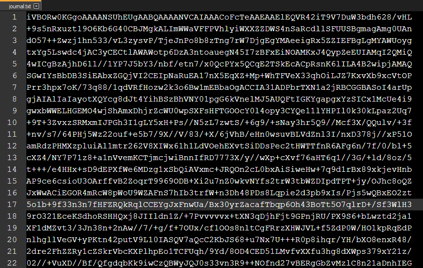
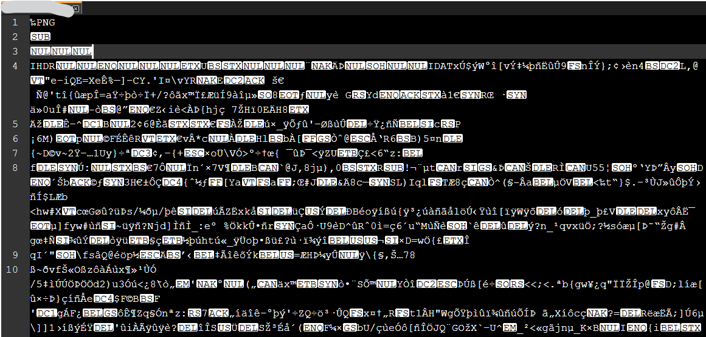

# TryHackMe(THM) - CherryBlossom - WriteUp

> Austin Lai | August 7th, 2021

---

<!-- Description -->

[Room = TryHackMe(THM) - CherryBlossom](https://tryhackme.com/room/cherryblossom)

Difficulty: **HARD**

The room is completed on May 7th, 2020

<!-- /Description -->

<br />

## Table of Contents

<!-- TOC -->

- [TryHackMe(THM) - CherryBlossom - WriteUp](#tryhackmethm---cherryblossom---writeup)
    - [Table of Contents](#table-of-contents)
    - [Task 1](#task-1)
        - [Journal Flag](#journal-flag)
        - [User Flag](#user-flag)
        - [Root Flag](#root-flag)

<!-- /TOC -->

<br />

## Task 1

Let fire up basic enumeration.

Nmap result:

```text
# Nmap 7.80 scan initiated Wed May 06 21:34:23 2020 as: nmap --privileged --stats-every 1s -vvvvvv -Pn -p- -O -sS -sV --version-all -T4 --min-parallelism 50 --script=vuln -A --append-output -oN tryhackme-CherryBlossom 10.10.80.171
Pre-scan script results:
| broadcast-avahi-dos: 
|   Discovered hosts:
|     224.0.0.251
|   After NULL UDP avahi packet DoS (CVE-2011-1002).
|_  Hosts are all up (not vulnerable).
Nmap scan report for 10.10.80.171
Host is up, received user-set (0.26s latency).
All 65535 scanned ports on 10.10.80.171 are closed because of 65535 resets
Too many fingerprints match this host to give specific OS details
TCP/IP fingerprint:
SCAN(V=7.80%E=4%D=5/6%OT=%CT=1%CU=30347%PV=Y%DS=2%DC=T%G=N%TM=5EB2C16E%P=i686-pc-windows-windows)
SEQ(II=I)
T5(R=Y%DF=Y%T=40%W=0%S=Z%A=S+%F=AR%O=%RD=0%Q=)
T6(R=Y%DF=Y%T=40%W=0%S=A%A=Z%F=R%O=%RD=0%Q=)
T7(R=Y%DF=Y%T=40%W=0%S=Z%A=S+%F=AR%O=%RD=0%Q=)
U1(R=Y%DF=N%T=40%IPL=164%UN=0%RIPL=G%RID=G%RIPCK=G%RUCK=G%RUD=G)
IE(R=Y%DFI=N%T=40%CD=S)

Network Distance: 2 hops

TRACEROUTE (using port 3306/tcp)
HOP RTT       ADDRESS
1   200.00 ms 10.9.0.1
2   219.00 ms 10.10.80.171

Read data files from: C:\Program Files (x86)\Nmap
OS and Service detection performed. Please report any incorrect results at https://nmap.org/submit/ .
# Nmap done at Wed May 06 21:53:50 2020 -- 1 IP address (1 host up) scanned in 1167.31 seconds
# Nmap 7.80 scan initiated Wed May 06 22:00:15 2020 as: nmap --privileged --stats-every 1s -vvvvvv -Pn -p- -O -sS -sV --version-all -T4 --min-parallelism 50 --script=vuln -A --append-output -oN tryhackme-CherryBlossom 10.10.80.171
Pre-scan script results:
| broadcast-avahi-dos: 
|   Discovered hosts:
|     224.0.0.251
|   After NULL UDP avahi packet DoS (CVE-2011-1002).
|_  Hosts are all up (not vulnerable).
Nmap scan report for 10.10.80.171
Host is up, received user-set (0.21s latency).
Scanned at 2020-05-06 22:00:54 Malay Peninsula Standard Time for 915s
Not shown: 65532 closed ports
Reason: 65532 resets
PORT    STATE SERVICE     REASON         VERSION
22/tcp  open  ssh         syn-ack ttl 63 OpenSSH 7.6p1 Ubuntu 4ubuntu0.3 (Ubuntu Linux; protocol 2.0)
|_clamav-exec: ERROR: Script execution failed (use -d to debug)
139/tcp open  netbios-ssn syn-ack ttl 63 Samba smbd 3.X - 4.X (workgroup: WORKGROUP)
|_clamav-exec: ERROR: Script execution failed (use -d to debug)
445/tcp open  netbios-ssn syn-ack ttl 63 Samba smbd 3.X - 4.X (workgroup: WORKGROUP)
|_clamav-exec: ERROR: Script execution failed (use -d to debug)
No exact OS matches for host (If you know what OS is running on it, see https://nmap.org/submit/ ).
TCP/IP fingerprint:
OS:SCAN(V=7.80%E=4%D=5/6%OT=22%CT=1%CU=36312%PV=Y%DS=2%DC=T%G=Y%TM=5EB2C6A9
OS:%P=i686-pc-windows-windows)SEQ(SP=100%GCD=1%ISR=107%TI=Z%CI=I%II=I%TS=A)
OS:SEQ(SP=101%GCD=1%ISR=107%TI=Z%CI=I%TS=A)SEQ(II=I)OPS(O1=M508ST11NW6%O2=M
OS:508ST11NW6%O3=M508NNT11NW6%O4=M508ST11NW6%O5=M508ST11NW6%O6=M508ST11)WIN
OS:(W1=68DF%W2=68DF%W3=68DF%W4=68DF%W5=68DF%W6=68DF)ECN(R=Y%DF=Y%T=40%W=690
OS:3%O=M508NNSNW6%CC=Y%Q=)T1(R=Y%DF=Y%T=40%S=O%A=S+%F=AS%RD=0%Q=)T2(R=N)T3(
OS:R=N)T4(R=Y%DF=Y%T=40%W=0%S=A%A=Z%F=R%O=%RD=0%Q=)T5(R=Y%DF=Y%T=40%W=0%S=Z
OS:%A=S+%F=AR%O=%RD=0%Q=)T6(R=Y%DF=Y%T=40%W=0%S=A%A=Z%F=R%O=%RD=0%Q=)T7(R=Y
OS:%DF=Y%T=40%W=0%S=Z%A=S+%F=AR%O=%RD=0%Q=)U1(R=Y%DF=N%T=40%IPL=164%UN=0%RI
OS:PL=G%RID=G%RIPCK=G%RUCK=G%RUD=G)IE(R=Y%DFI=N%T=40%CD=S)

Uptime guess: 34.373 days (since Thu Apr 02 13:18:19 2020)
Network Distance: 2 hops
TCP Sequence Prediction: Difficulty=257 (Good luck!)
IP ID Sequence Generation: All zeros
Service Info: Host: UBUNTU; OS: Linux; CPE: cpe:/o:linux:linux_kernel

Host script results:
|_smb-vuln-ms10-054: false
|_smb-vuln-ms10-061: false
| smb-vuln-regsvc-dos: 
|   VULNERABLE:
|   Service regsvc in Microsoft Windows systems vulnerable to denial of service
|     State: VULNERABLE
|       The service regsvc in Microsoft Windows 2000 systems is vulnerable to denial of service caused by a null deference
|       pointer. This script will crash the service if it is vulnerable. This vulnerability was discovered by Ron Bowes
|       while working on smb-enum-sessions.
|_          

TRACEROUTE (using port 1025/tcp)
HOP RTT       ADDRESS
1   202.00 ms 10.9.0.1
2   222.00 ms 10.10.80.171

Read data files from: C:\Program Files (x86)\Nmap
OS and Service detection performed. Please report any incorrect results at https://nmap.org/submit/ .
# Nmap done at Wed May 06 22:16:09 2020 -- 1 IP address (1 host up) scanned in 955.10 seconds
```

Notice there is SMB?

You can fire up nmap smb vuln script, smbclient, smbmap or for our case, we use enum4linux !

enum4linux result:

```text
enum4linux -a -M -d -l -v 10.10.80.171 > enum.txt

[V] Dependent program "nmblookup" found in /usr/bin/nmblookup
[V] Dependent program "net" found in /usr/bin/net
[V] Dependent program "rpcclient" found in /usr/bin/rpcclient
[V] Dependent program "smbclient" found in /usr/bin/smbclient
[V] Dependent program "polenum" found in /usr/bin/polenum
[V] Dependent program "ldapsearch" found in /usr/bin/ldapsearch
Starting enum4linux v0.8.9 ( http://labs.portcullis.co.uk/application/enum4linux/ ) on Wed May  6 22:13:24 2020

 ========================== 
|    Target Information    |
 ========================== 
Target ........... 10.10.80.171
RID Range ........ 500-550,1000-1050
Username ......... ''
Password ......... ''
Known Usernames .. administrator, guest, krbtgt, domain admins, root, bin, none


 ==================================================== 
|    Enumerating Workgroup/Domain on 10.10.80.171    |
 ==================================================== 
[V] Attempting to get domain name with command: nmblookup -A '10.10.80.171'
[+] Got domain/workgroup name: WORKGROUP

 ============================================ 
|    Nbtstat Information for 10.10.80.171    |
 ============================================ 
Looking up status of 10.10.80.171
	UBUNTU          <00> -         B <ACTIVE>  Workstation Service
	UBUNTU          <03> -         B <ACTIVE>  Messenger Service
	UBUNTU          <20> -         B <ACTIVE>  File Server Service
	..__MSBROWSE__. <01> - <GROUP> B <ACTIVE>  Master Browser
	WORKGROUP       <00> - <GROUP> B <ACTIVE>  Domain/Workgroup Name
	WORKGROUP       <1d> -         B <ACTIVE>  Master Browser
	WORKGROUP       <1e> - <GROUP> B <ACTIVE>  Browser Service Elections

	MAC Address = 00-00-00-00-00-00

 ===================================== 
|    Session Check on 10.10.80.171    |
 ===================================== 
[V] Attempting to make null session using command: smbclient -W 'WORKGROUP' //'10.10.80.171'/ipc$ -U''%'' -c 'help' 2>&1
[+] Server 10.10.80.171 allows sessions using username '', password ''

 ===================================================== 
|    Getting information via LDAP for 10.10.80.171    |
 ===================================================== 
[V] Attempting to long domain name: ldapsearch -x -h '10.10.80.171' -p 389 -s base namingContexts 2>&1
[E] Connection error

 =========================================== 
|    Getting domain SID for 10.10.80.171    |
 =========================================== 
[V] Attempting to get domain SID with command: rpcclient -W 'WORKGROUP' -U''%'' 10.10.80.171 -c 'lsaquery' 2>&1
Domain Name: WORKGROUP
Domain Sid: (NULL SID)
[+] Can't determine if host is part of domain or part of a workgroup

 ====================================== 
|    OS information on 10.10.80.171    |
 ====================================== 
[V] Attempting to get OS info with command: smbclient -W 'WORKGROUP' //'10.10.80.171'/ipc$ -U''%'' -c 'q' 2>&1
[+] Got OS info for 10.10.80.171 from smbclient: 
[V] Attempting to get OS info with command: rpcclient -W 'WORKGROUP' -U''%'' -c 'srvinfo' '10.10.80.171' 2>&1
[+] Got OS info for 10.10.80.171 from srvinfo:
	UBUNTU         Wk Sv PrQ Unx NT SNT Samba 4.7.6-Ubuntu
	platform_id     :	500
	os version      :	6.1
	server type     :	0x809a03

 ============================= 
|    Users on 10.10.80.171    |
 ============================= 
[V] Attempting to get userlist with command: rpcclient -W 'WORKGROUP' -c querydispinfo -U''%'' '10.10.80.171' 2>&1
index: 0x1 RID: 0x3e8 acb: 0x00000010 Account: samba	Name: 	Desc: 

[V] Attempting to get userlist with command: rpcclient -W 'WORKGROUP' -c enumdomusers -U''%'' '10.10.80.171' 2>&1
user:[samba] rid:[0x3e8]
[V] Attempting to get detailed user info with command: rpcclient -W 'WORKGROUP' -U''%'' -c 'queryuser 1000' '10.10.80.171' 2>&1


 =========================================== 
|    Machine Enumeration on 10.10.80.171    |
 =========================================== 
[E] Internal error.  Not implmented in this version of enum4linux.

 ========================================= 
|    Share Enumeration on 10.10.80.171    |
 ========================================= 
[V] Attempting to get share list using authentication

	Sharename       Type      Comment
	---------       ----      -------
	Anonymous       Disk      Anonymous File Server Share
	IPC$            IPC       IPC Service (Samba 4.7.6-Ubuntu)
SMB1 disabled -- no workgroup available

[+] Attempting to map shares on 10.10.80.171
[V] Attempting map to share //10.10.80.171/Anonymous with command: smbclient -W 'WORKGROUP' //'10.10.80.171'/'Anonymous' -U''%'' -c dir 2>&1
//10.10.80.171/Anonymous	Mapping: OK, Listing: OK
[V] Attempting map to share //10.10.80.171/IPC$ with command: smbclient -W 'WORKGROUP' //'10.10.80.171'/'IPC$' -U''%'' -c dir 2>&1
//10.10.80.171/IPC$	[E] Can't understand response:
NT_STATUS_OBJECT_NAME_NOT_FOUND listing \*

 ==================================================== 
|    Password Policy Information for 10.10.80.171    |
 ==================================================== 
[V] Attempting to get Password Policy info with command: polenum '':''@'10.10.80.171' 2>&1
[E] Unexpected error from polenum:


[+] Attaching to 10.10.80.171 using a NULL share

[+] Trying protocol 139/SMB...

	[!] Protocol failed: Missing required parameter 'digestmod'.

[+] Trying protocol 445/SMB...

	[!] Protocol failed: Missing required parameter 'digestmod'.

[V] Attempting to get Password Policy info with command: rpcclient -W 'WORKGROUP' -U''%'' '10.10.80.171' -c "getdompwinfo" 2>&1

[+] Retieved partial password policy with rpcclient:

Password Complexity: Disabled
Minimum Password Length: 5


 ============================== 
|    Groups on 10.10.80.171    |
 ============================== 
[V] Getting builtin groups with command: rpcclient -W 'WORKGROUP' -U''%'' '10.10.80.171' -c 'enumalsgroups builtin' 2>&1

[+] Getting builtin groups:

[+] Getting builtin group memberships:
[V] Getting local groups with command: rpcclient -W 'WORKGROUP' -U''%'' '10.10.80.171' -c 'enumalsgroups domain' 2>&1

[+] Getting local groups:

[+] Getting local group memberships:
[V] Getting domain groups with command: rpcclient -W 'WORKGROUP' -U''%'' '10.10.80.171' -c "enumdomgroups" 2>&1

[+] Getting domain groups:

[+] Getting domain group memberships:

 ======================================================================= 
|    Users on 10.10.80.171 via RID cycling (RIDS: 500-550,1000-1050)    |
 ======================================================================= 
[V] Attempting to get SID from 10.10.80.171 with command: rpcclient -W 'WORKGROUP' -U''%'' '10.10.80.171' -c 'lookupnames administrator' 2>&1
[V] Assuming that user "administrator" exists
[V] User "administrator" doesn't exist.  User enumeration should be possible, but SID needed...
[V] Attempting to get SID from 10.10.80.171 with command: rpcclient -W 'WORKGROUP' -U''%'' '10.10.80.171' -c 'lookupnames guest' 2>&1
[V] Processing SID S-1-5-32-550
[I] Found new SID: S-1-5-32
[V] Processing SID S-1-5-32-544
[V] Processing SID S-1-1-0
[+] Enumerating users using SID S-1-5-32 and logon username '', password ''
S-1-5-32-500 *unknown*\*unknown* (8)
S-1-5-32-544 BUILTIN\Administrators (Local Group)
[V] Attempting to get detailed group info with command: rpcclient -W 'WORKGROUP' -U''%'' -c 'querygroup 544' '10.10.80.171' 2>&1
[E] No info found

S-1-5-32-545 BUILTIN\Users (Local Group)
[V] Attempting to get detailed group info with command: rpcclient -W 'WORKGROUP' -U''%'' -c 'querygroup 545' '10.10.80.171' 2>&1
[E] No info found

S-1-5-32-546 BUILTIN\Guests (Local Group)
[V] Attempting to get detailed group info with command: rpcclient -W 'WORKGROUP' -U''%'' -c 'querygroup 546' '10.10.80.171' 2>&1
[E] No info found

S-1-5-32-547 BUILTIN\Power Users (Local Group)
[V] Attempting to get detailed group info with command: rpcclient -W 'WORKGROUP' -U''%'' -c 'querygroup 547' '10.10.80.171' 2>&1
[E] No info found

S-1-5-32-548 BUILTIN\Account Operators (Local Group)
[V] Attempting to get detailed group info with command: rpcclient -W 'WORKGROUP' -U''%'' -c 'querygroup 548' '10.10.80.171' 2>&1
[E] No info found

S-1-5-32-549 BUILTIN\Server Operators (Local Group)
[V] Attempting to get detailed group info with command: rpcclient -W 'WORKGROUP' -U''%'' -c 'querygroup 549' '10.10.80.171' 2>&1
[E] No info found

S-1-5-32-550 BUILTIN\Print Operators (Local Group)
[V] Attempting to get detailed group info with command: rpcclient -W 'WORKGROUP' -U''%'' -c 'querygroup 550' '10.10.80.171' 2>&1
[E] No info found

S-1-5-32-1000 *unknown*\*unknown* (8)
S-1-5-32-1001 *unknown*\*unknown* (8)
S-1-5-32-1002 *unknown*\*unknown* (8)
[+] Enumerating users using SID S-1-22-1 and logon username '', password ''
S-1-22-1-1001 Unix User\johan (Local User)
[V] Attempting to get detailed user info with command: rpcclient -W 'WORKGROUP' -U''%'' -c 'queryuser 1001' '10.10.80.171' 2>&1

S-1-22-1-1002 Unix User\lily (Local User)
[V] Attempting to get detailed user info with command: rpcclient -W 'WORKGROUP' -U''%'' -c 'queryuser 1002' '10.10.80.171' 2>&1

[+] Enumerating users using SID S-1-5-21-3394966362-3970299913-3211979797 and logon username '', password ''
S-1-5-21-3394966362-3970299913-3211979797-500 *unknown*\*unknown* (8)
S-1-5-21-3394966362-3970299913-3211979797-501 UBUNTU\nobody (Local User)
[V] Attempting to get detailed user info with command: rpcclient -W 'WORKGROUP' -U''%'' -c 'queryuser 501' '10.10.80.171' 2>&1
	User Name   :	nobody
	Full Name   :	nobody
	Home Drive  :	
	Dir Drive   :	(null)
	Profile Path:	
	Logon Script:	
	Description :	
	Workstations:	
	Comment     :	
	Remote Dial :
	Logon Time               :	Thu, 01 Jan 1970 07:30:00 +0730
	Logoff Time              :	Thu, 14 Sep 30828 10:48:05 +08
	Kickoff Time             :	Thu, 14 Sep 30828 10:48:05 +08
	Password last set Time   :	Thu, 01 Jan 1970 07:30:00 +0730
	Password can change Time :	Thu, 01 Jan 1970 07:30:00 +0730
	Password must change Time:	Thu, 01 Jan 1970 07:30:00 +0730
	unknown_2[0..31]...
	user_rid :	0x1f5
	group_rid:	0x201
	acb_info :	0x00000010
	fields_present:	0x00ffffff
	logon_divs:	168
	bad_password_count:	0x00000000
	logon_count:	0x00000000
	padding1[0..7]...
	logon_hrs[0..21]...
	Account Disabled         : False
	Password does not expire : False
	Account locked out       : False
	Password expired         : False
	Interdomain trust account: False
	Workstation trust account: False
	Server trust account     : False
	Trusted for delegation   : False

S-1-5-21-3394966362-3970299913-3211979797-502 *unknown*\*unknown* (8)
S-1-5-21-3394966362-3970299913-3211979797-503 *unknown*\*unknown* (8)
S-1-5-21-3394966362-3970299913-3211979797-504 *unknown*\*unknown* (8)
S-1-5-21-3394966362-3970299913-3211979797-513 UBUNTU\None (Domain Group)
[V] Attempting to get detailed group info with command: rpcclient -W 'WORKGROUP' -U''%'' -c 'querygroup 513' '10.10.80.171' 2>&1
	Group Name:	None
	Description:	Ordinary Users
	Group Attribute:7
	Num Members:0

S-1-5-21-3394966362-3970299913-3211979797-514 *unknown*\*unknown* (8)
S-1-5-21-3394966362-3970299913-3211979797-515 *unknown*\*unknown* (8)
S-1-5-21-3394966362-3970299913-3211979797-516 *unknown*\*unknown* (8)
S-1-5-21-3394966362-3970299913-3211979797-1000 UBUNTU\samba (Local User)
[V] Attempting to get detailed user info with command: rpcclient -W 'WORKGROUP' -U''%'' -c 'queryuser 1000' '10.10.80.171' 2>&1

S-1-5-21-3394966362-3970299913-3211979797-1001 *unknown*\*unknown* (8)
S-1-5-21-3394966362-3970299913-3211979797-1002 *unknown*\*unknown* (8)

 ============================================= 
|    Getting printer info for 10.10.80.171    |
 ============================================= 
[V] Attempting to get printer info with command: rpcclient -W 'WORKGROUP' -U''%'' -c 'enumprinters' '10.10.80.171' 2>&1
No printers returned.


enum4linux complete on Wed May  6 22:35:38 2020
```

Anyway, from the result, you saw there is a smb share you can access anonymously.

Let's try access it with smbclient or any smbclient will do.

You will see only one file is waiting there for you to download --- journal.txt



It was easy, guess what base it is?

Once you decoded, it still display gibberish.



As shown, it show this is a PNG file, if you want, you can use the file command to check what is the file type.

So, let's change to PNG extension.

Here what is it.


But it doesn't make sense, right? Showing blossom picture.

So let's think what content we can get from this PNG file.

Do some basic steganography check, nothing yield possible outcome.

You notice steghide doesn't work for PNG, you have to tried other tools then.

The best tools available as of what I found would be `stegpy`

There is a zip file extracted using `stegpy`

The zip file is password-protected and contain a file ctz.

But if you check the file command, it's JPEG.

Anything you can think of? File signature perhaps?

Once we get it right, then we can try to crack the zip file.

<details><summary>Hint</summary>

```text
JTR - zip2john
```

</details>

Yeah, we finally get to unzip it.

But, dont happy so soon ! 😬

Have you check file command again?

Again, once you get it right. We can get start cracking ...

<details><summary>Hint</summary>

```text
JTR - 7z2john
```

</details>

<br />

### Journal Flag

Once you crack the zip file, you will get the flag !

<br />

### User Flag

Have you notice or inspect the journal file?

Have you download the cherryblossom list?

Since we have username and a list, what can we do?

Let try to login to the system !

<details><summary>Hint</summary>

```text
Hydra ?
```

</details>

Once you login to it, ensure you done enumeration ...

You will find file with hash, let's crack it !

<details><summary>Hint</summary>

```text
unshadow? JTR? hashcat?
```

</details>

Well, you can escalate privileged right?

User flag is right there !

<br />

### Root Flag

Time to get PrivEsc !

Have you check basic enumeration?

<details><summary>Hint</summary>

```text
sudo ?
```

</details>

From there, you can get the ROOT and your root flag is right there waiting for you!

<br />

---

> The room was completed long ago when I was just started fresh in TryHackMe platform, some technique can be improved ! Let's have fun !

> Do let me know any command or step can be improve or you have any question you can contact me via THM message or write down comment below or via FB


