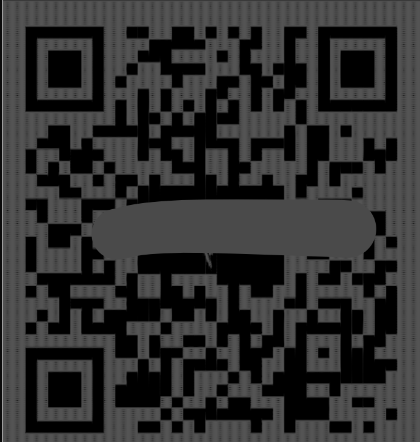
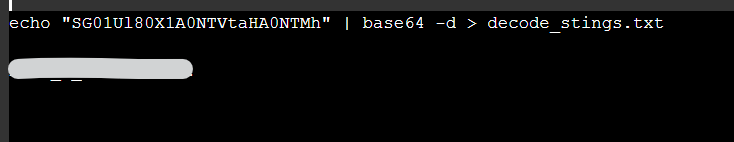
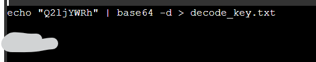
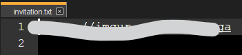
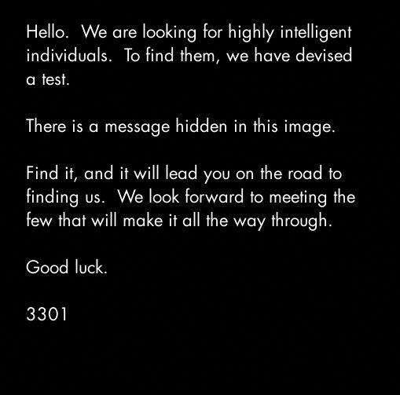
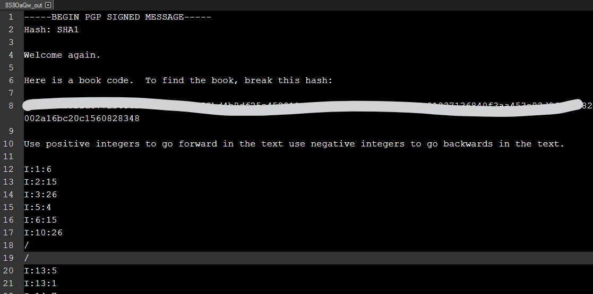
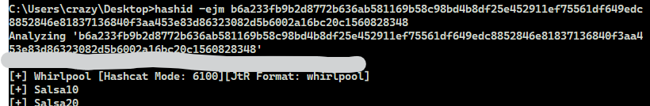

# TryHackMe(THM) - Cicada-3301 Vol-1 - WriteUp

> Austin Lai | August 7th, 2021

---

<!-- Description -->

[Room = TryHackMe(THM) - Cicada-3301 Vol-1](https://tryhackme.com/room/cicada3301vol1)

Difficulty: **Medium**

However, I rate it as quite easy.

The room is completed on June 12th, 2020

<!-- /Description -->

<br />

## Table of Contents

<!-- TOC -->

- [TryHackMeTHM - Cicada-3301 Vol-1 - WriteUp](#tryhackmethm---cicada-3301-vol-1---writeup)
    - [Table of Contents](#table-of-contents)
    - [Task 1](#task-1)
    - [Task 2](#task-2)
    - [Task 3](#task-3)
        - [Question 1](#question-1)
        - [Question 2](#question-2)
        - [Question 3](#question-3)
        - [Question 4](#question-4)
        - [Question 5](#question-5)
    - [Task 4](#task-4)
    - [Task 5](#task-5)
    - [Task 6](#task-6)
        - [Question 1](#question-1)
        - [Question 2](#question-2)
        - [Question 3](#question-3)
        - [Question 4](#question-4)
        - [Question 5](#question-5)
    - [Task 7](#task-7)

<!-- /TOC -->

<br />

## Task 1

Nothing to solve, read through the introduction.

## Task 2

```text
Web Browsers are useless here

Welcome.

Good Luck

-3301

Use Sonic Visualizer to analyze the audio
```

Have you tried spectrogram?



Scan the QR Code, what is the link?

## Task 3

```text
Welcome.

Good Luck.

-3301

Use various encryption methods and ciphers to decode the passphrase and

access the metadata of Welcome.jpg
```

### Question 1

_Find and Decrypt the passphrase and key_

Open the link you get from previous task.

<br />

### Question 2

_What is the decrypted passphrase?_

<details><summary>Hint given by question</summary>

```text
Base64
```



</details>

<br />

### Question 3

_What is the decrypted key?_

<details><summary>Hint given by question</summary>

```text
Base64
```



</details>

<br />

### Question 4

_Still looks funny? Find and use a cipher along with the key to decipher the passphrase_

<details><summary>Hint given by question</summary>

```text
French Diplomat Cipher
```

</details>

<br />

### Question 5

_What is the final passphrase_

<details><summary>Hint given by question</summary>

```text
Encode using Vigenere Cipher
```

</details>

You have the passphrase and key, given the hint. Check it out .

<br />

## Task 4

```text
Good Luck

-3301

Use Steganography tools to gather metadata from Welcome.jpg as well as 

find the hidden message inside of the image file.
```

_Using the found passphrase along with Stego tools find the secret message_

_What link is given?_

<details><summary>Hint given by question</summary>

```text
Steghide
```



</details>

Once you get the link, remember to check out the link, what is the file awaiting you ...

## Task 5

```text
I am surprised you have made it this far... 

I doubt you will make it any further.

-3301

Use Stego tools to find the hidden files inside of the image
```

_Using stego tools find the hidden file inside of the image_

_What tool did you use to find the hidden file_

<details><summary>Hint given by question</summary>

```text
Use the same tool used to extract data in the original Cicada challenges
```

</details>

Once you have the file downloaded from previous task, you can continue here.



Have you google and research online about original cicada?

## Task 6

```text
We have one last challenge to find our individuals

Find the last clue, crack the hash, decipher the message

Good Luck

-3301

Use Hash cracking tools to reveal the text to the text 

Use methods like Cicada to decipher the message
```

Once you have the file extracted from previous task, you can continue here.



### Question 1

_Crack the Hash_

No answer required.

<br />

### Question 2

_What is the Hash type?_

<details><summary>Hint given by question</summary>

```text
SHA... Figure out the rest
```

</details>

What is the hash? Have you check out hashid?



<br />

### Question 3

_What is the Link from the hash?_

<details><summary>Hint given by question</summary>

```text
Answer is not in conventional wordlists, try an online service
```

</details>

Once you check out the hint, you will get the answer.

Remember to download the file.

<br />

### Question 4

_Decipher the message_

<details><summary>Hint given by question</summary>

```text
Use the same techniques the Cicada participants used
```

Have you done research on original Cicada? Perhaps book cipher?

You may use manual method or online method.

</details>

<br />

### Question 5

_What is the link?_

Once you done the previous question, the answer is there.

## Task 7

One you get the link from previous task - last question, answer is right there.

<br />

---

> Do let me know any command or step can be improve or you have any question you can contact me via THM message or write down comment below or via FB


