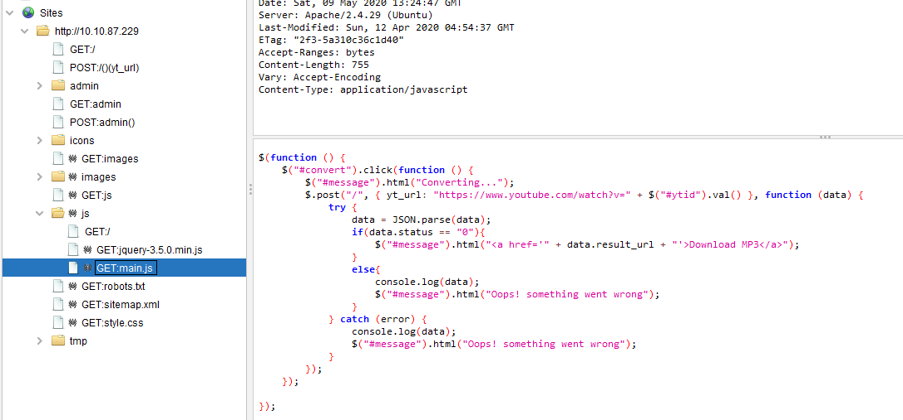

# TryHackMe(THM) - ConvertMyVideo - WriteUp

> Austin Lai | August 7th, 2021

---

<!-- Description -->

[Room = TryHackMe(THM) - ConvertMyVideo](https://tryhackme.com/room/convertmyvideo)

Difficulty: **Medium**

The room is completed on May 9th, 2020

<!-- /Description -->

<br />

## Table of Contents

<!-- TOC -->

- [TryHackMe(THM) - ConvertMyVideo - WriteUp](#tryhackmethm---convertmyvideo---writeup)
    - [Table of Contents](#table-of-contents)
    - [Task 1](#task-1)
        - [Question 1](#question-1)
        - [Question 2 - 3](#question-2---3)
        - [Question 4](#question-4)

<!-- /TOC -->

<br />

## Task 1

Nmap result:

```text
# Nmap 7.80 scan initiated Sat May 09 18:53:42 2020 as: nmap --privileged --stats-every 1s -vvvvvv -Pn -p- -O -sS -sV --version-all -T4 --min-parallelism 10 --script=vuln -A --append-output -oN tryhackme-ConvertMyVideo 10.10.87.229
Pre-scan script results:
| broadcast-avahi-dos: 
|   Discovered hosts:
|     224.0.0.251
|   After NULL UDP avahi packet DoS (CVE-2011-1002).
|   Hosts that seem down (vulnerable):
|_    224.0.0.251
Warning: 10.10.87.229 giving up on port because retransmission cap hit (6).
Nmap scan report for 10.10.87.229
Host is up, received user-set (0.23s latency).
Scanned at 2020-05-09 18:54:22 Malay Peninsula Standard Time for 1896s
Not shown: 65524 closed ports
Reason: 65524 resets
PORT      STATE    SERVICE REASON         VERSION
22/tcp    open     ssh     syn-ack ttl 63 OpenSSH 7.6p1 Ubuntu 4ubuntu0.3 (Ubuntu Linux; protocol 2.0)
|_clamav-exec: ERROR: Script execution failed (use -d to debug)
80/tcp    open     http    syn-ack ttl 63 Apache httpd 2.4.29 ((Ubuntu))
|_clamav-exec: ERROR: Script execution failed (use -d to debug)
|_http-csrf: Couldn't find any CSRF vulnerabilities.
|_http-dombased-xss: Couldn't find any DOM based XSS.
| http-fileupload-exploiter: 
|   
|     Couldn't find a file-type field.
|   
|_    Couldn't find a file-type field.
| http-internal-ip-disclosure: 
|_  Internal IP Leaked: 127.0.1.1
|_http-jsonp-detection: Couldn't find any JSONP endpoints.
|_http-litespeed-sourcecode-download: Request with null byte did not work. This web server might not be vulnerable
|_http-server-header: Apache/2.4.29 (Ubuntu)
|_http-stored-xss: Couldn't find any stored XSS vulnerabilities.
|_http-vuln-cve2017-1001000: ERROR: Script execution failed (use -d to debug)
|_http-wordpress-users: [Error] Wordpress installation was not found. We couldn't find wp-login.php
| vulners: 
|   cpe:/a:apache:http_server:2.4.29: 
|     	CVE-2019-0211	7.2	https://vulners.com/cve/CVE-2019-0211
|     	CVE-2018-1312	6.8	https://vulners.com/cve/CVE-2018-1312
|     	CVE-2017-15715	6.8	https://vulners.com/cve/CVE-2017-15715
|     	CVE-2019-10082	6.4	https://vulners.com/cve/CVE-2019-10082
|     	CVE-2019-0217	6.0	https://vulners.com/cve/CVE-2019-0217
|     	CVE-2020-1927	5.8	https://vulners.com/cve/CVE-2020-1927
|     	CVE-2019-10098	5.8	https://vulners.com/cve/CVE-2019-10098
|     	CVE-2020-1934	5.0	https://vulners.com/cve/CVE-2020-1934
|     	CVE-2019-10081	5.0	https://vulners.com/cve/CVE-2019-10081
|     	CVE-2019-0220	5.0	https://vulners.com/cve/CVE-2019-0220
|     	CVE-2019-0196	5.0	https://vulners.com/cve/CVE-2019-0196
|     	CVE-2018-17199	5.0	https://vulners.com/cve/CVE-2018-17199
|     	CVE-2018-1333	5.0	https://vulners.com/cve/CVE-2018-1333
|     	CVE-2017-15710	5.0	https://vulners.com/cve/CVE-2017-15710
|     	CVE-2019-0197	4.9	https://vulners.com/cve/CVE-2019-0197
|     	CVE-2019-10092	4.3	https://vulners.com/cve/CVE-2019-10092
|     	CVE-2018-11763	4.3	https://vulners.com/cve/CVE-2018-11763
|_    	CVE-2018-1283	3.5	https://vulners.com/cve/CVE-2018-1283
746/tcp   filtered unknown no-response
13283/tcp filtered unknown no-response
19306/tcp filtered unknown no-response
20652/tcp filtered unknown no-response
24481/tcp filtered unknown no-response
34893/tcp filtered unknown no-response
36894/tcp filtered unknown no-response
41094/tcp filtered unknown no-response
42164/tcp filtered unknown no-response
No exact OS matches for host (If you know what OS is running on it, see https://nmap.org/submit/ ).
TCP/IP fingerprint:
OS:SCAN(V=7.80%E=4%D=5/9%OT=22%CT=1%CU=44649%PV=Y%DS=2%DC=T%G=Y%TM=5EB69346
OS:%P=i686-pc-windows-windows)SEQ(SP=FF%GCD=1%ISR=108%TI=Z%CI=Z%II=I%TS=A)S
OS:EQ(CI=Z)OPS(O1=M508ST11NW6%O2=M508ST11NW6%O3=M508NNT11NW6%O4=M508ST11NW6
OS:%O5=M508ST11NW6%O6=M508ST11)WIN(W1=F4B3%W2=F4B3%W3=F4B3%W4=F4B3%W5=F4B3%
OS:W6=F4B3)ECN(R=Y%DF=Y%T=40%W=F507%O=M508NNSNW6%CC=Y%Q=)T1(R=Y%DF=Y%T=40%S
OS:=O%A=S+%F=AS%RD=0%Q=)T2(R=N)T3(R=N)T4(R=Y%DF=Y%T=40%W=0%S=A%A=Z%F=R%O=%R
OS:D=0%Q=)T5(R=Y%DF=Y%T=40%W=0%S=Z%A=S+%F=AR%O=%RD=0%Q=)T6(R=Y%DF=Y%T=40%W=
OS:0%S=A%A=Z%F=R%O=%RD=0%Q=)T7(R=Y%DF=Y%T=40%W=0%S=Z%A=S+%F=AR%O=%RD=0%Q=)U
OS:1(R=Y%DF=N%T=40%IPL=164%UN=0%RIPL=G%RID=G%RIPCK=G%RUCK=G%RUD=G)IE(R=Y%DF
OS:I=N%T=40%CD=S)

Uptime guess: 42.755 days (since Sat Mar 28 01:18:28 2020)
Network Distance: 2 hops
TCP Sequence Prediction: Difficulty=255 (Good luck!)
IP ID Sequence Generation: All zeros
Service Info: OS: Linux; CPE: cpe:/o:linux:linux_kernel

TRACEROUTE (using port 23/tcp)
HOP RTT       ADDRESS
1   228.00 ms 10.9.0.1
2   228.00 ms 10.10.87.229

Read data files from: C:\Program Files (x86)\Nmap
OS and Service detection performed. Please report any incorrect results at https://nmap.org/submit/ .
# Nmap done at Sat May 09 19:25:58 2020 -- 1 IP address (1 host up) scanned in 1936.15 seconds
```

You can fire up gobuster or dirsearch as you want, at the time, we are using OWASP ZAP.

OWASP ZAP Spider:


If you inspect the result, you will notice one of the js (javascript) is interesting.



Have you tried to play around with it?

<details><summary>Hint</summary>

```text
Maybe command injection?
```


</details>

<br />

### Question 1

_What is the name of the secret folder?_

Once you get it in, you will get this answer.

<br />

### Question 2 - 3

_What is the user to access the secret folder?_

_What is the user flag?_

Follow up with question 1, you will get the answer.

<br />

### Question 4

_What is the root flag?_

Do you crack the given hash from question 2?


<details><summary>Hint</summary>

```text
Have you tried to google the type of hash? perhaps using hashid? JTR?
```

</details>

What else you can do with the username and password? Have you checkout another page you got from gobuster or owasp zap?

<details><summary>Hint</summary>

```text
admin page? Keep in mind of the function available in the page .... Have you check you the source?
```

</details>

Time to get reverse shell and root flag !

Since we know it can be exploit via command injection, which allow us to get reverse shell.

Once you get in, let's do some enumeration, with the prior enum, you would have know what should we look for.

<details><summary>Hint</summary>

```text
a clean script, which sound familiar with the function available in admin page.
```

</details>

That's right, now you can modify it to get PrivEsc !

Tho, you can spawn another root shell or just cat the root flag or you can copy it !

<br />

---

> The room was completed long ago when I was just started fresh in TryHackMe platform, some technique can be improved ! Let's have fun !

> Do let me know any command or step can be improve or you have any question you can contact me via THM message or write down comment below or via FB


