# TryHackMe(THM) - Disk Analysis & Autopsy - WriteUp

> Austin Lai | August 6th, 2021

---

<!-- Description -->

[Room = TryHackMe(THM) - Disk Analysis & Autopsy](https://tryhackme.com/room/autopsy2ze0)

Difficulty: **Medium**

The room is completed on June 17th, 2021

You will learn how to analyse Windows Disk Image with popular Forensic Tools --- Autopsy.

Please make sure you have research and play around Autopsy before you started this room.

<!-- /Description -->

<br />

## Table of Contents

<!-- TOC -->

- [TryHackMe(THM) - Disk Analysis & Autopsy - WriteUp](#tryhackmethm---disk-analysis--autopsy---writeup)
    - [Table of Contents](#table-of-contents)
    - [Task 1](#task-1)
        - [Question 1](#question-1)
        - [Question 2](#question-2)
        - [Question 3 - 4](#question-3---4)
        - [Question 5 - 6](#question-5---6)
        - [Question 7](#question-7)
        - [Question 8](#question-8)
        - [Question 9](#question-9)
        - [Question 10](#question-10)
        - [Question 11 - 12](#question-11---12)
        - [Question 13](#question-13)
        - [Question 14](#question-14)
        - [Question 15](#question-15)

<!-- /TOC -->

<br />

## Task 1

### Question 1

_What is the MD5 hash of the E01 image ?_

Once you login to the system, open up Autopsy with the Disk Image

The first thing you saw would be "Data Source", on your right panel - click on it; you will be shown the detail at the bottom panel, remember to check on the "File Metadata"

<details><summary>Answer</summary>

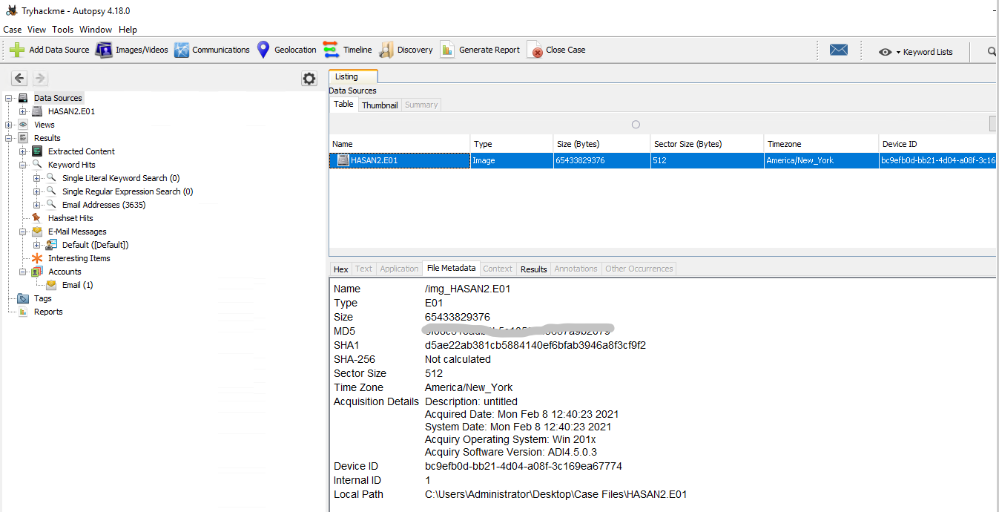

</details>

There is a trick, even you not open the Autopsy, have you notice there is another text file in the same folder ?

<details><summary>Trick Answer</summary>

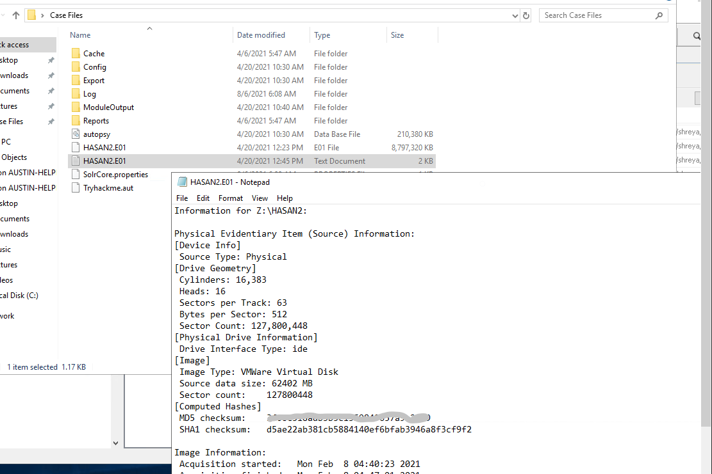

</details>

<br />

### Question 2

_What is the computer account name ?_

The answer is quite straightforward, have you check out "Operating System Information" under "Result" in Autopsy ?

<details><summary>Answer</summary>

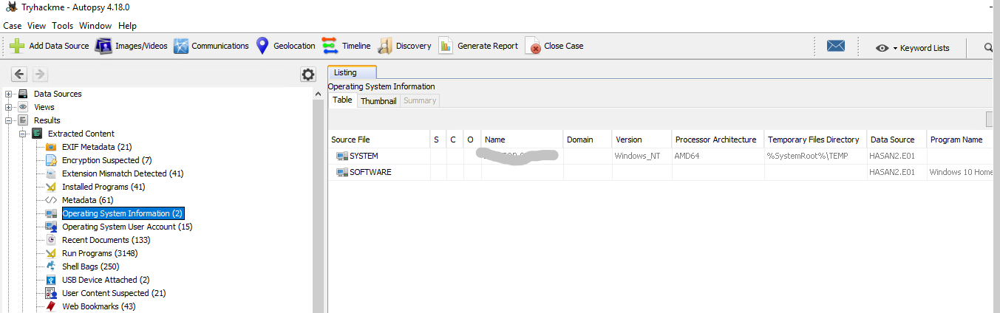

</details>

<br />

### Question 3 - 4

_List all the user accounts. (alphabetical order)_

_Who was the last user to log into the computer ?_

The answer is quite straightforward as well, have you check out "Operating System User Account" under "Result" in Autopsy ?

<details><summary>Answer</summary>

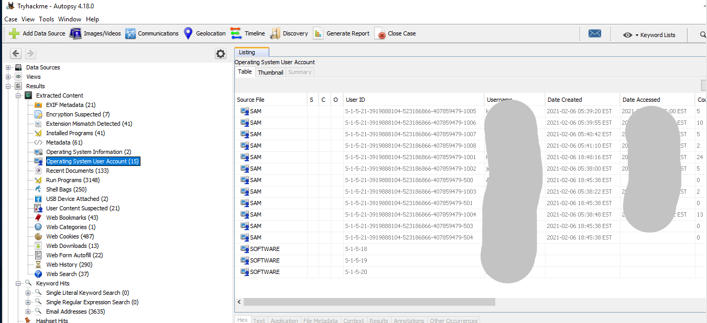

</details>

<br />

### Question 5 - 6

_What was the IP address of the computer?_

_What was the MAC address of the computer? (XX-XX-XX-XX-XX-XX)_

Have you check and analyse what program install ?

<details><summary>Answer</summary>

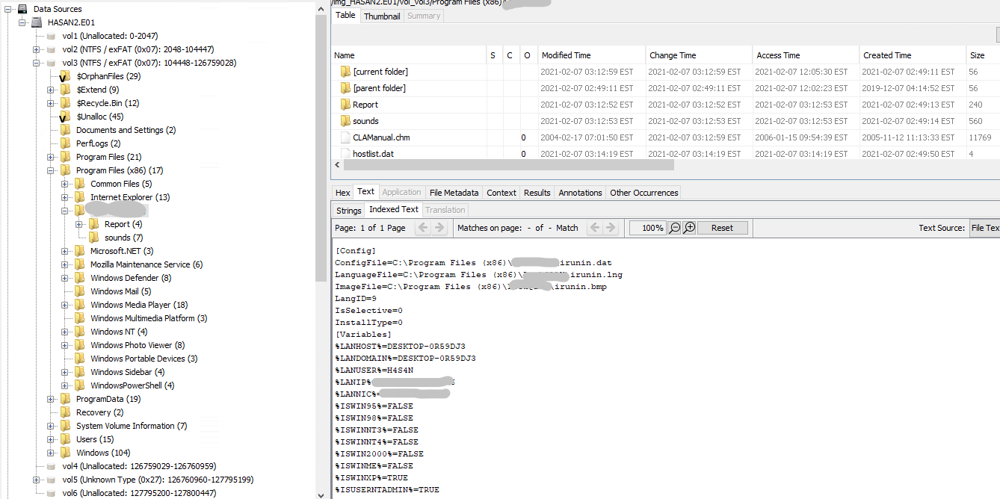

</details>

<br />

### Question 7

_Name the network cards on this computer._

Have you tried to use keyword search ?

<details><summary>Answer</summary>

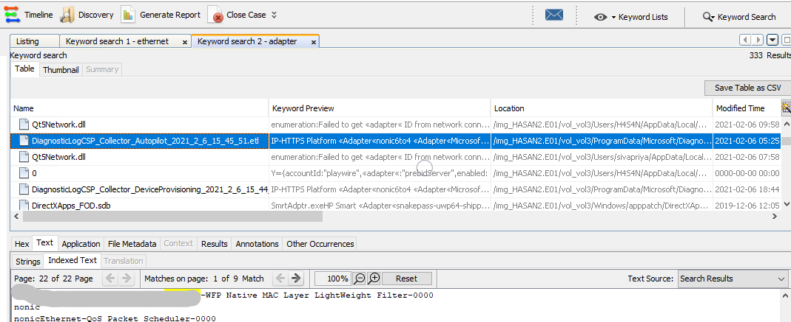

</details>

Additional Method: Have you tried to check out what registry key can get the network card information?

<details><summary>Additional Method</summary>

```text
/Microsoft/Windows NT/CurrentVersion/NetworkCards
```

</details>

<br />

### Question 8

_What is the name of the network monitoring tool?_

If you done question 5 - 6, you should have the answer.

Tho, there is another way to find the answer, check below.

Have you check the "Installed Program" ?

<details><summary>Answer</summary>

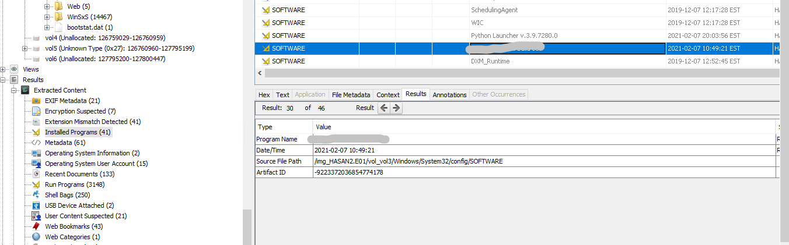

</details>

<br />

### Question 9

_A user bookmarked a Google Maps location. What are the coordinates of the location?_

Have you check on the "Web Bookmark" ?

<details><summary>Answer</summary>

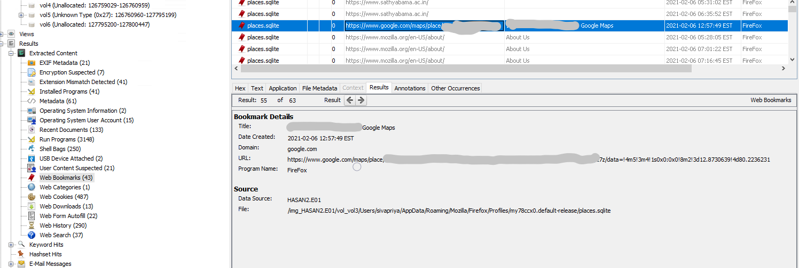

</details>

<br />

### Question 10

_A user has his full name printed on his desktop wallpaper. What is the user's full name?_

Have you check the "Image/Video" ?

<br />

### Question 11 - 12

_A user had a file on her desktop. It had a flag but she changed the flag using PowerShell. What was the first flag?_

_The same user found an exploit to escalate privileges on the computer. What was the message to the device owner?_

Have you notice what user do have powershell script in their folder?

Have you check what is the method to find what powershell command is ran? history? PSReadline?

<details><summary>Answer</summary>

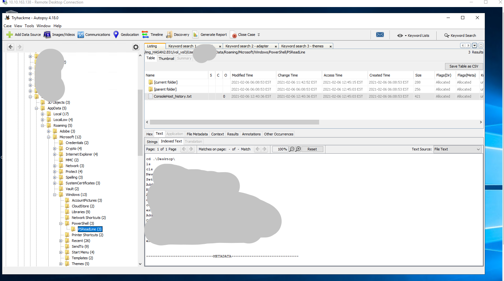

</details>

Beside, there is one more file you can check right?

<details><summary>Additional File</summary>

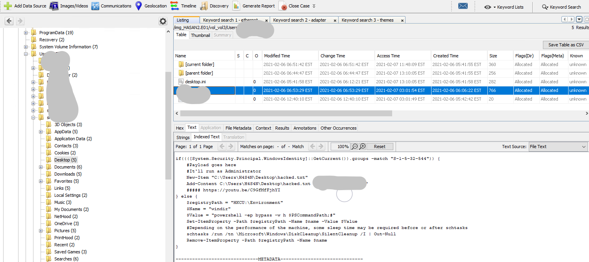

</details>

<br />

### Question 13

_2 hack tools focused on passwords were found in the system. What are the names of these tools? (alphabetical order)_

Have you check what other suspicious file in the user folder?

<details><summary>Answer - 1</summary>

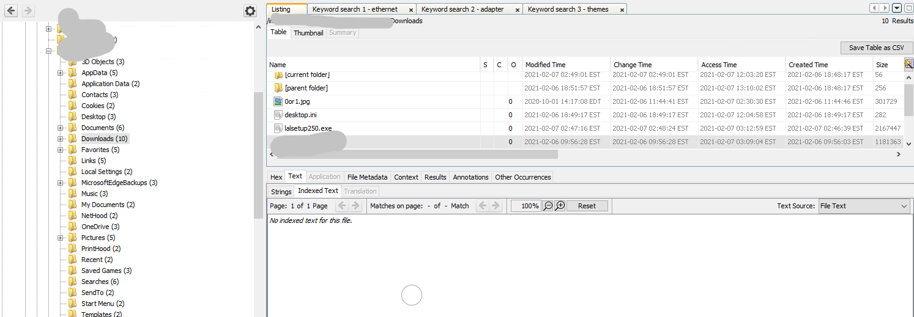

</details>

Once you narrow down the user, have you check what other file is run by the user?

<details><summary>Answer - 2</summary>

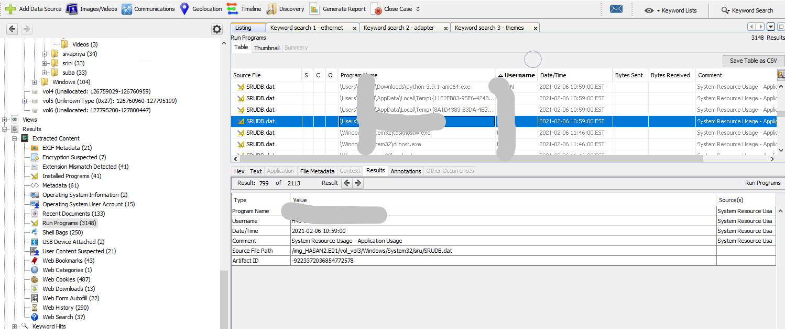

</details>

Beside that, do you know what other method you can get the same answer ?

<details><summary>Additional Method</summary>

```text
Have you check Windows  Defender history?
```

</details>


<br />

### Question 14

_There is a YARA file on the computer. Inspect the file. What is the name of the author?_

Again, you can use keyword search for this.

<details><summary>Answer - 1</summary>

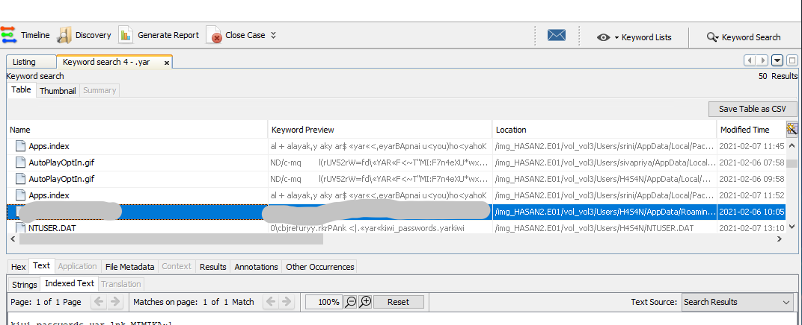

</details>

Once you get the yara file name.

Let narrow down the file contain yara rule.

<details><summary>Answer - 2</summary>

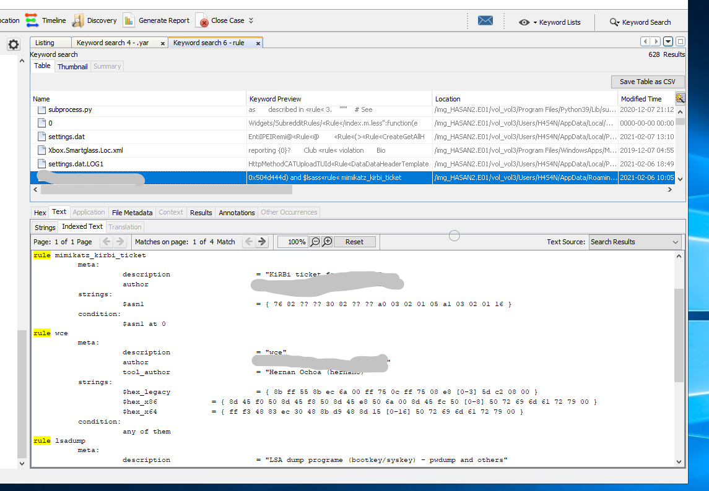

</details>

Beside that, do you know what other method you can get the same answer ?

Have you inspect the content of malicious file?

<br />

### Question 15

_One of the users wanted to exploit a domain controller with an MS-NRPC based exploit. What is the filename of the archive that you found? (include the spaces in your answer)_

Have you check on "Recent Document" ?

<details><summary>Answer</summary>

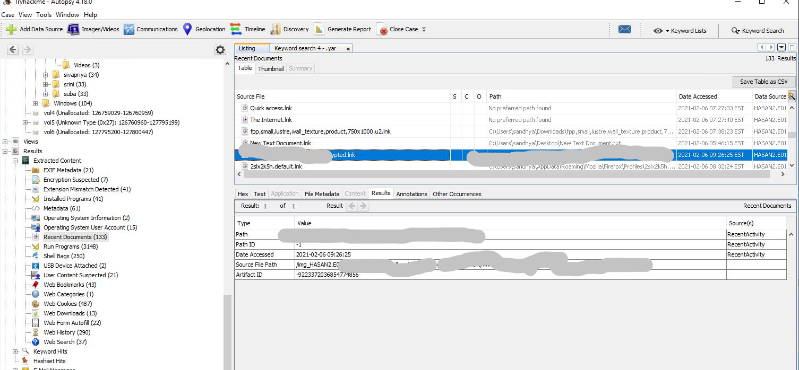

</details>

<br />

---

> Do let me know any command or step can be improve or you have any question you can contact me via THM message or write down comment below or via FB


