# TryHackMe(THM) - Iron Corp - WriteUp

> Austin Lai | August 7th, 2021

---

<!-- Description -->

[Room = TryHackMe(THM) - Iron Corp](https://tryhackme.com/room/ironcorp)

Difficulty: **HARD**

The room is completed on May 23rd, 2020

```text
Iron Corp suffered a security breach not long time ago.

You have been chosen by Iron Corp to conduct a penetration test of their asset. They did system hardening and are expecting you not to be able to access their system.

The asset in scope is: ironcorp.me

Note: Edit your config file and add ironcorp.me

Happy hacking!
```

<!-- /Description -->

<br />

## Table of Contents

<!-- TOC -->

- [TryHackMe(THM) - Iron Corp - WriteUp](#tryhackmethm---iron-corp---writeup)
    - [Table of Contents](#table-of-contents)
    - [Task 1](#task-1)
        - [User Flag](#user-flag)
        - [Root Flag](#root-flag)

<!-- /TOC -->

<br />

## Task 1

Let's fire up basic enumeration.

Nmap result:

```text
# Nmap 7.80 scan initiated Sat May 23 12:23:17 2020 as: nmap --privileged --stats-every 5s -vvvvvv -Pn -p- -A -sC -O -sS -sV --version-all -T4 --min-parallelism 50 --script=vuln --append-output -oN TryHackMe-IronCorp 10.10.13.75
Pre-scan script results:
| broadcast-avahi-dos: 
|   Discovered hosts:
|     224.0.0.251
|   After NULL UDP avahi packet DoS (CVE-2011-1002).
|_  Hosts are all up (not vulnerable).
Nmap scan report for 10.10.13.75
Host is up, received user-set (0.17s latency).
Scanned at 2020-05-23 12:23:56 Malay Peninsula Standard Time for 1666s
Not shown: 65528 filtered ports
Reason: 65528 no-responses
PORT      STATE SERVICE       REASON          VERSION
53/tcp    open  domain?       syn-ack ttl 127
|_clamav-exec: ERROR: Script execution failed (use -d to debug)
| fingerprint-strings: 
|   DNSVersionBindReqTCP: 
|     version
|_    bind
135/tcp   open  msrpc         syn-ack ttl 127 Microsoft Windows RPC
|_clamav-exec: ERROR: Script execution failed (use -d to debug)
3389/tcp  open  ms-wbt-server syn-ack ttl 127 Microsoft Terminal Services
|_clamav-exec: ERROR: Script execution failed (use -d to debug)
|_sslv2-drown: 
8080/tcp  open  http          syn-ack ttl 127 Microsoft IIS httpd 10.0
|_clamav-exec: ERROR: Script execution failed (use -d to debug)
|_http-csrf: Couldn't find any CSRF vulnerabilities.
|_http-dombased-xss: Couldn't find any DOM based XSS.
| http-enum: 
|_  /login.html: Possible admin folder
| http-fileupload-exploiter: 
|   
|     Couldn't find a file-type field.
|   
|     Couldn't find a file-type field.
|   
|     Couldn't find a file-type field.
|   
|     Couldn't find a file-type field.
|   
|     Couldn't find a file-type field.
|   
|     Couldn't find a file-type field.
|   
|     Couldn't find a file-type field.
|   
|     Couldn't find a file-type field.
|   
|     Couldn't find a file-type field.
|   
|_    Couldn't find a file-type field.
|_http-jsonp-detection: Couldn't find any JSONP endpoints.
|_http-litespeed-sourcecode-download: Request with null byte did not work. This web server might not be vulnerable
|_http-server-header: Microsoft-IIS/10.0
|_http-stored-xss: Couldn't find any stored XSS vulnerabilities.
|_http-wordpress-users: [Error] Wordpress installation was not found. We couldn't find wp-login.php
11025/tcp open  http          syn-ack ttl 127 Apache httpd 2.4.41 ((Win64) OpenSSL/1.1.1c PHP/7.4.4)
|_clamav-exec: ERROR: Script execution failed (use -d to debug)
|_http-csrf: Couldn't find any CSRF vulnerabilities.
|_http-dombased-xss: Couldn't find any DOM based XSS.
| http-enum: 
|   /.gitignore: Revision control ignore file
|   /css/: Potentially interesting directory w/ listing on 'apache/2.4.41 (win64) openssl/1.1.1c php/7.4.4'
|   /icons/: Potentially interesting folder w/ directory listing
|   /img/: Potentially interesting directory w/ listing on 'apache/2.4.41 (win64) openssl/1.1.1c php/7.4.4'
|   /js/: Potentially interesting directory w/ listing on 'apache/2.4.41 (win64) openssl/1.1.1c php/7.4.4'
|_  /vendor/: Potentially interesting directory w/ listing on 'apache/2.4.41 (win64) openssl/1.1.1c php/7.4.4'
| http-fileupload-exploiter: 
|   
|     Couldn't find a file-type field.
|   
|     Couldn't find a file-type field.
|   
|     Couldn't find a file-type field.
|   
|     Couldn't find a file-type field.
|   
|     Couldn't find a file-type field.
|   
|     Couldn't find a file-type field.
|   
|     Couldn't find a file-type field.
|   
|_    Couldn't find a file-type field.
|_http-jsonp-detection: Couldn't find any JSONP endpoints.
|_http-litespeed-sourcecode-download: Request with null byte did not work. This web server might not be vulnerable
|_http-server-header: Apache/2.4.41 (Win64) OpenSSL/1.1.1c PHP/7.4.4
| http-sql-injection: 
|   Possible sqli for queries:
|     http://10.10.13.75:11025/vendor/jquery/?C=M%3bO%3dA%27%20OR%20sqlspider
|     http://10.10.13.75:11025/vendor/jquery/?C=N%3bO%3dD%27%20OR%20sqlspider
|     http://10.10.13.75:11025/vendor/jquery/?C=S%3bO%3dA%27%20OR%20sqlspider
|     http://10.10.13.75:11025/vendor/jquery/?C=D%3bO%3dA%27%20OR%20sqlspider
|     http://10.10.13.75:11025/vendor/bootstrap/js/?C=N%3bO%3dD%27%20OR%20sqlspider
|     http://10.10.13.75:11025/vendor/bootstrap/js/?C=D%3bO%3dA%27%20OR%20sqlspider
|     http://10.10.13.75:11025/vendor/bootstrap/js/?C=M%3bO%3dA%27%20OR%20sqlspider
|     http://10.10.13.75:11025/vendor/bootstrap/js/?C=S%3bO%3dA%27%20OR%20sqlspider
|     http://10.10.13.75:11025/vendor/jquery/?C=M%3bO%3dD%27%20OR%20sqlspider
|     http://10.10.13.75:11025/vendor/jquery/?C=S%3bO%3dA%27%20OR%20sqlspider
|     http://10.10.13.75:11025/vendor/jquery/?C=N%3bO%3dA%27%20OR%20sqlspider
|     http://10.10.13.75:11025/vendor/jquery/?C=D%3bO%3dA%27%20OR%20sqlspider
|     http://10.10.13.75:11025/vendor/jquery/?C=M%3bO%3dA%27%20OR%20sqlspider
|     http://10.10.13.75:11025/vendor/jquery/?C=N%3bO%3dA%27%20OR%20sqlspider
|     http://10.10.13.75:11025/vendor/jquery/?C=S%3bO%3dA%27%20OR%20sqlspider
|     http://10.10.13.75:11025/vendor/jquery/?C=D%3bO%3dA%27%20OR%20sqlspider
|     http://10.10.13.75:11025/vendor/jquery/?C=M%3bO%3dA%27%20OR%20sqlspider
|     http://10.10.13.75:11025/vendor/jquery/?C=N%3bO%3dA%27%20OR%20sqlspider
|     http://10.10.13.75:11025/vendor/jquery/?C=S%3bO%3dD%27%20OR%20sqlspider
|     http://10.10.13.75:11025/vendor/jquery/?C=D%3bO%3dA%27%20OR%20sqlspider
|     http://10.10.13.75:11025/vendor/jquery/?C=M%3bO%3dA%27%20OR%20sqlspider
|     http://10.10.13.75:11025/vendor/jquery/?C=D%3bO%3dD%27%20OR%20sqlspider
|     http://10.10.13.75:11025/vendor/jquery/?C=S%3bO%3dA%27%20OR%20sqlspider
|     http://10.10.13.75:11025/vendor/jquery/?C=N%3bO%3dA%27%20OR%20sqlspider
|     http://10.10.13.75:11025/vendor/?C=N%3bO%3dD%27%20OR%20sqlspider
|     http://10.10.13.75:11025/vendor/?C=S%3bO%3dA%27%20OR%20sqlspider
|     http://10.10.13.75:11025/vendor/?C=D%3bO%3dA%27%20OR%20sqlspider
|     http://10.10.13.75:11025/vendor/?C=M%3bO%3dA%27%20OR%20sqlspider
|     http://10.10.13.75:11025/vendor/bootstrap/js/?C=D%3bO%3dA%27%20OR%20sqlspider
|     http://10.10.13.75:11025/vendor/bootstrap/js/?C=M%3bO%3dA%27%20OR%20sqlspider
|     http://10.10.13.75:11025/vendor/bootstrap/js/?C=N%3bO%3dA%27%20OR%20sqlspider
|_    http://10.10.13.75:11025/vendor/bootstrap/js/?C=S%3bO%3dA%27%20OR%20sqlspider
|_http-stored-xss: Couldn't find any stored XSS vulnerabilities.
| http-trace: TRACE is enabled
| Headers:
| Date: Sat, 23 May 2020 04:37:03 GMT
| Server: Apache/2.4.41 (Win64) OpenSSL/1.1.1c PHP/7.4.4
| Connection: close
| Transfer-Encoding: chunked
|_Content-Type: message/http
|_http-wordpress-users: [Error] Wordpress installation was not found. We couldn't find wp-login.php
| vulners: 
|   cpe:/a:apache:http_server:2.4.41: 
|     	CVE-2020-1927	5.8	https://vulners.com/cve/CVE-2020-1927
|_    	CVE-2020-1934	5.0	https://vulners.com/cve/CVE-2020-1934
49667/tcp open  msrpc         syn-ack ttl 127 Microsoft Windows RPC
|_clamav-exec: ERROR: Script execution failed (use -d to debug)
49670/tcp open  msrpc         syn-ack ttl 127 Microsoft Windows RPC
|_clamav-exec: ERROR: Script execution failed (use -d to debug)
1 service unrecognized despite returning data. If you know the service/version, please submit the following fingerprint at https://nmap.org/cgi-bin/submit.cgi?new-service :
SF-Port53-TCP:V=7.80%I=9%D=5/23%Time=5EC8A66E%P=i686-pc-windows-windows%r(
SF:DNSVersionBindReqTCP,20,"\0\x1e\0\x06\x81\x04\0\x01\0\0\0\0\0\0\x07vers
SF:ion\x04bind\0\0\x10\0\x03");
Warning: OSScan results may be unreliable because we could not find at least 1 open and 1 closed port
Device type: general purpose
Running (JUST GUESSING): Microsoft Windows 2016 (87%)
OS CPE: cpe:/o:microsoft:windows_server_2016
OS fingerprint not ideal because: Missing a closed TCP port so results incomplete
Aggressive OS guesses: Microsoft Windows Server 2016 (87%)
No exact OS matches for host (test conditions non-ideal).
TCP/IP fingerprint:
SCAN(V=7.80%E=4%D=5/23%OT=53%CT=%CU=%PV=Y%DS=2%DC=T%G=N%TM=5EC8ABDE%P=i686-pc-windows-windows)
SEQ(SP=F5%GCD=1%ISR=10F%TI=I%TS=A)
SEQ(SP=F6%GCD=1%ISR=10F%TS=A)
OPS(O1=M508NW8ST11%O2=M508NW8ST11%O3=M508NW8NNT11%O4=M508NW8ST11%O5=M508NW8ST11%O6=M508ST11)
WIN(W1=2000%W2=2000%W3=2000%W4=2000%W5=2000%W6=2000)
ECN(R=Y%DF=Y%TG=80%W=2000%O=M508NW8NNS%CC=Y%Q=)
T1(R=Y%DF=Y%TG=80%S=O%A=S+%F=AS%RD=0%Q=)
T2(R=N)
T3(R=N)
T4(R=N)
U1(R=N)
IE(R=N)

Uptime guess: 0.024 days (since Sat May 23 12:17:02 2020)
Network Distance: 2 hops
TCP Sequence Prediction: Difficulty=246 (Good luck!)
IP ID Sequence Generation: Busy server or unknown class
Service Info: OS: Windows; CPE: cpe:/o:microsoft:windows

TRACEROUTE (using port 53/tcp)
HOP RTT       ADDRESS
1   202.00 ms 10.9.0.1
2   206.00 ms 10.10.13.75

Read data files from: C:\Program Files (x86)\Nmap
OS and Service detection performed. Please report any incorrect results at https://nmap.org/submit/ .
# Nmap done at Sat May 23 12:51:42 2020 -- 1 IP address (1 host up) scanned in 1705.58 seconds
# Nmap 7.80 scan initiated Sat May 23 12:52:10 2020 as: nmap --privileged --stats-every 5s -vvvvvv -Pn -p- -A -sC -O -sS -sV --version-all -T4 --min-parallelism 50 --append-output -oN TryHackMe-IronCorp 10.10.13.75
Nmap scan report for admin.ironcorp.me (10.10.13.75)
Host is up, received user-set (0.22s latency).
Scanned at 2020-05-23 12:52:15 Malay Peninsula Standard Time for 883s
Not shown: 65528 filtered ports
Reason: 65528 no-responses
PORT      STATE SERVICE       REASON          VERSION
53/tcp    open  domain?       syn-ack ttl 127
| fingerprint-strings: 
|   DNSVersionBindReqTCP: 
|     version
|_    bind
135/tcp   open  msrpc         syn-ack ttl 127 Microsoft Windows RPC
3389/tcp  open  ms-wbt-server syn-ack ttl 127 Microsoft Terminal Services
| rdp-ntlm-info: 
|   Target_Name: WIN-8VMBKF3G815
|   NetBIOS_Domain_Name: WIN-8VMBKF3G815
|   NetBIOS_Computer_Name: WIN-8VMBKF3G815
|   DNS_Domain_Name: WIN-8VMBKF3G815
|   DNS_Computer_Name: WIN-8VMBKF3G815
|   Product_Version: 10.0.14393
|_  System_Time: 2020-05-23T05:06:41+00:00
| ssl-cert: Subject: commonName=WIN-8VMBKF3G815
| Issuer: commonName=WIN-8VMBKF3G815
| Public Key type: rsa
| Public Key bits: 2048
| Signature Algorithm: sha256WithRSAEncryption
| Not valid before: 2020-04-12T18:27:11
| Not valid after:  2020-10-12T18:27:11
| MD5:   5712 e0f5 1549 eadd dc22 35f8 ed75 29a4
| SHA-1: 3fe2 5ec2 c766 a48a a7fa 87e5 362f f246 254f 2ccb
| -----BEGIN CERTIFICATE-----
| MIIC4jCCAcqgAwIBAgIQYMqaBsXFxKBNefuoVHxMTzANBgkqhkiG9w0BAQsFADAa
| MRgwFgYDVQQDEw9XSU4tOFZNQktGM0c4MTUwHhcNMjAwNDEyMTgyNzExWhcNMjAx
| MDEyMTgyNzExWjAaMRgwFgYDVQQDEw9XSU4tOFZNQktGM0c4MTUwggEiMA0GCSqG
| SIb3DQEBAQUAA4IBDwAwggEKAoIBAQC3Xx5bCYVksCGJsoGGdict0OcRaM1huKJE
| GlBo4XS0ynIaOLL+cFt3gwHLnI+ww7GZialVRaZ4GQAPvpMwbqZ9HbUcxRSIynrm
| zSEs/WVCCmV7twv7w6QTWiI6Nta1skpOQUB6iDDYV5Yx/yWUhzLums8GqE+pwOwH
| SuXUaPetAoGkJIY45f5ZiAIdS54x6RrVkWrsLQ9OGCDbZ/3BoSgaBgutT6X1Vaip
| MARvFOu/RRp70rYg5BCEG0gB0b/dL1d4rhbdHnFGBnvmhu4tHLASaMCuLW2tYTTh
| sEGp1UuCBeniWt59IHVx1h06Wd9ij/AkGS/cu92+0IApMnIwPmFxAgMBAAGjJDAi
| MBMGA1UdJQQMMAoGCCsGAQUFBwMBMAsGA1UdDwQEAwIEMDANBgkqhkiG9w0BAQsF
| AAOCAQEAapLFT1yrfTEqrkVvrC8DgiN+E+0ZqL8hVSmYbTdHknXmXWT0sGYfoiPi
| c+VTqfFZ2rpHaEur6zndxjrFdqIoHQXBllnUW6R7+ifxmoTamigFjx1NK5vSLmGb
| L/6kwmmYHNMFJQ726fZ+0DQ6avi7UFHKh32PXaAK/0MPE3cjCxnQG5VQwkOHfoWw
| TJ/VoDIyXCvVoE1MUdO5os5aYhqL/kTwvPOFp6OcvHyRmJlWEG8MMx2MzOr4ybhg
| CfWM1I9zjnZphTAuupYUuQ9RqaNU1TCEv/YWpFd4lLYwd7ZH4x1duaKe/aw0A1vy
| wS89EnqIZUrc10SMdhYjqKHcV9ai/g==
|_-----END CERTIFICATE-----
|_ssl-date: 2020-05-23T05:06:56+00:00; -1s from scanner time.
8080/tcp  open  http          syn-ack ttl 127 Microsoft IIS httpd 10.0
| http-methods: 
|   Supported Methods: OPTIONS TRACE GET HEAD POST
|_  Potentially risky methods: TRACE
|_http-server-header: Microsoft-IIS/10.0
|_http-title: Dashtreme Admin - Free Dashboard for Bootstrap 4 by Codervent
11025/tcp open  http          syn-ack ttl 127 Apache httpd 2.4.41 ((Win64) OpenSSL/1.1.1c PHP/7.4.4)
| http-auth: 
| HTTP/1.1 401 Unauthorized\x0D
|_  Basic realm=My Protected Area
|_http-server-header: Apache/2.4.41 (Win64) OpenSSL/1.1.1c PHP/7.4.4
|_http-title: Authentication required!
49667/tcp open  msrpc         syn-ack ttl 127 Microsoft Windows RPC
49670/tcp open  msrpc         syn-ack ttl 127 Microsoft Windows RPC
1 service unrecognized despite returning data. If you know the service/version, please submit the following fingerprint at https://nmap.org/cgi-bin/submit.cgi?new-service :
SF-Port53-TCP:V=7.80%I=9%D=5/23%Time=5EC8AD73%P=i686-pc-windows-windows%r(
SF:DNSVersionBindReqTCP,20,"\0\x1e\0\x06\x81\x04\0\x01\0\0\0\0\0\0\x07vers
SF:ion\x04bind\0\0\x10\0\x03");
Warning: OSScan results may be unreliable because we could not find at least 1 open and 1 closed port
Device type: general purpose
Running (JUST GUESSING): Microsoft Windows 2016 (88%)
OS CPE: cpe:/o:microsoft:windows_server_2016
OS fingerprint not ideal because: Missing a closed TCP port so results incomplete
Aggressive OS guesses: Microsoft Windows Server 2016 (88%)
No exact OS matches for host (test conditions non-ideal).
TCP/IP fingerprint:
SCAN(V=7.80%E=4%D=5/23%OT=53%CT=%CU=%PV=Y%DS=2%DC=T%G=N%TM=5EC8AF72%P=i686-pc-windows-windows)
SEQ(SP=104%GCD=1%ISR=108%TS=A)
SEQ(SP=103%GCD=1%ISR=108%TI=I%TS=A)
OPS(O1=M508NW8ST11%O2=M508NW8ST11%O3=M508NW8NNT11%O4=M508NW8ST11%O5=M508NW8ST11%O6=M508ST11)
WIN(W1=2000%W2=2000%W3=2000%W4=2000%W5=2000%W6=2000)
ECN(R=Y%DF=Y%TG=80%W=2000%O=M508NW8NNS%CC=Y%Q=)
T1(R=Y%DF=Y%TG=80%S=O%A=S+%F=AS%RD=0%Q=)
T2(R=N)
T3(R=N)
T4(R=N)
U1(R=N)
IE(R=N)

Uptime guess: 0.035 days (since Sat May 23 12:17:02 2020)
Network Distance: 2 hops
TCP Sequence Prediction: Difficulty=259 (Good luck!)
IP ID Sequence Generation: Incremental
Service Info: OS: Windows; CPE: cpe:/o:microsoft:windows

Host script results:
|_clock-skew: mean: 0s, deviation: 0s, median: -1s

TRACEROUTE (using port 135/tcp)
HOP RTT       ADDRESS
1   197.00 ms 10.9.0.1
2   327.00 ms admin.ironcorp.me (10.10.13.75)

Read data files from: C:\Program Files (x86)\Nmap
OS and Service detection performed. Please report any incorrect results at https://nmap.org/submit/ .
# Nmap done at Sat May 23 13:06:58 2020 -- 1 IP address (1 host up) scanned in 888.60 seconds
```

As mentioned in the task, we will need to add ironcorp.me into hosts, as well as notice the second nmap result show something interesting?

Once added hosts, let do some digging.

Dig result:

```text
; <<>> DiG 9.16.2-Debian <<>> 10.10.13.75
;; global options: +cmd
;; Got answer:
;; ->>HEADER<<- opcode: QUERY, status: NOERROR, id: 46859
;; flags: qr rd ad; QUERY: 1, ANSWER: 1, AUTHORITY: 0, ADDITIONAL: 0
;; WARNING: recursion requested but not available

;; QUESTION SECTION:
;10.10.13.75.			IN	A

;; ANSWER SECTION:
10.10.13.75.		0	IN	A	10.10.13.75

;; Query time: 4 msec
;; SERVER: 172.17.96.1#53(172.17.96.1)
;; WHEN: Sat May 23 12:42:40 +08 2020
;; MSG SIZE  rcvd: 56


; <<>> DiG 9.16.2-Debian <<>> ironcorp.me @10.10.13.75 axfr
;; global options: +cmd
ironcorp.me.		3600	IN	SOA	win-8vmbkf3g815. hostmaster. 3 900 600 86400 3600
ironcorp.me.		3600	IN	NS	win-8vmbkf3g815.
admin.ironcorp.me.	3600	IN	A	127.0.0.1
internal.ironcorp.me.	3600	IN	A	127.0.0.1
ironcorp.me.		3600	IN	SOA	win-8vmbkf3g815. hostmaster. 3 900 600 86400 3600
;; Query time: 284 msec
;; SERVER: 10.10.13.75#53(10.10.13.75)
;; WHEN: Sat May 23 12:43:37 +08 2020
;; XFR size: 5 records (messages 1, bytes 238)
```

While at the time, I'm using OWASP ZAP to act like a gobuster tools as well as intercept the HTTP traffic.

Main page (8080):

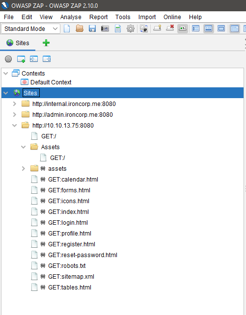

Admin page (8080):

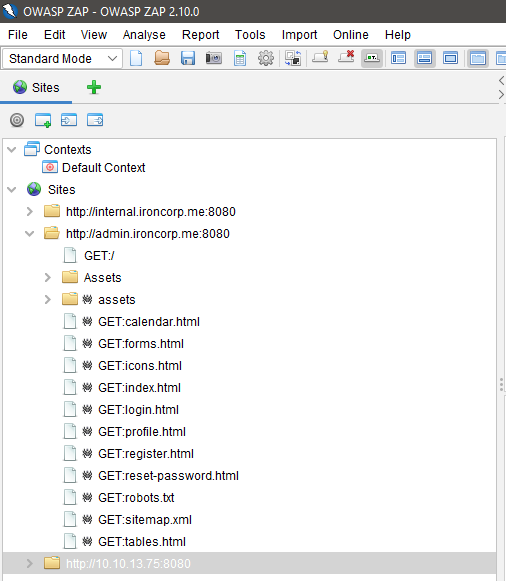

Internal page (8080):

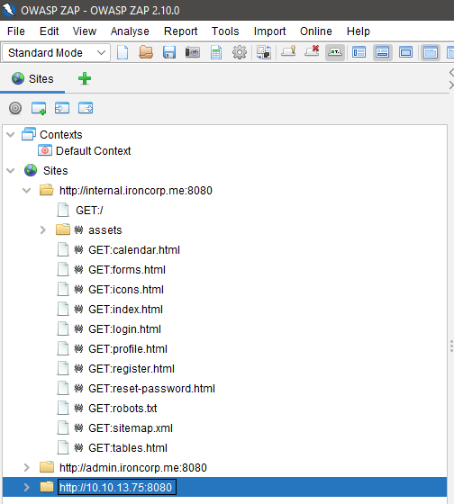

Both main and admin page (8080):

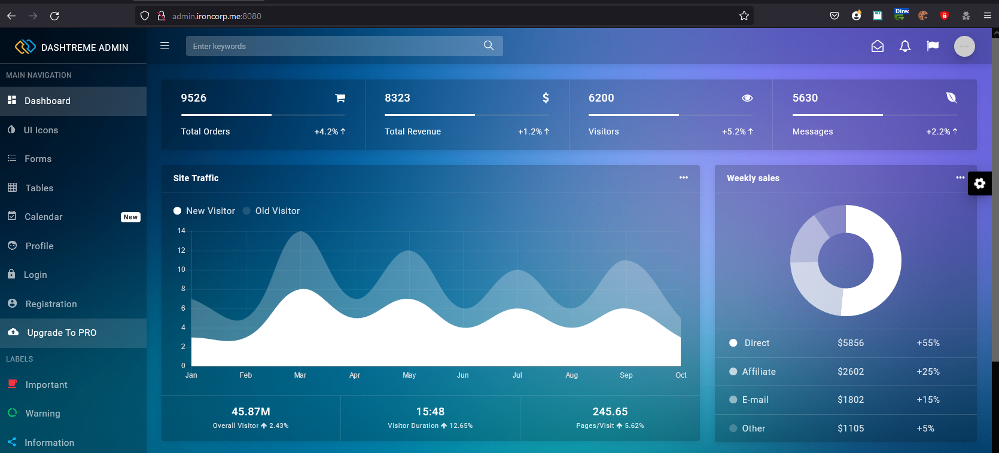

Let check on port 11025, if you using gobuster or OWASP ZAP, again, nothing show informative here.

Let check out the page

Main page (11025):

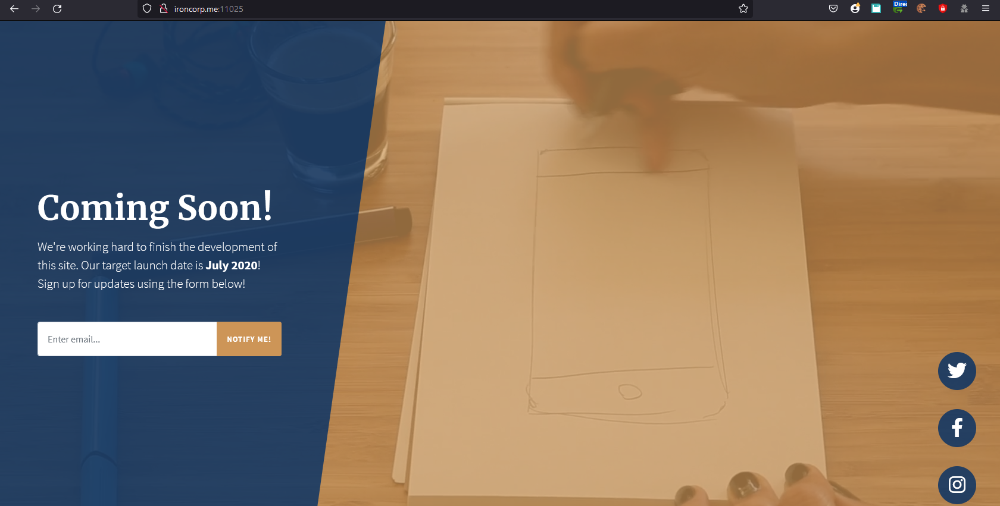

Admin page (11025):

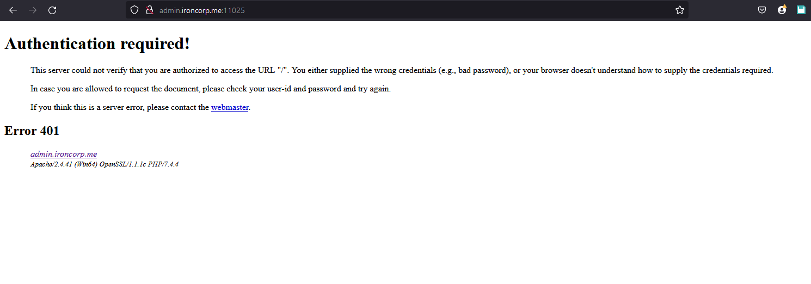

Well, there you found something.

Have you try hydra with common username and password from seclist ?

Yeah, we found the credentials and manage to login.

Admin page (11025) - Hydra Result:

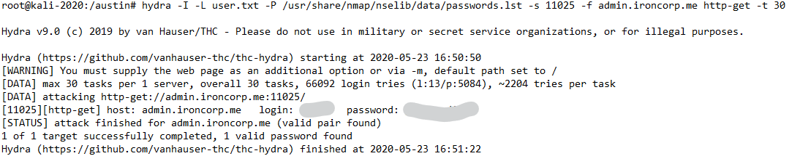

Admin page (11025) success login:

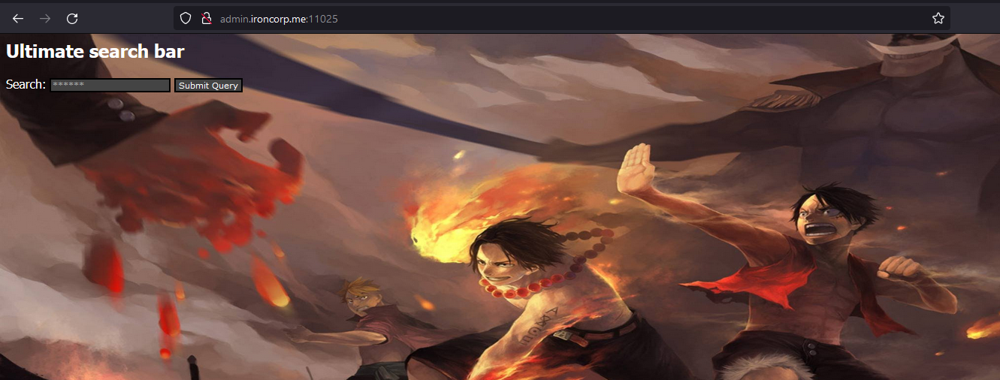

Hmm, it seem like we can perform some LFI or command injection ...

Have you tried any of it? What is the outcome ?

Do you still remember ironcorp do has an internal page we have not yet get thru?

What else you can done? Leveraging the LFI as referrer ?

Check out the result:

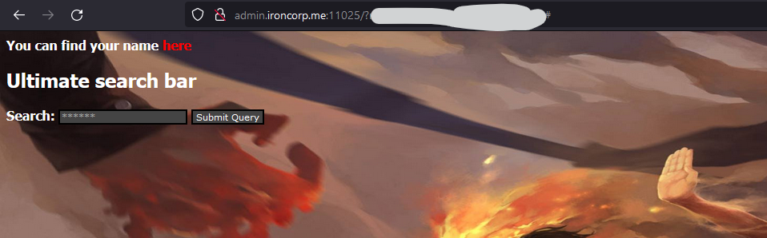

It give out something we would want to explore more !

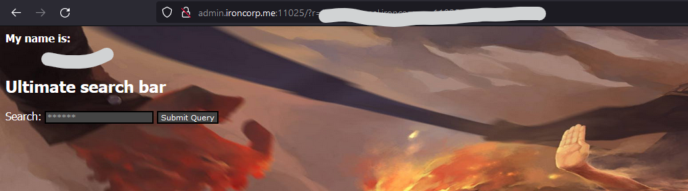

Well, there it is ... we got the username !

Can we tried command injection ? perhaps shell escape ?

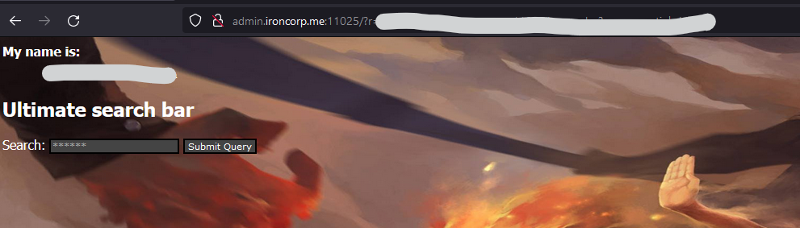

Yeah, now we talking, we are able to get the command injection working.

Let get our reverse shell then.

There are plenty method we can get reverse shell from windows environment ... oppss... by now you should know that this is windows environment right? Especially nmap result shown and the command injection result shown.

You can choose to generate reverse shell payload from msfvenom or just plain powershell or other method as you like.

For our case here, we use simple plain powershell then.

If you don't know what we are talking about, google and research it!

Specifically we talking about ` Invoke-PowerShellTcp `

Save as script? Spawn netcat? Web Server? --- to allow we download using command injection in the victim machine?

Now, we get our payload ready, challenge is how we get pass to the web server?

Think about how url represent?

<details><summary>Hint</summary>

```text
URL encode
```

</details>

<br />

### User Flag

From there once you get the reverse shell, the user flag is what you looking at !

<br />

### Root Flag

Time to get PrivEsc !

There are others method you can PrivEsc in windows environment, for example, potato base, mimikatz, or you could use the easiest method --- meterpreter !

Take note, most PrivEsc require you to get impersonated token !

If you using meterpreter, research what is the straightforward function in meterpreter to get impersonated token.

<details><summary>Hint</summary>

```text
INCOGNITO
```

</details>

From there, you can get the ROOT and your root flag is right there waiting for you!

<br />

---

> The room was completed long ago when I was just started fresh in TryHackMe platform, some technique can be improved ! Let's have fun !

> Do let me know any command or step can be improve or you have any question you can contact me via THM message or write down comment below or via FB


