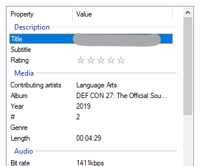
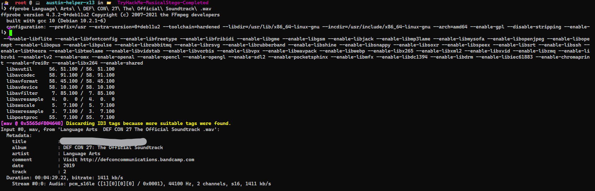
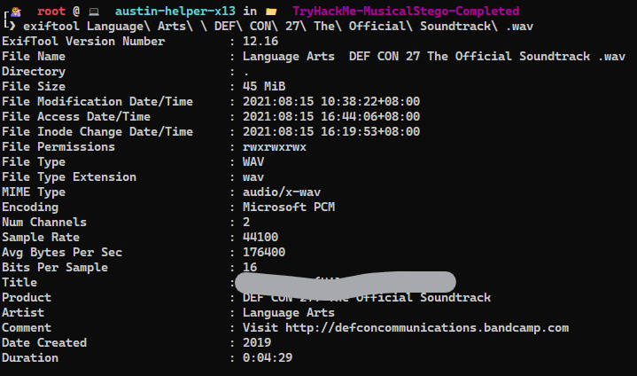
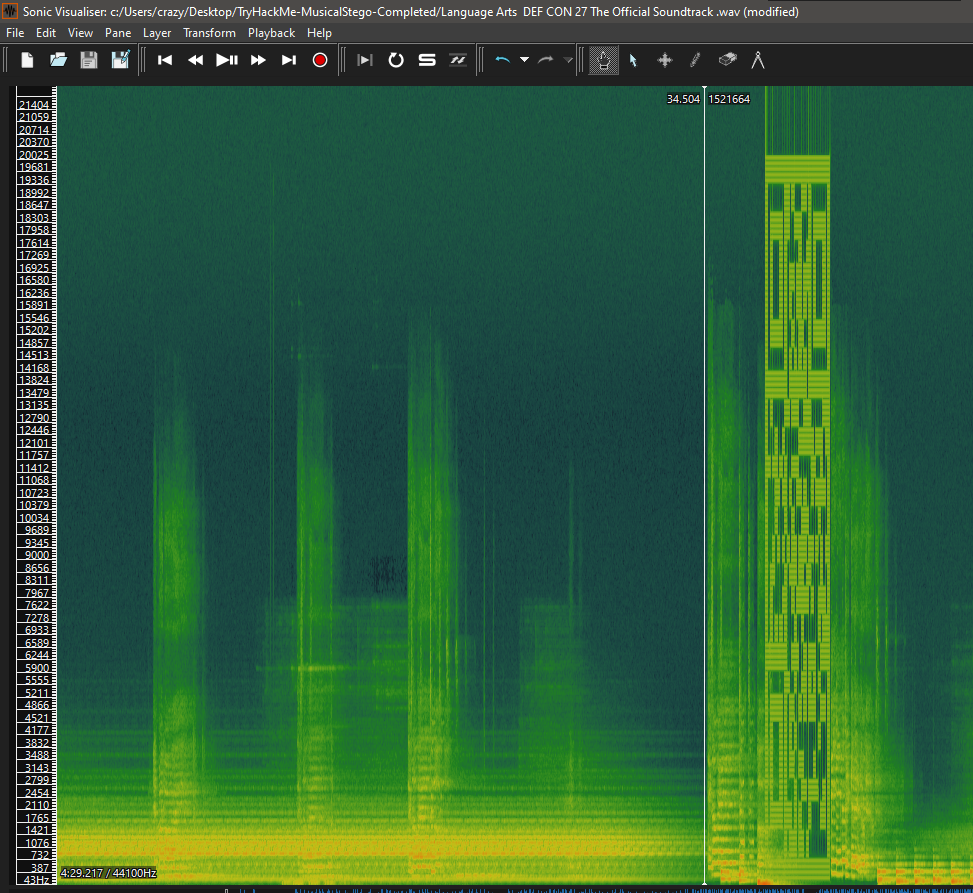
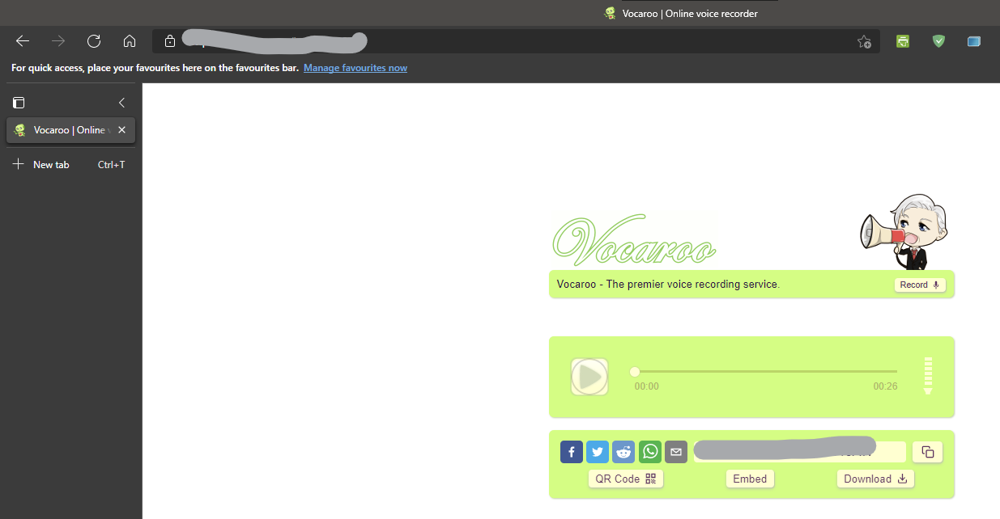
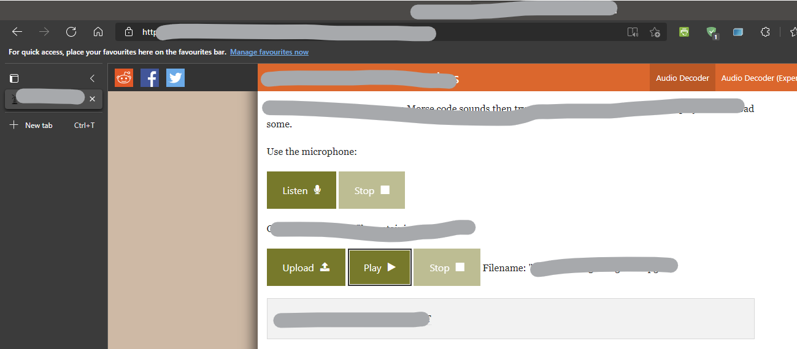
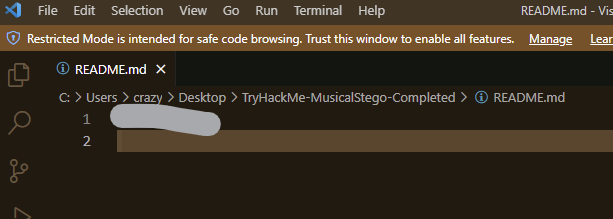
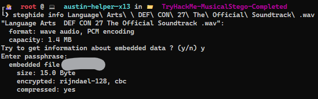

# TryHackMe(THM) - Musical Stego - WriteUp

> Austin Lai | August 15th, 2021

---

<!-- Description -->

[Room = TryHackMe(THM) - Musical Stego](https://tryhackme.com/room/musicalstego)

Difficulty: **Medium**

The room is completed on Aug 15th, 2021

I would rate it as quite easy and it was fun, given that to work on audio steganography.

<!-- /Description -->

---

## Table of Contents

<!-- TOC -->

- [TryHackMeTHM - Musical Stego - WriteUp](#tryhackmethm---musical-stego---writeup)
    - [Table of Contents](#table-of-contents)
    - [Task 1](#task-1)
        - [Question 1](#question-1)
        - [Question 2](#question-2)
        - [Question 3](#question-3)
        - [Question 4](#question-4)
        - [Question 5](#question-5)
        - [Question 6](#question-6)

<!-- /TOC -->

---

## Task 1

```text
Download and listen to the audio file. Can you complete this challenge?
```

### Question 1

_Download the file_

### Question 2

_Who remixed the song?_

Quite easy, you can check the mp3 tag or the file detail if you using windows.

File properties:



Or you can use `ffprobe` from `ffmpeg` to check the mp3 tag:



Or you can use exiftool, right?



### Question 3

_What link is hiding in the music?_

<details><summary>Hint given by question</summary>

```text
Useful Tool: Sonic Visualizer
```

</details>

Using Sonic Visualizer to analyse:



Once you extracted the image, you will get the link.



### Question 4

_What does the found audio convert to? [CHECK HINT, LINK IS DEAD]_

<details><summary>Hint given by question</summary>

```text
https://github.com/m00-git/XXXXXXXX Replace the last 8 characters of the github link with the last 8 characters of the pastebin link found in the audio. Sorry about the less than ideal solution, "Paste will never expire" just doesn't mean what it used to I guess.
```

</details>

If you listen to the audio found from the previous question, you will know it is a code.

Check out what is it, then you will have the link.


<details><summary>Hint</summary>

```text
morse
```

</details>



### Question 5

_What was the found password?_

Once you have the link from previous question, it lead you to a file.



### Question 6

_What is the final flag?_

<details><summary>Hint given by question</summary>

```text
Useful Tool: Steghide
```

</details>

Let say you get this far, what is the final flag, there is only 2 audio we downloaded and a password.

Even if you not checking the hint, you can always google how to extract hidden data from audio.

You will find out steghide probably is the answer, especially it work on wav audio file and given we have a password

Let's check it out.



Now we have the final flag !

<br />

---

> Do let me know any command or step can be improve or you have any question you can contact me via THM message or write down comment below or via FB


