# TryHackMe(THM) - Racetrack Bank - WriteUp

> Austin Lai | August 8th, 2021

---

<!-- Description -->

[Room = TryHackMe(THM) - Racetrack Bank](https://tryhackme.com/room/racetrackbank)

Difficulty: **HARD**

The room is completed on May 23rd, 2020

```text
It's time for another heist.

Hack into the machine and capture both the user and root flags! It's pretty hard, so good luck.
```

<!-- /Description -->

<br />

## Table of Contents

<!-- TOC -->

- [TryHackMeTHM - Racetrack Bank - WriteUp](#tryhackmethm---racetrack-bank---writeup)
    - [Table of Contents](#table-of-contents)
    - [Task 1](#task-1)
        - [User Flag](#user-flag)
        - [Root Flag](#root-flag)

<!-- /TOC -->

<br />

## Task 1

Let fire up basic enumeration.

Nmap result:

```text
# Nmap 7.80 scan initiated Fri May 22 21:15:38 2020 as: nmap --privileged --stats-every 5s -vvvvvv -Pn -p- -A -sC -O -sS -sV --version-all -T4 --min-parallelism 50 --script=vuln --append-output -oN TryHackMe-RacetrackBank 10.10.88.80
Pre-scan script results:
| broadcast-avahi-dos: 
|   Discovered hosts:
|     224.0.0.251
|   After NULL UDP avahi packet DoS (CVE-2011-1002).
|_  Hosts are all up (not vulnerable).
Nmap scan report for 10.10.88.80
Host is up, received user-set (0.20s latency).
Scanned at 2020-05-22 21:16:18 Malay Peninsula Standard Time for 1572s
Not shown: 65533 filtered ports
Reason: 65533 no-responses
PORT   STATE SERVICE REASON         VERSION
22/tcp open  ssh     syn-ack ttl 63 OpenSSH 7.6p1 Ubuntu 4ubuntu0.3 (Ubuntu Linux; protocol 2.0)
|_clamav-exec: ERROR: Script execution failed (use -d to debug)
80/tcp open  http    syn-ack ttl 63 nginx 1.14.0 (Ubuntu)
|_clamav-exec: ERROR: Script execution failed (use -d to debug)
| http-csrf: 
| Spidering limited to: maxdepth=3; maxpagecount=20; withinhost=10.10.88.80
|   Found the following possible CSRF vulnerabilities: 
|     
|     Path: http://10.10.88.80:80/create.html
|     Form id: uname
|     Form action: /api/create
|     
|     Path: http://10.10.88.80:80/login.html
|     Form id: uname
|_    Form action: /api/login
|_http-dombased-xss: Couldn't find any DOM based XSS.
| http-enum: 
|_  /login.html: Possible admin folder
|_http-jsonp-detection: Couldn't find any JSONP endpoints.
|_http-litespeed-sourcecode-download: Request with null byte did not work. This web server might not be vulnerable
|_http-server-header: nginx/1.14.0 (Ubuntu)
|_http-stored-xss: Couldn't find any stored XSS vulnerabilities.
|_http-wordpress-users: [Error] Wordpress installation was not found. We couldn't find wp-login.php
Warning: OSScan results may be unreliable because we could not find at least 1 open and 1 closed port
OS fingerprint not ideal because: Missing a closed TCP port so results incomplete
Aggressive OS guesses: Crestron XPanel control system (90%), ASUS RT-N56U WAP (Linux 3.4) (87%), Linux 3.1 (87%), Linux 3.16 (87%), Linux 3.2 (87%), HP P2000 G3 NAS device (87%), AXIS 210A or 211 Network Camera (Linux 2.6.17) (87%), Linux 2.6.32 (86%), Linux 2.6.32 - 3.1 (86%), Linux 2.6.39 - 3.2 (86%)
No exact OS matches for host (test conditions non-ideal).
TCP/IP fingerprint:
SCAN(V=7.80%E=4%D=5/22%OT=22%CT=%CU=%PV=Y%DS=2%DC=T%G=N%TM=5EC7D6C6%P=i686-pc-windows-windows)
SEQ(SP=108%GCD=1%ISR=10A%TI=Z%II=I%TS=A)
OPS(O1=M508ST11NW6%O2=M508ST11NW6%O3=M508NNT11NW6%O4=M508ST11NW6%O5=M508ST11NW6%O6=M508ST11)
WIN(W1=F4B3%W2=F4B3%W3=F4B3%W4=F4B3%W5=F4B3%W6=F4B3)
ECN(R=Y%DF=Y%TG=40%W=F507%O=M508NNSNW6%CC=Y%Q=)
T1(R=Y%DF=Y%TG=40%S=O%A=S+%F=AS%RD=0%Q=)
T2(R=N)
T3(R=N)
T4(R=Y%DF=Y%TG=40%W=0%S=A%A=Z%F=R%O=%RD=0%Q=)
U1(R=N)
IE(R=Y%DFI=N%TG=40%CD=S)

Uptime guess: 33.683 days (since Sun Apr 19 05:19:10 2020)
Network Distance: 2 hops
TCP Sequence Prediction: Difficulty=264 (Good luck!)
IP ID Sequence Generation: All zeros
Service Info: OS: Linux; CPE: cpe:/o:linux:linux_kernel

TRACEROUTE (using port 22/tcp)
HOP RTT       ADDRESS
1   225.00 ms 10.9.0.1
2   232.00 ms 10.10.88.80

Read data files from: C:\Program Files (x86)\Nmap
OS and Service detection performed. Please report any incorrect results at https://nmap.org/submit/ .
# Nmap done at Fri May 22 21:42:30 2020 -- 1 IP address (1 host up) scanned in 1612.94 seconds
# Nmap 7.80 scan initiated Fri May 22 21:44:40 2020 as: nmap --privileged --stats-every 5s -vvvvvv -Pn -p- -A -sC -O -sS -sV --version-all -T4 --min-parallelism 50 --append-output -oN TryHackMe-RacetrackBank 10.10.88.80
Nmap scan report for 10.10.88.80
Host is up, received user-set (0.18s latency).
Scanned at 2020-05-22 21:44:44 Malay Peninsula Standard Time for 226s
Not shown: 65533 filtered ports
Reason: 65533 no-responses
PORT   STATE SERVICE REASON         VERSION
22/tcp open  ssh     syn-ack ttl 63 OpenSSH 7.6p1 Ubuntu 4ubuntu0.3 (Ubuntu Linux; protocol 2.0)
| ssh-hostkey: 
|   2048 51:91:53:a5:af:1a:5a:78:67:62:ae:d6:37:a0:8e:33 (RSA)
| ssh-rsa AAAAB3NzaC1yc2EAAAADAQABAAABAQCxnwgBjCjyJ+aWd6heYTvHySh7tEBlAO3Jv/wzZZe1Qo0dj4ZLzGohKkWBfsqH3zXqQn+nWOXKjLNMlGSfPmSNVtY5vWa+SNHZIkvyILsv0NgoPwU4QB4TVP5DCGiz6tBYk92j26vLmP0kxD+sd7KNmmRHnjrVd8WhWhjGCzcGUte5tAnxNGHZUPyX9o6m0LsbC1goWrQSyJ6dGFtausj5IzVGA9wO+vJD577KMy74QvLywLEe8KkNsjbejBphFsmz849OE9fq0Y+cfZbIdYQtQCD0ARC5SCluZ+c8BUB3G+c7ZanGyIzWV695dKYR/dru7/ElBT9xkwMlNZf2giNv
|   256 c1:70:72:cc:82:c3:f3:3e:5e:0a:6a:05:4e:f0:4c:3c (ECDSA)
| ecdsa-sha2-nistp256 AAAAE2VjZHNhLXNoYTItbmlzdHAyNTYAAAAIbmlzdHAyNTYAAABBBKgVewqlT05Af1S9+0VideqdvN07wONAqm8iHSiQ/9mD3WS6uAeJzdfz8uX328uXfpaynISu12WuBQkki+1iYQY=
|   256 a2:ea:53:7c:e1:d7:60:bc:d3:92:08:a9:9d:20:6b:7d (ED25519)
|_ssh-ed25519 AAAAC3NzaC1lZDI1NTE5AAAAIHg5lLniSCVt74z0uR1M/dCYjDnVWT8PdHCIJjk5eH5J
80/tcp open  http    syn-ack ttl 63 nginx 1.14.0 (Ubuntu)
| http-methods: 
|_  Supported Methods: GET HEAD POST OPTIONS
|_http-server-header: nginx/1.14.0 (Ubuntu)
|_http-title: Racetrack Bank
Warning: OSScan results may be unreliable because we could not find at least 1 open and 1 closed port
OS fingerprint not ideal because: Missing a closed TCP port so results incomplete
Aggressive OS guesses: Crestron XPanel control system (90%), ASUS RT-N56U WAP (Linux 3.4) (87%), Linux 3.1 (87%), Linux 3.16 (87%), Linux 3.2 (87%), HP P2000 G3 NAS device (87%), AXIS 210A or 211 Network Camera (Linux 2.6.17) (87%), Linux 2.6.32 (86%), Linux 2.6.39 - 3.2 (86%), Infomir MAG-250 set-top box (86%)
No exact OS matches for host (test conditions non-ideal).
TCP/IP fingerprint:
SCAN(V=7.80%E=4%D=5/22%OT=22%CT=%CU=%PV=Y%DS=2%DC=T%G=N%TM=5EC7D82F%P=i686-pc-windows-windows)
SEQ(SP=103%GCD=1%ISR=10F%TI=Z%II=I%TS=A)
OPS(O1=M508ST11NW6%O2=M508ST11NW6%O3=M508NNT11NW6%O4=M508ST11NW6%O5=M508ST11NW6%O6=M508ST11)
WIN(W1=F4B3%W2=F4B3%W3=F4B3%W4=F4B3%W5=F4B3%W6=F4B3)
ECN(R=Y%DF=Y%TG=40%W=F507%O=M508NNSNW6%CC=Y%Q=)
T1(R=Y%DF=Y%TG=40%S=O%A=S+%F=AS%RD=0%Q=)
T2(R=N)
T3(R=N)
T4(R=Y%DF=Y%TG=40%W=0%S=A%A=Z%F=R%O=%RD=0%Q=)
U1(R=N)
IE(R=Y%DFI=N%TG=40%CD=S)

Uptime guess: 33.687 days (since Sun Apr 19 05:19:11 2020)
Network Distance: 2 hops
TCP Sequence Prediction: Difficulty=260 (Good luck!)
IP ID Sequence Generation: All zeros
Service Info: OS: Linux; CPE: cpe:/o:linux:linux_kernel

TRACEROUTE (using port 80/tcp)
HOP RTT       ADDRESS
1   216.00 ms 10.9.0.1
2   217.00 ms 10.10.88.80

Read data files from: C:\Program Files (x86)\Nmap
OS and Service detection performed. Please report any incorrect results at https://nmap.org/submit/ .
# Nmap done at Fri May 22 21:48:31 2020 -- 1 IP address (1 host up) scanned in 230.91 seconds
```

Gobuster result:

```text
===============================================================
Gobuster v3.0.1
by OJ Reeves (@TheColonial) & Christian Mehlmauer (@_FireFart_)
===============================================================
[+] Url:            http://10.10.88.80
[+] Threads:        20
[+] Wordlist:       /usr/share/dirbuster/wordlists/directory-list-2.3-medium.txt
[+] Status codes:   200,204,301,302,307,401,403
[+] User Agent:     gobuster/3.0.1
[+] Extensions:     html,txt,htm,log,php
[+] Timeout:        10s
===============================================================
2020/05/22 21:32:41 Starting gobuster
===============================================================
/index.html (Status: 200)
/images (Status: 301)
/home.html (Status: 302)
/login.html (Status: 200)
/Images (Status: 301)
/Home.html (Status: 302)
/purchase.html (Status: 302)
/Index.html (Status: 200)
/Login.html (Status: 200)
/create.html (Status: 200)
```

While at the time, I'm using OWASP ZAP as well.

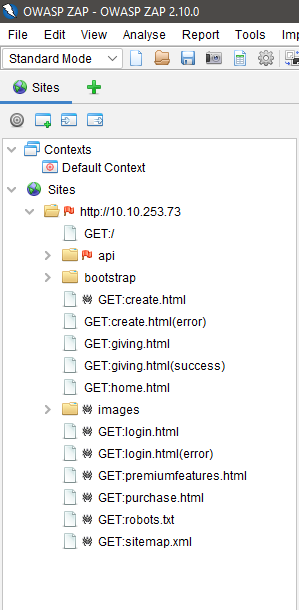

Racetrack Main Page:

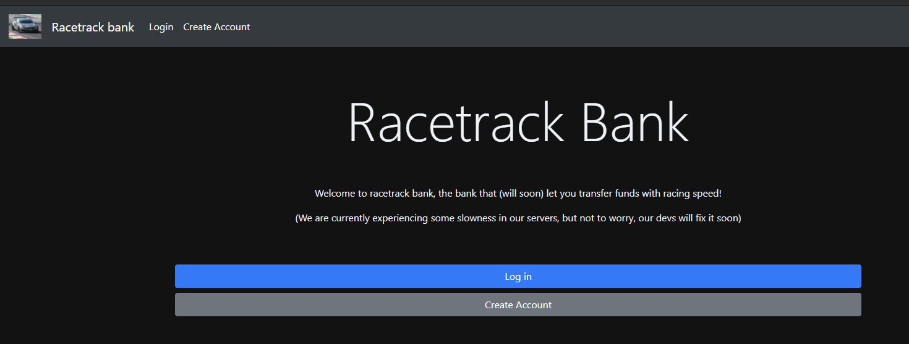

Racetrack Login Page:

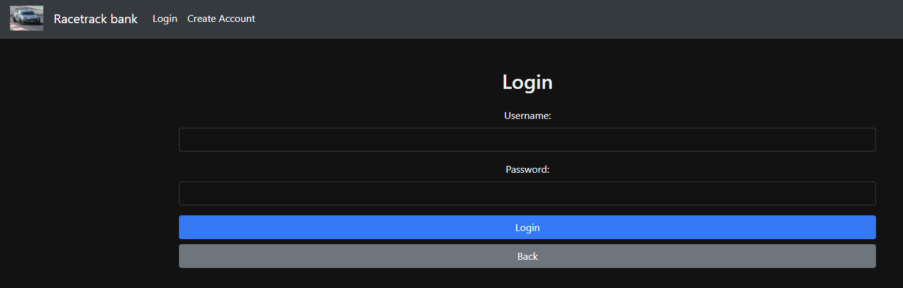

Racetrack Create Account Page:

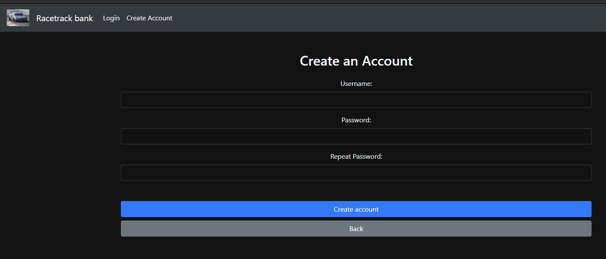

Let try to create a new account and login.

User success login page:

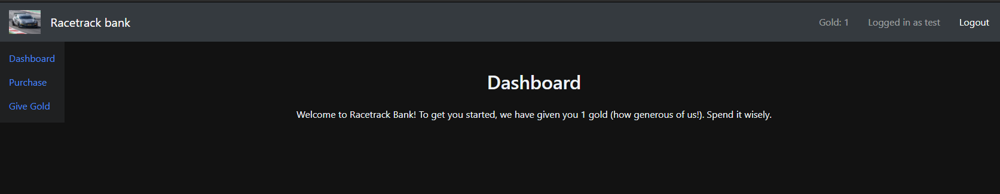

Racetrack user give gold page:

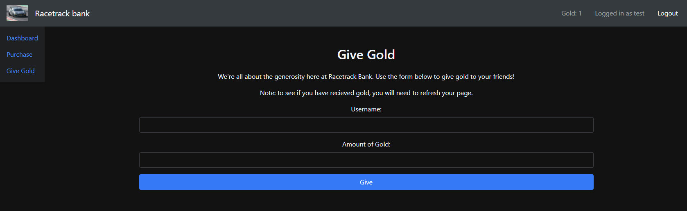

Racetrack user purchase page:

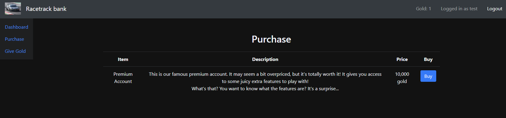

You have notice, there is premium account available by purchase it.

That's sound interesting.

If you inspect the source for both page, you will find there is premiumfeatures page !

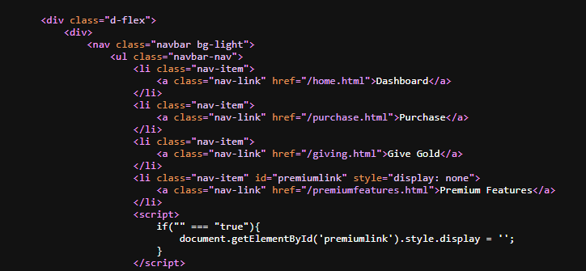

Racetrack premiumfeatures page:

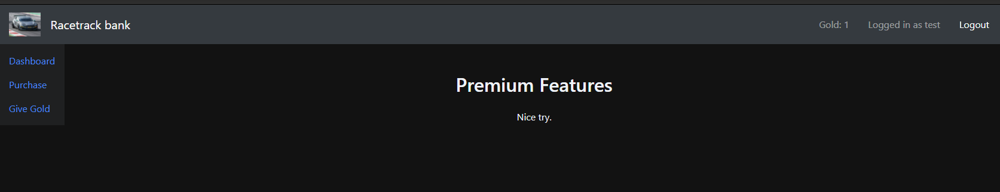

So what's now?

Have you ever think how to get more gold to purchase premium account?

Since we can give gold to another user, why not we create another account to test it out.

Have you try to intercept the http request and response?

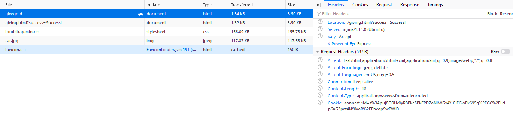

Can we fuzz it? As we know the give gold function take in number and send to another user.

Let's try fuzz it to create more gold !

First create a list of number and fuzz, see what happen. Remember you will need to have the valid cookies for the user.

If you get it right, you will be able to see something like below:

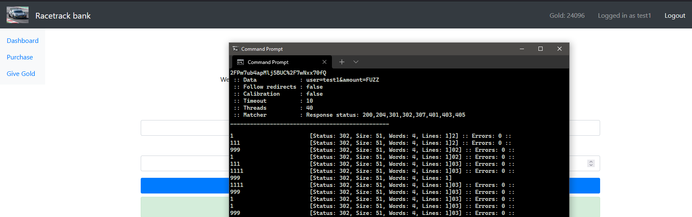

<details><summary>Hint</summary>

```text
wfuzz -c -w fuzz.txt -u http://VICTIM_IP/api/givegold -H "Content-Type: application/x-www-form-urlencoded" -b "connect.sid=YOUR_COOKIES" -d "user=YOUR_USER&amount=FUZZ"
```

</details>

We success get the premium account.

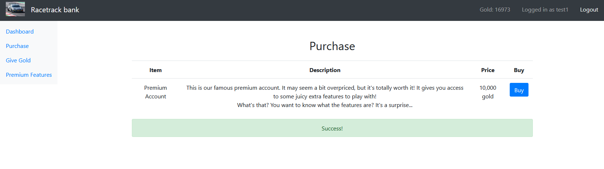

As in premium features, we can perform calculation. Which mean we can have exploit right .... LFI? Command Injection?

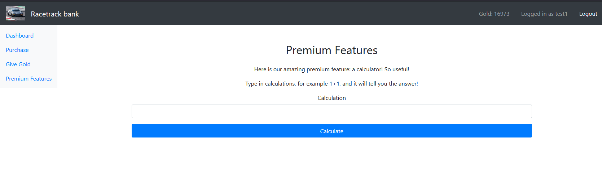

Let's get reverse shell then ! You should what type web server it is, have you take a closer look at the request header?

<br />

### User Flag

From there once you get the reverse shell, the user flag is what you looking at !

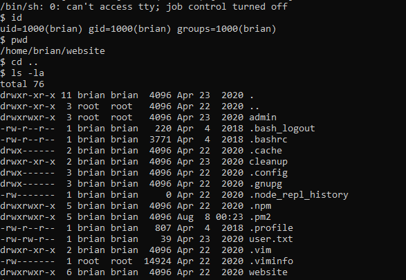

<br />

### Root Flag

Time to get PrivEsc !

Let see what other file is belong to root then.

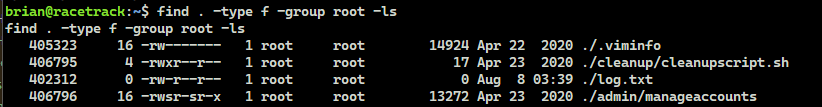

That's interesting, now you can modify it to get PrivEsc !

Tho, you can spawn another root shell or just cat the root flag or you can copy it !

From there, you can get the ROOT and your root flag is right there waiting for you!

<br />

---

> The room was completed long ago when I was just started fresh in TryHackMe platform, some technique can be improved ! Let's have fun !

> Do let me know any command or step can be improve or you have any question you can contact me via THM message or write down comment below or via FB


