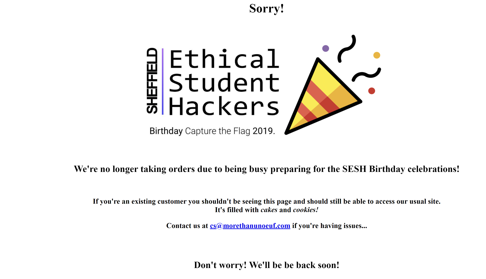
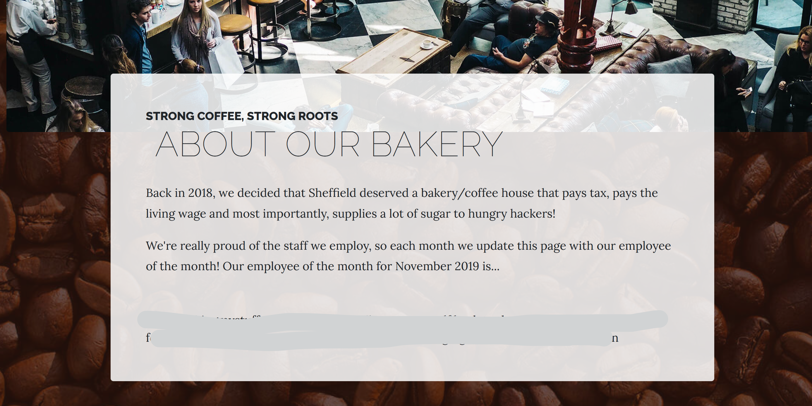
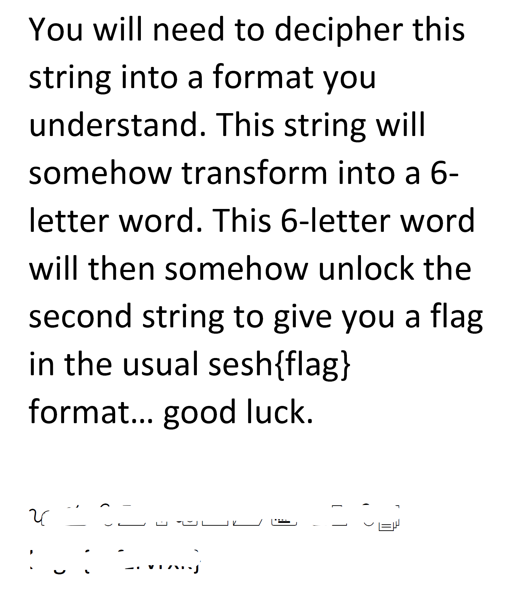
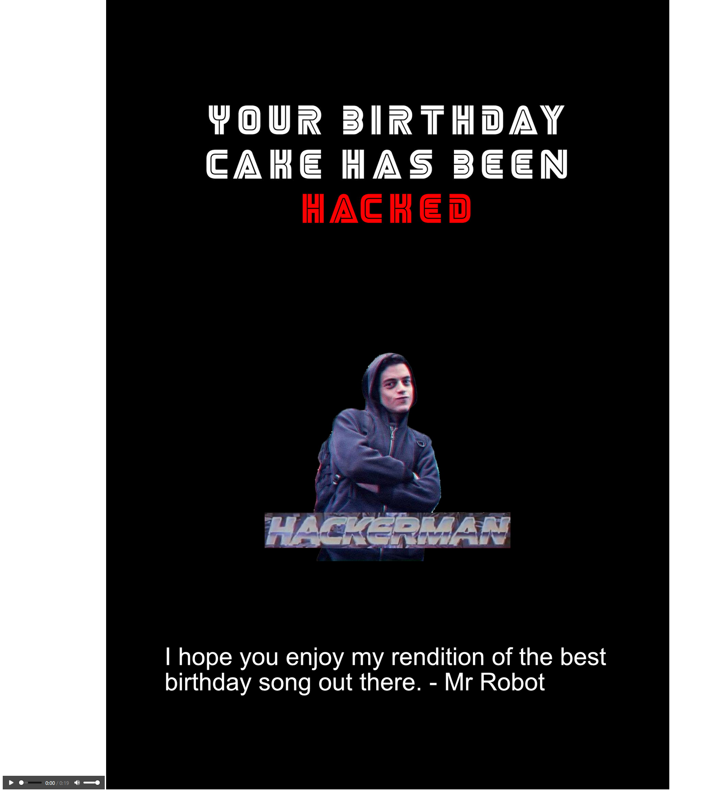

# TryHackMe(THM) - SESH Birthday CTF - WriteUp

> Austin Lai | August 6th, 2021

---

<!-- Description -->

[Room = TryHackMe(THM) - SESH Birthday CTF](https://tryhackme.com/room/seshbirthday)

Difficulty: **HARD**

It was fun and tricky, and be sure you can learn a lots from this room !

The room was created by Sheffield Ethical Student Hackers Society, Twitter @_shefesh.

It help and allow you to learn:

- Python scripting - variety of library functions

- Lateral thinking (lesson learnt from this room)

- Web Enumeration \| Exploit

- Steganography - especially audio

**Disclaimer:  This is not a complete writeup yet as I have one last Bonus Points yet to be solved, do ping me if you solved or at least point me some direction. I am still learning ......**

Now, let's get started !!!

<!-- /Description -->

<br />

## Table of Contents

<!-- TOC -->

- [TryHackMe(THM) - SESH Birthday CTF - WriteUp](#tryhackmethm---sesh-birthday-ctf---writeup)
    - [Table of Contents](#table-of-contents)
    - [Task 1](#task-1)
    - [Task 2](#task-2)
        - [Question 1](#question-1)
        - [Question 2](#question-2)
        - [Question 3](#question-3)
        - [Question 4](#question-4)
        - [Question 5](#question-5)
        - [Question 6](#question-6)
        - [Question 7](#question-7)
        - [Question 8](#question-8)
        - [Question 9](#question-9)
        - [Question 10](#question-10)
        - [Question 11](#question-11)
        - [Question 12 - Yet to be solved !!!](#question-12---yet-to-be-solved-)

<!-- /TOC -->

<br />

## Task 1

Nothing to solve.

Just read through the statement given by SESH

Time to spin up the machine ! 

<br />

## Task 2

Grab the flags and take over.

Flags are in the format sesh{FLAG} unless otherwise stated.

The hints for each question go in quite a lot of depth.

Use them wisely.

<br />

### Question 1

There's a flag on the first web page you encounter

<details><summary>Hint Given by the question</summary>

```text
Manipulate how you view the image, research basic steganography techniques.
```

</details>

<br />

_This one is quite easy, no explanation required._



<br />

### Question 2

You'll need to find a way onto the existing customer website.

(It has coffee beans in the background image, don't click 'completed' otherwise or you will lose the hint!)

<details><summary>Hint given by question</summary>

```text
The word 'cookie' is highlighted on the front page.

Have a look at the cookies the site sets when you load it.

Consider the two most frequent characters in the cookie, and the related encoding method that utilise these two characters.

(As used in telegraph messages)
```

</details>

<br />

_This one is quite easy as well, no explanation required._

_So long you know what you going to enumerate for web server, you should get this right !_

You will need to get this right to proceed further.

<details><summary>Spoiler Hint</summary>

Literally, check out the cookies.

You will find a cookies with code

Google it, what the code was and what it represent and have FUN !


</details>

<br />

### Question 3

SIDE TASKS (Q4 and Q5): There are two areas of the site that the bakery owners don't want you to access. Find them.

<details><summary>Hint given by question</summary>

```text
How do site owners prevent Google from indexing certain pages?
```

</details>

<br />

_Think about how you enumerate web server, what are the tools or file or page we can enumerate._

_**Tip:** Always a good choice to have tools like nmap, gobuster and etc running when you enumerate web server_

Nmap result:


Gobuster result:


Once you have the cookies from previous question, time to access the sites you found.

Site 1:


Site 2:


Site 3:


<br />

### Question 4

What's the gingerbread man's favourite band called?

<details><summary>Hint given by question</summary>

```text
If you have a Swedish band, you haven't checked the whole page.
```

</details>

<br />

Where should we start ?

Well? What site we found in questions 3 that is most likely to be our starting place?

Refer back to the Site 3 , it seem to be the place we should look into it as the page mentioned keyword "gingerbreadman".

It does mentioned this is kind of rabbit hole, but if we want to get the flag, we have to jump into it ! :smile:

So what we need to do is play the game of riddle, when we solve the riddle, use the answer as page name.

Then we will go to next stage.

It does mentioned **don't bother with DirBuster, you'll never find them**

So, I guess we have no luck with gobuster tools and have to play the game !

Let get started then.

From the page and information given, it seem nothing useful.

So, re-think on how to enum web server. Ah..ha... let's go check on the page source.

Guess what we found !


Let use what we found and jump to next stage.


It seem like encoded message, if you have no idea, Google it !

<details><summary>Hint</summary>

```text
it's a base encoded
```

</details>

Once we decoded, let's jump to next stage


What was it ? Hmm ... Out of my mind, I thinking common encode method, let try it ... Turn out, it is _13_

Next stage !


Same, trying common encode method, it was brother of 13 !

Next stage !


Hmm ... this is .... _hex_

You may use online decoder, however as mentioned for me, I would like to practice on python scripting.

Let's create a simple python decode hex script --- [Python Hex Decode Script](hex-decode-script.py)

Once you decode, you get the message


I have no idea, what does the decoded message meant. But the question was mentioned something related to band and the hint was mentioned "swedish band".

So let's Google it, turn on it was part of the lyrics from one of the song.

Till now, everything seem very smooth as we pass thru, however, the the band we get on doesn't seem to be the correct answer as we submit it !

I have check everything, we have done everything correct.

It took me quite some time !

Revisit the first page we got, it mentioned "rabbit hole", got me thinking what was the answer then.

Let do basic enumeration of the page

I started to check on the source of every page we get !

Ahh... ha... one of the page show some text that I didn't notice before, it was using white colour font !

That was the answer !

<br />

### Question 5

Grandpa Joe tried to send the muffin man a message. What is it?

<details><summary>Hint given by question</summary>

```text
Look at the accompanying blog post, there are hints there.

Research the Apollo 11 missing tapes.

Don't disregard the ranting about 36 robots either...
```

</details>

<br />

Looking at the hint we got from question, it mentioned about blog post.

Remember there is one site we found mentioned about blog. It was Site 2 ! 

Read thru the post, no explanation needed.

Decode it, you get the flag !

<br />

### Question 6

We want 500 cookie points and the branded flag from the existing customer website. You'll need to decode the custom loyalty programme code on the home page.

<details><summary>Hint given by question</summary>

```text
Think about the image.

There are two discrete colours.

Fundamentally, all computers work on two discrete values.

If you get gibberish, flip your interpretation.

You may need to write a script for this challenge.
```

</details>

<br />

Refer back to the Site 1 we found, there is QR Code !

Check on the hint given by question.

Google and research how to convert or flip the value !

Of course you can always use online version to solve it.

However, I choose to write a script using Python.

This is a good practice for me to familiar python scripting and python library.

For that, you will need to research how python handle binary, image pixel, especially the black and white value and which library to use !

If you haven't figure out, you can check out script below

<details><summary>Hint - Python Script - Flip Image Binary Value</summary>

Refer to the [script here](convert-chug_jugs-to-binary.py)

</details>

<br />

Since we flip the QR Code Image in binary value, you will need to convert it to ascii or at least human readable form !


Then again, you have to decode it !

Then you have the flag !


<br />

### Question 7

Hackerman has hidden a file somewhere. Look around and find a way to retrieve it.

<details><summary>Hint by question</summary>

```text
Never neglect to check the source code of a web page.

Look at how the employee of the month is loaded.

Is his spacebar really broken or is this a diversion?
```

</details>

<br />

Note: You will need to get this right to proceed the next question.

We can continue to enumerate further for Site 2 and Site 3, there is not much information or enumeration left.

So let jump to Site 1 which we have not done much enumeration yet, obviously we going enumerate !

Let start from basic, checking cookie, source, possible link and etc ... !

After a few moment later !

You probably notice there is only one page do have additional parameter !

The page also contain interesting information !

Focus on the detail, check the URL, how it change when you navigate throughout the Site 1.

What is the possible enumeration \| exploit method we can use ??

<details><summary>Hint 1</summary>

```text
Check on LFI !

Have you also check on the page source for that particular page ???
```

</details>

<br />

Once you tried, you found something like this.

<details><summary>Hint - Spoiler</summary>



</details>

<br />

Then, keep continue to enumerate, a few hours later ...

Nothing yield to get the secret file !

Revisit the hint given by question, it mention something the spacebar or diversion.

It got me thinking, should we take a look the word mentioned by Hackerman?

Ahh..ha... that was it ...

Combination of the hint given, the secret message, we manage to find the secret folder !!!


<br />

### Question 8

In Hackerman's file there's a flag you need to decode, what is it? (There are clues hidden around the site that may help you with this task)

<details><summary>Hint by question</summary>

```text
It's a Microsoft font with a funny-sounding name.

What common numbers are 13 digits long and have a 978 prefix?

The 6-character word is a key for a certain kind of cipher. (John can't pronounce it)
```

</details>

<br />

Once you get the secret file from previous question, open it as shown below.




It is pretty self-explanatory with the hint.

Get the flag !

<br />

### Question 9

You'll need to use the credentials found in Hackerman's file to log into the system.

Find a way to do that. This task will require lateral thinking to find the key information to log in.

<details><summary>Hint by question</summary>

```text
The password is the name of a famous movie.

You'll need to make sure to apply the same shift as you did with the flag from question 8.

Look at the store page, does the address of the business stand out? Or the phone number?

Why would they care if their customers are knocking loudly?
```

</details>

<br />

Yes, checking the hint given by the question again, you know that the password decoded from previous question is Hackerman credential.

But, challenge is how we get into the system ?

There is no common services such as FTP, SMB or SSH available.

At first, I was looking at the blog site.

After hours of trying, I do notice that isn't right, as the blog site does not belong to Hackerman.

Again, revisit the hint given, it mentioned to check on the store page, store address, phone number and etc ...

Hmm ... I do notice something ... However, it is still yet to figure out how to get into the system.

I have to pause this room and get back to it someday.

After a few days, or a week later.

Yeah, today is my lucky day.

When I checking the store page, it trigger one idea, especially I have just completed a quite similar challenge in a way !

Remember the store page do mention and hint mention again --- "Why would they care if their customers are knocking loudly ?"

It got me thinking ! PORT-KNOCKING !!!

Yes, the store address and phone number is a pattern which give out that --- those are port numbers

We have to port knock it !

Yeah ! At last, after port knocking, we found a service alive !

Guess what ? SSH !!!

Now we can SSH into the machines, but we have a problem here, we have yet to know what is the username !

Remember, the secret message given out ! Hint is right there !

Now we have the username and password, we can login to the system.

Let pause for a moment, while we get additional side task - check out question 10

<br />

### Question 10

SIDE TASK: You may have noticed Mr Robot has a song for you. There's something going on at a deeper level with this, find the flag.

<details><summary>Hint by question</summary>

```text
Have you looked at the page you get redirected to instead of a 404?

Mr Robot S1E6. Audio file.
```

</details>

<br />

For this question, even if you not checking the hint given by question; you should be able to get it.

Especially when you perform LFI !



As the page given 2 items, one image file and one audio file. The

Immediately, ring a bell for steganography.

After a quick check, there is a hidden file inside one of the file !

That's the flag !

<details><summary>Hint - Spoiler</summary>

```text
Check on tool to extract data from audio !!
```

</details>

<br />

### Question 11

What is the root flag?

<details><summary>Hint by question</summary>

```text
You can either privilege escalate with a vulnerability disclosed in October 2019 (try sudo -l).

The other method involves looking at /killswitch/killswitch.py
```

</details>

<br />

For this one, quite easy, quickly google it, you will find how to get ROOT !

Then you have the root flag

<br />

### Question 12 - Yet to be solved !!!

BONUS POINTS: Did you crack the killswitch? Enter the flag:

<details><summary>Hint by question</summary>

```text
The closer you are to the answer, the harder it gets.

This is an exaggerated version of a cryptographic algorithm implementation issue.
```

</details>

As I got the root from PrivEsc !

I get back to check on the killswicth.py

It was pyarmor obfuscated script, however I am stuck as I am not sure am I looking at the right direction.

Pending to continue ........

<br />

---

> Do let me know any command can be improve or you have any question you can contact me via THM message or write down comment below or via FB


