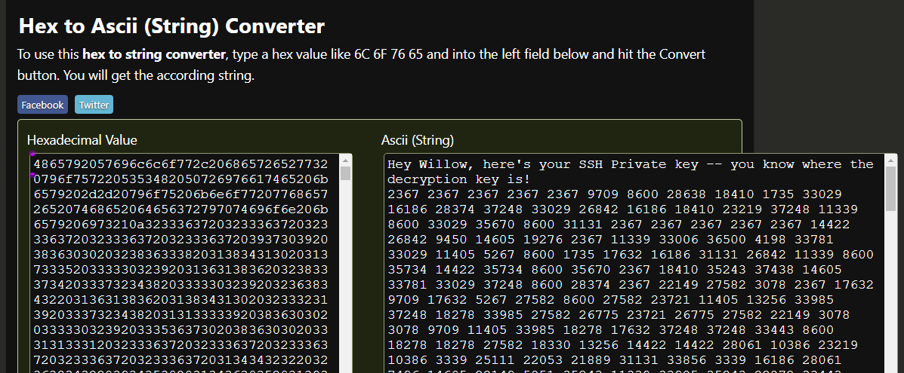
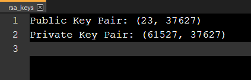
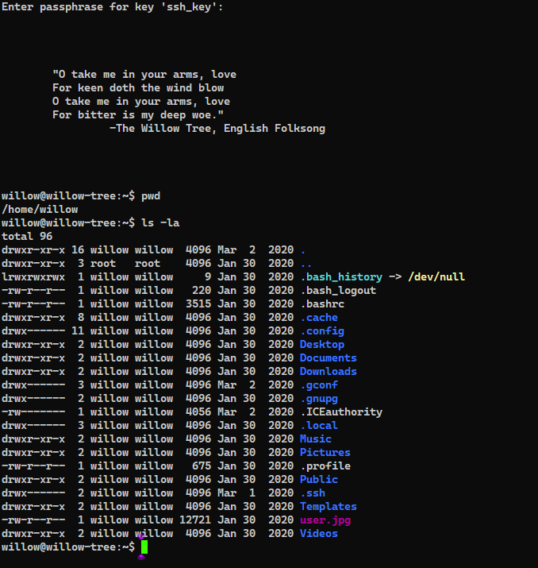
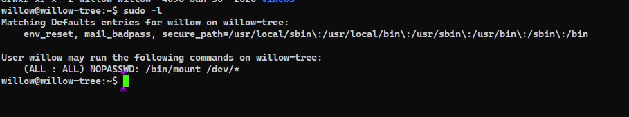
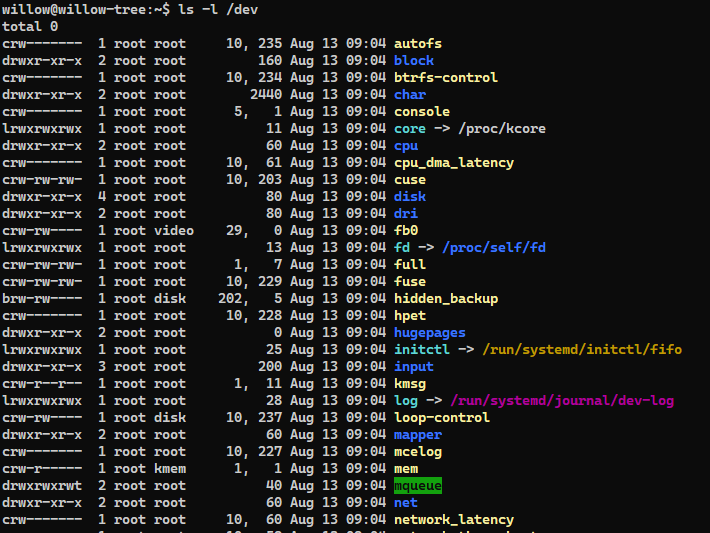
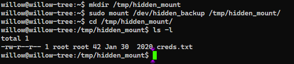

# TryHackMe(THM) - Willow - WriteUp

> Austin Lai | August 13th, 2021

---

<!-- Description -->

[Room = TryHackMe(THM) - Willow](https://tryhackme.com/room/willow)

Difficulty: **Medium**

The room is completed on May 20th, 2020

<!-- /Description -->

---

## Table of Contents

<!-- TOC -->

- [TryHackMeTHM - Willow - WriteUp](#tryhackmethm---willow---writeup)
    - [Table of Contents](#table-of-contents)
    - [Task 1](#task-1)
    - [Let's Begin Here !!!](#lets-begin-here-)

<!-- /TOC -->

---

## Task 1

```text
What lies under the Willow Tree?

Grab the flags from the Willow
```

<details><summary>Hint given for user flag</summary>

```text
https://muirlandoracle.co.uk/2020/01/29/rsa-encryption/
```

</details>


<details><summary>Hint given for root flag</summary>

```text
Where, on a Linux system, would you first look for unmounted partitions?
```

</details>

## Let's Begin Here !!!

Let's fire up basic enumeration.

Nmap result:

```text
# Nmap 7.80 scan initiated Wed May 20 02:42:53 2020 as: nmap --privileged --stats-every 5s -vvvvvv -Pn -p- -A -sC -O -sS -sV --version-all -T4 --min-parallelism 50 --script=vuln --append-output -oN tryhackme-Willow 10.10.196.204
Pre-scan script results:
| broadcast-avahi-dos: 
|   Discovered hosts:
|     224.0.0.251
|   After NULL UDP avahi packet DoS (CVE-2011-1002).
|   Hosts that seem down (vulnerable):
|_    224.0.0.251
Warning: 10.10.196.204 giving up on port because retransmission cap hit (6).
Nmap scan report for 10.10.196.204
Host is up, received user-set (0.20s latency).
Scanned at 2020-05-20 02:43:35 Malay Peninsula Standard Time for 1099s
Not shown: 65523 closed ports
Reason: 65523 resets
PORT      STATE    SERVICE REASON         VERSION
22/tcp    open     ssh     syn-ack ttl 63 OpenSSH 6.7p1 Debian 5 (protocol 2.0)
|_clamav-exec: ERROR: Script execution failed (use -d to debug)
80/tcp    open     http    syn-ack ttl 63 Apache httpd 2.4.10 ((Debian))
|_clamav-exec: ERROR: Script execution failed (use -d to debug)
|_http-csrf: Couldn't find any CSRF vulnerabilities.
|_http-dombased-xss: Couldn't find any DOM based XSS.
|_http-jsonp-detection: Couldn't find any JSONP endpoints.
|_http-litespeed-sourcecode-download: Request with null byte did not work. This web server might not be vulnerable
|_http-server-header: Apache/2.4.10 (Debian)
|_http-stored-xss: Couldn't find any stored XSS vulnerabilities.
|_http-wordpress-users: [Error] Wordpress installation was not found. We couldn't find wp-login.php
| vulners: 
|   cpe:/a:apache:http_server:2.4.10: 
|      CVE-2017-7679 7.5 https://vulners.com/cve/CVE-2017-7679
|      CVE-2017-7668 7.5 https://vulners.com/cve/CVE-2017-7668
|      CVE-2017-3169 7.5 https://vulners.com/cve/CVE-2017-3169
|      CVE-2017-3167 7.5 https://vulners.com/cve/CVE-2017-3167
|      CVE-2018-1312 6.8 https://vulners.com/cve/CVE-2018-1312
|      CVE-2017-15715 6.8 https://vulners.com/cve/CVE-2017-15715
|      CVE-2017-9788 6.4 https://vulners.com/cve/CVE-2017-9788
|      CVE-2019-0217 6.0 https://vulners.com/cve/CVE-2019-0217
|      CVE-2020-1927 5.8 https://vulners.com/cve/CVE-2020-1927
|      CVE-2019-10098 5.8 https://vulners.com/cve/CVE-2019-10098
|      CVE-2020-1934 5.0 https://vulners.com/cve/CVE-2020-1934
|      CVE-2019-0220 5.0 https://vulners.com/cve/CVE-2019-0220
|      CVE-2018-17199 5.0 https://vulners.com/cve/CVE-2018-17199
|      CVE-2017-9798 5.0 https://vulners.com/cve/CVE-2017-9798
|      CVE-2017-15710 5.0 https://vulners.com/cve/CVE-2017-15710
|      CVE-2016-8743 5.0 https://vulners.com/cve/CVE-2016-8743
|      CVE-2016-2161 5.0 https://vulners.com/cve/CVE-2016-2161
|      CVE-2016-0736 5.0 https://vulners.com/cve/CVE-2016-0736
|      CVE-2014-3583 5.0 https://vulners.com/cve/CVE-2014-3583
|      CVE-2019-10092 4.3 https://vulners.com/cve/CVE-2019-10092
|      CVE-2016-4975 4.3 https://vulners.com/cve/CVE-2016-4975
|      CVE-2015-3185 4.3 https://vulners.com/cve/CVE-2015-3185
|      CVE-2014-8109 4.3 https://vulners.com/cve/CVE-2014-8109
|      CVE-2018-1283 3.5 https://vulners.com/cve/CVE-2018-1283
|_     CVE-2016-8612 3.3 https://vulners.com/cve/CVE-2016-8612
111/tcp   open     rpcbind syn-ack ttl 63 2-4 (RPC #100000)
|_clamav-exec: ERROR: Script execution failed (use -d to debug)
| rpcinfo: 
|   program version    port/proto  service
|   100000  2,3,4        111/tcp   rpcbind
|   100000  2,3,4        111/udp   rpcbind
|   100000  3,4          111/tcp6  rpcbind
|   100000  3,4          111/udp6  rpcbind
|   100003  2,3,4       2049/tcp   nfs
|   100003  2,3,4       2049/tcp6  nfs
|   100003  2,3,4       2049/udp   nfs
|   100003  2,3,4       2049/udp6  nfs
|   100005  1,2,3      34917/udp6  mountd
|   100005  1,2,3      43022/udp   mountd
|   100005  1,2,3      52483/tcp   mountd
|   100005  1,2,3      60815/tcp6  mountd
|   100021  1,3,4      39697/udp6  nlockmgr
|   100021  1,3,4      53730/tcp6  nlockmgr
|   100021  1,3,4      57952/udp   nlockmgr
|   100021  1,3,4      58633/tcp   nlockmgr
|   100024  1          45290/udp6  status
|   100024  1          48808/udp   status
|   100024  1          59175/tcp6  status
|   100024  1          59727/tcp   status
|   100227  2,3         2049/tcp   nfs_acl
|   100227  2,3         2049/tcp6  nfs_acl
|   100227  2,3         2049/udp   nfs_acl
|_  100227  2,3         2049/udp6  nfs_acl
2049/tcp  open     nfs_acl syn-ack ttl 63 2-3 (RPC #100227)
|_clamav-exec: ERROR: Script execution failed (use -d to debug)
6988/tcp  filtered unknown no-response
17031/tcp filtered unknown no-response
17925/tcp filtered unknown no-response
23034/tcp filtered unknown no-response
26535/tcp filtered unknown no-response
27223/tcp filtered unknown no-response
29836/tcp filtered unknown no-response
31538/tcp filtered unknown no-response
No exact OS matches for host (If you know what OS is running on it, see https://nmap.org/submit/ ).
TCP/IP fingerprint:
OS:SCAN(V=7.80%E=4%D=5/20%OT=22%CT=1%CU=35758%PV=Y%DS=2%DC=T%G=Y%TM=5EC42D2
OS:2%P=i686-pc-windows-windows)SEQ(SP=102%GCD=1%ISR=109%TI=Z%CI=I%II=I%TS=8
OS:)SEQ(CI=I%II=I)OPS(O1=M508ST11NW6%O2=M508ST11NW6%O3=M508NNT11NW6%O4=M508
OS:ST11NW6%O5=M508ST11NW6%O6=M508ST11)WIN(W1=68DF%W2=68DF%W3=68DF%W4=68DF%W
OS:5=68DF%W6=68DF)ECN(R=Y%DF=Y%T=40%W=6903%O=M508NNSNW6%CC=Y%Q=)T1(R=Y%DF=Y
OS:%T=40%S=O%A=S+%F=AS%RD=0%Q=)T2(R=N)T3(R=N)T4(R=Y%DF=Y%T=40%W=0%S=A%A=Z%F
OS:=R%O=%RD=0%Q=)T5(R=Y%DF=Y%T=40%W=0%S=Z%A=S+%F=AR%O=%RD=0%Q=)T6(R=Y%DF=Y%
OS:T=40%W=0%S=A%A=Z%F=R%O=%RD=0%Q=)T7(R=Y%DF=Y%T=40%W=0%S=Z%A=S+%F=AR%O=%RD
OS:=0%Q=)U1(R=Y%DF=N%T=40%IPL=164%UN=0%RIPL=G%RID=G%RIPCK=G%RUCK=G%RUD=G)IE
OS:(R=Y%DFI=N%T=40%CD=S)

Network Distance: 2 hops
Service Info: OS: Linux; CPE: cpe:/o:linux:linux_kernel

TRACEROUTE (using port 993/tcp)
HOP RTT       ADDRESS
1   194.00 ms 10.9.0.1
2   195.00 ms 10.10.196.204

Read data files from: C:\Program Files (x86)\Nmap
OS and Service detection performed. Please report any incorrect results at https://nmap.org/submit/ .
# Nmap done at Wed May 20 03:01:54 2020 -- 1 IP address (1 host up) scanned in 1141.93 seconds
# Nmap 7.80 scan initiated Wed May 20 03:02:25 2020 as: nmap --privileged --stats-every 5s -vvvvvv -Pn -p- -A -sCSV --version-all -T4 --min-parallelism 50 --append-output -oN tryhackme-Willow 10.10.196.204
Warning: 10.10.196.204 giving up on port because retransmission cap hit (6).
Nmap scan report for 10.10.196.204
Host is up, received user-set (0.22s latency).
Scanned at 2020-05-20 03:02:31 Malay Peninsula Standard Time for 886s
Not shown: 65524 closed ports
Reason: 65524 resets
PORT      STATE    SERVICE  REASON         VERSION
22/tcp    open     ssh      syn-ack ttl 63 OpenSSH 6.7p1 Debian 5 (protocol 2.0)
| ssh-hostkey: 
|   1024 43:b0:87:cd:e5:54:09:b1:c1:1e:78:65:d9:78:5e:1e (DSA)
| ssh-dss AAAAB3NzaC1kc3MAAACBAJHkiuOeIrYxoyBBsJX2wpThJlvbsanlxpYXyHspzVIdeGQq3kD/2h1iNbOLwIb/iwS4oaY83OwxMiXImgKm/QgpgffrrKmU41eI/q9i+3NhLfHLvoT5PWupe/UW5Y3/lfmIMD1UXTUJNYiA07w/kHKj9ElQs7EZ2oZ9L5j2/h/lAAAAFQDE3pT3CTjQSOUOqdgu9HBaB6d6FwAAAIAFWqdfVx3v+GNxecTNp1mDb64WZcf2ssl/j+B6hj5W7s++DTY7Ls/i2R0z5bQes+5rMWYvanYFyWYEj31qWmrLvluJbJKldG3IttW5WfMzIyOJ11MHGAMP2/ZXZ4w3t8dMMudgBPkXE1uGv+p03A1i+Z6UfvGVv4HrtlCwqCRBywAAAIBpf+5ztR5aSDuZPxe/BURQIBKqDhOVZOt+Zhcc1GEcdukmlfmyH0sSm/3ae4CYLqBgD1zzwwSg4IkPR8wb1wa3G5F+OSYymEoKuxYWYN4LlSe9vrIap/1C/NO+jMQ5ru6WYqBcNdPqHQ4r5I7MzhziLdNIhfBmY076aL2Dr/OsAg==
|   2048 c2:65:91:c8:38:c9:cc:c7:f9:09:20:61:e5:54:bd:cf (RSA)
| ssh-rsa AAAAB3NzaC1yc2EAAAADAQABAAABAQC0/BxHjpZXU3EhwOMURG/xIJno/fZBBw2tntPhQMsA+L6YoVL4IyTKTz6SGM6BcX9622CGutBiO0pc0vhGlf9v/4cUB7My3d1r3t3EkNF0SaKAmAZLm8QOFbmS/TyHy9wF5TGJLunz5cN3NdGIz3Bz2GHHouicRo/vopYmHxjItfVgVUD2u+e5Gkw7u+U1BxZOrQDlaUS41AJvZm9Pk0pn2hWXeGTCJu8oyCqaEi/u8Wu7Ylp/t15NjEpiDpRp2LH9ctB3EG50LL+ti2o8/U652wIoNhnoF33eI6HJget9jvSC03oOx5r6NqHbOn94kVAUjFbYzK716dBa+I5jocHr
|   256 bf:3e:4b:3d:78:b6:79:41:f4:7d:90:63:5e:fb:2a:40 (ECDSA)
| ecdsa-sha2-nistp256 AAAAE2VjZHNhLXNoYTItbmlzdHAyNTYAAAAIbmlzdHAyNTYAAABBBIW2cLhyEIs7aEuL5e/SGCx5HsLX1a1GfgE/YBPGXiaFt/AkVFA3leapIvX+CD5wc7wCKGDToBgx6bkIY9vb0T0=
|   256 2c:c8:87:4a:d8:f6:4c:c3:03:8d:4c:09:22:83:66:64 (ED25519)
|_ssh-ed25519 AAAAC3NzaC1lZDI1NTE5AAAAIOsXsk2l13dc4bQlT0wYP6/4gpeoTx5IfVvOBF++ClPu
80/tcp    open     http     syn-ack ttl 63 Apache httpd 2.4.10 ((Debian))
| http-methods: 
|_  Supported Methods: GET HEAD POST OPTIONS
|_http-server-header: Apache/2.4.10 (Debian)
|_http-title: Recovery Page
111/tcp   open     rpcbind  syn-ack ttl 63 2-4 (RPC #100000)
| rpcinfo: 
|   program version    port/proto  service
|   100000  2,3,4        111/tcp   rpcbind
|   100000  2,3,4        111/udp   rpcbind
|   100000  3,4          111/tcp6  rpcbind
|   100000  3,4          111/udp6  rpcbind
|   100003  2,3,4       2049/tcp   nfs
|   100003  2,3,4       2049/tcp6  nfs
|   100003  2,3,4       2049/udp   nfs
|   100003  2,3,4       2049/udp6  nfs
|   100005  1,2,3      34917/udp6  mountd
|   100005  1,2,3      43022/udp   mountd
|   100005  1,2,3      52483/tcp   mountd
|   100005  1,2,3      60815/tcp6  mountd
|   100021  1,3,4      39697/udp6  nlockmgr
|   100021  1,3,4      53730/tcp6  nlockmgr
|   100021  1,3,4      57952/udp   nlockmgr
|   100021  1,3,4      58633/tcp   nlockmgr
|   100024  1          45290/udp6  status
|   100024  1          48808/udp   status
|   100024  1          59175/tcp6  status
|   100024  1          59727/tcp   status
|   100227  2,3         2049/tcp   nfs_acl
|   100227  2,3         2049/tcp6  nfs_acl
|   100227  2,3         2049/udp   nfs_acl
|_  100227  2,3         2049/udp6  nfs_acl
2049/tcp  open     nfs_acl  syn-ack ttl 63 2-3 (RPC #100227)
3047/tcp  filtered hlserver no-response
16059/tcp filtered unknown  no-response
31190/tcp filtered unknown  no-response
33779/tcp filtered unknown  no-response
57743/tcp filtered unknown  no-response
58061/tcp filtered unknown  no-response
62039/tcp filtered unknown  no-response
No exact OS matches for host (If you know what OS is running on it, see https://nmap.org/submit/ ).
TCP/IP fingerprint:
OS:SCAN(V=7.80%E=4%D=5/20%OT=22%CT=1%CU=33962%PV=Y%DS=2%DC=T%G=Y%TM=5EC430B
OS:E%P=i686-pc-windows-windows)SEQ(SP=FD%GCD=1%ISR=10C%TI=Z%CI=I%II=I%TS=8)
OS:SEQ(CI=I%II=I)SEQ(SP=FD%GCD=1%ISR=10C%TI=Z%CI=I%TS=9)OPS(O1=M508ST11NW6%
OS:O2=M508ST11NW6%O3=M508NNT11NW6%O4=M508ST11NW6%O5=M508ST11NW6%O6=M508ST11
OS:)WIN(W1=68DF%W2=68DF%W3=68DF%W4=68DF%W5=68DF%W6=68DF)ECN(R=Y%DF=Y%T=40%W
OS:=6903%O=M508NNSNW6%CC=Y%Q=)T1(R=Y%DF=Y%T=40%S=O%A=S+%F=AS%RD=0%Q=)T2(R=N
OS:)T3(R=N)T4(R=Y%DF=Y%T=40%W=0%S=A%A=Z%F=R%O=%RD=0%Q=)T5(R=Y%DF=Y%T=40%W=0
OS:%S=Z%A=S+%F=AR%O=%RD=0%Q=)T6(R=Y%DF=Y%T=40%W=0%S=A%A=Z%F=R%O=%RD=0%Q=)T7
OS:(R=Y%DF=Y%T=40%W=0%S=Z%A=S+%F=AR%O=%RD=0%Q=)U1(R=Y%DF=N%T=40%IPL=164%UN=
OS:0%RIPL=G%RID=G%RIPCK=G%RUCK=G%RUD=G)IE(R=Y%DFI=N%T=40%CD=S)

Uptime guess: 0.027 days (since Wed May 20 02:38:12 2020)
Network Distance: 2 hops
TCP Sequence Prediction: Difficulty=253 (Good luck!)
IP ID Sequence Generation: All zeros
Service Info: OS: Linux; CPE: cpe:/o:linux:linux_kernel

TRACEROUTE (using port 1723/tcp)
HOP RTT       ADDRESS
1   196.00 ms 10.9.0.1
2   197.00 ms 10.10.196.204

Read data files from: C:\Program Files (x86)\Nmap
OS and Service detection performed. Please report any incorrect results at https://nmap.org/submit/ .
# Nmap done at Wed May 20 03:17:18 2020 -- 1 IP address (1 host up) scanned in 893.31 seconds
```

HTTP:


It's hex ! You can decode it.



From nmap result, we know there is nfs service running, let's try to enumerate it.

NFS:

```bash
┌💁  root @ 💻  austin-helper-x13 in 📁  Desktop
└❯ showmount -e 10.10.196.204
Export list for 10.10.196.204:
/var/failsafe *

┌💁  root @ 💻  austin-helper-x13 in 📁  Desktop
└❯ mount -vvv 10.10.196.204:/var/failsafe nfs
```

You will see there is a file called "rsa_keys"



Checking the hint given, the link to the post of RSA Encryption.

We have the encrypted message or key.

We have the public and private key pair.

We can crafted a script to decrypt the RSA Key.

Kindly check out the [full script here](decrypt-message.py)

```python
encrypted = 'The_HEX_DECODED_MESSAGE_HERE'

n = 37627
d = 61527

rsa_key = ''

for i in encrypted.split(' '):
 
 # decrypt = (encrypted**d) % n
 decrypt = (int(i)**d) % n

 # convert number to ascii 
 rsa_key += chr(decrypt)

print(rsa_key)
```

Now we have the encrypted rsa key.

We can try to crack with JTR.

Once you get the access to the system, you will see user jpg file.



Your user flag is right that.

Time to get PrivEsc and Root it !



It show we can run `mount` command as root, let's check on the /dev directory shall we?



Have you notice something there? Well, there is a block called 'hidden_backup'.

Can we try to mount it?



Once you mount it, there is a file called 'creds.txt'.

You have your root password, and get your root flag !

<br />

---

> Do let me know any command or step can be improve or you have any question you can contact me via THM message or write down comment below or via FB


