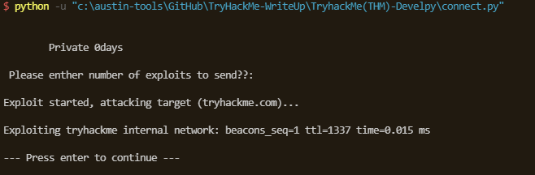
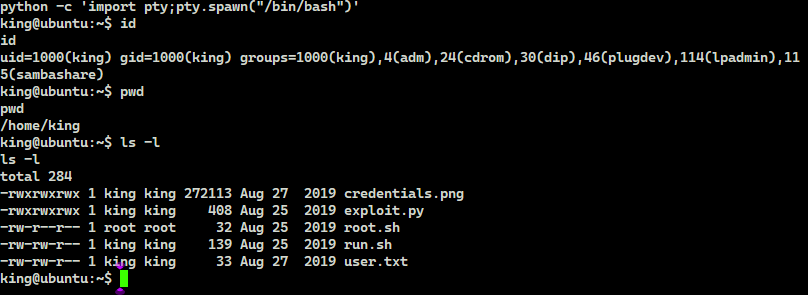

# TryHackMe(THM) - Develpy - WriteUp

> Austin Lai | August 9th, 2021

---

<!-- Description -->

[Room = TryHackMe(THM) - Develpy](https://tryhackme.com/room/bsidesgtdevelpy)

Difficulty: **Medium**

However, I rate it as quite easy.

The room is completed on June 14th, 2020

<!-- /Description -->

---

## Table of Contents

<!-- TOC -->

- [TryHackMe(THM) - Develpy - WriteUp](#tryhackmethm---develpy---writeup)
    - [Table of Contents](#table-of-contents)
    - [Task 1](#task-1)
    - [Let's Begin Here !!!](#lets-begin-here-)

<!-- /TOC -->

---

## Task 1

```text
read user.txt and root.txt
```


## Let's Begin Here !!!

Let's fire up basic enumeration.

Nmap result:

```text
# Nmap 7.80 scan initiated Sun Jun 14 22:53:09 2020 as: nmap --privileged --stats-every 15s -vvvvvv -Pn -p- -r -A -sCSV -O --version-all -T4 --min-parallelism 50 --min-rate 1000 --script=vuln --script-trace --reason --append-output -oN TryHackMe-Develpy-initial 10.10.56.120
Pre-scan script results:
| broadcast-avahi-dos: 
|   Discovered hosts:
|     224.0.0.251
|   After NULL UDP avahi packet DoS (CVE-2011-1002).
|   Hosts that seem down (vulnerable):
|_    224.0.0.251
Nmap scan report for 10.10.56.120
Host is up, received user-set (0.42s latency).
Scanned at 2020-06-14 22:53:50 Malay Peninsula Standard Time for 445s
Not shown: 65533 closed ports
Reason: 65533 resets
PORT      STATE SERVICE           REASON         VERSION
22/tcp    open  ssh               syn-ack ttl 61 OpenSSH 7.2p2 Ubuntu 4ubuntu2.8 (Ubuntu Linux; protocol 2.0)
|_clamav-exec: ERROR: Script execution failed (use -d to debug)
10000/tcp open  snet-sensor-mgmt? syn-ack ttl 61
|_clamav-exec: ERROR: Script execution failed (use -d to debug)
| fingerprint-strings: 
|   GenericLines: 
|     Private 0days
|     Please enther number of exploits to send??: Traceback (most recent call last):
|     File "./exploit.py", line 6, in <module>
|     num_exploits = int(input(' Please enther number of exploits to send??: '))
|     File "<string>", line 0
|     SyntaxError: unexpected EOF while parsing
|   GetRequest: 
|     Private 0days
|     Please enther number of exploits to send??: Traceback (most recent call last):
|     File "./exploit.py", line 6, in <module>
|     num_exploits = int(input(' Please enther number of exploits to send??: '))
|     File "<string>", line 1, in <module>
|     NameError: name 'GET' is not defined
|   HTTPOptions, RTSPRequest: 
|     Private 0days
|     Please enther number of exploits to send??: Traceback (most recent call last):
|     File "./exploit.py", line 6, in <module>
|     num_exploits = int(input(' Please enther number of exploits to send??: '))
|     File "<string>", line 1, in <module>
|     NameError: name 'OPTIONS' is not defined
|   NULL: 
|     Private 0days
|_    Please enther number of exploits to send??:
|_http-vuln-cve2006-3392: ERROR: Script execution failed (use -d to debug)
1 service unrecognized despite returning data. If you know the service/version, please submit the following fingerprint at https://nmap.org/cgi-bin/submit.cgi?new-service :
SF-Port10000-TCP:V=7.80%I=9%D=6/14%Time=5EE63A4C%P=i686-pc-windows-windows
SF:%r(NULL,48,"\r\n\x20\x20\x20\x20\x20\x20\x20\x20Private\x200days\r\n\r\
SF:n\x20Please\x20enther\x20number\x20of\x20exploits\x20to\x20send\?\?:\x2
SF:0")%r(GetRequest,136,"\r\n\x20\x20\x20\x20\x20\x20\x20\x20Private\x200d
SF:ays\r\n\r\n\x20Please\x20enther\x20number\x20of\x20exploits\x20to\x20se
SF:nd\?\?:\x20Traceback\x20\(most\x20recent\x20call\x20last\):\r\n\x20\x20
SF:File\x20\"\./exploit\.py\",\x20line\x206,\x20in\x20<module>\r\n\x20\x20
SF:\x20\x20num_exploits\x20=\x20int\(input\('\x20Please\x20enther\x20numbe
SF:r\x20of\x20exploits\x20to\x20send\?\?:\x20'\)\)\r\n\x20\x20File\x20\"<s
SF:tring>\",\x20line\x201,\x20in\x20<module>\r\nNameError:\x20name\x20'GET
SF:'\x20is\x20not\x20defined\r\n")%r(HTTPOptions,13A,"\r\n\x20\x20\x20\x20
SF:\x20\x20\x20\x20Private\x200days\r\n\r\n\x20Please\x20enther\x20number\
SF:x20of\x20exploits\x20to\x20send\?\?:\x20Traceback\x20\(most\x20recent\x
SF:20call\x20last\):\r\n\x20\x20File\x20\"\./exploit\.py\",\x20line\x206,\
SF:x20in\x20<module>\r\n\x20\x20\x20\x20num_exploits\x20=\x20int\(input\('
SF:\x20Please\x20enther\x20number\x20of\x20exploits\x20to\x20send\?\?:\x20
SF:'\)\)\r\n\x20\x20File\x20\"<string>\",\x20line\x201,\x20in\x20<module>\
SF:r\nNameError:\x20name\x20'OPTIONS'\x20is\x20not\x20defined\r\n")%r(RTSP
SF:Request,13A,"\r\n\x20\x20\x20\x20\x20\x20\x20\x20Private\x200days\r\n\r
SF:\n\x20Please\x20enther\x20number\x20of\x20exploits\x20to\x20send\?\?:\x
SF:20Traceback\x20\(most\x20recent\x20call\x20last\):\r\n\x20\x20File\x20\
SF:"\./exploit\.py\",\x20line\x206,\x20in\x20<module>\r\n\x20\x20\x20\x20n
SF:um_exploits\x20=\x20int\(input\('\x20Please\x20enther\x20number\x20of\x
SF:20exploits\x20to\x20send\?\?:\x20'\)\)\r\n\x20\x20File\x20\"<string>\",
SF:\x20line\x201,\x20in\x20<module>\r\nNameError:\x20name\x20'OPTIONS'\x20
SF:is\x20not\x20defined\r\n")%r(GenericLines,13B,"\r\n\x20\x20\x20\x20\x20
SF:\x20\x20\x20Private\x200days\r\n\r\n\x20Please\x20enther\x20number\x20o
SF:f\x20exploits\x20to\x20send\?\?:\x20Traceback\x20\(most\x20recent\x20ca
SF:ll\x20last\):\r\n\x20\x20File\x20\"\./exploit\.py\",\x20line\x206,\x20i
SF:n\x20<module>\r\n\x20\x20\x20\x20num_exploits\x20=\x20int\(input\('\x20
SF:Please\x20enther\x20number\x20of\x20exploits\x20to\x20send\?\?:\x20'\)\
SF:)\r\n\x20\x20File\x20\"<string>\",\x20line\x200\r\n\x20\x20\x20\x20\r\n
SF:\x20\x20\x20\x20\^\r\nSyntaxError:\x20unexpected\x20EOF\x20while\x20par
SF:sing\r\n");
No exact OS matches for host (If you know what OS is running on it, see https://nmap.org/submit/ ).
TCP/IP fingerprint:
OS:SCAN(V=7.80%E=4%D=6/14%OT=22%CT=1%CU=32453%PV=Y%DS=4%DC=T%G=Y%TM=5EE63BB
OS:B%P=i686-pc-windows-windows)SEQ(SP=104%GCD=2%ISR=106%TI=Z%CI=RD%II=I%TS=
OS:8)OPS(O1=M508ST11NW6%O2=M508ST11NW6%O3=M508NNT11NW6%O4=M508ST11NW6%O5=M5
OS:08ST11NW6%O6=M508ST11)WIN(W1=68DF%W2=68DF%W3=68DF%W4=68DF%W5=68DF%W6=68D
OS:F)ECN(R=Y%DF=Y%T=40%W=6903%O=M508NNSNW6%CC=Y%Q=)T1(R=Y%DF=Y%T=40%S=O%A=S
OS:+%F=AS%RD=0%Q=)T2(R=N)T3(R=N)T4(R=Y%DF=Y%T=40%W=0%S=A%A=Z%F=R%O=%RD=0%Q=
OS:)T5(R=Y%DF=Y%T=40%W=0%S=Z%A=S+%F=AR%O=%RD=0%Q=)T6(R=Y%DF=Y%T=40%W=0%S=A%
OS:A=Z%F=R%O=%RD=0%Q=)T7(R=Y%DF=Y%T=40%W=0%S=Z%A=S+%F=AR%O=%RD=0%Q=)U1(R=Y%
OS:DF=N%T=40%IPL=164%UN=0%RIPL=G%RID=G%RIPCK=G%RUCK=G%RUD=G)IE(R=Y%DFI=N%T=
OS:40%CD=S)

Uptime guess: 0.006 days (since Sun Jun 14 22:52:47 2020)
Network Distance: 4 hops
TCP Sequence Prediction: Difficulty=260 (Good luck!)
IP ID Sequence Generation: All zeros
Service Info: OS: Linux; CPE: cpe:/o:linux:linux_kernel

TRACEROUTE (using port 23/tcp)
HOP RTT       ADDRESS
1   162.00 ms 10.4.0.1
2   ... 3
4   420.00 ms 10.10.56.120

Read data files from: C:\Program Files (x86)\Nmap
OS and Service detection performed. Please report any incorrect results at https://nmap.org/submit/ .
# Nmap done at Sun Jun 14 23:01:15 2020 -- 1 IP address (1 host up) scanned in 487.54 seconds
```

As nmap result show, port 10000 is running some web server with python and it giving error message on the python input - integer error.

So let's try to craft python [connect script](connect.py) and pass a proper input as integer then.

You wonder how we crafted the python connect script right ?

Well, based on nmap result, client will received a few lines of data (response).

```text
Private 0days
Please enther number of exploits to send??: Traceback (most recent call last):
File "./exploit.py", line 6, in <module>
num_exploits = int(input(' Please enther number of exploits to send??: '))
```

First 2 lines show the header and instruction.

Then 3rd line require an input of integer which nmap does not pass properly hence prompt error.

So, in our connect script, we send a proper integer (1) message on the python input.

Notice we are using byte as python 3 take input as byte.

In the input we also send '\n', as newline, since we want python server to know the input is end.

Last, we added to receive data, this allow us to check if any response given by python server. You have to trial and error to get how many response it has.

However, based on the response, it seem like a ping message, the input we send consider as how many packet we want to send.

We have added a line of input to pause the python.

Below is the connect script result.



Now, we have find a way to get access to the system, maybe a reverse shell.

The python server currently only access input as it is the only function.

Let research on how to exploit python input to get reverse shell.

There, we have modify our connect script to get reverse shell.

Yeah, we get our reverse shell.



And right at the access, we have our user flag.

Now, let get some privesc and root it maybe ...

Well, there is one particular file pop up right ?

Root sh:

```bash
python /root/company/media/*.py
```

That is a hint for us, to check on cronjob.

Crontab:

```bash
king@ubuntu:~$ cat /etc/crontab
cat /etc/crontab
# /etc/crontab: system-wide crontab
# Unlike any other crontab you don't have to run the `crontab'
# command to install the new version when you edit this file
# and files in /etc/cron.d. These files also have username fields,
# that none of the other crontabs do.

SHELL=/bin/sh
PATH=/usr/local/sbin:/usr/local/bin:/sbin:/bin:/usr/sbin:/usr/bin

# m h dom mon dow user  command
17 *    * * *   root    cd / && run-parts --report /etc/cron.hourly
25 6    * * *   root    test -x /usr/sbin/anacron || ( cd / && run-parts --report /etc/cron.daily )
47 6    * * 7   root    test -x /usr/sbin/anacron || ( cd / && run-parts --report /etc/cron.weekly )
52 6    1 * *   root    test -x /usr/sbin/anacron || ( cd / && run-parts --report /etc/cron.monthly )
*  *    * * *   king    cd /home/king/ && bash run.sh
*  *    * * *   root    cd /home/king/ && bash root.sh
*  *    * * *   root    cd /root/company && bash run.sh
```

If there is root script and cronjob running.

Well we can get root !!! you can spawn another root shell or just cat the root flag or you can copy it !

<br />

---

> Do let me know any command or step can be improve or you have any question you can contact me via THM message or write down comment below or via FB


